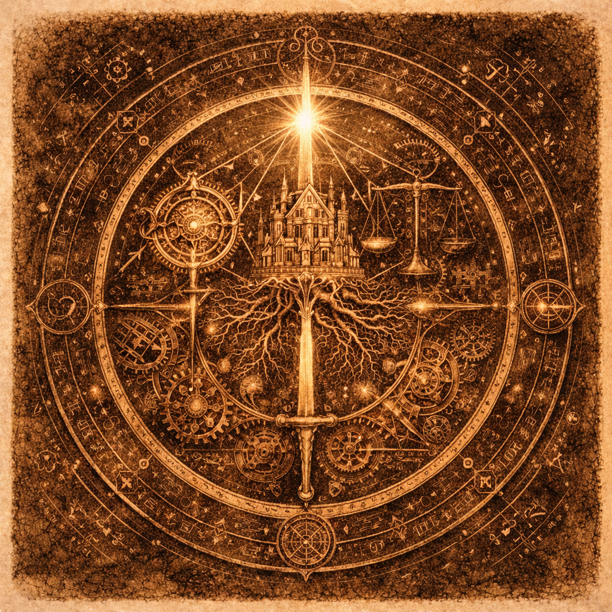

# 『「楽しい」ソフトウェア工学の教科書』
## デジタル・アルケミー：伝統の美学とAIで紡ぐ創造の地図

---

### **世界の欠片を論理のモデルへ、言葉が命を宿す瞬間。**

ソフトウェア工学という「魔法の地図」を手に、
伝統的な設計の美学と、現代のAI駆動開発が融合する
新たな創造のフロンティアへ。

---

**著者：**
小川 秀人（OGAWA Hideto）
& AI Familiar (Claude / Gemini)

**発行：**
2026年2月23日 初版発行
Digital Alchemy Press
