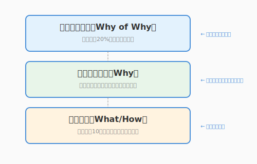
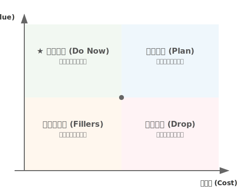

# 1.1 なぜ聴くのか？——要求工学という冒険の始まり

## 導入: 言葉の迷宮への入り口

「もっと使いやすいシステムにしてほしいんです」

ユーザーからそう言われたとき、あなたはどう反応しますか？

「わかりました、UIを改善しましょう」と即答する前に、ちょっと立ち止まってみませんか？　ここには、もっとワクワクする可能性が眠っています。

ユーザーの言葉は、海面に浮かぶ氷山の一角に過ぎません。その下には、言葉にできない期待、本人も気づいていない願望、そして本当に実現したいことという巨大な氷塊が隠れています。

ソフトウェアエンジニアリングにおける**要求工学（Requirements Engineering）**とは、単に言われたことをメモする作業ではありません。それは、王（クライアント）の希望を聞き、町（現場）を歩いて真実を探り、「財宝（ソフトウェア）」の正体を明らかにするプロセスなのです。

この章では、その第一歩として「なぜ聴くことが重要なのか」を深く理解します。

---

## 理論的背景: 「欲しいもの」と「必要なもの」は違う

### ブランコの風刺画が教えてくれること

ソフトウェア開発の現場には、古くから伝わる有名な風刺画があります。


この絵が描いているのは、6コマのストーリーです。

1. **スポンサーが発案したもの**: 太い枝から吊るした、3段の豪華な座席
2. **仕様書に書かれたもの**: 木の幹を貫通して固定された、動かない3段の座席
3. **システムアナリストが設計したもの**: 幹をロープでぐるぐる巻きにした複雑な構造
4. **プログラマーが作ったもの**: 強度が怪しい別の枝から吊るした座席
5. **現場に設置されたもの**: 幹を切り落とし、A型の支柱で支えた不安定な座席
6. **ユーザーが本当に欲しかったもの**: 木の枝に吊るした、1本の古タイヤ

この絵は1970年代から存在し、半世紀経った今も開発現場で共有され続けています。それは、**コミュニケーションの技術**が、いつの時代も価値を持ち続けることを示しています。
なお原作者は不明とのことで、上記のイラストは原著に最も近いと言われているUniversity of London Computer Center Newsletter　No.53,March.1973（ブライアン・L・ミーク、パトリシア・M・ヒース）をもとにnano banana 2で生成したものです。

### ドリルではなく「穴」が欲しい

マーケティングの世界には有名な言葉があります。

> 「顧客はドリルが欲しいのではない、穴が欲しいのだ」[^ドリル]

[^ドリル]: 本書の著者はドリルそのものを保有して自分で穴を開けたい人なので、誰かに穴を空けてもらったり、別のソリューションを提案されても嬉しくありません。たまにそんなめんどくさい人もいるので注意しましょう。

しかし私たちは、さらに一歩踏み込む必要があります。

**なぜ穴を開けたいのでしょうか？**

- 壁に絵を飾りたいから？　→　石膏ボード用の穴が目立たない壁掛けフックの方が良いかもしれない
- 隣の部屋へLANケーブルを通したいから？　→　Wi-Fiルーターが解決策かもしれない
- 換気のためか？　→　窓を開ける習慣で済むかもしれない

ユーザーが「ドリルが欲しい」と言ったとき、それは**解決策の一つ**に過ぎません。真の要求は、その奥にある「目的」なのです。

### 要求の3つの層

要求には階層があります。



```
┌─────────────────────────────────────┐
│     ビジネス要求（Why of Why）       │  ← 組織・事業の目標
│  「売上を20%向上させたい」           │
├─────────────────────────────────────┤
│     ユーザー要求（Why）              │  ← ユーザーが達成したいこと
│  「在庫切れで機会損失したくない」     │
├─────────────────────────────────────┤
│     機能要求（What/How）             │  ← 具体的な機能
│  「在庫が10個以下になったら通知」     │
└─────────────────────────────────────┘
```

プロジェクトが大きな成果を上げるとき、多くの場合、上位の「なぜ」から始めています。「通知機能を作ってください」という依頼に対して、「なぜ通知が必要なのか？」を掘り下げることで、より本質的な解決策が見えてきます。

上位の「なぜ」を理解できれば、期待を超える提案ができるのです。

---

## 「聴く」ことで広がる可能性

### 言葉の奥にある宝物

ユーザーの言葉には、まだ言語化されていない宝物が眠っています。それを見つけるチャンスが3つあります。

1. **暗黙知の発掘**: 毎日やっている作業ほど、言葉になっていない。「なんとなくこうやってる」の中に、本当のニーズが隠れている。

2. **目的への遡上**: ユーザーは「解決策」を語りがち。そこから「本当の目的」へと遡ることで、より良いアイデアが生まれる。

3. **未知の可能性**: ユーザーはまだ存在しないものを想像するのが難しい。だからこそ、私たちが新しい可能性を提案できる。スマートフォンが登場する前、誰が「ポケットに入るコンピュータ」を想像できただろうか？

### エンジニアが持つ特別な視点

エンジニアには、ユーザーにはない強みがあります。それを活かすための意識ポイントです。

1. **技術的可能性の提案**: 「面白そうな技術」を知っているからこそ、ユーザーが想像できなかった解決策を提案できる。まずは聴いてから、技術の魔法を見せよう。

2. **多角的な検証**: 自分の仮説を持ちつつも、異なる視点からも検証することで、より確かな理解に到達できる。

3. **翻訳者としての役割**: ユーザーの言葉を技術に変換できるのはエンジニアだけ。丁寧な翻訳で、ニュアンスまで伝えよう。

これらの強みを最大限に活かすために、**意識的に「聴く」技術**を身につけましょう。

---

## 聴くことがもたらす価値

### プロジェクト成功への近道

Standish Groupの調査（CHAOS Report）によれば、プロジェクト成功の鍵となる要因のトップ3は以下の通りです。

1. **ユーザーの参加（User Involvement）** — ユーザーの声を聴き、対話を通じて実現できる
2. **経営層のサポート（Executive Management Support）** — 経営層もステークホルダー。ビジネス要求を聴くことで得られる
3. **要求の明確化（Clear Statement of Requirements）** — しっかり聴くことで達成できる

3つすべてが「聴く」ことに深く関わっています。**適切に聴くことは、プロジェクト成功への最も確実な近道**なのです。

### 手戻りコストの削減

要求の誤りを発見するタイミングによって、修正コストは指数関数的に増加します。

| 発見フェーズ | 相対コスト |
|-------------|-----------|
| 要求定義時 | 1x |
| 設計時 | 5x |
| 実装時 | 10x |
| テスト時 | 20x |
| リリース後 | 200x |

最初に正しく聴くことは、最も費用対効果の高い投資なのです。

### 信頼関係の構築

そして何より、「聴いてもらえた」という経験は、ユーザーとの信頼関係を築きます。

> 「この人は私の話を本当に理解しようとしてくれている」

その信頼があれば、開発中に発生する様々な課題も、協力して乗り越えられます。


---

> ### コラム: 本書のサンプルプロジェクト「QuestForge」
>
> 本書では、ソフトウェアエンジニアリングの各技法を**QuestForge**というサンプルアプリを通じて学びます。
>
> #### QuestForgeとは
>
> 日々のタスクをRPGの「クエスト」に見立てて管理するアプリです。タスクを完了すると経験値を獲得し、レベルアップしていきます。
>
> #### 主な機能
>
> | 機能 | 説明 |
> |------|------|
> | クエスト管理 | タスクを「クエスト」として登録・完了 |
> | 経験値システム | 難易度に応じた経験値を獲得 |
> | レベルアップ | 経験値が閾値を超えると勇者がレベルアップ |
> | ストリーク | 連続達成日数を記録してモチベーション維持 |
> | バッジ | 特定の条件を満たすと実績を獲得 |
>
> #### なぜQuestForgeを題材にするのか
>
> - **身近なテーマ**: タスク管理は誰もが経験する課題
> - **適度な複雑さ**: 要求分析から設計、実装、テストまで一通りの技法を適用できる
> - **拡張の余地**: 章が進むにつれて機能を追加し、学んだ技法を実践できる
>
> #### 本書での発展
>
> | 章 | QuestForgeで学ぶこと |
> |----|---------------------|
> | 第1章 | 要求の聴き取り、ゴール分析、UMLによる可視化 |
> | 第2章 | ドメインモデル設計、クリーンアーキテクチャ |
> | 第3章 | AIを活用した実装、コード生成 |
> | 第4章 | TDD、テストケース生成 |
> | 第5章 | リファクタリング、コードレビュー |
> | 第6章 | CI/CD、運用 |
>
> サンプルコードは `sample-code/questforge/` にあります。実際に動かしながら読み進めてください。

---




## まとめ

1. **言葉は氷山の一角**: ユーザーの発言は、真の要求のごく一部に過ぎない。
2. **解決策ではなく目的を探れ**: 「ドリルが欲しい」の奥にある「なぜ穴が必要か」を問え。
3. **要求には階層がある**: ビジネス要求→ユーザー要求→機能要求。上位を理解せよ。
4. **聴くことは投資**: 最初に正しく聴けば、後の手戻りコストを劇的に削減できる。
5. **聴くことは信頼**: 「理解しようとしてくれる」姿勢が、プロジェクトを支える土台になる。

次節では、この「聴く」を実践するための具体的な技法——**アクティブ・リスニング**を学びます。

---

## さらに学ぶためのリソース

- 📚 **書籍**: カール・ウィーガーズ『[ソフトウェア要求 第3版](https://www.shoeisha.co.jp/book/detail/9784798135946)』（要求工学の必読書）
- 📚 **書籍**: ジェラルド・ワインバーグ『[要求仕様の探検学](https://www.kyoritsu-pub.co.jp/book/b10011444.html)』（要求発見の技法を人間心理の側面から説く古典）
- 🌐 **BABOK**: IIBA "[BABOK Guide](https://www.iiba.org/career-resources/a-business-analysis-professionals-foundation-for-success/babok/)"（ビジネスアナリシスの知識体系）
- 🌐 **IREB**: "[Certified Professional for Requirements Engineering (CPRE)](https://www.ireb.org/en/cpre/)"（要求工学の国際標準カリキュラム）
- 📊 **レポート**: Standish Group "[CHAOS Report](https://www.standishgroup.com/sample_reports/)"（プロジェクト成功要因の統計データ）
- 🎨 **風刺画**: "[Tree swing cartoon - Wikipedia](https://en.wikipedia.org/wiki/Tree_swing_cartoon)"（「顧客が本当に欲しかったもの」の歴史）

---

## AIへの詠唱例

```markdown
# 要求の階層を分析する
以下のユーザー発言から、要求の3層（ビジネス要求、ユーザー要求、機能要求）を
推測して整理してください。
不明な部分は「確認が必要」と記載し、確認すべき質問も提案してください。

**ユーザー発言**:
「毎月の経費精算が面倒なので、レシートを撮影したら自動で処理してくれるアプリが欲しい」
```

```markdown
# 「解決策」から「目的」を逆算する
以下の機能要求が、どのようなユーザー要求・ビジネス要求に紐づくか、
3つの可能性を挙げてください。

**機能要求**:
「QuestForgeに、友達とクエストを共有する機能を追加してほしい」
```
