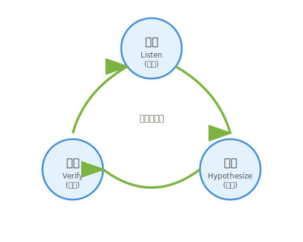

# 1.2 どう聴くか？——アクティブ・リスニングの技法

「聴くことが大切だ」と知っていることと、「実際に聴ける」ことは別物です。

多くのエンジニアは、ユーザーの話を聞きながら、頭の中ではすでに技術的な解決策を考えています。「Reactで作ろうか」「データベースはPostgreSQLがいいかな」——技術への情熱は素晴らしいことですが、その前に「聴く」時間を設けることで、さらに良いアイデアが生まれます。

このセクションでは、ユーザーの隠れた願いを引き出すための具体的な技法——**アクティブ・リスニング**を学びます。

---

## アクティブ・リスニングとは

次の図は、インタビュー駆動の学習ループ——聴く・仮説を立てる・確認するというサイクルを示しています。



ここで示されているのは、アクティブ・リスニングが一方向の情報収集ではなく、問いと応答を繰り返すことで螺旋的に深まるプロセスであるという点です。ユーザーの言葉を聴き、仮説を立て、次の質問で確認する——このループを回し続けることで、表面の言葉の奥にある「本当の願い」へと近づいていきます。

### 心理療法から生まれた技法

心理学者カール・ロジャーズの来談者中心療法（1940年代〜）から生まれたアクティブ・リスニング（積極的傾聴）は、その後広く普及した技法です。もともとはカウンセリングの場で使われていましたが、その有効性からビジネスや教育の世界に広まりました。

ソフトウェア開発においても、ユーザーの「本当の問題」を引き出すために、この技法は極めて有効です。

### 受動的な「聞く」との違い

その有効性は、受動的な「聞く」との根本的な違いにあります。日本語では「聞く」と「聴く」を区別することがあります。

- **聞く（hear）**: 音が耳に入る。受動的。
- **聴く（listen）**: 意識的に理解しようとする。能動的。

アクティブ・リスニングは、さらに一歩進みます。相手の言葉の**背後にある意図、感情、文脈**を理解しようと積極的に働きかけるのです。

### アクティブ・リスニングの3要素

この「積極的な働きかけ」を支えるのが、3つの根本的な要素です。

1. **共感的理解**: 相手の立場に立って物事を見る
2. **無条件の肯定的関心**: 批判せずに受け止める
3. **自己一致**: 聴き手自身が誠実である

これらは「技術」というより「姿勢」に近いものです。しかし、具体的なテクニックを身につけることで、この姿勢を実践できるようになります。

---

## 実践テクニック: 5つのWで深掘りする

姿勢を身につけたら、次は具体的な「問いかけの技」を手に入れましょう。中でも最も強力な武器が、「Why」の問いかけです。

### 魔法の質問「Why」

ユーザーの言葉を額面通りに受け取らず、その背景を探る最も強力な問いかけが「なぜ（Why）」です。

ただし、「なぜ？」を繰り返すだけでは尋問になってしまいます。共感を示しながら、好奇心を持って問いかけることが重要です。

**シンプルな問いかけ:**
> 「なぜToDoアプリが欲しいんですか？」
> 「なぜ管理できないんですか？」

**さらに効果的な問いかけ:**
> 「タスクが多くて大変なんですね。管理しきれないというのは、具体的にどんな瞬間に感じますか？」

### 5W1Hを状況に応じて使い分ける

「Why」だけでなく、状況に応じて問いの角度を変えることで、さらに豊かな情報を引き出せます。

[図: 質問タイプの使い分けマップ]

| 問いかけ | 目的 | 質問例 |
|---------|------|--------|
| Why (なぜ？) | 目的・動機の確認 | 「その機能があると、どう嬉しいですか？」 |
| Who (誰が？) | 利用者の特定 | 「実際に使うのは誰ですか？」 |
| When (いつ？) | 利用タイミングの把握 | 「どんな時にそれが必要になりますか？」 |
| Where (どこで？) | 利用環境の把握 | 「オフィスで？ 移動中に？」 |
| What (何を？) | 具体的な対象の特定 | 「管理したい『タスク』とは具体的に？」 |
| How (どのように？) | 現状の方法の把握 | 「今はどうやって対処していますか？」 |

### オウム返しと言い換え

問いかけと並んで強力なのが、相手の言葉をそのまま返す「オウム返し」と、自分の言葉に置き換える「言い換え」の技法です。相手の言葉を繰り返す（オウム返し）、または自分の言葉で言い換える（パラフレーズ）ことで、「ちゃんと聴いている」ことを示せます。

> **ユーザー**: 「朝起きて、やることリストを見ると、もうそれだけでやる気が失せるんだよね」
>
> **あなた**: 「朝、リストを見た瞬間にやる気が失せてしまう……それは辛いですね」

この一言で、ユーザーは「理解してもらえた」と感じ、より深い話をしてくれるようになります。

### 感情にフォーカスする

言葉の言い換えに慣れてきたら、さらに深いレイヤーへ踏み込めます——それが「感情」への着目です。機能の話ではなく、感情の話を引き出しましょう。

> 「その時、どんな気持ちになりますか？」
> 「それができないと、どんな不便がありますか？」
> 「逆に、うまくいった時はどう感じますか？」

感情は、ユーザー自身も言語化できていない「隠れた願い」への入り口です。

---

## 実践例: QuestForgeの誕生対話

この技法を使った対話例を見てみましょう。以下は説明のために作成した架空の対話であり、QuestForge開発時の実際の会話ではありません。

### シナリオ: 「タスク管理ツールが欲しい」

技法を頭で理解するだけでは十分ではありません——実際の対話の流れを通じて、どのように機能するかを体感してみましょう。勇者志望のAさんが相談に来ました。

> **Aさん**: 「日々のタスクが多くて管理しきれないんだ。ToDoリストアプリを作ってくれないか？」

#### すぐに技術に飛び込む反応

> **あなた**: 「わかりました！ Reactで作りますか？ それともモバイルアプリがいいですか？ リストへの追加と削除機能があればいいですよね。」

これでも動くアプリは作れます。でも、もっとワクワクする可能性を探ってみましょう。

#### アクティブ・リスニングを使った反応

> **あなた**: 「タスクが多くて大変なんですね。**管理しきれない**というのは、具体的にどんな瞬間に感じますか？」
>
> **Aさん**: 「うーん、朝起きて、やるべきことが山積みになっているリストを見ると、それだけでやる気が失せるんだよね……」
>
> **あなた**: 「なるほど、リストの量に圧倒されてしまうんですね。**逆に、どんな時なら『よし、やるぞ！』という気持ちになれますか？**」
>
> **Aさん**: 「ゲームをしている時は何時間でも集中できるんだけどな。レベルアップとか、報酬があると燃えるんだ。」
>
> **あなた**: 「面白いですね！ ゲームでは集中できる……。もし、**面倒なタスクが『モンスター』で、それを倒すと経験値が入るとしたら**どうでしょう？」
>
> **Aさん**: 「それなら、朝起きるのが楽しみになるかもしれない！」

### 対話の分析

この対話で何が起きたか、分析してみましょう。

| ターン | 技法 | 効果 |
|-------|------|------|
| 1 | 共感 + 具体化の質問 | 曖昧な「管理しきれない」を具体的な場面に落とし込んだ |
| 2 | オウム返し + 反対からの質問 | 問題だけでなく、ポジティブな体験も引き出した |
| 3 | 言い換え + 仮説の提示 | 得られた情報を統合し、新しい視点を提案した |

最終的に、要求は「ToDoリスト機能」から「**タスク消化を通じて達成感とワクワクを提供する体験**」へと変化しました。

これが「隠れた願いの翻訳」です。

---

## さらに効果を高めるコツ

基本の技法を身につけたら、実践の場でさらに威力を発揮するためのコツを押さえておきましょう。

### コツ1: 提案は聴いた後で

> 「あ、それならこういう機能を作ればいいですね」

アイデアが浮かんだら、まずは心の中にメモ。十分に聴いてから提案すると、ユーザーは「この人は本当に理解してくれた」と感じ、より深い話をしてくれます。

### コツ2: 相手の言葉で話す

提案を後回しにする余裕が生まれたら、次は「言葉の選び方」にも意識を向けてみましょう。

> 「APIでデータを取得して、フロントエンドでレンダリングすれば……」

技術的な表現を、ユーザーの言葉に翻訳してみましょう。**相手の言葉で話す**ことで、対話がスムーズになります。

### コツ3: 沈黙を味方にする

そして、言葉と同じくらい大切な「沈黙」の扱い方を覚えておきましょう。ユーザーが考え込んでいる時、焦って話を続けなくても大丈夫。**沈黙は思考の時間**です。待つことで、より深い答えが返ってきます。

### コツ4: 目を見て聴く

最後に、対話の場全体を温める、もっとも基本的な姿勢を確認しておきましょう。記録は大切ですが、メモは後でも取れます。対話中は**アイコンタクト**を大切に。「聴いてもらえている」という安心感が、ユーザーの本音を引き出します。

---

## AI時代のアプローチ: 深掘りの壁打ち相手

ここまでの技法は、対面のインタビューで輝きを放ちます。しかし、いつも理想的な練習相手がいるとは限りません。AIを「問いかけの壁打ち相手」として活用することで、一人でも技を磨くことができます。

### AIに「次の質問」を提案してもらう

アクティブ・リスニングで難しいのは、「次に何を聞けばいいか」の判断です。ここでAIが力を発揮します。

**プロンプト例:**
```text
以下はユーザーとの対話メモです。

「タスクが多くて管理しきれない。朝リストを見るとやる気が失せる。
ゲームなら何時間でも集中できる。レベルアップや報酬があると燃える。」

このユーザーの「隠れた願い」をさらに深掘りするために、
まだ聞けていない重要な質問を5つ提案してください。
各質問には、なぜその質問が有効かの理由も添えてください。
```

### 「これじゃない」を引き出すプロトタイピング

AIを使えば、対話の内容から瞬時に簡単な画面イメージやモックアップを生成できます。言葉だけの合意には限界があります——「見せる」ことで「違う」を引き出すプロトタイピングが、もう一つのAI活用法として力を発揮します。

それをユーザーに見せて、「これですか？」と聞くのです。

ユーザーは「欲しいもの」を言葉にするのは苦手です。しかし、目の前のものが「違う」ことを指摘するのは得意です。

> 「違います、こうじゃなくて……」

この言葉こそが、真の要求への道しるべとなります。

---

## ハンズオン: AIとアクティブ・リスニングを練習する

### ステップ1: テーマを決める

身近な課題をテーマにしましょう。

- 「毎日の献立が決まらない」
- 「積読（つんどく）が減らない」
- 「運動が続かない」

### ステップ2: AIに相談役になってもらう

以下のプロンプトで、AIに「優秀なプロダクトマネージャー」になってもらいます。

```markdown
私は「[あなたの課題]」という問題を解決するアプリを作りたいと考えています。

あなたは経験豊富なプロダクトマネージャーとして、
私の「真の要求」を引き出すために、一度に1つずつ、深掘りする質問を投げかけてください。

私が答えたら、その回答を踏まえて次の質問をしてください。
5回ほどやり取りした後、私の「隠れた願い」を要約してください。
```

### ステップ3: 振り返る

対話を終えたら、以下を確認しましょう。

- 当初考えていた機能とは違う視点が見えたか？
- AIはどんな質問を使っていたか？
- 自分ならどう質問するか？

---

「聴く」とは、受動的に音を受け取ることではありません。共感・傾聴・言い換えという具体的なテクニックを組み合わせ、相手の言葉の背後にある感情や意図へと能動的に踏み込む技術です。特に「なぜ？」という問いかけは強力で、表層の機能要求を突き破り、ユーザーが本当に体験したいことへと道を切り開きます。ユーザーが考え込んで沈黙しているとき、焦って話を続ける必要はありません。その静寂こそが思考の時間であり、最も深い答えが生まれる瞬間でもあります。

そしてAIは、この「聴く」技術の最高の練習相手になれます——質問の提案から、プロトタイプによる「これじゃない」の発見まで、いつでもどこでも壁打ちできます。技法を手に入れた次の問いは「では、**誰に**聴くのか？」です。現実にはインタビューの機会は限られています。1.3節では、AIにペルソナを演じさせることで、何度でも仮想のユーザーと対話する技術を学びます。

---

## AIへの詠唱例

```markdown
# 深掘り質問の生成
以下のユーザーの発言から、「隠れた願い」を探るための
深掘り質問を5つ生成してください。
各質問には、なぜその質問が有効かの理由も添えてください。

**ユーザーの発言**:
「毎朝の定例ミーティングが無駄に感じる。もっと効率的にしたい。」
```

```markdown
# 対話の分析と次のステップ
以下のユーザーとの対話を分析し、
1. ユーザーの「隠れた願い」の仮説
2. まだ確認すべき点
3. 次に投げかけるべき質問
を提案してください。

**対話**:
[対話ログをここに貼り付ける]
```

```markdown
# 曖昧な要望からの要件定義
以下の曖昧な要望から、具体的な「ユーザーストーリー」を3つ作成し、
それぞれの「受入条件（Acceptance Criteria）」を定義してください。

**要望**:
「なんかこう、QuestForgeを使った時に、もっとみんなで盛り上がれる機能が欲しいんだよね。一人だと寂しいし。」
```

## さらに学ぶためのリソース

- 📚 **古典**: カール・ロジャーズ『[カウンセリングと心理療法 ―実践のための新しい概念](https://www.iwasaki-ap.co.jp/book/b198944.html)』（アクティブ・リスニングの提唱者による基礎理論）
- 📚 **書籍**: ジェラルド・ワインバーグ『[要求仕様の探検学](https://www.kyoritsu-pub.co.jp/book/b10011444.html)』（ユーザーとのコミュニケーションにおける落とし穴と回避策を学ぶ）

---
