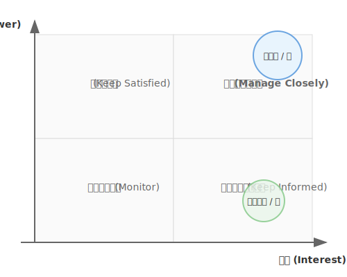
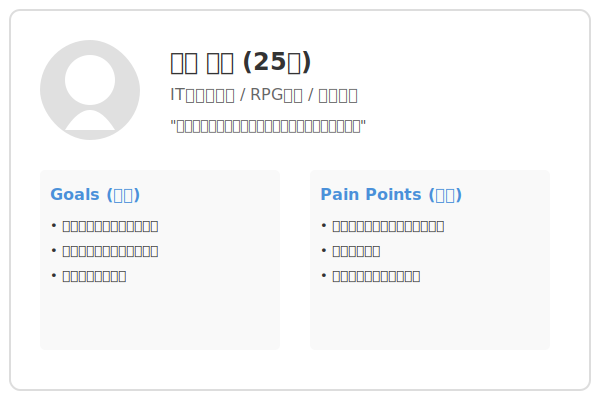

# 1.3 誰に聴くか？——AIペルソナとの対話



現実には、インタビューの機会は限られています。忙しいユーザーに何度も質問するわけにはいきません。

「もっと練習したい」「仮説を検証したい」「でも相手がいない」——そんなとき、AIは最高の練習相手になります。

このセクションでは、ソフトウェア開発で古くから愛用されてきた**ペルソナ法**を学び、AIという「依代（よりしろ）」を与えることで、仮想のユーザーと何度でも対話する技術を身につけます。

---


## ペルソナ法という伝統儀式

「誰に聴くか」という問いへの答えの一つが、ソフトウェア開発の世界で長く愛されてきたペルソナ法です。

### ペルソナとは何か

次の図は、ペルソナカードの構成要素——名前・年齢・職業・悩み・一言などを整理したテンプレートを示しています。



ここで重要なのは、ペルソナが単なる属性リストではなく「生きた人物像」として描かれている点です。名前と顔写真があり、具体的な悩みや口癖が添えられることで、チームメンバーが設計の判断を迫られたとき「このペルソナならどうするだろうか？」と自然に問えるようになります。

**ペルソナ法**は、1990年代にアラン・クーパーが提唱した手法です。

ターゲットユーザーを代表する架空の人物像を作り上げ、開発の指針にします。

ペルソナは単なる「ユーザー属性の箇条書き」ではありません。名前があり、年齢があり、趣味があり、悩みがあります。まるで小説の登場人物のように、生き生きとした人間像を作るのです。

では、なぜ「生きた人物像」を作ることが、開発の助けになるのでしょうか。

### なぜペルソナが有効なのか

ペルソナが効果を発揮する理由は3つあります。

1. **共感の装置**: 「30代男性会社員」より「田中太郎さん（32歳、2児の父、通勤時間にスマホゲームが唯一の息抜き）」の方が心に響く
2. **意思決定の基準**: 「この機能、太郎さんは使うだろうか？」と問うことで、独りよがりな設計を防げる
3. **チームの共通言語**: 全員が同じ「仮想のユーザー」を脳内に共有できる

この効果を引き出すために、従来はどのようなプロセスでペルソナを作ってきたのかを見ておきましょう。

### 伝統的なペルソナの作り方

従来のペルソナ作成は、以下のプロセスで行われてきました。

1. **調査**: 実際のユーザーへのインタビューやアンケート
2. **分類**: 回答をパターン化し、ユーザー群を特定
3. **具体化**: 代表的なユーザー像を1〜3人分作成
4. **共有**: チーム全員がアクセスできる場所に掲示

このプロセスは有効ですが、時間がかかります。調査だけで数週間を要することも珍しくありません。

---

## AI時代のアプローチ: ペルソナに命を吹き込む

伝統的なペルソナ作成の時間的ハードルを、AIは劇的に下げてくれます。さらに驚くべきことに、AIはペルソナを「紙の上の設定」から「語りかける存在」へと変える力を持っています。

### 「書類上の設定」から「語りかける存在」へ

現代の私たちは、ペルソナにAIという強力な依代を与えられます。これにより、ペルソナは紙の上の設定から、実際に語りかけてくる生きた存在へと進化します。

従来のペルソナ: 壁に貼られたポスター。眺めるだけ。
AIペルソナ: 質問に答え、感情を表現し、予想外の反応を返す対話相手。

では、AIにペルソナを演じさせるには、どのような魔法の言葉を与えればいいのでしょうか。

### AIペルソナの作り方

AIにペルソナを演じさせるには、以下の情報を与えます。

```text
あなたは以下の人物として振る舞ってください。

【基本情報】
- 名前: 佐藤美咲（28歳）
- 職業: フリーランスのWebデザイナー
- 家族: 一人暮らし、猫1匹

【性格・特徴】
- 完璧主義で、タスクを先延ばしにしがち
- SNSでの情報収集が日課
- ゲームは好きだが「時間を浪費している」と罪悪感がある

【現状の悩み】
- 案件が複数重なると優先順位がわからなくなる
- 締め切りに追われる日々にストレスを感じている
- 既存のToDoアプリは「できなかったこと」が可視化されて辛い

【回答のルール】
- 感情的かつ少し曖昧に答えてください
- 最初から全てを話さず、質問に応じて徐々に本音を明かしてください
- 時々、話が脱線してもOKです（リアルなユーザーのように）
```

このプロンプトを与えたAIに対して、あなたは開発者としてインタビューを行います。

---

## 実践例: QuestForgeのペルソナたち

それでは、実際にQuestForgeの開発でペルソナがどのように機能するかを見ていきましょう。

### メインペルソナ: 勇者志望のAさん

1.2節で登場したAさんを、より具体的なペルソナに仕上げてみましょう。

> **名前**: 鈴木 翔太（25歳）
> **職業**: IT企業のジュニアエンジニア（入社2年目）
> **趣味**: RPGゲーム、アニメ鑑賞、プログラミング勉強会
> **悩み**: やるべきことは多いが、優先順位がつけられない。成長実感がなく焦っている。
> **性格**: 素直で前向きだが、飽きっぽい。新しいもの好き。
> **一言**: 「もっとレベルアップしてる実感が欲しいんだよなあ」

翔太というペルソナが生まれました。次は、このペルソナをAIに演じさせ、実際の対話から開発のヒントを引き出してみましょう。

### AIペルソナとの対話例

以下は説明のために作成した架空の対話です。実際にAIに翔太を演じさせ、QuestForgeの仕様を深掘りしてみましょう。

> **あなた**: 「普段、タスク管理ってどうしてますか？」
>
> **AI（翔太）**: 「えっと、一応Notionにリスト作ってるんですけど……見返さないんですよね。書いた時点で満足しちゃうというか」
>
> **あなた**: 「満足しちゃう、というのは？」
>
> **AI（翔太）**: 「なんか、書き出しただけで仕事した気になっちゃうんです。でも翌日見ると、全然進んでなくて凹む。ゲームだったらクエスト受注した瞬間からワクワクするのに」
>
> **あなた**: 「ゲームと何が違うと思いますか？」
>
> **AI（翔太）**: 「うーん……ゲームって、やるべきことが明確じゃないですか。『ゴブリンを5体倒せ』とか。現実のタスクって、どこから手をつければいいかわからない」

この対話から、新たな洞察が得られました。「タスクの細分化と明確なゴール設定」がQuestForgeの核心機能であるべきだ、と。

一人のペルソナだけでは、特定のユーザー像に引きずられる危険があります。異なる視点を持つサブペルソナを加えることで、設計の幅が広がります。

### サブペルソナの活用

メインペルソナだけでは視野が偏ります。異なるユーザー層を代表するサブペルソナも用意しましょう。

| ペルソナ | 年齢・職業 | 特徴 | QuestForgeへの期待 |
|---------|-----------|------|------------------|
| 翔太 | 25歳・エンジニア | ゲーム好き、成長志向 | レベルアップの実感 |
| 美咲 | 28歳・デザイナー | 完璧主義、先延ばし癖 | 小さな達成感の積み重ね |
| 健一 | 42歳・マネージャー | チーム管理、多忙 | チームの進捗可視化 |

それぞれのペルソナをAIに演じさせ、同じ質問に対する異なる反応を観察します。これにより「誰のために作るのか」が鮮明になります。

---

## ハンズオン: AIペルソナと対話してみよう

理論と実例を踏まえたら、あなた自身のプロジェクトでペルソナを育てる番です。

### ステップ1: ペルソナを設計する

あなたが作りたいアプリのターゲットユーザーを1人、具体的に想像してください。以下の項目を埋めましょう。

- 名前・年齢・職業
- 性格（3つのキーワード）
- 現在の悩み（具体的に）
- 趣味・日常の過ごし方

ペルソナが描けたら、AIという「依代」を与えてその人物を召喚する準備をしましょう。

### ステップ2: AIに演じさせる

ステップ1で作ったペルソナを、前述のプロンプトテンプレートに当てはめてAIに入力してください。

AIがペルソナを演じ始めたら、いよいよ探偵のような好奇心を持って問いかけを始めましょう。

### ステップ3: インタビューする

5〜10回の質問を投げかけ、以下を探りましょう。

- ユーザーが**本当に実現したいこと**は何か？
- 既存の解決策では**何が足りない**と感じているか？
- どんな瞬間に**感情が動く**か（嬉しい、もっとこうだったら、ワクワク）？

対話の宝石が集まったら、AIに整理を手伝ってもらいましょう。

### ステップ4: 発見をまとめる

対話を終えたら、AIに以下のように依頼してみましょう。

```text
ここまでの対話を振り返り、以下の形式でまとめてください：

1. このユーザーの「隠れた願い」（1文で）
2. 最も重要な機能要求（3つ）
3. 意外だった発見（1つ）
```

---

抽象的な「ユーザー」という言葉には、共感が宿りにくいものです。「25歳のフリーランサー、佐藤あかり」のように名前と顔を持つペルソナを作ることで、設計の判断に一貫した軸が生まれます。AIがそのペルソナを演じれば、何度でもインタビューを繰り返せます——それはユーザーの声を手軽に借り受ける、現代の「召喚の儀式」です。

一人のペルソナでは見えなかった矛盾や新しい要求も、複数の視点を重ねることで浮かび上がります。事前に「こういう機能が必要なはず」と想定していたものが、対話の中で覆される瞬間こそ、ペルソナとの探検の醍醐味です。

こうして集まった声は、まだ「断片」に過ぎません。「レベルアップ感が欲しい」「小さな達成感を積み重ねたい」「チームで盛り上がりたい」——これらのバラバラな願いを一貫したシステム像へと整理する技術が、次のステップです。1.4節では、**ゴール指向要求分析**を使って、要求の全体地図を描きます。

---

## AIへの詠唱例

このセクションで学んだことを実践するためのプロンプト：

```markdown
# ペルソナの自動生成
以下の条件を満たすペルソナを3人作成してください。
それぞれ異なる年代・職業・性格にしてください。

**アプリの概要**: QuestForge（タスク管理をRPG風に楽しむアプリ）
**ターゲット**: 日々のタスクに追われている社会人

各ペルソナについて以下を記述してください：
- 基本情報（名前、年齢、職業、家族構成）
- 性格と特徴
- 現在の悩み
- このアプリに期待すること
- 使わない理由になりそうなこと
```

```markdown
# ペルソナ間の対立を発見する
以下の2人のペルソナがQuestForgeに対して
異なる期待を持っています。

ペルソナA: 翔太（25歳、ゲーマー、個人利用）
ペルソナB: 健一（42歳、マネージャー、チーム利用）

この2人の要求の両立が求められる場面を3つ挙げ、
それぞれの解決策を提案してください。
```

## さらに学ぶためのリソース

- 📚 **書籍**: アラン・クーパー『[About Face 3 インタラクションデザインの極意](https://www.shoeisha.co.jp/book/detail/9784798115313)』（ペルソナ法の提唱者による、ユーザー中心設計のバイブル）
- 📚 **書籍**: ジェフ・パットン『[ユーザーストーリーマッピング](https://www.oreilly.co.jp/books/9784873117324/)』（ペルソナから具体的な開発項目へと繋ぐ実践的な技法）
- 🌐 **Web**: Nielsen Norman Group "[Personas: Study Guide](https://www.nngroup.com/articles/persona-study-guide/)"（UXデザインの権威による、ペルソナ作成と活用の包括的ガイド。英語）

---
