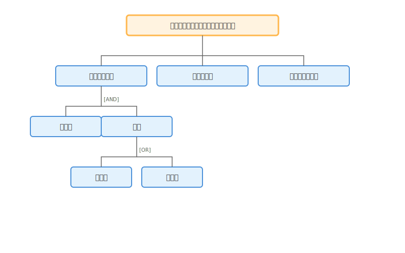
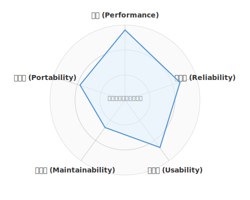

# 1.4 どう整理するか？——ゴール指向要求分析

## 導入: 「何を作るか」の前に「なぜ作るか」

ここまでで、なぜ聴くことが重要か（1.1）、どう聴くか（1.2）、そしてAIペルソナと対話して仮説を検証する方法（1.3）を学びました。

しかし、集まった情報はまだ「断片」に過ぎません。「レベルアップ感が欲しい」「小さな達成感を積み重ねたい」「チームで盛り上がりたい」——これらのバラバラな願いを、どうやって一貫したシステムへとまとめるのでしょうか？

ここで登場するのが**ゴール指向要求分析**です。RPGで言えば「メインクエスト」と「サブクエスト」の関係を整理し、冒険の全体地図を描く技術です。

---

## 理論的背景: ゴール指向要求分析とは

### 「機能」ではなく「目的」から始める

従来の要求分析では、こう聞きがちです。

> 「どんな**機能**が欲しいですか？」

ゴール指向要求分析では、問いの方向が逆転します。

> 「何を**達成したい**ですか？」

この違いは決定的です。機能から始めると「ボタンを追加する」「画面を作る」といった手段の議論に陥ります。ゴールから始めれば、本当に必要なものが見えてきます。

### ゴールの階層構造





ゴールは階層的に分解できます。

上位のゴールは「なぜ」を、下位のゴールは「どうやって」を表します。

```
【戦略ゴール（Why of Why）】
  └── なぜこのシステムを作るのか？

    【ユーザーゴール（Why）】
      └── ユーザーは何を達成したいのか？

        【サブゴール（How）】
          └── それをどうやって実現するか？

            【タスクゴール（What）】
              └── 具体的に何をするか？
```

上から下へ「How?（どうやって？）」で分解し、下から上へ「Why?（なぜ？）」で検証します。どの階層でも「なぜ？」に答えられなければ、そのゴールは不要かもしれません。

### AND/OR分解

ゴールの分解には2つのパターンがあります。

**AND分解**: すべてのサブゴールを達成しないと親ゴールは達成できない。

```
ユーザーがタスクを楽しく消化する
├── [AND] タスクに達成感がある
├── [AND] 継続するモチベーションがある
└── [AND] 進捗が可視化されている
```

**OR分解**: いずれかのサブゴールを達成すれば親ゴールは達成できる。

```
継続するモチベーションがある
├── [OR] 経験値・レベルで成長を実感する
├── [OR] ストリーク（連続日数）で習慣化する
└── [OR] 仲間との競争・協力で刺激を得る
```

OR分解は設計の選択肢を表します。すべてを実装する必要はなく、優先順位をつけて選べます。

---

## 実践例: QuestForgeのゴールツリー

QuestForgeのゴールを体系的に分解してみましょう。

### 戦略ゴール

> **「日々のタスク消化を、成長の実感と達成感に変換する」**

### ゴールツリー全体像

```
日々のタスク消化を成長の実感と達成感に変換する [戦略ゴール]
│
├── タスクに取り組む意欲を高める [ユーザーゴール 1]
│   ├── [AND] タスクが明確で取り組みやすい
│   │   ├── タスクを適切な粒度に分解できる
│   │   └── 難易度が可視化されている
│   └── [AND] 取り組みの先に報酬がある
│       ├── [OR] 経験値を獲得できる
│       ├── [OR] バッジ（実績）を獲得できる
│       └── [OR] レベルアップの演出がある
│
├── 継続するモチベーションを維持する [ユーザーゴール 2]
│   ├── [OR] ストリーク記録で習慣化を促す
│   ├── [OR] レベル進捗で長期的成長を可視化する
│   └── [OR] 過去の達成を振り返れる
│
└── 再スタートを応援する [ユーザーゴール 3]
    ├── [AND] 再挑戦を歓迎する設計
    │   ├── ストリークが切れても気軽に再開できる
    │   └── 未完了タスクも次の一歩として表示する
    └── [AND] 再開のハードルが低い
        ├── 1つの小さなタスクから再開できる
        └── 復帰ボーナスで迎え入れる
```

### ゴールツリーから見える設計判断

このツリーから、いくつかの重要な設計判断が浮かび上がります。

1. **ユーザーゴール3「再スタートを応援する」** は、QuestForgeならではの視点です。1.2節の対話で「やる気が失せる」という声を聴いたからこそ、ここにゴールが立ちました。

2. **OR分解の選択**: 「継続のモチベーション」には3つの手段がありますが、MVP（最小限の製品）ではまず「ストリーク」に絞る、という判断ができます。

3. **AND条件の確認**: 「取り組む意欲を高める」には「明確さ」と「報酬」の**両方**が必要です。片方だけでは不十分。

---

## AI時代のアプローチ: ゴール分析の加速

### AIにゴールツリーを補強してもらう

自分で作ったゴールツリーをさらに充実させましょう。AIに「追加できるゴール」を提案してもらいます。

```text
以下はタスク管理アプリ「QuestForge」のゴールツリーです。
このツリーをさらに充実させるために、
追加すると良さそうなゴールを3つ提案してください。

[ゴールツリーをここに貼り付ける]
```

### ゴール間のバランスを探る

異なるゴール同士を両立させる工夫が必要な場面があります。

例えば「タスクを細分化する」と「画面をシンプルに保つ」は、両立のための工夫が求められます。AIにバランスの取り方を提案してもらいましょう。

```text
以下のゴールツリーの中で、両立に工夫が必要なゴールの組み合わせを
列挙してください。
それぞれについて、うまくバランスを取る方法を提案してください。
```

### 非機能要求への展開：冒険の品質を守る

ゴールツリーは、目に見える機能だけを描くものではありません。工学的に極めて重要なのが、**非機能要求（Non-Functional Requirements: NFR）**です。機能が「何ができるか」なら、非機能要求は「どのくらいの品質でできるか」を定義します。

冒険に例えるなら、機能要求は「空を飛ぶ魔法」ですが、非機能要求は「何時間飛び続けられるか（信頼性）」「何人まで乗れるか（効率性）」「詠唱中に攻撃されても発動するか（堅牢性）」といった**魔法の制約条件**です。

### 品質特性はトレードオフの関係にある

非機能要求を扱う上で重要な洞察があります。品質特性どうしは、しばしば**互いに引っ張り合う**という事実です。



例えば「セキュリティを強化する」ために認証レイヤーを増やすと「性能（応答速度）」が下がります。「保守性を高める」ために抽象化を進めると、コードが増えて「効率性」が落ちることがあります。「機能の豊富さ」を追求すると「使用性（シンプルさ）」が犠牲になりがちです。

これはどれかが「正解」でどれかが「間違い」という話ではありません。プロジェクトの文脈に応じて「どの品質特性を最優先にするか」を意識的に選択し、ゴールツリーの中に明示しておくことが、後の設計判断の羅針盤になります。

```
ユーザーがストレスなく使える [品質ゴール]
├── [AND] 操作から1秒以内に応答する（性能）
├── [AND] 通信が途切れてもデータが失われない（信頼性）
└── [AND] 初見でも迷わず操作できる（使用性）
```

これらは「機能」ではないため見落とされがちですが、これらが欠けると、どんなに素晴らしい機能があってもユーザーは離れてしまいます。ゴール指向分析の段階で、これらの「品質の願い」も明文化しておくことが、後の設計やテストの道標となります。

---

## ハンズオン: ゴールツリーを構築してみよう

### ステップ1: 戦略ゴールを1文で書く

あなたのプロジェクトが**究極的に達成したいこと**を1文で書いてください。「〜を〜に変換する」「〜によって〜を実現する」の形が書きやすいです。

### ステップ2: ユーザーゴールを3つ挙げる

戦略ゴールを達成するために必要な「ユーザー視点のゴール」を3つ挙げてください。1.1節や1.2節で得た洞察を活用しましょう。

### ステップ3: AND/ORで分解する

各ユーザーゴールを1〜2段階、AND/ORで分解してください。

- 「すべて必要」ならAND
- 「どれか1つでよい」ならOR

### ステップ4: AIに検証してもらう

完成したゴールツリーをAIに見せ、以下を問いかけてみましょう。

- 「追加すると良いゴールはあるか？」
- 「両立させたいゴール同士の関係は？」
- 「優先順位をつけるとしたら？」

---

## まとめ

1. **ゴールから始めよ**: 「何を作るか」ではなく「なぜ作るか」を問うことで、本質を見失わない。
2. **階層的に分解せよ**: 戦略ゴール→ユーザーゴール→サブゴール→タスクと、抽象から具体へ降りていく。
3. **AND/ORで選択肢を可視化せよ**: AND条件は「必須要件」、OR条件は「設計の選択肢」を示す。
4. **ゴール間のバランスを探れ**: 両立が必要なゴールを見つけ、バランスの取り方を記録する。
5. **非機能要求も忘れるな**: 性能やUXのゴールも明示的にツリーに含める。

---

## さらに学ぶためのリソース

- 📚 **書籍**: Axel van Lamsweerde "[Requirements Engineering: From System Goals to UML Models to Software Specifications](https://www.wiley.com/en-us/Requirements+Engineering%3A+From+System+Goals+to+UML+Models+to+Software+Specifications-p-9780470012703)"（ゴール指向要求分析の集大成。KAOS手法の提唱者による教科書）
- 📄 **論文**: Axel van Lamsweerde "[Goal-Oriented Requirements Engineering: A Guided Tour](https://ieeexplore.ieee.org/document/917542)"（GORE分野の歴史と主要な技法を一望できる優れたレビュー論文）
- 📚 **書籍**: カール・ウィーガーズ『[ソフトウェア要求 第3版](https://www.shoeisha.co.jp/book/detail/9784798135946)』（第12章に非機能要求の扱いが詳述されています）

---

## AIへの詠唱例

このセクションで学んだことを実践するためのプロンプト：

```markdown
# ゴールツリーの生成
以下のプロジェクト概要から、ゴールツリーを作成してください。

**プロジェクト**: QuestForge（タスク管理RPGアプリ）
**戦略ゴール**: 日々のタスク消化を成長の実感と達成感に変換する

以下の形式で出力してください：
- 戦略ゴール（1つ）
- ユーザーゴール（3〜5つ）
- 各ユーザーゴールをAND/ORで2段階に分解
- 非機能要求ゴール（2〜3つ）

各ゴールには [AND] または [OR] のラベルをつけてください。
```

```markdown
# ゴールツリーからユーザーストーリーへの変換
以下のゴールツリーの末端（リーフ）ゴールを、
それぞれユーザーストーリー形式に変換してください。

形式: 「[ペルソナ]として、[ゴール]したい。なぜなら[理由]だから。」

さらに、各ストーリーにMoSCoW優先度（Must/Should/Could/Won't）を
付与してください。

[ゴールツリーをここに貼り付ける]
```
