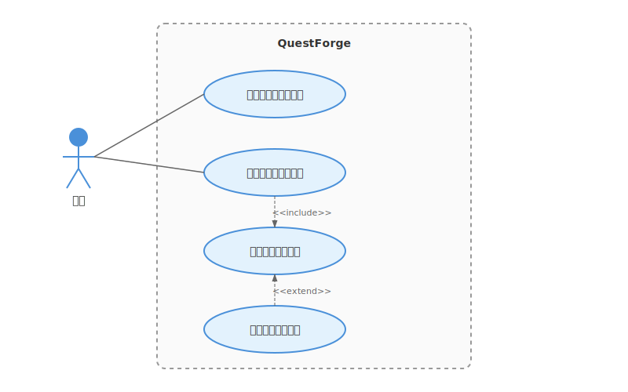
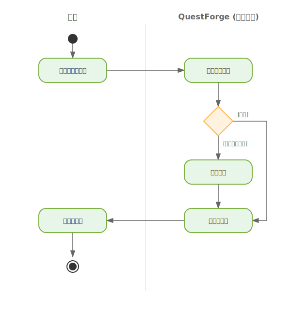
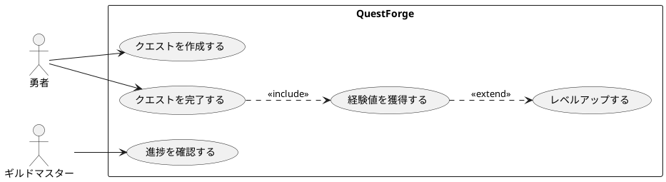

# 1.5 どう可視化するか？——要求を描く魔法陣（UML前編）

## 導入: 言葉の限界、図の力



ここまでで、ユーザーの声を聴き（1.1, 1.2）、AIペルソナと対話し（1.3）、ゴールツリーで整理する（1.4）方法を学びました。

ここで、さらに強力な武器を手に入れましょう。**図を使えば、認識をより正確に揃える**ことができます。

> 「ユーザーがログインして、タスクを追加できる」

この一文を読んで、あなたは何を想像しますか？

- ログイン画面は独立したページ？ モーダル？
- タスク追加はボタンをクリック？ エンターキーで？
- 追加後、リストは自動更新される？ 手動リロード？

同じ言葉を読んでも、人によって想像する「絵」は違います。

そこで登場するのが**UML（Unified Modeling Language）**——ソフトウェアの世界で長く使われてきた「共通の魔法陣」です。

---

## 理論的背景: UMLとは何か



### 統一された「図の言語」

UMLは1990年代に, 複数のモデリング手法を統合して生まれました。「Unified（統一された）」の名が示すように、異なる流派の図法を一つにまとめたものです。

かつて、ソフトウェアの世界には多くの「賢者（メソッド・エンジニア）」たちが存在し、それぞれが独自の図法を提唱していました。有名なものでは、グラディ・ブーチによる「Booch法」、ジェームズ・ランボーによる「OMT（オブジェクトモデル技術）」、そしてイヴァ・ヤコブソンによる「OOSE（オブジェクト指向ソフトウェア工学）」などがあります。これらは「メソッド戦争」と呼ばれるほど、どの手法が優れているかを競い合っていました。

しかし、1990年代半ば、これら3つの手法の提唱者たちは「協力して、より強力で共通の魔法陣を作ろう」と手を取り合いました。彼らは**スリーアミーゴス**（Three Amigos）と呼ばれ、彼らがまとめ上げた知恵の結晶こそがUMLなのです。

いわば、古のグリモワール（魔導書）に記された「火」や「水」の紋章のように、誰が見てもその意味が伝わるように約束された「共通言語」なのです。私たちアルケミストにとっては、論理を具現化するための「共通の魔法陣」と言えるでしょう。

UMLには14種類もの図がありますが、すべてを覚える必要はありません。本章では、**要求を可視化する**ための2つの図に絞ります。

| 図の種類 | 目的 | 問いかけ |
|---------|------|---------|
| **ユースケース図** | システムと利用者の関係を俯瞰する | 「誰が何をするのか？」 |
| **アクティビティ図** | 処理の流れを詳細に描く | 「どんな順序で進むのか？」 |

### なぜ「要求」と「設計」でUMLを分けるのか

UMLは要求分析にも設計にも使えます。しかし、**同じ図法でも、フェーズによって描く粒度が違います**。

- **要求フェーズ（本章）**: 「何をするか」を描く。技術的な詳細は含まない。
- **設計フェーズ（2.1節）**: 「どう作るか」を描く。クラス構造やシーケンスを含む。

本章では「要求の可視化」に集中し、設計レベルのUML（クラス図、シーケンス図）は第2章で扱います。

---

## ユースケース図: 「誰が何をするか」の魔法陣

### ユースケース図の基本要素

ユースケース図は、システムの「外側」から見た機能を描きます。

```
┌─────────────────────────────────────────────┐
│             QuestForge                       │
│  ┌─────────────────────────────────────┐    │
│  │                                     │    │
│  │    (クエストを作成する)              │◀───── 勇者
│  │                                     │    │    (Actor)
│  │    (クエストを完了する)              │◀───┘
│  │                                     │    │
│  │    (経験値を獲得する)                │    │
│  │                                     │    │
│  │    (レベルアップする)                │    │
│  │                                     │    │
│  └─────────────────────────────────────┘    │
│                                              │
└─────────────────────────────────────────────┘
         システム境界
```

**構成要素:**

| 要素 | 表記 | 意味 |
|------|------|------|
| アクター | 人型の記号 | システムを利用する人や外部システム |
| ユースケース | 楕円 | システムが提供する機能 |
| システム境界 | 四角形 | システムの範囲 |
| 関連 | 線 | アクターとユースケースの結びつき |

### ユースケースの命名規則

ユースケースは**「〜する」という動詞形**で書きます。

**推奨する書き方:**
- クエストを作成する
- 経験値を獲得する
- ストリークを確認する

**さらに明確にできる書き方:**
- 「クエスト作成機能」→「クエストを作成する」（動詞形にする）
- 「クエスト」→「クエストを管理する」（動詞を追加する）
- 「ユーザーがクエストを作成してレベルアップする」→ 2つのユースケースに分ける

### QuestForgeのユースケース図

QuestForgeのユースケースを整理してみましょう。

```
┌──────────────────────────────────────────────────────────┐
│                      QuestForge                          │
│                                                          │
│   ┌──────────────────┐                                   │
│   │ クエストを作成する │◀────────┐                        │
│   └──────────────────┘         │                        │
│            │                   │                        │
│            │ <<include>>       │                        │
│            ▼                   │                        │
│   ┌──────────────────┐         │      ┌─────┐           │
│   │ 難易度を設定する  │          ├──────│ 勇者 │           │
│   └──────────────────┘         │      └─────┘           │
│                                │                        │
│   ┌──────────────────┐         │                        │
│   │ クエストを完了する │◀────────┤                        │
│   └──────────────────┘         │                        │
│            │                   │                        │
│            │ <<include>>       │                        │
│            ▼                   │                        │
│   ┌──────────────────┐         │                        │
│   │ 経験値を獲得する  │◀────────┘                        │
│   └──────────────────┘                                   │
│            │                                             │
│            │ <<extend>>                                  │
│            ▼                                             │
│   ┌──────────────────┐                                   │
│   │ レベルアップする  │                                   │
│   └──────────────────┘                                   │
│                                                          │
│   ┌──────────────────┐                                   │
│   │ 進捗を確認する   │◀───────────────────────┐          │
│   └──────────────────┘                        │          │
│                                               │          │
│                                          ┌────┴────┐     │
│                                          │ギルドマスター│    │
│                                          └─────────┘     │
└──────────────────────────────────────────────────────────┘
```

**関係の種類:**

| 関係 | 表記 | 意味 |
|------|------|------|
| include | <<include>> | 必ず含まれる処理（共通処理の抽出） |
| extend | <<extend>> | 条件によって追加される処理（オプション） |

「クエストを完了する」には「経験値を獲得する」が**必ず含まれる**（include）。
「経験値を獲得する」と「レベルアップする」は、経験値が閾値を超えた**場合のみ**発生する（extend）。

---

## アクティビティ図: 「どう流れるか」の道筋

### アクティビティ図の基本要素

アクティビティ図は、処理の**流れ**を描きます。フローチャートに似ていますが、並行処理も表現できます。

```
        ●（開始）
        │
        ▼
┌───────────────┐
│ クエストを選択 │
└───────────────┘
        │
        ▼
    ◇（分岐）
   ／    ＼
  ／      ＼
[難易度:高]  [難易度:低]
  │          │
  ▼          ▼
┌─────┐   ┌─────┐
│確認表示│   │即開始│
└─────┘   └─────┘
  │          │
  └────┬─────┘
       │
       ▼
┌───────────────┐
│ クエスト実行中 │
└───────────────┘
       │
       ▼
   ◎（終了）
```

**構成要素:**

| 要素 | 表記 | 意味 |
|------|------|------|
| 開始ノード | ●（黒丸） | 処理の開始点 |
| 終了ノード | ◎（二重丸） | 処理の終了点 |
| アクション | 角丸四角形 | 具体的な処理 |
| 分岐 | ◇（ひし形） | 条件による分岐 |
| フロー | 矢印 | 処理の流れ |

### スイムレーンで責任を明確に

複数のアクターが関わる処理では、**スイムレーン**で責任範囲を明確にできます。

```
      │ 勇者           │ システム         │
      │               │                 │
      │   ●           │                 │
      │   │           │                 │
      │   ▼           │                 │
      │┌──────────┐   │                 │
      ││クエストを選択│   │                 │
      │└──────────┘   │                 │
      │   │           │                 │
      │   │───────────┼──▶              │
      │               │   ▼              │
      │               │┌──────────┐     │
      │               ││難易度を判定│     │
      │               │└──────────┘     │
      │               │   │              │
      │   ◀───────────┼───│              │
      │   │           │                 │
      │   ▼           │                 │
      │┌──────────┐   │                 │
      ││確認ダイアログ│   │                 │
      │└──────────┘   │                 │
      │   │           │                 │
```

スイムレーンを使うと、「この処理は誰の責任か？」が一目でわかります。

### QuestForgeのアクティビティ図: クエスト完了フロー

```
      │ 勇者           │ QuestForge       │
      │               │                  │
      │   ●           │                  │
      │   │           │                  │
      │   ▼           │                  │
      │┌───────────┐  │                  │
      ││完了ボタン押下│  │                  │
      │└───────────┘  │                  │
      │   │           │                  │
      │   │───────────┼──▶               │
      │               │   ▼               │
      │               │┌───────────┐     │
      │               ││経験値を計算│     │
      │               │└───────────┘     │
      │               │   │               │
      │               │   ▼               │
      │               │ ◇（分岐）         │
      │               │／      ＼         │
      │               │[レベルアップ] [通常] │
      │               │   │        │      │
      │               │   ▼        │      │
      │               │┌─────┐    │      │
      │               ││演出表示│   │      │
      │               │└─────┘    │      │
      │               │   │        │      │
      │               │   └───┬────┘      │
      │               │       │           │
      │               │       ▼           │
      │               │┌───────────┐     │
      │               ││結果を保存  │     │
      │               │└───────────┘     │
      │               │       │           │
      │   ◀───────────┼───────│           │
      │   │           │                  │
      │   ▼           │                  │
      │┌───────────┐  │                  │
      ││結果を確認  │  │                  │
      │└───────────┘  │                  │
      │   │           │                  │
      │   ◎           │                  │
```

---

## AI時代のアプローチ: 図を描く相棒

### AIにUML図を生成させる

テキストで要求を伝え、AIにUML図を生成させることができます。

**プロンプト例:**
```text
以下の機能要求から、PlantUML形式でユースケース図を生成してください。

**機能要求**:
- 勇者はクエストを作成できる
- 勇者はクエストを完了できる
- クエスト完了時に経験値を獲得する
- 経験値が閾値を超えるとレベルアップする
- ギルドマスターは全員の進捗を確認できる
```

### PlantUMLによるテキストベースの図

UMLはグラフィカルなツールで描くこともできますが、**PlantUML**というテキストベースの記法を使えば、コードのようにバージョン管理できます。



このテキストをPlantUMLツールに通すと、自動的に図が生成されます。

### AIとの図のレビュー

描いた図をAIにレビューしてもらいましょう。

**プロンプト例:**
```text
以下のユースケース図をレビューしてください。
- 追加すると良いユースケースはあるか？
- アクターの分類は適切か？
- include/extendの使い方は正しいか？

[PlantUMLコードをここに貼り付ける]
```

---

## ハンズオン: QuestForgeの図を描いてみよう

### ステップ1: アクターを洗い出す

QuestForgeを使う「人」や「外部システム」を列挙しましょう。

- 勇者（一般ユーザー）
- ギルドマスター（管理者）
- 通知システム（外部連携）？

### ステップ2: ユースケースを列挙する

1.4節のゴールツリーを参考に、システムが提供する「機能」を動詞形で書き出します。

- クエストを作成する
- クエストを完了する
- 経験値を獲得する
- レベルアップする
- バッジを獲得する
- ストリークを確認する
- 進捗を振り返る

### ステップ3: 関係を整理する

- どのアクターがどのユースケースを使うか？
- include/extendの関係はあるか？

### ステップ4: AIで図を生成する

```text
以下のユースケース一覧から、PlantUML形式のユースケース図を生成してください。
アクターとユースケースの関係も適切に設定してください。

**アクター**: 勇者、ギルドマスター
**ユースケース**: [ステップ2で列挙したもの]
```

---

## ユースケース記述: 図を補完する文書

### 図だけでは足りない

ユースケース図は「何があるか」を俯瞰できますが、**詳細な振る舞い**は表現できません。そこで、各ユースケースに対して**ユースケース記述**を書きます。

### ユースケース記述のテンプレート

```markdown
## ユースケース: クエストを完了する

**アクター**: 勇者

**事前条件**:
- 勇者がログインしている
- 未完了のクエストが1つ以上存在する

**基本フロー**:
1. 勇者がクエスト一覧を表示する
2. 勇者が完了するクエストを選択する
3. 勇者が「完了」ボタンを押す
4. システムが経験値を計算する
5. システムが勇者の経験値を更新する
6. システムが完了メッセージを表示する

**代替フロー**:
- 4a. レベルアップ条件を満たす場合
  - 4a1. システムがレベルアップ演出を表示する
  - 4a2. システムが勇者のレベルを更新する

**事後条件**:
- クエストが「完了」状態になっている
- 勇者の経験値が増加している
```

### AIにユースケース記述を生成させる

```text
以下のユースケースについて、ユースケース記述を生成してください。
事前条件、基本フロー、代替フロー、事後条件を含めてください。

**ユースケース名**: クエストを作成する
**アクター**: 勇者
**概要**: 勇者が新しいクエスト（タスク）を作成する
```

---

## 設計フェーズへの橋渡し

### 要求と設計の境界

本章で描いたUML図は、**「何をするか」を明確にする**ためのものでした。

- ユースケース図: システムの機能の全体像
- アクティビティ図: 処理の流れ
- ユースケース記述: 詳細な振る舞い

これらは**技術的な実装方法には言及していません**。データベースの構造も、クラスの設計も、まだ決めていないのです。

### 第2章への予告

第2章では、「**どう作るか**」を設計するためのUMLを学びます。

| 図の種類 | 目的 | 本書での位置づけ |
|---------|------|-----------------|
| ユースケース図 | 何をするか | 1.5節（本章） |
| アクティビティ図 | どう流れるか | 1.5節（本章） |
| クラス図 | どんな構造か | 2.2節 |
| シーケンス図 | どう連携するか | 2.2節 |

要求フェーズで描いた図が、設計フェーズでどのように具体化されていくのか——その過程を楽しみにしていてください。

---

## まとめ

1. **言葉の限界を図で補う**: 同じ文章でも、人によって想像する「絵」は違う。UMLで認識を揃える。
2. **ユースケース図で俯瞰する**: 「誰が何をするか」をシステム全体で把握する。
3. **アクティビティ図で流れを描く**: 「どんな順序で進むか」を明確にする。
4. **ユースケース記述で詳細を補完する**: 図だけでは表現できない振る舞いを文書化する。
5. **AIを図の相棒に**: PlantUML生成やレビューでAIを活用する。

これで第1章「ドメインという名の異世界探検」は完結です。あなたは要求工学の基本——聴く、整理する、可視化する——を身につけました。

第2章では、いよいよ「設計」の世界に足を踏み入れます。

---

## さらに学ぶためのリソース

- 📚 **書籍**: マーチン・ファウラー『UMLモデリングのエッセンス 第3版』（UMLの定番入門書）
- 📚 **書籍**: アリスター・コーバーン『ユースケース実践ガイド』（ユースケース記述の詳細な技法）
- 🔗 **ツール**: PlantUML（https://plantuml.com/）テキストからUML図を生成
- 🔗 **ツール**: Mermaid（https://mermaid.js.org/）Markdown内でUML図を描ける

---

## AIへの詠唱例

```markdown
# ユースケース図の生成
以下の機能一覧から、PlantUML形式でユースケース図を生成してください。
アクターの識別と、include/extend関係の設定も行ってください。

**システム名**: QuestForge
**機能一覧**:
- ユーザー登録
- ログイン
- クエスト作成
- クエスト完了
- 経験値獲得
- レベルアップ
- バッジ獲得
- 進捗確認（管理者のみ）
```

```markdown
# アクティビティ図の生成
以下の処理フローを、PlantUML形式のアクティビティ図で表現してください。
スイムレーンを使って、勇者とシステムの責任を分けてください。

**処理名**: クエスト作成フロー
**フロー**:
1. 勇者がクエスト名を入力
2. 勇者が難易度を選択
3. システムが入力を検証
4. 入力に不足がある場合、案内メッセージを表示して1に戻る
5. システムがクエストを保存
6. システムが完了メッセージを表示
```

```markdown
# ユースケース記述の生成
以下のユースケースについて、詳細なユースケース記述を作成してください。

**ユースケース名**: レベルアップする
**アクター**: 勇者（システムが自動実行）
**トリガー**: 経験値が次のレベルの閾値を超えた時

以下の項目を含めてください：
- 事前条件
- 基本フロー（5〜8ステップ）
- 代替フロー（2つ以上）
- 例外フロー
- 事後条件
- ビジネスルール
```
