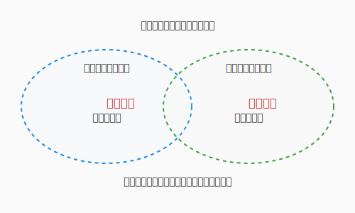

# 1.6 【外伝】言葉の壁を越えて——ドメイン翻訳とバベルの塔


「クエストのステータスを更新しました」

開発者がそう言ったとき、受付の職員（営業担当）は「報酬の支払いが完了した」と思い、冒険者（ユーザー）は「次の目的地が表示された」と思い、データベース管理者（DBA）は「行の更新フラグが立った」と思います。

一つの言葉が、立場によって異なる魔法の効果を持ってしまう——。これは現代のプロジェクトにおいて、混乱と失敗を招く「バベルの塔」の呪いです。本節では、ドメイン駆動設計（DDD）の重要な知恵である**「ユビキタス言語」**を使い、この呪いを解く翻訳の技術を学びます。

---

## 共通言語の錬成：ユビキタス言語

私たちは、技術用語だけで世界を語ろうとしてはいけません。また、ユーザーの言葉を鵜呑みにしてそのままコードに反映させるのも危険です。

大切なのは、開発者とドメインエキスパート（現場の専門家）が、対話を重ねて**「共通の魔法言語（ユビキタス言語）」**を錬成することです。

- **不適切な言葉**: `UpdateStatusRequest`, `process_flag`
- **ユビキタス言語**: `クエスト受注`, `報酬確定`, `冒険失敗`

コードの中に、現場のプロが使う言葉がそのまま息づいている状態。それが、認識のズレという魔物を寄せ付けない最強の結界になります。

## 境界を引く：限定されたコンテキスト

一つの巨大な塔を建てるのではなく、役割ごとに「領地（コンテキスト）」を分けることも重要です。



この図では、同じ「クエスト」という概念が、二つの異なる領地でまったく異なる役割を担っています。

- **受注コンテキスト**: 「クエスト」は、契約と条件の象徴。
- **戦闘コンテキスト**: 「クエスト」は、敵と報酬の象徴。

同じ言葉でも、コンテキスト（文脈）が変われば、その役割も変わります。これを無理に一つにまとめようとせず、**「境界づけられたコンテキスト（Bounded Context）」**として整理することで、大規模なシステムの複雑さを制御できます。

---

技術用語の陰に逃げ込まず、ドメインの言葉で語ること。言葉の定義を曖昧にせず、チーム全員が合意を取り続けること。境界づけられたコンテキストを引くことで、「同じ言葉、違う意味」という混乱を防ぐこと——これらは地味に見えて、プロジェクトの成否を分ける根本的な技術です。

正しい言葉は、正しい設計を導きます。バベルの塔が崩れたのは言葉の混乱が原因でした。逆に言えば、チームが同じ言語を共有できたとき、設計は驚くほどシンプルになります。あなたのチームだけの「聖なる辞書」——ユビキタス言語——を丁寧に編み上げていきましょう。

---

## AIへの詠唱例

```prompt
私たちのプロジェクトには「[役割A]」と「[役割B]」という2つのステークホルダーがいます。
「[特定の用語]」という言葉について、それぞれの立場から見た定義と期待する挙動の違いを分析し、
全員が納得できる「共通言語」の案を提示してください。
```

## さらに学ぶためのリソース

- 📚 **書籍**: エリック・エヴァンス『[ドメイン駆動設計](https://www.shoeisha.co.jp/book/detail/9784798121963)』（ユビキタス言語や境界づけられたコンテキストの原典）
- 📚 **書籍**: ヴォーン・ヴァーノン『[実践ドメイン駆動設計](https://www.shoeisha.co.jp/book/detail/9784798131610)』（DDDをより実践的に適用するためのガイド）
- 📄 **論文**: Eric Evans "[Ubiquitous Language](https://domainlanguage.com/ddd/ubiquitous-language/)"（提唱者によるユビキタス言語の解説）

---
