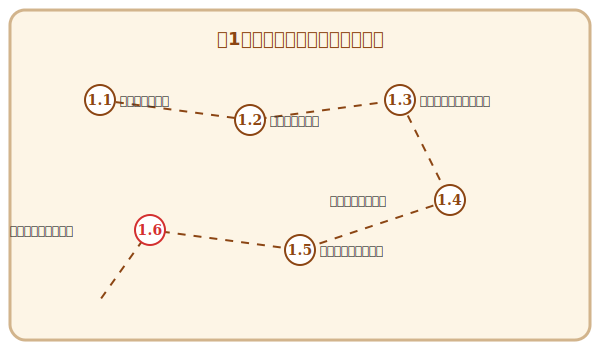

# 第1章 ドメインという名の異世界探検——要求工学入門

## この章で手に入れる力

ソフトウェア開発の冒険は、「何を作るか」を見極めることから始まります。

どんなに優れた技術を持っていても、作るべきものを見誤れば、その技術は活かせません。逆に、ユーザーの真の願いを理解できれば、シンプルな技術でも大きな価値を生み出せます。

この章では、**要求工学（Requirements Engineering）**の基礎を学びます。ユーザーの言葉の奥にある「隠れた願い」を発見し、それを明確な形に整理し、チームで共有できる図として可視化する——その一連の技術を身につけましょう。

---

## 冒険の地図

---

## 本章で使うサンプルプロジェクト

本章では、**QuestForge**というサンプルアプリを題材に学びます。

> **QuestForge**: 日々のタスクをRPGの「クエスト」に見立てて管理するアプリ。タスクを完了すると経験値を獲得し、レベルアップしていきます。

詳細は1.1節のコラムで紹介しています。サンプルコードは `sample-code/questforge/` にあります。

---

## 読了後のあなた

この章を読み終えると、あなたは以下のことができるようになります。

- **聴く**: ユーザーの言葉から「隠れた願い」を引き出せる
- **対話する**: AIペルソナを使って、いつでも仮説を検証できる
- **整理する**: 散らばった要求をゴールツリーで体系化できる
- **描く**: ユースケース図・アクティビティ図で要求を可視化できる
- **共有する**: チームメンバーと認識を揃えられる

さあ、要求工学という冒険の世界へ踏み出しましょう。

---

## さらに学ぶためのリソース（章全体）

各セクションの参考文献に加え、要求工学全般を学ぶためのリソースです。

- 📚 **書籍**: カール・ウィーガーズ『[ソフトウェア要求 第3版](https://www.shoeisha.co.jp/book/detail/9784798135946)』（要求工学の決定版。アジャイルやデータ要求も網羅）
- 📚 **書籍**: ジェラルド・ワインバーグ『[要求仕様の探検学](https://www.kyoritsu-pub.co.jp/book/b10011444.html)』（要求発見の技法を人間心理の側面から解き明かす古典）
- 📚 **書籍**: Axel van Lamsweerde "[Requirements Engineering: From System Goals to UML Models to Software Specifications](https://www.wiley.com/en-us/Requirements+Engineering%3A+From+System+Goals+to+UML+Models+to+Software+Specifications-p-9780470012703)"（ゴール指向分析のバイブル）
- 📚 **書籍**: マーチン・ファウラー『[UMLモデリングのエッセンス 第3版](https://www.shoeisha.co.jp/book/detail/9784798107950)』（UMLのエッセンスを短時間で習得できる定番書）
