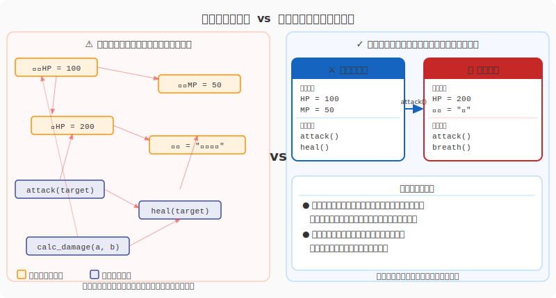

# 2.1 オブジェクト指向という魔法の源

第1章では「要求」という未知の領域を探検し、地図を描きました。これからは、その地図の上に城を築く「設計」のフェーズに入ります。

しかし、いきなり柱を立て始める前に、私たちが使う「建材」と「工法」について知る必要があります。現代のソフトウェア・アルケミーにおいて、最も基本的かつ強力な思想——それが**オブジェクト指向（Object-Oriented Programming: OOP）**です。

### 手続き型の迷宮 vs オブジェクト指向の秩序

オブジェクト指向以前の世界（手続き型プログラミング）では、データ（魔力）と処理（呪文）はバラバラに管理されていました。「勇者のHP」という変数がどこかにあり、「勇者を攻撃する関数」が別の場所にありました。規模が大きくなると、どこで誰のHPが減らされたのか追うのが難しくなり、世界はまるで出口のない迷宮のように複雑になっていきました。

オブジェクト指向は、この問題を解決するために生まれた「世界を再構築する魔法」です。
複雑な現実世界を「モノ（Object）」の集まりとして捉え直します。「勇者」というオブジェクトの中に「HP（データ）」と「戦う（処理）」をセットにして持たせるのです。



図の左側（手続き型）では、データと処理がバラバラに散在しています。右側（オブジェクト指向）では、「勇者」というオブジェクトがデータと処理を自ら抱え込んでいます。この構造の違いが、コードの可読性と保守性を根本から変えるのです。

### モノと役割の物語

オブジェクト指向の世界では、すべてのオブジェクトが「自律」しています。
彼らは自分の状態を自分で管理し、互いにメッセージ（依頼）を送り合うことでシステム全体を動かします。神様（メイン関数）がすべてを細かく操作するのではなく、登場人物たちがそれぞれの**役割（Role）**を果たしながら協調して物語を紡ぐ——それがオブジェクト指向の本質です。

---

次の図は、オブジェクト指向を支える「カプセル化・継承・ポリモーフィズム」の三本柱と、それぞれがシステムにもたらす役割を示しています。


ここで示された三つの柱は、それぞれ独立した魔法ではなく、互いに補い合う一体の思想です。カプセル化がデータと処理を一つの「カプセル」に封じ込め、継承が共通の性質を親から子へと受け継がせ、ポリモーフィズムが「同じ命令に異なる振る舞いで応える」柔軟性を生み出します。この三つが揃ってはじめて、コードは「命令の羅列」から「自律した存在の集まり」へと変貌するのです。

## 0. クラスとインスタンス：設計図と実体

オブジェクト指向を語る上で避けて通れないのが、「クラス」と「インスタンス」の関係です。これら三本柱の魔法を学ぶ前に、まずその土台となる概念を確認しましょう。

- **クラス（Class）**: 魔法のレシピ、あるいは設計図。「勇者とはこういうものだ」という定義です。実体はないので、これだけでは戦えません。
- **インスタンス（Instance）**: レシピから具現化された実体。「勇者アリス」や「勇者ボブ」など、実際にHPを持ち、戦うことができる存在です。

私たちアーキテクト（設計者）の仕事は、美しい「クラス」を書くことです。そして、実行時にそのクラスから無数の「インスタンス」が生まれ、世界を動き回るのです。

---

## 1. カプセル化：魔力の隠蔽

[図: カプセル化—内部状態と公開インターフェース]

### 概要

クラスとインスタンスの関係が見えたところで、オブジェクトの「秘密」を守るための最初の魔法石——カプセル化を見てみましょう。

カプセル化（Encapsulation）とは、データ（魔力）とそれを操作する手続き（呪文）を一つの「カプセル」に閉じ込め、外部から不用意に触らせないようにする技術です。

### 冒険でのたとえ
「伝説の魔剣」を想像してください。
使い手は、剣の柄を握って振る（インターフェース）だけで、強力な炎を放つことができます。剣の内部でどのような魔力回路が動いているか（内部実装）を知る必要はありません。また、剣の核（データ）に直接触れて壊してしまうリスクもありません。

では、この魔剣をコードで表現するとどうなるでしょうか。

### コードでの表現
```python
class MagicSword:
    def __init__(self):
        self._power = 100  # 内部の魔力（外部からは隠されている）

    def attack(self):
        # 外部には「攻撃する」という方法だけを見せる
        self._consume_power()
        print("炎の斬撃！")

    def _consume_power(self):
        # 内部でのみ使われる処理
        self._power -= 10
```

---

## 2. 継承：力の継承と進化

### 概要
カプセル化で「内部を守る」術を身につけたところで、次は既存の力を受け継ぎ新たな存在を生み出す魔法石——継承（Inheritance）の世界を見てみましょう。継承とは、あるクラス（親）の性質を受け継ぎ、新しいクラス（子）を作る技術です。コードの再利用性を高め、階層構造を作ります。

### 冒険でのたとえ
「モンスター」という基本種族がいるとします。
そこから「ドラゴン」や「ゴブリン」が派生します。彼らは皆「HPを持つ」「攻撃する」というモンスターとしての共通の性質（親の力）を受け継ぎつつ、ドラゴンなら「火を吐く」、ゴブリンなら「盗む」といった独自の能力（子の力）を追加で持っています。

### コードでの表現
```python
class Monster:
    def attack(self):
        print("攻撃した！")

class Dragon(Monster):  # Monsterの力を継承
    def breath(self):   # 独自の能力を追加
        print("火を吐いた！")
```

---

## 3. ポリモーフィズム：多態性の輝き

### 概要
継承で多種多様な存在が生まれた世界では、「同じ命令でそれぞれが輝く」という三つ目の魔法石が生きてきます——ポリモーフィズム（Polymorphism）とは、同じ「命令」に対して、受け取り手によって異なる「振る舞い」をする性質です。日本語では「多態性」と呼ばれます。

### 冒険でのたとえ
ギルドマスターが「総員、攻撃せよ！」と号令をかけたとします。
- 剣士は「剣を振るう」
- 魔法使いは「杖を掲げる」
- 僧侶は「祈りを捧げる」

号令（インターフェース）は一つですが、実際の行動（実装）はそれぞれの職業（クラス）によって異なります。これにより、ギルドマスターは個々の職業の詳細を知らなくても、全員を指揮することができます。

### コードでの表現
```python
def guild_attack(members):
    for member in members:
        member.attack()  # 全員に同じ「攻撃せよ」という命令

# 実行時
# memberが剣士なら斬撃、魔法使いなら魔法が発動する
```

### インターフェースを通じたポリモーフィズム

継承を使わなくても、**共通のインターフェース（抽象基底クラス）** を定義することでポリモーフィズムを実現できます。Pythonではサードパーティのクラス（外部ライブラリのオブジェクトなど）であっても、同じインターフェースを満たしていれば同一の関数に渡すことができます。これは「ダックタイピング」とも呼ばれ、「アヒルのように歩き、アヒルのように鳴くなら、それはアヒルだ」という思想です。

```python
from abc import ABC, abstractmethod

# 共通の「戦闘員」インターフェース（抽象基底クラス）
class Fighter(ABC):
    @abstractmethod
    def attack(self) -> str:
        pass

class Swordsman(Fighter):
    def attack(self) -> str:
        return "剣で斬撃！"

class Mage(Fighter):
    def attack(self) -> str:
        return "魔法を放つ！"

# どのFighterでも同じ関数で扱える
def guild_attack(members: list[Fighter]):
    for member in members:
        print(member.attack())

guild_attack([Swordsman(), Mage()])
# → 剣で斬撃！
# → 魔法を放つ！
```

インターフェース経由のポリモーフィズムは、**継承関係のないクラス同士**でも共通の操作を可能にし、コードの拡張性を大きく高めます。新しい職業を追加する際も、`Fighter` を継承して `attack` を実装するだけで、既存の `guild_attack` 関数に変更を加える必要がありません。

---

## AI時代のアプローチ: 役割分担の相談役

三本柱を学んだことで、コードをオブジェクトの集まりとして捉える目が育ってきました。しかし、「誰にどの役割を与えるか」という判断は、実際の設計で最も奥深い問いの一つです。オブジェクト指向設計のこの難しさにこそ、AIが強力なパートナーとして力を発揮します。

### 責務の提案
AIに「この機能を実現するために、どのようなクラス構成にすべきか？」と問いかけてみてください。AIは、驚くほど的確に「モノ」と「役割」を提案してくれます。

### ポリモーフィズムの発見
「この `if` 文の羅列、ポリモーフィズムを使ってもっときれいに書けない？」と相談すれば、AIはすぐに共通のインターフェースを定義し、美しいクラス構造へとリファクタリングしてくれます。

---

## ハンズオン: 小さな世界を創造する

### ステップ1: クラスを定義する
「動物（Animal）」クラスを作り、`speak`（鳴く）というメソッドを持たせましょう。

### ステップ2: 継承で種族を作る
「犬（Dog）」と「猫（Cat）」クラスを作り、Animalを継承させます。それぞれの `speak` メソッドで「ワン」「ニャー」と表示するようにオーバーライド（上書き）してください。

### ステップ3: 多態性を体験する
Animalのリストを作り、ループで回しながら `speak` を呼び出してみましょう。コードは同じでも、振る舞いが変わることを確認してください。

---

---

## AIへの詠唱例

```
Pythonを使って、カプセル化、継承、ポリモーフィズムの3大要素を示す簡単なRPGのコード例を書いてください。
```

```
オブジェクト指向の「ポリモーフィズム」について、小学生でもわかるように「動物の鳴き声」を使って説明してください。
```

## さらに学ぶためのリソース

- 📚 **書籍**: マット・ワイスフェルド『[オブジェクト指向の思考プロセス](https://www.amazon.co.jp/dp/483997114X)』（言語に依存せず、オブジェクト指向の「考え方」を学べる良書）
- 📚 **書籍**: エリック・フリーマン他『[Head Firstオブジェクト指向分析設計](https://www.oreilly.co.jp/books/9784873113500/)』（ストーリー形式で楽しく学べる入門書）
- 📄 **論文**: Alan Kay "[The Early History of Smalltalk](http://worrydream.com/EarlyHistoryOfSmalltalk/)"（オブジェクト指向の生みの親による、その思想の原点）

---
