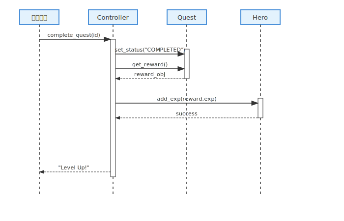
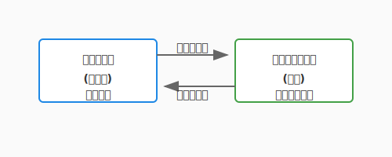
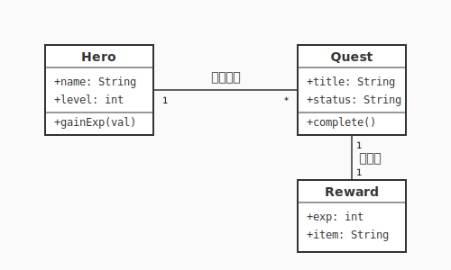
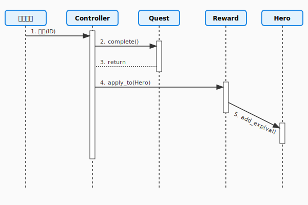
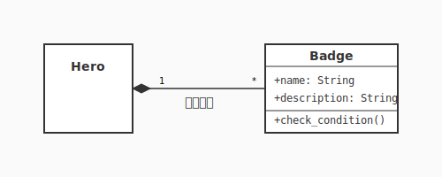

# 2.2 どう構造化するか？——設計を描く魔法陣（UML後編）





第1章では、私たちは「何を作りたいのか」という、広大で魅力的な要求の世界を探索してきました。

ユースケース図で登場人物（アクター）の目的を整理し、アクティビティ図で冒険の流れを描き出しました。

しかし、冒険の地図を手にしても、実際にその場所に城を築くためには、より詳細な「設計図」が必要です。「誰が何をするか」という要求の解像度を一段引き上げ、「どんな部品が、どう組み合わさって動くのか」という構造の世界へ足を踏み入れる時が来ました。

このセクションでは、設計を描くための「共通の魔法陣」——UML（統一モデリング言語）の後半戦として、クラス図とシーケンス図を学びます。これらは、あなたの頭の中にある漠然としたアイデアを、魔法（コード）として発動可能な論理的な形へと変換するための、美しく力強いツールです。

---

### なぜこれが重要か

設計図を描くことは、単なる記録作業ではありません。それは「思考の整理」そのものです。

複雑なシステムを構築する際、すべてを一度に考えるのは至難の業です。クラス図を使ってシステムの「静的な構造」を固定し、シーケンス図で「動的な振る舞い」をシミュレーションすることで、実装を始める前に設計のバランスを確認できます。これにより、後の工程でさらに効果的な改善を行うための、強固な土台を築くことができるのです。

### 基本概念

#### 1. クラス図：世界の「骨組み」
設計フェーズで最も頻繁に使われる図の一つが、クラス図という魔法陣です。システムの「静的な構造」を描き、概念間の関係性を固定します。

- **クラス**: 名前（真名）、属性（魔力）、操作（呪文）を持つ情報の箱。
- **関係性（魔力の結びつき）**:
    - **関連 (Association)**: 通常の結びつき。互いに認識している状態。
    - **集約 (Aggregation / 白抜きの菱形)**: 「パーティ」のような緩やかな主従関係。勇者がいなくなっても、装備していた剣は独立して存在できる。
    - **コンポジション (Composition / 黒塗りの菱形)**: 「肉体」のような強い主従関係。勇者が消滅すれば、その腕力も同時に消滅する運命共同体。
    - **依存 (Dependency / 点線矢印)**: 一時的な協力関係。ある呪文を唱える一瞬だけ、他のアイテムの力を借りるような淡い関係。
- **継承/汎化 (Inheritance)**: 「共通の性質」をまとめるエレガントな構造。

#### 2. シーケンス図：共鳴の儀式（ダイナミズム）
シーケンス図は、複数のオブジェクトが時間の経過とともに、どのようにメッセージをやり取りして一つの魔法（機能）を実現するかを描く「動的な魔法陣」です。

- **ライフライン（生命線）**: 魔法の媒介者（オブジェクト）がその儀式の間に存在していることを示す点線です。
- **メッセージ（魔力の伝達）**: オブジェクト間で交わされる「呼び出し」です。あるオブジェクトが別のオブジェクトの力を借りる（メソッドを呼ぶ）たびに、魔力が横断するように矢印が描かれます。
- **活性化（魔力の練成）**: ライフライン上に描かれる細長い長方形。そのオブジェクトが実際に思考し、魔力を練り上げている（処理を実行している）時間を表します。

クラス図が「どんな魔導具があるか」を示す目録だとすれば、シーケンス図は「それらをどの順番で動かして、どんな奇跡を起こすか」を示す、いわば**詠唱の連鎖**なのです。



図が示す流れに注目してください。「何をするか（What）」を捉えたユースケース図が、「どうするか（How）」を表現するクラス図・シーケンス図へと変換されていく様子がわかります。この変換プロセスこそが、分析から設計への橋渡しです。

---

## 実践例: QuestForgeのドメインモデル

私たちのサンプルプロジェクト「QuestForge」を題材に、実際に図を描いてみましょう。

### 従来のアプローチ（要求レベルのモデル）

記法の概念を理解したところで、まずは要求レベルから設計図を起こすアプローチを体験します。最初は、ドメインの主要な概念を抽出することから始めます。1.4節のゴール指向分析で特定した要素を、クラスの候補として配置します。



この図では、QuestForgeの主要なエンティティ——「クエスト」「勇者（User）」「報酬」——とそれらの関係性が一目でわかります。名詞が概念（クラス候補）になり、関係が線（関連）として現れる——これがドメインモデルの第一歩です。

### AI時代のアプローチ（詳細設計への進化）

AIを活用すると、このシンプルなモデルから、より実装に近い詳細な設計へとスムーズに移行できます。AIは既存のコードや要求仕様から、クラス間の細かい依存関係や、適切なインターフェースを提案してくれます。

たとえば、AIとの対話を通じて、「クエスト完了時の報酬付与プロセス」をシーケンス図として具体化してみましょう。



矢印の順序と方向に注目してください。「クエストを完了する」という一つのアクションが、QuestService → QuestRepository → RewardService という複数のオブジェクト間の連鎖として設計されています。シーケンス図はこの「責任の連鎖」を視覚化します。

### 比較と考察

要求を整理するための図と、実装を導くための図では、その「目的」に違いがあります。

| 観点 | 要求モデリング（1.5節） | 設計モデリング（本節） |
|------|-------------------------|------------------------|
| 主な読者 | ユーザー、ステークホルダー | 開発者、AIアシスタント |
| 抽象度 | 高い（現実世界の言葉） | 中〜低（プログラミングの言葉） |
| 注目点 | 「何ができるか」 | 「どう実現するか」 |
| ゴール | 共通認識の形成 | 迷いのない実装のガイド |

---

## 付録: 魔法陣の文法書（クラス図記法リファレンス）

正確な魔法陣を描くための、標準的な記法（シンタックス）をまとめました。

### 1. クラスの構造
クラスの構造から始め、可視性・関係性・多重度の順に詳細を押さえていきましょう。クラスは3つの部屋を持つ長方形で描かれます。

| 部屋 | 内容 | 記法例 |
|---|---|---|
| **上段** | **クラス名**（真名） | `Hero` |
| **中段** | **属性**（魔力） | `+name: String`<br>`-hp: int` |
| **下段** | **操作**（呪文） | `+attack(target)`<br>`#recover()` |

### 2. 可視性（魔力の公開範囲）
属性や操作が、誰から見えるかを定義します。

| 記号 | 名前 | 意味 | イメージ |
|:---:|---|---|---|
| `+` | **Public** | 誰でもアクセス可能 | 街の広場で叫ぶ |
| `-` | **Private** | 自分自身のみ | 心の中の独り言 |
| `#` | **Protected** | 自分と継承者（子供）のみ | 一族の秘伝 |
| `~` | **Package** | 同じパッケージ内のみ | ギルドメンバー限定 |

### 3. 関係性（魔力の結びつき）の詳細
クラス間の結びつきを、線の種類で区別します。

| 関係名 | 線種 | 説明 | コード例 |
|---|---|---|---|
| **関連**<br>(Association) | 実線<br>`──>` | 知り合い。「AはBを知っている」。 | `class A { b: B }` |
| **集約**<br>(Aggregation) | 白抜き菱形<br>`◇──` | 「全体」と「部分」。部分は独立して生きられる（弱い所有）。 | `Party` と `Hero` |
| **コンポジション**<br>(Composition) | 黒塗り菱形<br>`◆──` | 運命共同体。全体が消えれば部分も消える（強い所有）。 | `Hero` と `Arm` |
| **依存**<br>(Dependency) | 点線矢印<br>`..>` | 一時的な利用。引数などで一時的に使うだけ。 | `Hero.heal(Potion)` |
| **汎化**<br>(Generalization) | 白抜き三角<br>`──▷` | 継承。「BはAの一種である（Is-a）」。 | `Dragon` is a `Monster` |
| **実現**<br>(Realization) | 点線白三角<br>`..▷` | 実装。インターフェースの契約を満たす。 | `Hero` implements `ICharacter` |

### 4. 多重度（結びつきの数）
関係の端に数字を書き、相手がいくつ存在するかを示します。

- `1`: 必ず1つ（運命の相手）
- `0..1`: 0か1つ（持っていないかもしれない）
- `*` / `0..*`: 0以上（たくさん）
- `1..*`: 1以上（最低1つは必要）

**例**: `Hero "1" -- "0..*" Badge`
「一人の勇者は、0個以上のバッジを持つ」

---

## ハンズオン: 実際に描いてみよう

現代の設計では、マウスで図を描くよりも、テキストベースで図を「記述」するスタイルが主流です。これにより、AIとの親和性が格段に高まります。

### ステップ1: PlantUML / Mermaidの準備

文法の全貌が見えてきたところで、実際にツールを使って魔法陣を描く感覚を体験してみましょう。VS Codeなどのエディタに、MermaidやPlantUMLの拡張機能を導入します。これらは、テキストを即座に美しい図へと変換してくれます。

### ステップ2: クラスの関係を定義する

以下のコードをエディタに貼り付けてみてください。QuestForgeに「バッジ（Badge）」システムを追加する設計です。
ここで `*--` は**コンポジション（強い結びつき）**を表しています。バッジは勇者の実績の一部であり、勇者が消えればバッジも意味をなさなくなる、という設計意図を込めています。



### ステップ3: AIに図をレビューしてもらう

描いた図（テキスト）をAIに見せ、「この設計をさらに柔軟にするにはどうすればいい？」と問いかけてみましょう。AIは、インターフェースの導入やパターンの適用など、あなたの設計を次のレベルへ引き上げるアイデアをくれるはずです。

ここでAIが提案してくる「美しさの基準」の多くは、次節（2.3節）で詳しく学ぶ「SOLID原則」に基づいています。今はまず、図を描くことで思考が整理される感覚を楽しんでください。

---

## より深く理解するために

### よくある誤解

ハンズオンで手を動かした後は、設計の目を磨くためによくある誤解とベストプラクティスを確認しておきましょう。

1. **誤解**: すべてのクラスを完璧に図示しなければならない。
   - **真実**: 図は「伝えるための道具」です。複雑すぎる図はかえって理解を妨げます。重要な部分、変化が激しい部分に絞って描くのがコツです。

2. **誤解**: コードを書く前にすべてのシーケンスを確定させるべきだ。
   - **真実**: 設計と実装は反復するものです。図で大枠を捉え、実装しながら詳細を詰め、必要に応じて図を更新していくのが、現代的なアジャイルのアプローチです。

### ベストプラクティス

- **コードと同期させる**: 魔法陣が古くなると混乱を招きます。Git管理できるテキストベースのUMLを使い、コードの変更に合わせて図も更新しましょう。
- **AIを「モデリング・パートナー」にする**: AIに「このアクティビティ図を実現するクラス図を提案して」と依頼することで、要求から設計へのジャンプを軽やかに行えます。
- **「魔力の流れ」を左から右へ**: シーケンス図では、主要な流れを左から右へ、応答を右から左へ描くのが基本です。矢印が激しく交差しすぎる場合は、責務の分散が「調和」していないサインかもしれません。そんな時は、魔法陣の構成を見直すチャンスです。

---

クラス図は設計の「静止画」であり、シーケンス図は「動画」です。静止画がクラスの役割と関係を明確にし、動画がオブジェクト間の会話の流れを可視化する——二つを組み合わせることで、「何があるか」と「何が起きるか」という設計の全貌が立体的に見えてきます。

第1章で描いた要求の地図（What）から、ここではクラスとシーケンスという設計図（How）へと思考の解像度を上げました。テキストベースのUMLはAIとの協働にも馴染み、「このクラス図をレビューして」と問いかけるだけで設計の精度を高速に磨ける強みがあります。

部品の形が見えてきたところで、次の問いが浮かびます——**どんな配置の原則に従えば、変更に強く、触るのが楽しいコードになるのか？** 2.3節では、優れた設計を導く「黄金律」、SOLID原則の世界を探索します。

---

## AIへの詠唱例

このセクションで学んだことを実践するためのプロンプト：

```
以下の要求仕様から、主要なクラスとその関係性を示すMermaid形式のクラス図を作成してください：
「ユーザーはクエストを受注し、達成すると経験値とアイテムを獲得できる。また、特定の条件を満たすとバッジが付与される。」
```

```
上記の設計において、「クエスト完了から報酬付与、バッジ獲得のチェックまで」の処理の流れをシーケンス図にしてください。
```

---

**執筆メモ**:
- 執筆日時: 2026-01-26
- AIモデル: Gemini 2.0 Flash (CLI)
- 実装の意図: 要求から設計へのスムーズな移行を、UML後編という位置づけでポジティブに解説。AI時代にテキストベースUMLが重要であることを強調。

## さらに学ぶためのリソース

- 📚 **書籍**: クレイグ・ラーマン『[実践UML 第3版](https://www.amazon.co.jp/dp/489471611X)』（反復開発とUMLを組み合わせた、実践的な魔導書）
- 🌐 **仕様**: OMG "[Unified Modeling Language (UML) Specification](https://www.omg.org/spec/UML/)"（UMLの公式仕様書）
- 🌐 **ツール**: [PlantUML](https://plantuml.com/ja/) / [Mermaid](https://mermaid.js.org/)（テキストから設計図を生成する現代の必須ツール）

---
