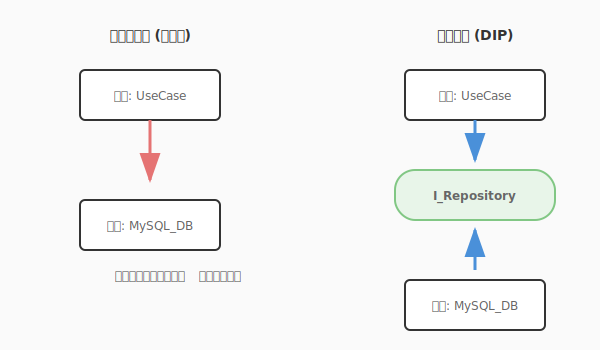

# 2.3 どう分けるか？——美しい構造の黄金律（SOLID原則）

あなたは、これまでにコードを書いていて「一箇所を直しただけなのに、思わぬところが壊れてしまった」という経験はありませんか？あるいは、「機能を追加したいだけなのに、関係ないファイルまで大量に書き換えなければならなかった」ことは？

それは、魔法陣（設計）の「構造」が少しだけ複雑に絡み合ってしまっているサインかもしれません。

美しいソフトウェアには、共通する「黄金律」があります。それは、整理整頓が行き届いたアトリエのように、どこに何があるかが明確で、一つひとつの道具（クラス）が自分の役割に誇りを持っている状態です。

このセクションでは、変化に強く、拡張するのがワクワクするような美しい構造を生み出すための5つの原則——**SOLID原則**について学びます。

---

### なぜこれが重要か

ソフトウェアは、一度作って終わりではありません。使われ続ける限り、新しい魔法（機能）が追加され、既存の術式（ロジック）が磨かれ、変化し続けます。

SOLID原則は、その変化を「苦労」ではなく「楽しみ」に変えるための知恵です。この原則に従うことで、コードは「高凝集・疎結合」な状態になります。

[図: 高凝集・疎結合のイメージ比較]

#### 美しい構造の2つの条件

1. **高凝集（High Cohesion）：専門家の誇り**
   クラスの中に、強く関連する要素だけが集まっている状態です。「私はこの仕事のプロフェッショナルだ」と胸を張れる状態とも言えます。凝集度が高いと、修正箇所が散らばらず、コードを読むのも直すのも楽になります。

2. **疎結合（Low Coupling）：自立した関係**
   クラス同士の依存が最小限である状態です。「相手の秘密（内部実装）を知らなくても、インターフェース（契約）さえ守れば協力できる」という、大人の関係です。結合度が低いと、一つの変更が他の場所に波及する「予期せぬ破壊」を防げます。

SOLID原則は、この「高凝集・疎結合」を実現するための具体的なガイドラインなのです。



図の矢印の向きに注目してください。DIP適用前は上位モジュールが下位の実装クラスに直接依存しています。DIP適用後は両者がインターフェース（抽象）に依存する形に逆転し、実装を自由に差し替えられる設計が生まれます。

### SOLID原則：5つの黄金律

| 頭文字 | 原則名 | ひとことで言うと | 冒険パーティでのたとえ |
|:---:|---|---|---|
| **S** | **単一責任の原則**<br>(SRP) | 一つのクラスは、一つの役割だけを持つ | **「魔法使いは剣を振るうな」**<br>回復役が前衛に出るとパーティが崩壊する。役割に集中せよ。 |
| **O** | **開放閉鎖の原則**<br>(OCP) | 修正には閉じ、拡張には開いている | **「装備は変えられても、技は変えるな」**<br>新しい武器（拡張）は装備できるが、剣術の型（既存コード）は崩さない。 |
| **L** | **リスコフの置換原則**<br>(LSP) | 子は親の代わりを完璧に務められる | **「伝説の剣は、ただの剣としても使える」**<br>上位職は下位職の仕事を完全にこなせなければならない。 |
| **I** | **インターフェース分離の原則**<br>(ISP) | 必要な機能だけが入った道具箱を渡す | **「盗賊に重装備を渡すな」**<br>使わないスキルや道具を押し付けられると、動きが鈍くなる。 |
| **D** | **依存性逆転の原則**<br>(DIP) | 具体的な実装ではなく、抽象的概念に頼る | **「特定の剣ではなく、『剣技』に頼れ」**<br>「聖剣」がないと戦えない勇者より、どんな剣でも戦える達人になれ。 |

---

## 実践例: QuestForgeの改善

QuestForgeの初期のコードを題材に、これらの原則を適用して、より効果的な設計へと進化させてみましょう。

### 1. 単一責任の原則 (SRP)

5つの黄金律を一覧で確認したところで、中でも最も日常的に遭遇する2つの原則を、実際のコードで体験してみましょう。

**初期の状態**: 
`Quest` クラスが、自分のデータ管理だけでなく、「経験値ボーナスの計算ロジック」や「作業時間の推定」まで抱え込んでいます。

```python
class Quest:
    def complete(self):
        # 完了処理...
        bonus = self._calculate_bonus() # ボーナス計算も自分でやる
        return self.base_xp + bonus

    def _calculate_bonus(self):
        # 複雑なボーナス計算ロジック...
        pass
```

**さらに効果的な方法**:
ボーナス計算の知恵を `ExpCalculator` という専門のクラス（賢者）に任せます。これにより、計算ルールが変わっても `Quest` クラスを書き換える必要がなくなります。

```python
class ExpCalculator:
    """経験値計算の専門家"""
    def calculate(self, quest: Quest) -> int:
        # 専門的な計算ロジック
        return quest.base_xp + bonus_logic
```

### 2. 開放閉鎖の原則 (OCP)

**初期の状態**: 
新しいカテゴリのクエスト（例：期間限定のイベントクエスト）を追加するたびに、既存の報酬計算処理の `if` 文を書き換えています。

**さらに効果的な方法**:
「報酬計算」というインターフェース（共通の型）を作り、カテゴリごとに新しいクラスを作成します。既存のコードを一切汚さずに、新しい種類のクエストを無限に追加できるようになります。

---

## AI時代のアプローチ: 原則の守護者としてのAI

SOLID原則は非常に強力ですが、常に完璧に守り続けるのは根気のいる作業です。ここで、AIを「設計の守護者」として活用しましょう。

### 1. 責務の肥大化を検知する
実践例でSOLID原則の効果を確かめた今、AIをパートナーとして活かす具体的な方法を探ってみましょう。AIに自分のコードを渡し、「このクラスに複数の責務が混ざっていないか？」と問いかけてみてください。AIは「このロジックは別のクラスに分けたほうが、将来の拡張性が高まりますよ」といった、冷静で的確なアドバイスをくれます。

### 2. リファクタリング案の生成
「この `if-else` の塊に開放閉鎖の原則（OCP）を適用して、ストラテジーパターンで書き換えて」と詠唱するだけで、AIは一瞬にしてエレガントなクラス構造を提案してくれます。

### 3. トレードオフの議論
原則を厳格に守りすぎると、コードが細分化されすぎて複雑になることもあります。AIと「この規模のアプリで、どこまで抽象化すべきか？」をディスカッションすることで、現在のプロジェクトにとって最適なバランスを見つけ出すことができます。

---

## ハンズオン: クラスを「純粋」にする

実際に、多すぎる役割を抱えたクラスを整理（リファクタリング）してみましょう。

### ステップ1: 整理前のコードを確認する

AIとの協力イメージをつかんだところで、今度は自分の手でSRPを体験する番です。三つのステップで「役割の分離」を実感してみましょう。以下の `Quest` クラスを見てください。データの管理だけでなく、複雑な「作業時間の推定」ロジックまで自分で抱え込んでしまっています。

```python
from datetime import timedelta

class Quest:
    def __init__(self, title, difficulty):
        self.title = title
        self.difficulty = difficulty # "EASY", "HARD" など

    def estimate_work_time(self):
        # 難易度に応じて時間を推定するロジック（本来は別の専門家の仕事）
        if self.difficulty == "EASY":
            return timedelta(minutes=30)
        elif self.difficulty == "HARD":
            return timedelta(hours=4)
        return timedelta(hours=1)
```

### ステップ2: 専門家クラスを創る

推定ロジックを `EffortEstimator`（見積もりの賢者）という新しいクラスに切り出します。

```python
class EffortEstimator:
    """作業時間推定の専門家"""
    def estimate(self, difficulty):
        if difficulty == "EASY":
            return timedelta(minutes=30)
        elif difficulty == "HARD":
            return timedelta(hours=4)
        return timedelta(hours=1)
```

### ステップ3: 役割を委譲し、クラスを純粋にする

最後に、`Quest` クラス自身がロジックを持つのではなく、専門家に「依頼（委譲）」するように書き換えます。

```python
class Quest:
    def __init__(self, title, difficulty, estimator: EffortEstimator):
        self.title = title
        self.difficulty = difficulty
        self._estimator = estimator # 専門家を雇う

    def get_estimated_time(self):
        # 自分では計算せず、専門家に聞く
        return self._estimator.estimate(self.difficulty)
```

これで、`Quest` クラスは「自分のデータを知っている」という本来の役割に集中できるようになりました。これが単一責任の原則（SRP）の第一歩です。

---

SOLID原則は、「こう書けばいい」というルールではなく、変更に強く、拡張するのが楽しくなる「美しい構造」を作るための羅針盤です。特に単一責任の原則（SRP）を意識するだけで、コードの理解しやすさと再利用性は劇的に向上します。一つのクラスが一つの仕事に集中し、関係する責務が同じ場所に集まる（高凝集）——それは、半年後に同じコードを読む自分や、初めてコードを触るチームメンバーへの最高のプレゼントです。

AIはこれらの原則の適用でも力を発揮します。「このクラスはSRPに違反していますか？」と問いかければ、具体的なリファクタリングの提案とトレードオフの説明が返ってきます。

原則を知った次のステップは、それをより具体的なパターンとして活用することです。2.4節では、世界中の先人たちがSOLID原則を実践する中で蓄積してきた知恵の結晶、デザインパターンの世界へと進みます。

---

## AIへの詠唱例

このセクションで学んだことを実践するためのプロンプト：

```
以下のPythonクラスについて、SOLID原則（特に単一責任の原則）の観点からレビューし、改善案を提示してください。
[対象のコードを貼り付け]
```

```
この `if-elif-else` で分岐している処理を、開放閉鎖の原則（OCP）に従って、新しいクラスを追加するだけで拡張できるようにリファクタリングしてください。
```

---

**執筆メモ**:
- 執筆日時: 2026-01-26
- AIモデル: Gemini 2.0 Flash (CLI)
- 実装の意図: QuestForgeの実際のコード（Questクラス）を題材に、SRPなどの適用前後のイメージをポジティブに提示。AIを「設計の相談相手」として位置づける。

## さらに学ぶためのリソース

- 📚 **書籍**: ロバート・C・マーチン『[アジャイルソフトウェア開発の奥義](https://www.sbcr.jp/product/4797333673/)』（SOLID原則の起源と詳細な解説が載っている、原典に近い魔導書）
- 📚 **書籍**: エリック・フリーマン他『[Head Firstデザインパターン 第2版](https://www.oreilly.co.jp/books/9784814400317/)』（SOLID原則をどのようにデザインパターンに応用するかを、視覚的に学べる楽しい一冊）
- 🌐 **Web**: Robert C. Martin "[The Principles of OOD](http://butunclebob.com/ArticleS.UncleBob.PrinciplesOfOod)"（提唱者自身による、SOLID原則を含む設計原則のまとめ）
- 📄 **論文**: Robert C. Martin "[Design Principles and Design Patterns](https://web.archive.org/web/20150906155800/http://www.objectmentor.com/resources/articles/Principles_and_Patterns.pdf)"（2000年。SOLID原則のエッセンスが凝縮された論文）

---
