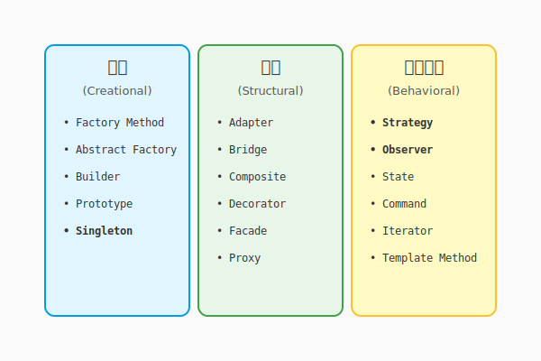
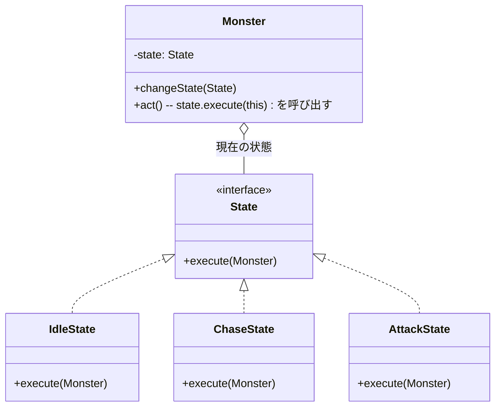

# 2.4 どう受け継ぐか？——デザインパターンの知恵

**執筆状態**: 🟩 暫定完了

**最終更新**: 2026-01-26

---

## 導入: 賢者たちの処方箋

ここまでの旅で、あなたは「オブジェクト指向」という魔法の源（2.1節）を手に入れ、「UML」という魔法陣（2.2節）を描き、「SOLID原則」という黄金律（2.3節）を学びました。

しかし、実際の冒険（開発）では、似たような困難に何度も遭遇することになります。
「変化するアルゴリズムをどう切り替えるか？」「状態の変化をどうやって皆に知らせるか？」「複雑なオブジェクトをどうやって生成するか？」

安心してくだい。これらの問題は、あなたより先にこの道を歩いた「古の賢者たち」も悩み、そして解決してきたものです。彼らが残した解決策の結晶、それが**デザインパターン**です。

これは単なる再利用ではありません。「知恵の継承」です。先人たちの知恵を受け継ぎ、巨人の肩の上に立つことで、私たちはより遠くへ行けるのです。

---

## 理論的背景

### パターン・ランゲージ：建築家からの贈り物



「パターン」という考え方は、実はソフトウェアの世界で生まれたものではありません。
元々は建築家クリストファー・アレグザンダーが提唱した**パターン・ランゲージ**という概念です。彼は、心地よい街や建物に共通する「構造」をパターンとして抽出しました。

「日当たりの良い場所（Sunny Place）」や「縁側（Arcade）」のように、名前をつけることで、誰もがその良さを認識し、設計に取り入れられるようにしたのです。

この「共通の課題に、名前のついた解決策を与える」という思想が、ソフトウェア工学にも輸入されました。私たちもまた、バーチャルな世界に「心地よい構造」を築く建築家だからです。

### GoFのデザインパターン

1994年、4人の賢者（Gang of Four: GoF）によって記されたグリモワール『デザインパターン』は、この思想をソフトウェアの世界で決定的なものにしました。彼らは23のパターンを定義しましたが、現代のAI駆動開発において特に重要なのは以下の3つの分類です。

1.  **生成に関するパターン（Creational）**: 「どう生み出すか」の知恵（例：Factory Method）
2.  **構造に関するパターン（Structural）**: 「どう組み合わせるか」の知恵（例：Adapter）
3.  **振る舞いに関するパターン（Behavioral）**: 「どう協調するか」の知恵（例：Strategy, Observer）

### パターンは「共通言語」

「ここにStrategyパターンを使おう」と言えば、世界中のエンジニア（そしてAI）に一瞬で意図が伝わります。パターンを学ぶことは、より高度な魔法の言葉を習得することと同じなのです。

### GoFの23の紋章（全パターン一覧）

すべてのパターンを一度に覚える必要はありませんが、目録として知っておくと便利です。本書の世界観に合わせて、ひとこと比喩を添えました。

| 分類 | パターン名 | ひとこと比喩 |
|:---:|---|---|
| **生成** | **Factory Method** | 「町工場」：製品の作り方は工場に任せる |
| | **Abstract Factory** | 「王立工廠」：関連する製品群をまとめて作る |
| | **Builder** | 「建築手順書」：複雑な建築手順を段階的に進める |
| | **Prototype** | 「影分身」：自分自身のコピーを作って増える |
| | **Singleton** | 「唯一神」：世界に一つしか存在しないことを保証する |
| **構造** | **Adapter** | 「翻訳機」：異なる言葉（インターフェース）を繋ぐ |
| | **Bridge** | 「機能と実装の架け橋」：両者を独立して拡張する |
| | **Composite** | 「マトリョーシカ」：全体と部分を同じように扱う |
| | **Decorator** | 「着せ替え人形」：中身を変えずに機能を追加・装飾する |
| | **Facade** | 「執事」：複雑な裏側を隠し、シンプルな窓口になる |
| | **Flyweight** | 「共有倉庫」：大量の細かいオブジェクトを共有して軽くする |
| | **Proxy** | 「代理人」：本人の代わりにアクセスを制御する |
| **振る舞い** | **Chain of Responsibility** | 「たらい回し」：責任を持てる人が見つかるまで次へ渡す |
| | **Command** | 「命令書」：要求をオブジェクトとしてカプセル化する |
| | **Interpreter** | 「通訳」：文法規則に従って言語を解釈する |
| | **Iterator** | 「ガイド」：内部構造を知らなくても要素に順にアクセスする |
| | **Mediator** | 「仲介者」：オブジェクト同士の複雑な通信を整理する |
| | **Memento** | 「セーブポイント」：状態を保存し、後で復元する |
| | **Observer** | **「狼煙（のろし）」：状態変化を登録者に通知する** |
| | **State** | 「変身」：状態によって振る舞いを変える |
| | **Strategy** | **「軍師の策」：アルゴリズム（戦術）を切り替える** |
| | **Template Method** | 「秘伝のレシピ」：処理の枠組みを決め、詳細は子に任せる |
| | **Visitor** | 「訪問者」：データ構造と処理を分離する |

※ **太字** は、以下の実践例で詳しく解説する、現代のAI駆動開発においても特に頻出のパターンです。なお、**Repositoryパターン**はGoFには含まれませんが（PofEAA由来）、現代の設計では必須級のため併せて紹介します。

---

## 実践例: QuestForgeへの継承

QuestForgeの開発において、特に役立つ「3つの処方箋」を紹介しましょう。

### 1. Strategyパターン：戦術の切り替え

[図: StrategyパターンによるXP計算の差し替え]

**課題**: クエストの経験値計算ロジックが、「通常時」「キャンペーン期間中」「プレミアム会員」などで頻繁に変わる。`if`文の嵐になりそうだ。

**処方箋**: 「計算ロジック（戦術）」をクラスとして独立させ、切り替え可能にする。

```python
# 戦術のインターフェース
class ExpStrategy:
    def calculate(self, base_exp): pass

# 具体的な戦術
class NormalStrategy(ExpStrategy):
    def calculate(self, base_exp): return base_exp

class CampaignStrategy(ExpStrategy):
    def calculate(self, base_exp): return base_exp * 2

# 使用者（コンテキスト）
class Quest:
    def __init__(self, strategy: ExpStrategy):
        self.strategy = strategy

    def complete(self):
        return self.strategy.calculate(self.base_exp)
```

**効果**: どんなに計算式が増えても、`Quest`クラスは無傷です（OCPの遵守）。

### 2. Observerパターン：狼煙（のろし）を上げる

**課題**: クエストを完了した時、「レベルアップの確認」「バッジの付与」「UIの更新」「ログの送信」など、やりたいことが山ほどある。これらを全部 `complete()` メソッドに書くと、結合度が爆発する。

**処方箋**: 「何かが起きた（イベント）」ことだけを通知し、興味がある人（オブザーバー）に勝手に動いてもらう。

```python
class QuestSubject:
    def __init__(self):
        self._observers = []

    def attach(self, observer):
        self._observers.append(observer)

    def notify_completion(self, quest):
        # 狼煙を上げる！
        for observer in self._observers:
            observer.update(quest)

# 興味がある人たち
class LevelUpChecker: ...
class BadgeGranter: ...
class UIRefresher: ...
```

**効果**: 通知する側は、相手が誰で何をするか知る必要がありません（疎結合の極み）。

### 3. Repositoryパターン：倉庫の番人

**課題**: データを保存する場所が、メモリだったり、ファイルだったり、クラウドデータベースだったりと変わる可能性がある。ビジネスロジックが保存先の詳細を知りたくない。

**処方箋**: データの出し入れを抽象化し、「倉庫の番人」に任せる。

```python
class IQuestRepository:
    def save(self, quest): pass
    def find_by_id(self, id): pass

# 実装は裏でこっそり切り替える
class JsonQuestRepository(IQuestRepository): ...
class SqliteQuestRepository(IQuestRepository): ...

# 利用側のイメージ：具体的な保存先を知らなくてよい
repo: IQuestRepository = SqliteQuestRepository() # 実際は設定ファイル等で切り替える
repo.save(new_quest)
```

**効果**: テスト時はメモリ、本番はDBといった切り替えが容易になります（テスト容易性の向上）。

---

## AI時代のアプローチ: パターンの民主化

かつて、デザインパターンの習得には長い修行が必要でした。しかし今は、AIという相棒がいます。

### パターンの発見と適用
「このコード、条件分岐が多くて読みづらいんだけど、いいパターンある？」とAIに聞いてみてください。「Strategyパターンが使えますよ」と提案し、リファクタリング後のコードまで生成してくれるでしょう。

### パターンの学習
「Observerパターンを、学校の放送委員会に例えて説明して」と頼めば、AIはあなたにぴったりの比喩で解説してくれます。

---

## ハンズオン: AIと行う「設計の選定」

コードを書く前に、まずは「どのパターンを使うべきか」を判断し、構造を設計することが重要です。AIを参謀として、最適な戦術を選んでみましょう。

### ステップ1: 課題をAIに相談する

あなたは「モンスターの行動パターンが複雑すぎて、管理しきれない」という問題に直面しています。以下のプロンプトをAIに投げかけ、解決策を探ってください。

```
RPGを作っていますが、モンスターの状態（待機、追跡、攻撃、逃走）によって行動がガラリと変わり、switch文が肥大化して困っています。
この問題を解決するのに適したGoFデザインパターンを提案し、その理由を教えてください。
```

### ステップ2: 構造を可視化する

AIはおそらく「Stateパターン」や「Strategyパターン」を提案するでしょう。
次に、そのパターンを適用した場合の設計図（クラス図）を描かせます。

```
提案された「Stateパターン」を適用した場合のクラス図を、Mermaid形式で出力してください。
クラス名：Monster, State（インターフェース）, IdleState, ChaseState, AttackState
```

### ステップ3: 魔法陣（設計図）を確認する

AIが出力したMermaidコードをエディタやプレビューツールで確認しましょう。以下のような構造が表示されるはずです。



コードを1行も書かずに、複雑な状態遷移をきれいに整理する「構造」が見えましたか？
これがデザインパターンの力であり、設計の楽しさです。

---

## まとめ

1.  **デザインパターン**は、先人たちの知恵の結晶であり、共通の課題に対する「処方箋」である。
2.  **Strategyパターン**は、アルゴリズム（戦術）をカプセル化し、交換可能にする。
3.  **Observerパターン**は、状態変化を通知し、疎結合な連携を実現する。
4.  **AIを活用**することで、適切なパターンの選択と実装が劇的に容易になる。

これで、あなたの道具箱には強力な魔法の道具が揃いました。
次節では、これらを組み合わせて城全体を築くための設計図——**アーキテクチャ**について学びます。

---

## さらに学ぶためのリソース

### 古のグリモワール（推薦図書）

- 📚 **エリック・フリーマン他『Head Firstデザインパターン』**: ここでも登場。パターンの入門書としてこれ以上のものはない。
- 📚 **GoF『オブジェクト指向における再利用のためのデザインパターン』**: 原典。難解だが、アルケミストなら一度は目を通しておきたい。
- 📚 **結城浩『Java言語で学ぶデザインパターン入門』**: 日本の賢者による、非常に分かりやすい解説書。言語はJavaだが考え方は共通。

---

## AIへの詠唱例

```
PythonでObserverパターンを実装したいです。
「天気が変わったら、村人とカエルがそれぞれの反応をする」というサンプルコードを書いてください。
```

```
StrategyパターンとStateパターンの違いを、RPGのキャラクターの状態変化に例えて説明してください。
```
