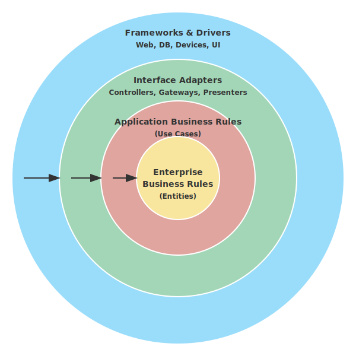

# 2.5 どう守るか？——クリーンアーキテクチャ

オブジェクト指向で「魔力の源」を知り、UMLで「魔法陣」を描き、SOLID原則とデザインパターンで「美しい構造」を学びました。しかし、あなたの作ったシステムは、外の世界の嵐（変化）に耐えられるでしょうか？

- 「データベースをOracleからPostgreSQLに変えたい」
- 「Web画面だけでなく、スマホアプリも作りたい」
- 「UIフレームワークをReactからVueに変えたい」

こうした外側の変化のたびに、大切なビジネスロジック（クエストの計算式やレベルアップのルール）まで書き換える必要があったら、冒険はいつまでたっても進みません。

本当に大切な「魂（ドメインロジック）」を守るために、堅牢な城壁を築く必要があります。それが**クリーンアーキテクチャ**です。


---


### 同心円の城郭都市

次の図は、クリーンアーキテクチャを構成する同心円状の各レイヤーと、それらの間の依存の方向を示しています。



ここで特に注目すべきは、矢印の向きです。すべての依存関係は「外から内」——すなわちインフラ層やインターフェース層からドメイン層へと向かっています。中心にある「ドメイン層」は何にも依存せず、データベースやWebフレームワークの存在を知りません。この構造により、外側の「道具」が何であれ、城の本丸（ビジネスロジック）は傷つかずに輝き続けます。

クリーンアーキテクチャは、システムを同心円状の階層（レイヤー）に分ける考え方です。

中心に行けば行くほど「重要で変化しにくいもの」、外側に行けば行くほど「詳細で変化しやすいもの」を配置します。

#### 1. ドメイン層（Entities）：城の本丸（Keep）
ビジネスの核心となるルールです。QuestForgeで言えば、「経験値が溜まればレベルが上がる」といった、ゲーム自体のルールです。データベースやUIが何であれ、このルールは変わりません。

#### 2. アプリケーション層（Use Cases）：内郭（Inner Wall）
ユーザーがシステムを使って達成したいこと（ユースケース）です。「クエストを作成する」「報酬を受け取る」といった処理の流れを記述します。

#### 3. インターフェース層（Interface Adapters）：外郭（Outer Wall）
内側のデータを、外側（DBやUI）が使いやすい形に変換する翻訳者たちです。ControllerやPresenter、Gatewayがここにいます。

#### 4. インフラ層（Frameworks & Drivers）：城下町
Webフレームワーク、データベース、外部APIなど。これらはあくまで「道具」であり、いつでも取り替え可能な状態にしておきます。

### 依存の方向性（The Dependency Rule）

[図: 依存方向のルール（内向きの矢印）]

この城にはたった一つ、絶対の掟があります。

> **「依存の矢印は、常に外側から内側へ向かわなければならない」**

外側（DBやUI）は内側（ドメイン）を知っていますが、内側は外側のことを一切知りません。王様（ドメイン）は、城下町（DB）の流行り廃りに影響されないのです。

### 城壁の高さ：オーバーエンジニアリングとYAGNIの智慧

クリーンアーキテクチャは強力な「守り」ですが、一つだけ心がけておきたいポイントがあります。それは、**オーバーエンジニアリング（過剰設計）**です。

小さな小屋を建てるだけなのに、何十メートルもの石造りの城壁（何層もの抽象化レイヤー）を築くのは、かえって時間と労力の無駄になり、身動きが取れなくなってしまいます。

ここで、アルケミストが心得ておくべき2つの「自戒の呪文」を紹介します。

1.  **YAGNI（You Aren't Gonna Need It）**: 
    「それはきっと必要にならない」。将来の変更を予測して複雑な構造を作るのではなく、本当に必要になった瞬間に初めてその構造を導入せよ、という教えです。
2.  **KISS（Keep It Simple, Stupid）**: 
    「常にシンプルにしておけ」。複雑な魔法陣よりも、誰にでも効果がわかる単純な術式の方が、間違いが少なく扱いやすいのです。

クリーンアーキテクチャという「堅牢な城」を築くべきか、あるいは今はまだ「身軽なキャンプ」で済ませるべきか。その**トレードオフ（利害のバランス）**を見極めることこそが、真のエンジニアリングの醍醐味です。

---

## 実践例: QuestForgeの城郭構造

QuestForgeのディレクトリ構造は、この思想を反映しています。

```
questforge/
├── domain/           # [本丸] エンティティ、リポジトリのインターフェース
│   ├── hero.py       # Heroクラス（純粋なPythonコード）
│   └── i_repo.py     # IHeroRepository（インターフェース）
│
├── application/      # [内郭] ユースケース
│   └── level_up.py   # LevelUpUseCase
│
├── infrastructure/   # [城下町] 詳細な実装
│   └── db_repo.py    # SqliteHeroRepository（IHeroRepositoryの実装）
│
└── presentation/     # [城下町] UI
    └── cli.py        # コマンドライン操作
```

### コードで見る「依存の逆転」

ここで重要なのが、2.3節で学んだ「依存性逆転の原則（DIP）」です。

**初期の状態（内側が外側に依存）**:
```python
# application/level_up.py
from infrastructure.db_repo import SqliteRepo # ❌ 外側の詳細に依存している！

def level_up(hero_id):
    repo = SqliteRepo() # DBが変わったらここも修正が必要
    hero = repo.find(hero_id)
```

**さらに効果的な方法（外側が内側に依存）**:
```python
# application/level_up.py
from domain.i_repo import IHeroRepository # ⭕ 内側のインターフェースに依存

def level_up(hero_id, repo: IHeroRepository):
    # repoがSqliteかJsonかは知らなくていい
    hero = repo.find(hero_id)
```

こうすることで、`infrastructure` フォルダを丸ごと削除しても、`domain` と `application` のコードは1行も書き換えずに済みます。これが「守られている」状態です。

---

## AI時代のアプローチ: ボイラープレートからの解放

レイヤーを分けると、どうしても似たようなクラスや変換処理（ボイラープレートコード）が増えます。これを手で書くのは退屈ですが、AIにとっては得意分野です。

### レイヤー構造の生成
「Heroエンティティを基に、Repositoryインターフェース、ユースケース、そしてSQLite用の実装クラスの雛形を一括生成して」と詠唱すれば、AIは城の骨組みを一瞬で築き上げます。

### 依存ルールのチェック
「このプロジェクトの中で、内側のレイヤーから外側のレイヤーをimportしている箇所はないかチェックして」とAIに依頼することで、城壁のほころび（アーキテクチャ違反）を早期に発見できます。

---

## ハンズオン: 城壁を築く

### ステップ1: レイヤーを定義する
自分のプロジェクトフォルダに `domain`, `application`, `infrastructure` という3つのディレクトリを作成しましょう。

### ステップ2: 本丸（ドメイン）を守る
`domain` フォルダに、外部ライブラリ（SQLAlchemyやDjangoなど）を一切使わない、純粋なPythonクラスを作成してください。これが守るべき宝です。

### ステップ3: 門（インターフェース）を作る
`domain` フォルダに、データの保存や取得に必要なメソッドを定義した「抽象クラス（インターフェース）」を作成しましょう。実装はまだ書きません。

---

## コラム: 城の内側を豊かにする思想——ドメイン駆動設計（DDD）

クリーンアーキテクチャは「城の守り方（構造）」を教えてくれますが、「城の中で誰がどのように暮らすか（ドメインモデルの中身）」を決定するのは、あなたの思想です。ここで役立つのが、**ドメイン駆動設計（Domain-Driven Design: DDD）**の知恵です。

「アーキテクチャ」が城壁なら、「DDD」はその中で共通の言葉を話し、秩序を守るための「王国の法律」のようなものです。特に重要な3つの概念を、冒険の比喩で紐解いてみましょう。

### 1. ユビキタス言語：翻訳の壁を壊す「共通語」
開発者と、ビジネスの専門家（ドメインエキスパート）が使う言葉がバラバラだと、悲劇が起きます。
専門家が「冒険者の称号を授与する」と言っているのに、コードが `update_user_status(3)` となっていたらどうでしょう？ 修正のたびに「status(3)って称号のことだっけ？」という脳内翻訳が必要になり、いつか必ずミスが起きます。

DDDでは、会話でも、仕様書でも、そして**ソースコードの変数名やメソッド名でも**、全く同じ言葉（ユビキタス言語）を使います。
`hero.grant_title("Dragon Slayer")` と書けば、誰が読んでも意図が一目でわかります。言葉の壁を取り払うことで、魔法（プログラム）の暴走を防ぐのです。

### 2. 境界づけられたコンテキスト：言葉の衝突を防ぐ「領土」
同じ「ヒーロー」という言葉でも、場所が変われば意味が変わります。
- **「戦闘」の領土**では、ヒーローは「HPや攻撃力を持つ戦士」です。
- **「酒場（ギルド管理）」の領土**では、ヒーローは「ランクや会費の支払い状況を持つ登録者」です。

これらを無理に一つの巨大な `Hero` クラスにまとめようとすると、あらゆるデータが混ざり合い、複雑すぎて手がつけられない「キメラ」が生まれてしまいます。
領土（コンテキスト）ごとに境界を引き、「ここではヒーローは戦士として扱う」「あちらでは登録者として扱う」と割り切ることで、モデルをシンプルに保つのです。

### 3. 集約：データの整合性を守る「結束」
システムの中には、バラバラに操作してはいけない「運命共同体」が存在します。
例えば、「クエスト」とその「達成条件（タスク）」です。クエスト本体を知らずに、勝手にタスクだけを「完了」にできてしまったら、クエスト全体の整合性が崩れてしまいます。

これを防ぐのが「集約」です。クエストとタスクを一つのグループ（集約）とし、外部からの操作は必ずグループのリーダー（集約ルート）である「クエスト」を通すように制限します。これにより、「タスクが全部終わっていないのにクエストが完了扱いになる」といった矛盾した状態を防ぐ、強力な防壁となるのです。

城壁（アーキテクチャ）を作ったら、その中にはこれらの法律を敷き、豊かで秩序ある王国（ドメインモデル）を築いていきましょう。

---

クリーンアーキテクチャは、ビジネスロジックという「宝」を、フレームワークやデータベースという「道具」の変化から守るための城郭です。同心円の中心に近いほど重要で変化しにくいものを置き、依存の方向は常に「外から内」へ——この一点を守るだけで、DBを取り替えてもUIを変えても、核心のロジックは傷つきません。そしてこの構造は、テストの書きやすさにも直結します。外側の詳細（DBやUIフレームワーク）を差し替えてテストを走らせられるからこそ、設計の健全性を継続的に確認できるのです。

### 技術的負債という魔物

ここで一つ、アルケミストが心に留めておくべき概念があります——**技術的負債（Technical Debt）**です。

技術的負債とは、「今は楽だが、後で利子（追加の作業）を払うことになる設計上の妥協」のことです。締め切りに追われて「とりあえず動く」コードを書いたり、本来分離すべきレイヤーを混ぜてしまったりすると、負債は静かに積み上がります。

負債そのものは必ずしも悪ではありません。冒険には時に「今を乗り切るための借金」が必要なこともあります。大切なのは、**負債の存在を認識し、計画的に返済していくこと**です。

技術的負債を見つけ出し、美しく返済していく技術——それが**リファクタリング**です。この魔法については、**第5章「リファクタリング：彫刻を磨く喜び」**で詳しく学びます。

---

これで第2章「悠久のアーキテクチャ」の旅は終わりです。
オブジェクト指向から始まり、UML、SOLID、デザインパターンを経て、最後にそれらを統合するクリーンアーキテクチャに到達しました。

あなたの手には今、堅牢で美しい城を築くための設計図があります。
次章からは、いよいよこの城に命を吹き込む「実装」の旅——**第3章：モダン・アルケミー（AI駆動実装）**が始まります。

---

## AIへの詠唱例

```
以下のドメインオブジェクト（Heroクラス）に対して、クリーンアーキテクチャに基づいた
1. リポジトリインターフェース
2. ヒーローを作成するユースケース
3. インメモリで動作するリポジトリの実装
のPythonコードを生成してください。
```

```
このPythonプロジェクトのディレクトリ構造を解析し、Clean Architectureの「依存性のルール（外側から内側へのみ依存）」に違反しているimport文があれば指摘してください。
```

## さらに学ぶためのリソース

- 📚 **書籍**: エリック・エヴァンス『[ドメイン駆動設計](https://www.shoeisha.co.jp/book/detail/9784798121963)』（ビジネスの複雑さに立ち向かうための設計思想）
- 📚 **書籍**: ヴァーン・ヴァーノン『[実践ドメイン駆動設計](https://www.shoeisha.co.jp/book/detail/9784798131610)』（DDDの実装パターンを詳細に解説した、通称「赤本」）
- 📚 **書籍**: 成瀬 允宣『[ドメイン駆動設計入門](https://www.shoeisha.co.jp/book/detail/9784798161501)』（ボトムアップでDDDを学べる、日本で最も分かりやすい入門書）
- 🌐 **Web**: Robert C. Martin "[The Clean Architecture](https://blog.cleancoder.com/uncle-bob/2012/08/13/the-clean-architecture.html)"（すべての始まりとなった、伝説的なブログ記事）

---
