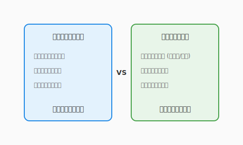

# 2.6 【外伝】二つの聖域——エンタープライズと組み込み

## 導入: 魔法が従う「物理法則」

この章では、オブジェクト指向、SOLID原則、そしてクリーンアーキテクチャという、ソフトウェア設計の「王道」を学んできました。これらは、複雑な現代のソフトウェアを長期間守り抜くための最強の盾です。

しかし、アルケミスト（開発者）が扱う「コード」という魔法は、どの世界でも同じ物理法則に従うわけではありません。魔法が発動する「戦場」が変われば、重力や魔力の供給源といった前提条件そのものが一変してしまいます。

最後に、私たちが学んできた「エンタープライズ」の世界と、それとは対極の力学で動く「組み込み・制御」の世界の違いを覗いてみましょう。

---

## 1. エンタープライズ（無限の空を飛ぶ城）

### 主戦場
Webサービス、金融システム、SNS、QuestForge（Web版）。

### 世界のルール：変化こそが日常
この世界は、常に「ユーザーの要望」という嵐にさらされています。機能は明日には追加され、仕様は来週には変わるかもしれません。

*   **設計の焦点**: 保守性と拡張性。魔法を「改良し続けられること」が正義です。
*   **アーキテクチャ**: 本章で学んだクリーンアーキテクチャが最も輝く場所です。多少のコード量や抽象化のオーバーヘッドがあっても、変更に強い構造を作ることが優先されます。
*   **魔力（リソース）**: CPUやメモリが足りなければ、魔法石（クラウドのインスタンス）を買い足せば解決します。「開発者の時間（人件費）」は「機械の時間」より遥かに高価だからです。

---

## 2. 組み込み・制御（一滴の水を黄金に変える）

### 主戦場
自動車のエンジン制御、スマート家電、医療機器、火星探査機。

### 世界のルール：器（ハードウェア）が絶対
この世界には「無限」という言葉はありません。物理的な物質の中に魔法を閉じ込める必要があります。

*   **設計の焦点**: 効率と確実性。1ミリ秒の応答遅延や、1バイトのメモリ不足が、物理的な事故や製品の回収（リコール）に直結します。
*   **アーキテクチャ**: 抽象化による美しさよりも、「予測可能性」が重視されます。クリーンアーキテクチャのような重厚な盾を構える余裕はなく、ハードウェアに近い、鋭く研ぎ澄まされたナイフのような設計が求められます。
*   **魔力（リソース）**: 魔石（メモリ・電力）は極めて限定的で、後から買い足すことはできません。一滴の魔力も無駄にしない「極限の節約」こそがアルケミストの技量となります。

---

## 3. アルケミストの柔軟な視点

ここまで学んできた設計原則は、決して「絶対の教義」ではありません。

*   **エンタープライズの知恵**（重厚な抽象化）を組み込みに持ち込みすぎれば、リソース不足で魔法は不発に終わるでしょう。
*   **組み込みの知恵**（密結合な最適化）をエンタープライズに持ち込みすぎれば、あまりの複雑さに誰も増築ができなくなるでしょう。

優れたアルケミストは、自分が今立っている戦場の特性を理解しています。

この章で手に入れた「設計の武器」は非常に強力です。しかし、それをいつ、どこで振るうべきか、あるいはあえて振るわないべきか。その判断力こそが、あなたを真のマスターへと導くのです。

---

## コラム：QuestForgeの戦場はどこだ？

私たちが作っている QuestForge は、基本的には「エンタープライズ」の住人です。Webを通じて多くの冒険者に届け、機能を追加し続ける必要があるからです。

しかし、もしあなたが「QuestForge専用の携帯ゲーム機（ハードウェア）」を自作し、そこでの動作を最適化しようとするなら、その瞬間にあなたは「組み込み」の聖域に足を踏み入れることになります。その時、あなたのコードから不必要な抽象化を剥ぎ取り、1バイトの節約に挑むことになるかもしれません。それもまた、エキサイティングな冒険なのです。

---

## さらに学ぶためのリソース

- 📚 **書籍**: ジョン・ザックマン他『[エンタープライズ・アーキテクチャの構築](https://www.amazon.co.jp/dp/482224343X)』（大規模組織のシステム全体を俯瞰するEAの基礎）
- 📚 **書籍**: 鵜飼文敏他『[エンジニアなら知っておきたい 組み込みシステムの基礎知識](https://www.gihyo.co.jp/book/2008/978-4-7741-3444-4)』（ハードウェアの制約と戦うための、もう一つの設計の世界）
- 🌐 **Web**: MISRA C / AUTOSAR "[Standards](https://www.misra.org.uk/)"（自動車や航空機など、絶対に失敗が許されないシステムの設計基準）
