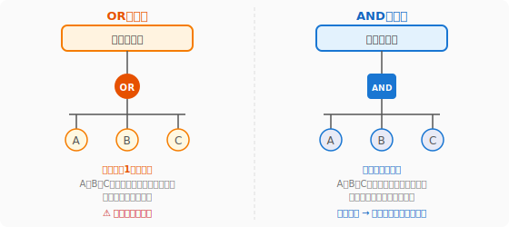
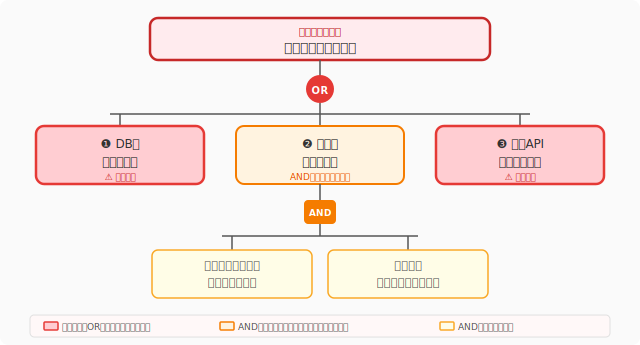
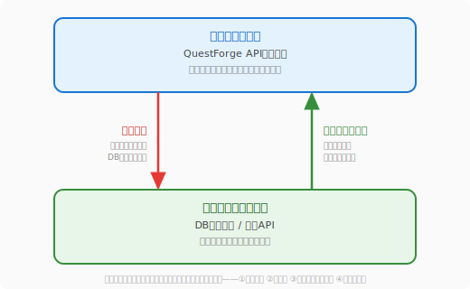
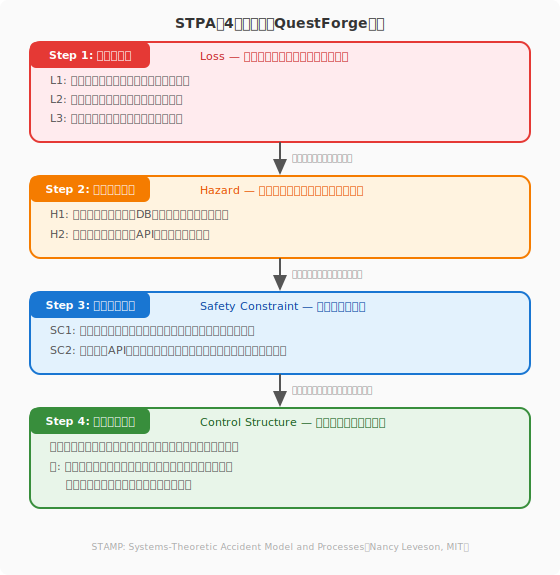

# 2.7 【外伝】システムエンジニアリングの視点——FTA・FMEA・STAMP

オブジェクト指向、SOLID、クリーンアーキテクチャと、この章ではコードの「美しさ」と「守り」を探求してきました。この外伝では、視野をもう一段広げ、システム全体の安全性を体系的に問う**システムエンジニアリング**の手法を紹介します。

航空・自動車・医療といった「絶対に失敗が許されない」分野で磨かれてきた以下の3つの手法は、Webサービスやゲームの開発にも鮮やかに応用できます。

| 手法 | 視点 | 分析の方向 |
|------|------|-----------|
| **FTA**（故障の木分析） | 特定の事故がなぜ起きるか | トップダウン |
| **FMEA**（故障モード影響分析） | 何が壊れ、どれが深刻か | ボトムアップ |
| **STAMP/STPA** | 設計構造がリスクを生んでいないか | 制御構造の水平展開 |

QuestForgeを題材に、それぞれを体験してみましょう。

---

## FTA（Fault Tree Analysis：故障の木分析）

### 考え方：事故の「なぜ」をトップダウンで掘り下げる

3つの手法の概観をつかんだところで、まずはトップダウンで「なぜ事故が起きるか」を掘り下げるFTAを見ていきましょう。FTAは1960年代にベル研究所が弾道ミサイルの安全分析のために開発した手法です。「防ぎたい最悪の結果」をツリーの頂点（**トップ事象**）に置き、そこに至る原因を木の枝のように掘り下げていきます。

原因の組み合わせは2種類の**論理ゲート**で表現します。

**ORゲートの原因は「単点故障」**——いずれか一つだけで全体を壊しうる急所です。FTAの最大の価値は、この急所を設計の早い段階で可視化することにあります。

### QuestForge例：「クエスト完了の失敗」ツリー

次の図は、QuestForgeにおける「クエスト完了の失敗」というトップ事象に至る原因をFTAで表した故障の木を示しています。

ここで重要なのは、ORゲートとANDゲートの違いです。ORゲートでつながれた原因（❶❸）は「いずれか一つだけで上位の故障を引き起こせる」単点故障であり、最優先で対策すべき急所です。一方、ANDゲートの❷は「複数の条件が同時に揃わなければ発生しない」複合故障であり、個々の頻度は低くても組み合わさると被害が大きい点に注意が必要です。この木を眺めるだけで、どこに防護を集中すれば最大の効果が得られるかが一目でわかります。

このツリーから次の優先順位が導き出せます。

1. **❶ と ❸**（ORゲート）は単点故障——どちらか一方だけで全体が止まる。真っ先に対策すべき急所。
2. **❷**（ANDゲート）は複合条件——キャッシュ破損と整数オーバーフローが同時に起きなければ発生しない。重要だが優先度は❶❸より低い。

### FTAの主な利用場面

- **設計レビュー**: 「どこが急所か」を可視化し、過剰設計を避けながら重点的に防護する
- **カオスエンジニアリングの計画**: ORゲートの項目を優先して実験対象に選ぶ
- **事故後の根本原因分析（RCA）**: トップ事象から原因を逆引きしてどの枝が現実に発火したかを特定する

### ミニマルカットセット：急所の正式な名前

FTAでは「最小の故障の組み合わせでトップ事象を引き起こせる集合」を**ミニマルカットセット**と呼びます。上記の例では：

- `{DBが応答しない}` — 要素1つ（単点故障）
- `{外部APIタイムアウト}` — 要素1つ（単点故障）
- `{キャッシュ破損, 整数オーバーフロー}` — 要素2つ（複合故障）

要素数が少ないセットほど危険度が高いため、優先的に対策します。

---

## FMEA（Failure Mode and Effects Analysis：故障モード影響分析）

### 考え方：故障を「網羅」して「優先順位付け」する

FTAで「一つの事故の急所」を見つける手法を学んだ次は、システム全体の故障モードを広く網羅してリスクに優先順位をつける、ボトムアップのアプローチです。FMEAは1940年代に米国軍で生まれ、航空・自動車・医療機器の品質保証で広く使われてきた手法です。FTAが「1つの事故の根本原因」を深く掘り下げるのに対して、FMEAは**システム全体の故障モードをボトムアップで網羅**し、どれから直すかを数値で判断します。

リスクの大きさは **RPN（Risk Priority Number）** で表します。

> **RPN = 深刻度（S）× 発生頻度（O）× 検出困難度（D）**

各項目を 1〜10 で評価し、積（最大1000）が大きいほど優先して対処します。

### 3つのスコアの定義

**深刻度（Severity: S）**——故障が発生したときの影響の大きさ

| スコア | 基準 | QuestForge例 |
|:------:|------|-------------|
| 9〜10 | システム全体の停止・データ消失 | DBダウンでゲーム全体が停止 |
| 7〜8 | 主要機能の停止 | クエスト完了ができない |
| 4〜6 | 一部機能の低下 | 報酬メッセージが表示されない |
| 1〜3 | ほぼ気づかないレベル | アイコンの表示がズレる |

**発生頻度（Occurrence: O）**——その故障がどれくらいの頻度で起きるか

| スコア | 基準 |
|:------:|------|
| 9〜10 | 頻繁に起きる（毎日レベル） |
| 5〜8 | 時々起きる（月1回〜週1回） |
| 2〜4 | まれに起きる（年1〜数回） |
| 1 | ほぼ起きない |

**検出困難度（Detection: D）**——故障が起きたときに、リリース前または運用中に気づきにくいか

| スコア | 基準 |
|:------:|------|
| 9〜10 | テストでほぼ検出できない |
| 5〜8 | 状況によっては気づかず通過する |
| 2〜4 | テストや監視で比較的検出しやすい |
| 1 | 確実に検出できる仕組みがある |

### QuestForge例：FMEAテーブル

| 故障モード | 影響 | S | O | D | RPN | 推奨対策 |
|-----------|------|:-:|:-:|:-:|:---:|---------|
| DB接続枯渇 | クエスト完了不能・全機能停止 | 9 | 4 | 7 | **252** | 接続プール設定見直し・サーキットブレーカー導入 |
| 外部APIタイムアウト | 報酬メッセージが出ない | 7 | 6 | 5 | **210** | タイムアウト短縮・フォールバックメッセージ実装 |
| セッション管理の不具合 | 強制ログアウト・データ不整合 | 6 | 6 | 3 | **108** | セッションストアの冗長化・統合テスト追加 |
| キャッシュ不整合 | 経験値表示のズレ | 4 | 6 | 4 | **96** | キャッシュ無効化ロジックのレビュー |

**読み方のポイント：**

- RPN=252の「DB接続枯渇」は深刻度(9)と検出困難度(7)が高い。テストでは気づきにくい割に被害が大きいため最優先で対策する。
- RPN=210の「外部APIタイムアウト」は発生頻度(6)が問題の核心。サーキットブレーカーで被害を局所化する設計が効果的。
- RPN=108の「セッション管理」は検出困難度(3)が低い——つまりテストで見つけやすい。テストの充実で対応できる。

### FTAとFMEAの使い分け

| 観点 | FTA | FMEA |
|------|-----|------|
| 分析の出発点 | 防ぎたい特定の事故 | システム全体の部品・処理 |
| 分析の方向 | トップダウン（原因を深掘り） | ボトムアップ（全モードを網羅） |
| 得意なこと | 単点故障の特定・ミニマルカットセットの発見 | 全リスクの比較・優先順位の数値化 |
| 主な利用場面 | 設計レビュー・カオス実験の計画・RCA | リリース前評価・改善ロードマップ作成 |

2つの手法は「特定の事故を深く掘る（FTA）」と「すべてのリスクを広く見る（FMEA）」という、トレードオフの関係にあります。組み合わせて使うことで、急所の深掘りと全体の網羅を同時に実現できます。

---

## STAMP/STPA（システム理論的事故モデルと安全分析）

### 考え方：事故は「制御の失敗」として起きる

FTAとFMEAで「部品の故障」を分析する2つの手法を学んだところで、より現代的な問いに挑む第3の手法——STAMPを見ていきましょう。FTAとFMEAは「部品や処理が故障する」ことを前提にしますが、現代の複雑なシステムでは、**すべての部品が正常に動いているのに事故が起きる**ケースが増えています。

2003年、MITのNancy Levesonは**STAMP（Systems-Theoretic Accident Model and Processes）**を提唱しました。その核心は次の一文です。

> **事故は「部品の故障」ではなく「制御構造の欠陥」によって起きる。**

例えば「経験値が正しく加算されない」というバグがあっても、DBもAPIも正常に動いているケースがあります。問題は、コンポーネントではなく「誰が何を制御し、どう結果を確認するか」という**制御の仕組みそのもの**にあるのです。

### 制御構造とは何か

STAMPはシステムを「コントローラーと制御されるプロセスの階層」として捉えます。

事故は次の4種類の「危険な制御行動（Unsafe Control Action）」として起きます。

| 種類 | 説明 | QuestForge例 |
|------|------|-------------|
| **実行されない** | 必要な指令が送られなかった | トランザクション開始が省略された |
| **誤った指令** | 間違った内容の指令が送られた | 負の経験値が加算された |
| **タイミングのズレ** | 早すぎる・遅すぎる指令 | コミット前にレスポンスを返した |
| **停止しない** | 止めるべき指令が続いた | ループが終了せず無限に書き込んだ |

### STPAの4ステップ

STAMPの実践的な分析手法が **STPA（System-Theoretic Process Analysis）** です。設計段階で安全制約を定め、その制約が構造的に保証されているかを検証します。

**Step 1: 損失（Loss）を定義する**

システムが絶対に避けたい最悪の結果を列挙します。ここで「何を守りたいか」を明確にすることが、以降のすべての分析の土台となります。

- **L1**: 冒険者のデータが消失または破損する
- **L2**: 冒険者が誤った経験値・ランクで冒険を続ける
- **L3**: 不正アクセスによる個人情報の漏洩
- **L4**: システムの長時間停止によるユーザー離脱

**Step 2: ハザード（Hazard）を特定する**

損失に直結しうるシステムの状態を特定します。ハザードは「まだ事故ではないが、放置すれば損失につながる危険な状態」です。

- **H1**: 経験値計算の結果がDBに反映されていない状態（→L1, L2）
- **H2**: 未認証リクエストがAPIに到達できる状態（→L3）
- **H3**: 一部のサービス障害が全機能の停止に波及する状態（→L4）

**Step 3: 安全制約（Safety Constraint）を定義する**

各ハザードを防ぐために、設計が「必ず守らなければならないルール」を定めます。

- **SC1**: 経験値の計算・保存はトランザクションで原子的に行い、部分的な更新が起きてはならない（H1への対策）
- **SC2**: すべてのAPIエンドポイントは認証ミドルウェアを必ず通過しなければならない（H2への対策）
- **SC3**: 外部サービスの障害は、サーキットブレーカーで局所化しなければならない（H3への対策）

**Step 4: 制御構造を確認する**

安全制約が実際の設計の中で「構造的に保証されているか」を問い直します。「守ろうとしている」ではなく「守れない設計になっていないか」を問うのがポイントです。

| 安全制約 | 確認すべき設計上の問い |
|---------|---------------------|
| SC1（トランザクション） | トランザクションを開始し忘れたコードが書けてしまう構造になっていないか？ |
| SC2（認証必須） | 新しいエンドポイントを追加したとき、認証ミドルウェアを付け忘れても動いてしまうか？ |
| SC3（サーキットブレーカー） | 外部APIの呼び出し箇所が散在していて、一括して保護できない構造になっていないか？ |

SC2の例で言えば、「デフォルトで全エンドポイントに認証が適用されるミドルウェアの構造」にすれば、付け忘れは構造的に発生しなくなります。これが「安全制約を設計に埋め込む」ということです。

### STAMPが見つける「FTAでは見えないリスク」

FTAは「DBが応答しない」という部品レベルの故障を分析します。しかしSTAMPは「DBが正常に動いているのにデータが壊れる」という**インタラクションの失敗**を捉えます。

例えば、「クエスト完了処理」と「ランキング更新処理」が同じDBに同時アクセスしたとき、それぞれの処理は正常でも、**同時実行による競合状態（Race Condition）**でデータが壊れることがあります。この問題はFTAやFMEAでは見えにくく、STAMPの制御構造分析で初めて発見できます。

---

## 3つの手法の全体像

| 観点 | FTA | FMEA | STAMP/STPA |
|------|-----|------|-----------|
| 生まれた分野 | 航空・ミサイル（1960年代） | 軍事・航空（1940年代） | 航空・宇宙（2003年） |
| 主な問い | 「この事故はなぜ起きるか」 | 「何が壊れ、どれが深刻か」 | 「設計の構造がリスクを生んでいないか」 |
| 捉える故障 | 部品・コンポーネントの故障 | 全故障モードとその影響 | 制御の失敗・インタラクションの欠陥 |
| 主な成果物 | 故障ツリー図・ミニマルカットセット | RPNテーブル・対策一覧 | 安全制約・制御構造の検証表 |
| 特に有効な場面 | 設計レビュー・RCA・カオス実験計画 | リリース前評価・改善ロードマップ | 設計段階・アーキテクチャレビュー |

3つの手法は段階的に組み合わせると最も力を発揮します。

> **設計時にSTAMPで安全制約を定める**
> →**リリース前にFMEAでリスクを優先順位付けする**
> →**運用・事故後にFTAで根本原因を掘り下げる**

この流れが、システムの安全を設計から運用まで多層的に守る「安全のサイクル」となります。

---

FTA・FMEA・STAMPの三手法は、それぞれ異なる角度からシステムの安全性を問います。FTAが「なぜ事故が起きるか」をトップダウンで掘り下げ、ORゲートの単点故障（ミニマルカットセット）を炙り出す。FMEAが「何が壊れ、どれが最も深刻か」をRPNで数値化し、優先順位をつける。そしてSTAMPが「コンポーネント間のインタラクションの失敗」という、部品単体では見えない事故の本質を設計段階で捉える。三者を組み合わせることで、単なるコードの美しさを超え、社会に安全を届けるシステムの設計が見えてきます。

---

## さらに学ぶためのリソース

- 📚 **書籍**: Nancy Leveson『[Engineering a Safer World](https://mitpress.mit.edu/books/engineering-safer-world)』（STAMPを提唱した原著。MITプレスよりPDFで無料公開されています）
- 📚 **書籍**: Nancy Leveson, John Thomas『[STPA Handbook](https://psas.scripts.mit.edu/home/get_file.php?name=STPA_handbook.pdf)』（STPAの実践ガイド。無料PDFで公開）
- 🌐 **Web**: IPA「[非機能要求グレード2024](https://www.ipa.go.jp/digital/ps6vr7000001cpet-att/nfr_grade_2024.pdf)」（FTA・FMEAを含む安全分析手法の日本語ガイド）
- 📚 **書籍**: 飯塚悦功 監修『[機能安全の実践技法](https://www.ohmsha.co.jp/)』（IEC 61508など機能安全規格とFMEAの実務）
- 📄 **論文**: C. Rosenthal et al. "[Chaos Engineering](https://dl.acm.org/doi/10.1145/2857056.2857057)" (2015)（FTAで特定した単点故障をカオス実験で検証する文脈でも参照価値あり）
