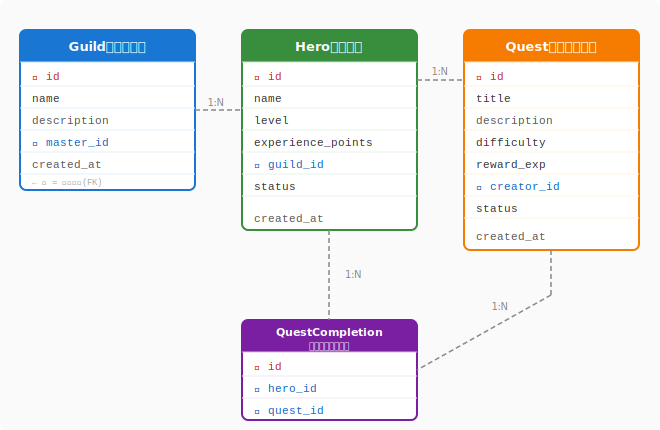

# 2.8 どうデータを設計するか？——ERモデルとスキーマ設計

コードは実行されると消えます。しかしデータは残ります。冒険者が積み上げた経験値も、ギルドの名声も、すべてデータとして永続します。どれほど美しいアーキテクチャを設計しても、その「記憶の形」が歪んでいれば、システムは長く健全に動き続けることができません。

クリーンアーキテクチャで「依存の方向」を設計し、SOLID原則で「変化への耐性」を身につけた今、次はデータの形——**スキーマ**——を設計する目を養いましょう。

---

## エンティティ関係モデル（ERモデル）

### エンティティとリレーションシップ

データ設計の出発点は、システムに登場する「もの（エンティティ）」とその「関係（リレーションシップ）」を整理することです。

- **エンティティ**: 独立して存在を持つ概念。QuestForgeでは `Hero`・`Quest`・`Guild` など。
- **属性**: エンティティが持つ特性。`Hero` なら `name`・`level`・`experience_points`。
- **リレーションシップ**: エンティティ間の関係。「勇者はギルドに所属する」「勇者はクエストを達成する」など。

リレーションシップには**多重度**があります。

| 多重度 | 意味 | QuestForge例 |
|:------:|------|-------------|
| 1:1 | 一対一 | 勇者 ↔ キャラクタープロフィール |
| 1:N | 一対多 | ギルド ↔ 勇者（1つのギルドに複数の勇者） |
| M:N | 多対多 | 勇者 ↔ クエスト（一人の勇者が複数クエストを達成、1つのクエストを複数の勇者が達成） |

M:N関係はDBでは直接表現できないため、**中間テーブル（ジャンクションテーブル）**で解決します。QuestForgeでは `QuestCompletion` がこれにあたります。

### QuestForgeのERD

次の図は、QuestForgeの主要エンティティ（Hero・Quest・Guild・QuestCompletion）とそれらの関係・多重度を示したERダイアグラムです。



ここで示された設計では、各テーブルが「自分の責任範囲の情報だけ」を持つという原則が貫かれています。勇者の名前やレベルは `Hero` テーブルにだけ存在し、クエスト達成の記録は `QuestCompletion` 中間テーブルに集約されます。こうすることで、勇者がレベルアップしても更新箇所は一か所に限定され、「同じ勇者なのにレコードによってデータが違う」という矛盾が構造的に生まれなくなります。

この設計のポイント：

- **`Hero`と`Guild`は 1:N**——一人の勇者は一つのギルドに所属し、一つのギルドに複数の勇者がいる
- **`Hero`と`Quest`は M:N**——`QuestCompletion` 中間テーブルで解決。`completed_at` のような「達成という出来事」の属性をここに持たせる
- **`Quest`の `creator_id`**——どの勇者（またはギルドマスター）がクエストを作ったかを追跡する

---

## 正規化：データの「重複」を排除する

### なぜ正規化が必要か

非正規化されたテーブルはこのような問題を生みます。

```
# 悪い例：一つのテーブルにすべてを詰め込む
quest_completion:
  id | hero_name | hero_level | guild_name | quest_title | completed_at
   1 | アルス    |     12     | 銀の盾      | ゴブリン討伐  | 2024-01-10
   2 | アルス    |     12     | 銀の盾      | 竜の洞窟     | 2024-01-15
```

`hero_name`・`hero_level`・`guild_name` が何度も重複しています。アルスがレベルアップすれば、全行を更新しなければなりません。更新漏れがあれば「同じ勇者なのにレコードによってレベルが違う」という矛盾が生まれます。

### 3つの正規形

**第1正規形（1NF）**: 各列は原子値（分割できない値）を持つ
- ❌ `tags = "戦士,魔法使い"` → ✅ `tag` テーブルを別に作る

**第2正規形（2NF）**: 主キーの一部にだけ依存する属性を排除（複合主キーの場合）
- `(hero_id, quest_id)` が主キーなのに `hero_name` を持つのは NG → `Hero` テーブルに分離

**第3正規形（3NF）**: 主キー以外の列に依存する属性を排除（推移的関数従属を排除）
- `guild_id` → `guild_name` という依存関係を `quest_completion` に持たせるのは NG → `Guild` テーブルに分離

QuestForgeのERDはこの3NFを守っています。各テーブルは「自分の責任範囲の情報だけ」を持ちます。

---

## SQL vs NoSQL：データの「形」に合わせて選ぶ

データベースの選択は、アーキテクチャの選択と同じくトレードオフです。「どちらが優れているか」ではなく「何に向いているか」を問います。

| 観点 | SQL（リレーショナルDB） | NoSQL（ドキュメント/KVS等） |
|------|----------------------|--------------------------|
| データ構造 | 定まったスキーマ（テーブル） | 柔軟なスキーマ（JSON等） |
| 得意なこと | 複雑な結合・集計・トランザクション | 大規模な読み書き・スキーマ変更の頻度が高い場合 |
| 整合性 | ACID特性で強い整合性を保証 | 結果整合性（最終的には一致）が多い |
| QuestForgeでの用途 | 勇者・クエスト・達成の主データ | セッションデータ・キャッシュ・リアルタイム通知 |

QuestForgeの核心データ（勇者、クエスト、達成記録）は**関係が複雑**で**整合性が重要**なため SQL が適しています。一方、セッション管理やランキングのキャッシュは Redis（KVS）が自然に映えます。

---

## スキーマ設計の実践

### 命名規則

一貫した命名規則は、スキーマを「読める設計書」にします。

```sql
-- テーブル名: スネークケース、複数形
heroes, quests, quest_completions, guilds

-- カラム名: スネークケース
experience_points, created_at, guild_id

-- 外部キー: 参照テーブル名_id
guild_id (guildsテーブルのid), creator_id (heroesテーブルのid)

-- 真偽値: is_ または has_ プレフィックス
is_active, has_completed
```

### インデックス設計

インデックスは「どのクエリが速い必要があるか」から設計します。

```sql
-- よく使うクエリ: あるギルドの全勇者を取得
SELECT * FROM heroes WHERE guild_id = ?;
-- → guild_id にインデックスを張る

-- よく使うクエリ: ある勇者の達成済みクエストを取得
SELECT * FROM quest_completions WHERE hero_id = ?;
-- → hero_id にインデックスを張る
```

すべての列にインデックスを張ると、書き込みが遅くなります。「読み取りの速さ」と「書き込みのコスト」のバランスを意識した設計が重要です。

---

## スキーマ進化：マイグレーション戦略

設計は変わります。「勇者にアバター画像を追加したい」「クエストにタグ機能を追加したい」——こうした変更をDBに安全に反映する仕組みが**マイグレーション**です。

### マイグレーションの原則

```python
# マイグレーションの例（Alembicなどのツールで管理）

def upgrade():
    # 新しい列を追加（既存データに影響しない安全な変更）
    op.add_column('heroes',
        sa.Column('avatar_url', sa.String(255), nullable=True)
    )

def downgrade():
    # ロールバック（必ずペアで定義する）
    op.drop_column('heroes', 'avatar_url')
```

マイグレーションの鉄則：

1. **必ず `downgrade` を書く**: 問題が起きたとき、前の状態に戻せる
2. **後方互換性を守る**: 列を削除する前に、まずアプリ側の参照をなくす
3. **ゼロダウンタイム移行**: `nullable=True` で追加してデータ移行 → `nullable=False` に変更、という2段階移行

---

## AI時代のデータ設計

AIはスキーマ設計とマイグレーションの強力な助手です。

### ER図からDDLを生成する

「このER図を元にSQLのDDL（テーブル定義）を生成して」と依頼することで、エンティティ設計からすぐに実装に移れます。

### マイグレーションのレビュー

「このマイグレーションで既存データや本番環境に影響が出るリスクはあるか？」とAIに問えば、見落としがちな副作用（ロック時間・インデックス再構築のコストなど）を指摘してもらえます。

### 正規化のチェック

「このテーブル定義で正規化の違反（重複・推移的依存）がないかレビューして」と依頼すれば、設計の盲点を早期に発見できます。

---

データの設計は、システムの「記憶の形」を決める仕事です。ERモデルでエンティティとその関係の地図を描き、正規化で重複と更新異常を排除することで、時間が経っても整合性を保てるスキーマが生まれます。SQLとNoSQLのどちらを選ぶかは、整合性と関係の複雑さを重視するかスケールと柔軟性を重視するかで決まりますが、現実のシステムはその両方を使い分けるハイブリッド構成が多数派です。そしてスキーマは静的なものではなく、マイグレーションという仕組みで継続的に進化させていくものです。コードと同様に、データの設計もまた生き続けます。

---

## さらに学ぶためのリソース

- 📚 **書籍**: C.J.Date『[データベース・イン・デプス](https://www.oreilly.co.jp/books/9784873113685/)』（リレーショナルモデルの理論的な基盤を学ぶ古典）
- 📚 **書籍**: 奥野 幹也『[理論から学ぶデータベース実践入門](https://gihyo.jp/book/2015/978-4-7741-7197-5)』（SQLとリレーショナルモデルを実践的に理解する日本語入門書）
- 🌐 **Web**: [Flyway](https://flywaydb.org/) / [Alembic](https://alembic.sqlalchemy.org/)（マイグレーションツール。どちらも主要なWeb開発で広く使われています）
- 📚 **書籍**: Martin Fowler『[Refactoring Databases](https://www.databaserefactoring.com/)』（DBのリファクタリング手法をカタログ形式でまとめた実践書）
