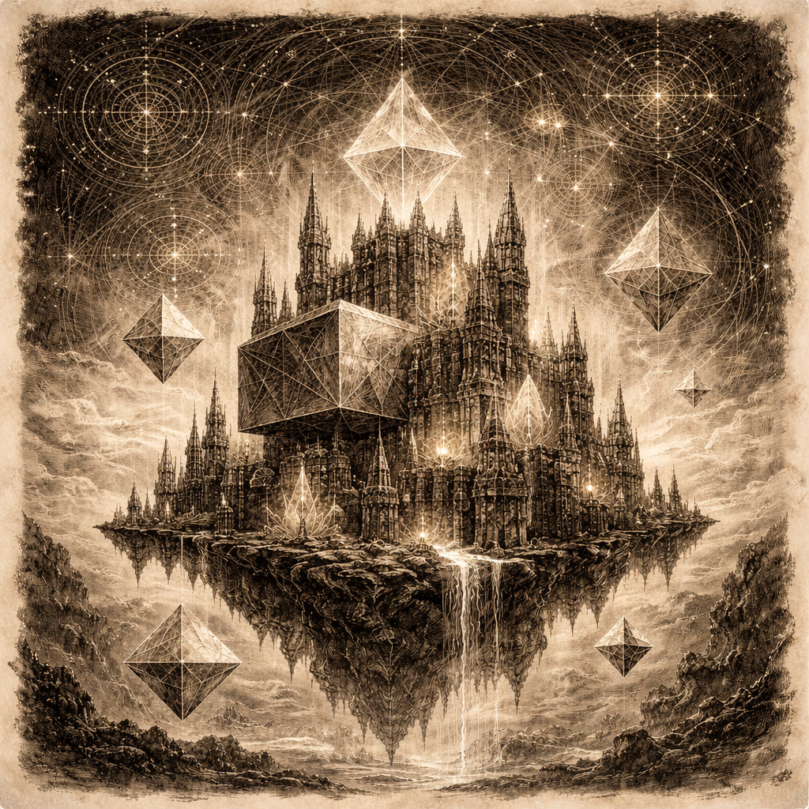
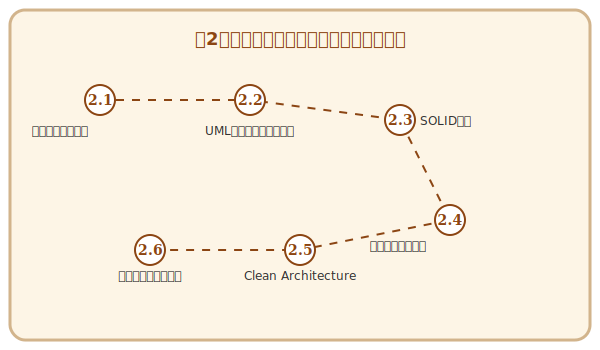

# 第2章 悠久のアーキテクチャ——ソフトウェア設計入門

## この章で手に入れる力

第1章で「何を作るか」という地図を手に入れたあなたは、次に「いかに作るか」という建物の設計図を描く必要があります。

良い設計は、時の試練に耐え、変化し続ける要求に対しても柔軟に応えることができます。逆に、その場しのぎの設計は、後に巨大な「技術的負債」という魔物となってあなたの冒険を阻むことでしょう。

この章では、**ソフトウェア設計（Software Design）**の普遍的な知恵を学びます。オブジェクト指向という魔法の源泉から、美しく堅牢な構造を築くための黄金律（SOLID）、そしてそれらを守り抜くためのクリーンアーキテクチャまで——悠久の時を経て磨かれた設計の極意を身につけましょう。

---

## 冒険の地図

---

## 読了後のあなた

この章を読み終えると、あなたは以下のことができるようになります。

- **整理する**: 複雑な要求をオブジェクトとして適切にモデル化できる
- **描く**: クラス間の関係やメッセージの流れを図解できる
- **判断する**: 「どこにコードを書くべきか」を論理的に決定できる
- **改善する**: 密結合で壊れやすいコードを、柔軟な構造へリファクタリングできる
- **守る**: 長期間にわたって保守可能なアーキテクチャを選択できる

アーキテクチャという「悠久の城」を築く旅を始めましょう。

---

## さらに学ぶためのリソース（章全体）

- 📚 **書籍**: ロバート・C・マーチン『Clean Architecture 達人に学ぶソフトウェアの構造と設計』
- 📚 **書籍**: エリック・ガンマ他『オブジェクト指向における再利用のためのデザインパターン』
- 📚 **書籍**: 結城浩『Java言語で学ぶデザインパターン入門』
- 📚 **書籍**: Joshua Kerievsky『リファクタリング・デザインパターン』
