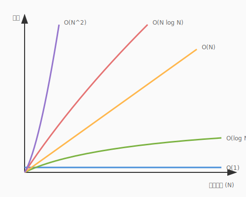
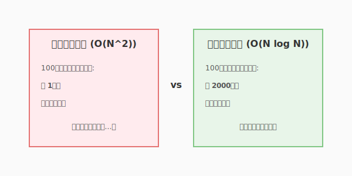
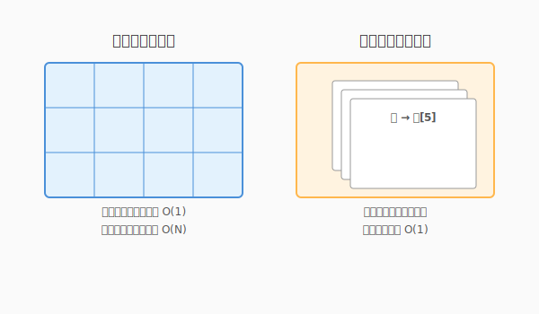

# 3.1 魔導の元素——アルゴリズムとデータ構造

あなたが第2章で設計した「城（アーキテクチャ）」は、壮大で美しいものでした。しかし、その城を構成するレンガの一つひとつが脆ければ、城はやがて崩壊してしまいます。

ソフトウェアという魔法の世界において、レンガに相当する最小の構成単位——それが「アルゴリズム」と「データ構造」です。

「AIがあれば、アルゴリズムなんて知らなくてもコードは書ける」と思うかもしれません。確かに、AIはソート（並べ替え）や検索のコードを瞬時に生成してくれます。しかし、生成されたコードが「なぜそのデータ構造を選んだのか」「その魔法を使うのにどれだけの魔力（計算資源）を消費するのか」を判断することが、あなたが真のアルケミスト（錬金術師）になる道なのです。

このセクションでは、魔法の原子であるアルゴリズムとデータ構造の基礎を学び、AIの出力を正しく評価し、最適化するための「目」を養います。

---

### なぜこれが重要か

アルゴリズムとデータ構造を理解することは、少ない魔力で素早く魔法を発動することに繋がります。

1. **魔力の節約**: 非効率なアルゴリズムは、データ量が増えた瞬間に指数関数的にリソースを大量に消費します。
2. **魔道具との対話能力**: 「高速に検索したい」「メモリを節約したい」といった具体的な意図を魔道具(AI)に素早くかつ正しく伝えるには、適切な用語（ハッシュマップ、二分探索など）を知る必要があります。
3. **トラブルシューティング**: AIが生成したコードが特定の条件下で遅くなる理由を見抜くには、計算量の知識が不可欠です。

### 基本概念

#### 1. 計算量（O記法）：魔法のコスト見積もり
魔法を発動する際、どれだけの時間やメモリが必要かを評価する指標が「計算量」です。一般に **O（オーダー）記法** を使って表します。
オーダーは、対象とするデータの大きさが増大するにあたり、時間やメモリなどのリソースがどのように増加するかを示します。

次の図は、代表的な計算量の種類ごとにデータ量とリソース消費の関係を示しています。



ここで注目したいのは、O(1)とO(log N)の曲線がデータ量が増えてもほぼ水平を保つのに対し、O(N^2)の曲線が急激に跳ね上がる点です。魔力（リソース）の消費量は、データが2倍になったときにどう変化するかで大きく異なります。アルケミストとして、AIが提案するアルゴリズムのコスト曲線を読み取る力を養いましょう。

| 計算量 | 特徴 | 代表例 |
|--------|------|--------|
| **O(1)** | 常に一定。魔法の指を鳴らすだけで完了 | ハッシュマップの検索 |
| **O(log N)** | データが増えても時間はほぼ増えない。極めて優秀 | 二分探索 |
| **O(N)** | データの数に比例。素直で分かりやすい魔法 | 線形探索 |
| **O(N log N)** | 大規模データでも実用的。洗練された魔法 | マージソート、クイックソート |
| **O(N^2)** | データが2倍で時間は4倍。大規模データでは工夫が必要 | バブルソート、選択ソート |

#### ソートアルゴリズムに見る計算量の威力

「並べ替え（ソート）」は、アルゴリズムの威力を最も実感できる題材です。同じ「並べ替える」という目的でも、アルゴリズムの選択によって効率が劇的に変わります。

**洗練されたソートアルゴリズム（O(N log N)）**:
- **マージソート**: データを半分に分割し、それぞれを整列させてから統合する「分割統治法」の傑作。100万件のデータでも約2000万回の操作で完了します。
- **クイックソート**: 基準値（ピボット）を使って効率よく分割する、実務で最も愛用されるアルゴリズム。平均的にはマージソートと同等の速さを誇ります。

**シンプルなソートアルゴリズム（O(N^2)）**:
- **バブルソート**: 隣り合う要素を比較して入れ替える、最も直感的な方法。100万件では約1兆回の操作が必要になり、洗練されたアルゴリズムとの差は歴然です。

次の図は、主要なソートアルゴリズムのデータ量に対する処理時間の違いを比較しています。



ここで際立つのは、同じ「並べ替え」という目的を達成するにもかかわらず、アルゴリズムの選択によって処理時間が数十倍から数億倍も変わりうるという事実です。マージソートやクイックソートはO(N log N)の優美な曲線を描くのに対し、バブルソートはO(N^2)という急勾配を示します。データ量が増えるほどこの差は拡大するため、規模の大きいシステムではアルゴリズム選択が本質的な設計上の決断となります。

#### 速さだけではない——空間とのトレードオフ

「速いアルゴリズムがわかっているならば、それを常に選べばいい」と思うかもしれませんが、魔法には**魔力（メモリ）**も必要です。時間計算量だけでなく、**空間計算量**（必要なメモリ量）も考慮する必要があります。
さきほどの表に空間計算量を加えてみましょう。

| アルゴリズム | 時間計算量 | 空間計算量 | 特徴 |
|-------------|-----------|-----------|------|
| **マージソート** | O(N log N) | O(N) | 高速だが、元データと同じサイズの作業領域が必要 |
| **クイックソート** | O(N log N) | O(log N) | 元の配列上で並べ替え（インプレース）、メモリに優しい |
| **バブルソート** | O(N^2) | O(1) | 遅いが、追加メモリはほぼ不要 |

**具体例: 1GBのデータをソートする場合**

- **マージソート**: 高速だが、追加で約1GBのメモリが必要。メモリが潤沢な環境向き。
- **クイックソート**: 同じく高速で、追加メモリはわずか。メモリが限られた環境でも活躍。
- **バブルソート**: ソート完了までに膨大な時間がかかるが、追加メモリはほぼゼロ。

組み込みシステムやモバイルアプリなど、メモリが貴重な環境では「少し遅くてもメモリを節約するアルゴリズム」が選ばれることもあります。**トレードオフを理解し、状況に応じて最適な選択をすること**——これがアルケミストの腕の見せどころです。

この視点があれば、AIが提案したアルゴリズムに対して「メモリ使用量を抑えた別の方法はある？」と問いかけることもできます。

#### 2. データ構造：魔力の容れ物
データをどのように保持するかによって、その後の処理効率が劇的に変わります。

次の図は、配列（巻物棚）と連想配列（索引目録）という二つの代表的なデータ構造の検索効率の違いを示しています。



ここで示されているのは、「どこに何を入れるか」という格納方法の違いが、取り出すときのコストに直結するという原理です。巻物棚（配列）では先頭から順に探すため最悪O(N)の時間がかかりますが、索引目録（ハッシュマップ）はキーから直接格納場所を計算するためO(1)で取り出せます。QuestForgeでタグ検索を高速化したいなら、この違いを理解することが出発点となります。

**基本の4つ**:

| データ構造 | 特徴 | 得意なこと |
|-----------|------|-----------|
| **配列（Array）** | 順番に並んだ巻物 | インデックスでの高速アクセス O(1) |
| **連想配列（Hash Map）** | 魔法の索引 | キーによる瞬時の検索 O(1) |
| **スタック（Stack）** | 本の山（LIFO: 後入れ先出し） | 直前の状態に戻る操作（Undo機能など） |
| **キュー（Queue）** | 行列（FIFO: 先入れ先出し） | 順番待ちの処理（タスクキューなど） |

**発展的なデータ構造**:

- **木構造（Tree）**: 系譜図のような階層構造。高速な検索（二分探索木）やデータの階層管理に適している。
- **ヒープ（Heap）**: 「常に最大値（または最小値）を素早く取り出せる」特殊な木構造。優先度付きキューの実装に使われる。
- **グラフ（Graph）**: ノード（点）とエッジ（線）で関係性を表現。SNSの友達関係や地図の経路探索に活躍。

QuestForgeでは、クエストの依存関係を**グラフ**で、「やり直し機能」を**スタック**で、報酬の配布順を**キュー**で表現できます。

---

## 実践例

QuestForgeにおいて、1万件のクエストから特定の「タグ」がついたものを探すシーンを考えてみましょう。

### 従来のアプローチ（全件検索）

リストの先頭から一つずつ確認していく方法です。これを「線形探索」と呼びます。

```python
# 従来の方法：リストを全走査する
def find_quests_by_tag_linear(quests, target_tag):
    found_quests = []
    for quest in quests:
        if target_tag in quest.tags:
            found_quests.append(quest)
    return found_quests

# 計算量: O(N) 
# クエストが100万件になれば、100万回のチェックが必要。
```

### AI時代のアプローチ（インデックス作成）

あらかじめ検索用の「索引（ハッシュマップ）」を作っておく方法です。

```python
# 最適化された方法：あらかじめタグをキーにした辞書を作っておく
class QuestStore:
    def __init__(self, quests):
        self.tag_index = {} # 魔法の索引 (ハッシュマップ)
        for quest in quests:
            for tag in quest.tags:
                if tag not in self.tag_index:
                    self.tag_index[tag] = []
                self.tag_index[tag].append(quest)

    def find_by_tag(self, target_tag):
        return self.tag_index.get(target_tag, [])

# 計算量: O(1) 
# クエストがいくら増えても、一瞬で取り出せる。
```

### 比較と考察

| 観点 | 従来のアプローチ（線形探索） | AI時代のアプローチ（索引利用） |
|------|-----------------|-------------------|
| 実行速度 | データ量に比例して遅くなる | 常に一定（極めて高速） |
| メモリ消費 | 少ない | 索引の分だけ多くなる |
| 実装コスト | 低い | やや高い（事前の準備が必要） |
| 推奨シーン | データが少ない、または一度きり | 頻繁に検索が発生する大規模システム |

> [!TIP]
> **コラム: 「クラス」と「関数」**
> プログラミングパラダイムによって、ロジックの呼び方や捉え方は異なります。オブジェクト指向では「クラス（のメソッド）」、関数型や手続き型プログラミングでは「関数」と呼ばれます。
> 
> これらは厳密には異なる概念ですが、**「特定のデータ構造に対して、一定の手順（アルゴリズム）で処理を行う最小単位」**という点では共通しています。本書では、アルゴリズムの元素を説明するにあたって、これらを概念的に類似したものとして捉えて進めます。

AIに「検索を速くして」と頼むと、多くの場合後者のような「インデックス（ハッシュマップ）を使った実装」を提案してくれます。この時、「なぜ辞書を使う必要があるのか」を理解していれば、自信を持ってその提案を採用できます。

---

## ハンズオン: 実際に試してみよう

### ステップ1: 大量データの準備

Pythonの標準ライブラリを使って、10万件のダミーデータを生成してみましょう。

### ステップ2: 実行時間の比較

線形探索とハッシュマップによる探索で、どれくらい速度が違うかを計測します。

```python
import time
import random

# ダミーデータ生成
num_quests = 100000
tags = ["Urgent", "Daily", "Legendary", "Gold", "XP"]
quests = [{"id": i, "tags": [random.choice(tags)]} for i in range(num_quests)]

# 1. 線形探索
start = time.perf_counter()
result_linear = [q for q in quests if "Legendary" in q["tags"]]
end = time.perf_counter()
print(f"Linear Search: {end - start:.6f} seconds")

# 2. ハッシュマップ（インデックス）
start = time.perf_counter()
# 索引の構築（本来は事前に行う）
index = {}
for q in quests:
    for t in q["tags"]:
        if t not in index: index[t] = []
        index[t].append(q)
# 検索
result_hash = index.get("Legendary", [])
end = time.perf_counter()
print(f"Index Search: {end - start:.6f} seconds")
```

### ステップ3: 検証

実行結果を見て、数十倍から数百倍の速度差が出ることを確認してください。これが「アルゴリズムの魔力」です。

---

## より深く理解するために

### より深く理解するために

1. **誤解**: 「今のコンピュータは速いから、効率の悪いコードでも問題ない」
   - **真実**: データが「指数関数的」に増える場合、ハードウェアの進化では追いつけません。O(N^2)のアルゴリズムは、少しデータが増えただけでシステムを沈黙させます。

2. **誤解**: 「AIに『速くして』と言えば、常に最適なコードが出る」
   - **真実**: AIは文脈なしでは「メモリを削るべきか、速度を優先すべきか」を判断できません。アルケミスト（あなた）が優先順位を指定する必要があります。

### ベストプラクティス

- **検索には辞書（Set/Dict）**: 重複チェックや検索を行うなら、リスト（List）ではなくセット（Set）や辞書（Dict）を使いましょう。
- **適切なライブラリの利用**: 自作する前に、Pythonの `bisect`（二分探索）や `heapq`（優先度付きキュー）などの強力な標準モジュールがないか確認しましょう。

---

## まとめ

アルゴリズムとデータ構造は、ソフトウェアの「レンガ」です。O記法という共通言語を使ってコストを見積もる力、そして目的に応じてデータ構造を選び取る判断力は、AIが生成したコードの質を見抜くための必須の眼力となります。特にハッシュマップは「瞬時の検索」を実現する最強の武器であり、使いこなせるかどうかでシステムの限界値が大きく変わります。

AI時代のアルケミストに求められるのは、コードをゼロから書く力だけではありません。AIが提案した実装の計算量を評価し、「もっとメモリ効率の良い方法は？」「大規模データでも速度が落ちない構造に変えられる？」と的確に問い返せる力こそが、真の価値を生み出します。

次の3.2節では、これらの元素を組み合わせて複雑な魔法を組み立てる「制御構造」の美学について学びます。ガード節や早期リターンといった技法を通じて、術式をより読みやすく、より意図が伝わりやすい形に磨き上げる方法を探っていきましょう。

---

## AIへの詠唱例

```
以下のPythonコードはリストを全走査して検索を行っています。
データ量が増えても高速に動作するように、適切なデータ構造（ハッシュマップなど）を使ってリファクタリングしてください。
また、リファクタリング前後の計算量（O記法）についても説明してください。
[対象のコードを貼り付け]
```

```
QuestForgeのクエストツリー（依存関係）を表現するのに最適なデータ構造を提案してください。
特定のクエストが完了した際に、影響を受ける後続のクエストを効率よく抽出できる構造にしたいです。
```

---

**執筆メモ**:
- 執筆日時: 2026-01-28
- AIモデル: Gemini 3 Pro Preview
- 実装の意図: アルゴリズムの基礎を、AIとの協働という文脈で再定義する。

## さらに学ぶためのリソース

### 古のグリモワール（推薦図書）

- 📚 **Aditya Y. Bhargava『[なっとく！アルゴリズム 第2版](https://www.shoeisha.co.jp/book/detail/9784798181417)』**: イラスト豊富で、ソート・探索・グラフを直感的に理解できる入門書。
- 📚 **米田優峻『[問題解決のための「アルゴリズム×数学」が基礎からしっかり身につく本](https://www.sbcr.jp/product/4815609114/)』**: 全200問の演習で手を動かしながら学べる実践書。
- 📚 **大槻兼資『[問題解決力を鍛える！アルゴリズムとデータ構造](https://bookclub.kodansha.co.jp/product?item=0000345133)』**: アルゴリズムを「自分の道具」にしたい人向けの実践的入門書。
- 📚 **T.コルメン他『[アルゴリズムイントロダクション 第4版](https://www.kindaikagaku.co.jp/book_list/detail/9784764906419/)』**: 世界標準MIT教科書。辞書的に使える網羅的な一冊。
- 📚 **結城浩『[数学ガール／乱択アルゴリズム](https://www.sbcr.jp/product/4797316324/)』**: 物語を通じてアルゴリズムの深淵に触れることができる名作。
- 📚 **石田保輝、宮崎修一『[アルゴリズム図鑑](https://www.shoeisha.co.jp/book/detail/9784798149776)』**: 全編フルカラー図解。視覚的に理解するのに最適。

### 魔導の系譜（原典論文）

本節で扱った概念には、それぞれ歴史的な原典があります。

| 概念 | 原典 | 一言 |
|------|------|------|
| O記法 | Knuth, "Big Omicron and Big Omega and Big Theta," *ACM SIGACT News*, 1976 | O・Ω・Θの3記法を計算機科学に定着させた |
| マージソート | Knuth, "Von Neumann's First Computer Program," *ACM Computing Surveys*, 1970 | 史上最初のプログラム（1945年）がソートだった |
| クイックソート | Hoare, "Quicksort," *The Computer Journal*, 1962 | 実務で最も使われるソートの誕生 |
| ハッシュテーブル | Peterson, "Addressing for Random-Access Storage," *IBM J. Res. Dev.*, 1957 | ハッシュの数学的分析の先駆け |
| グラフ探索 | Dijkstra, "A Note on Two Problems in Connexion with Graphs," *Numerische Mathematik*, 1959 | たった3ページで最短経路を解いた |

### 探索の羅針盤（Webリソース）

- 🌐 **Web**: [VisuAlgo](https://visualgo.net/ja)（様々なアルゴリズムをインタラクティブなアニメーションで学べる学習サイト）
- 🌐 **Web**: [Big-O Cheat Sheet](https://www.bigocheatsheet.com/)（主要なデータ構造とアルゴリズムの計算量早見表）

---
