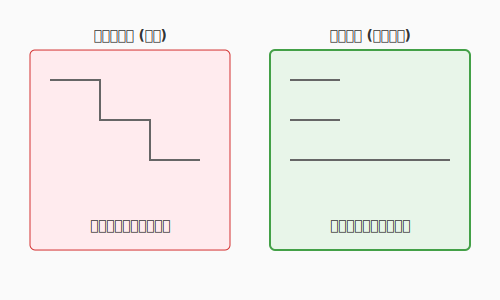

# 3.2 術式の構築——制御構造と論理の美学

「元素（アルゴリズムとデータ構造）」が魔法の材料だとしたら、それらをどのように組み合わせ、どのような順序で発動させるかを決める手順が「術式（制御構造）」です。

すべてのプログラムは、たった3つの基本構造の組み合わせで表現できます。

- **順次（Sequence）**: 上から下へ順番に実行する
- **分岐（Selection）**: 条件によって道を変える（`if`, `switch`など）
- **反復（Iteration）**: 条件を満たすまで繰り返す（`for`, `while`など）

シンプルな原理ですが、これらを組み合わせると無限の複雑さが生まれます。本節では、複雑さを手なずけ、美しく読みやすい術式を構築する技法を学びます。

次の図は、順次・分岐・反復という三つの基本構造が組み合わさった制御フローの全体像を示しています。



ここで確認できるのは、どれほど複雑に見えるプログラムも、この三つの要素に還元できるという構造的な美しさです。正常系（ハッピーパス）は左端の幹として流れ、異常系は枝として早期に弾かれます。この「幹と枝」の分離こそが、本節を通して磨いていく読みやすい術式の基本的な形です。

---

## 1. どう設計するか（思考編）

コードを書き始める前に、制御フローを頭の中で（あるいは紙の上で）設計します。

### 1.1 正常系（ハッピーパス）を先に描く

まず「すべてがうまくいった場合」の流れを明確にします。

```
クエスト完了の正常系:
1. クエストがアクティブである
2. 英雄のレベルが足りている
3. 期限内である
4. → クエスト完了、経験値付与
```

正常系が明確になれば、それが術式の「幹」になります。

### 1.2 異常系を列挙する

次に「何が失敗しうるか」を洗い出します。

```
異常系の列挙:
- クエストがアクティブでない → エラー
- レベルが足りない → エラー
- 期限切れ → エラー
```

異常系は正常系の「枝」として扱います。幹と枝を分離することで、術式の見通しが良くなります。

### 1.3 制御フローを図式化する

複雑な処理は、書く前に図にすると整理できます。

```
[開始]
   │
   ▼
[アクティブ?]──No──→[エラー: 非アクティブ]
   │Yes
   ▼
[レベル足りる?]──No──→[エラー: レベル不足]
   │Yes
   ▼
[期限内?]──No──→[エラー: 期限切れ]
   │Yes
   ▼
[クエスト完了処理]
   │
   ▼
[終了]
```

この図を見れば、コードの構造が自然と浮かび上がります。

---

## 2. どう表現するか（実装編）

設計した制御フローを、読みやすいコードとして表現する技法を学びます。

### 2.1 分岐の技法

#### ガード節（早期リターン）

異常系を関数の冒頭で弾き、正常系をメインの流れとして残す技法です。

```python
# ガード節を使った術式
def complete_quest(quest, hero):
    # 異常系を先に弾く（ガード節）
    if quest.status != "ACTIVE":
        return Error("Quest not active")

    if hero.level < quest.required_level:
        return Error("Level too low")

    if quest.is_expired():
        return Error("Quest expired")

    # 正常系（ハッピーパス）
    quest.status = "COMPLETED"
    hero.add_xp(quest.xp_reward)
    return Success("Quest completed!")
```

ガード節の利点:
- 正常系がネストせず、左端に揃う
- 各条件が独立して読める
- 条件の追加・削除が容易

#### 条件式の書き方

**肯定形を優先する**: 人間の脳は否定より肯定を処理しやすいです。

```python
# 否定形（読みにくい）
if not user.is_inactive():
    process(user)

# 肯定形（読みやすい）
if user.is_active():
    process(user)
```

**複雑な条件は名前をつける**: 条件式が長くなったら、意図を表す名前に抽出します。

```python
# 条件式が長い（意図が見えにくい）
if user.age >= 18 and user.has_verified_email and not user.is_banned:
    allow_purchase()

# 意図を名前にする（読みやすい）
can_purchase = user.age >= 18 and user.has_verified_email and not user.is_banned
if can_purchase:
    allow_purchase()

# さらに良い: メソッドに抽出
if user.can_purchase():
    allow_purchase()
```

#### switch/match vs if-else

分岐先が3つ以上あり、同じ変数を比較する場合は `switch` や `match` が適しています。

```python
# if-elseの連鎖（冗長）
if status == "PENDING":
    handle_pending()
elif status == "ACTIVE":
    handle_active()
elif status == "COMPLETED":
    handle_completed()
elif status == "CANCELLED":
    handle_cancelled()

# match文（Python 3.10+）
match status:
    case "PENDING":
        handle_pending()
    case "ACTIVE":
        handle_active()
    case "COMPLETED":
        handle_completed()
    case "CANCELLED":
        handle_cancelled()
```

### 2.2 ループの技法

#### for vs while の選択基準

| 使い分け | for | while |
|---------|-----|-------|
| 回数が決まっている | ✅ | |
| コレクションを走査 | ✅ | |
| 終了条件が動的 | | ✅ |
| 無限ループ | | ✅ |

```python
# 回数が決まっている → for
for i in range(10):
    print(i)

# コレクションを走査 → for
for quest in active_quests:
    quest.check_deadline()

# 終了条件が動的 → while
while not queue.is_empty():
    process(queue.pop())
```

#### 無限ループの安全な書き方

無限ループは意図的に使う場面があります。必ず脱出条件を明示します。

```python
# ゲームループの例
while True:
    event = get_input()

    if event == "QUIT":
        break  # 明確な脱出条件

    update_game_state(event)
    render()
```

#### break と continue

- **break**: ループを完全に抜ける
- **continue**: 今回のイテレーションをスキップし、次へ進む

```python
# continueで不要な処理をスキップ
for quest in all_quests:
    if quest.is_completed():
        continue  # 完了済みはスキップ

    # 未完了クエストの処理
    check_deadline(quest)
    notify_hero(quest)
```

#### 再帰という選択肢

木構造やグラフの探索など、自己相似的なデータには再帰が自然です。

```python
# ディレクトリ内のファイルを再帰的に取得
def find_all_files(directory):
    files = []
    for item in directory.contents:
        if item.is_file():
            files.append(item)
        elif item.is_directory():
            files.extend(find_all_files(item))  # 再帰呼び出し
    return files
```

ただし、再帰はスタックオーバーフローのリスクがあります。深さが不明な場合はループに変換するか、末尾再帰最適化を意識します。

### 2.3 例外処理の技法

プログラムの実行中に異常が発生したとき、どのように対処するかを決める仕組みが例外処理です。例外処理を理解するには、**制御の流れ**（どこで・どう対処するか）と**エラー情報の渡し方**（何を使って伝えるか）の2つの軸で整理すると見通しが良くなります。

#### 制御の流れの三つの型

エラーが発生したとき、プログラムの制御がどう動くかは大きく3つに分類できます。

| 型 | 仕組み | 代表例 |
|----|--------|--------|
| **例外機構によるジャンプ** | エラー発生地点から、あらかじめ登録されたハンドラへ制御が飛ぶ | `try-catch`（Java, Python, C#） |
| **条件分岐による局所判定** | 戻り値やフラグを `if` 文等でチェックし、その場で分岐する | C言語のエラーコード判定、Goの `if err != nil` |
| **呼び出し元への委譲** | 関数内では対処せず、エラー情報を戻り値として返して判断を委ねる | Rustの `Result<T, E>` + `?` 演算子 |

それぞれの制御フローを図で見てみましょう。

**型1: 例外機構によるジャンプ**

```
呼び出し元                    呼び出し先
┌──────────────┐          ┌──────────────┐
│ try:         │          │              │
│   func() ───────────→   │  処理実行     │
│ except:      │  ←─────── │  raise Error │（ジャンプ！）
│   回復処理    │          └──────────────┘
└──────────────┘
```

エラーが起きると、通常の実行順序を飛び越えて `catch`/`except` ブロックに制御が移ります。関数の呼び出し階層を何段でも遡れるのが特徴です。

```python
# Python: 例外機構によるジャンプ
def connect_database():
    try:
        return Database.connect(config)
    except ConnectionError as e:
        # ここに制御がジャンプする
        raise DatabaseUnavailable(f"Cannot connect: {e}")
```

**型2: 条件分岐による局所判定**

```
┌──────────────────────────┐
│ result = func()          │
│ if result == ERROR:      │──→ エラー処理
│   ...                    │
│ else:                    │──→ 正常処理
│   ...                    │
└──────────────────────────┘
```

呼び出し直後にその場でチェックします。制御のジャンプは起きず、通常の順次実行の中で分岐するだけです。

```c
// C言語: エラーコードを条件分岐で判定
int result = open_file("data.txt");
if (result == -1) {
    printf("Failed to open file\n");
    return EXIT_FAILURE;
}
// 正常処理を続行
```

**型3: 呼び出し元への委譲**

```
関数A                  関数B                  関数C
┌────────────┐    ┌────────────┐    ┌────────────┐
│ B()を呼ぶ   │    │ C()を呼ぶ   │    │ エラー発生   │
│ Err→処理    │←── │ Err→そのまま │←── │ Err を返す   │
│            │    │   返す      │    │             │
└────────────┘    └────────────┘    └────────────┘
```

関数Cはエラーを返すだけ。関数Bも自分では処理せずそのまま返す。最終的に関数Aが判断します。「誰が責任を持つか」を呼び出し階層の中で選べる柔軟な方式です。

```rust
// Rust: Result型 + ?演算子で呼び出し元に委譲
fn load_quest(id: u32) -> Result<Quest, QuestError> {
    let data = read_file(id)?;   // エラーなら即座に返す（?演算子）
    let quest = parse(data)?;    // ここも同様
    Ok(quest)                    // 成功時のみここに到達
}
```

#### エラー情報の伝え方

制御の流れとは別に、「エラーの内容をどのような形で伝えるか」にも複数の方法があります。

| 方法 | 仕組み | 言語例 |
|------|--------|--------|
| **例外オブジェクト** | エラーの種類・メッセージ・スタックトレースをオブジェクトに格納して `throw`/`raise` する | Java, Python, C# |
| **Result / Either 型** | 成功値とエラー値のどちらかを保持する型で返す。型システムが処理漏れを検出できる | Rust (`Result<T, E>`), Haskell (`Either`) |
| **エラーコード（整数値）** | 関数の戻り値として整数を返し、0 なら成功、それ以外はエラー番号を示す | C, POSIX API |
| **複数戻り値** | 正常値とエラー値をタプルや多値で同時に返す | Go (`value, err`) |
| **Option / Maybe 型** | 「値がある（Some）」か「ない（None）」かだけを表現する。エラーの詳細は持たない | Rust (`Option<T>`), Haskell (`Maybe`) |

それぞれの方法を具体的なコードで見てみましょう。

```python
# 例外オブジェクト（Python）
# → エラーの種類を型で、詳細をメッセージで伝える
raise QuestNotFound(f"Quest {quest_id} does not exist")
```

```rust
// Result型（Rust）
// → 成功(Ok)かエラー(Err)かを型で保証。処理し忘れるとコンパイル警告
fn find_user(id: u32) -> Result<User, UserError> {
    match database.query(id) {
        Some(user) => Ok(user),
        None => Err(UserError::NotFound(id)),
    }
}
```

```go
// 複数戻り値（Go）
// → 値とエラーを同時に返す。慣習的にerrをチェックしてから値を使う
func findUser(id int) (*User, error) {
    user, err := database.Query(id)
    if err != nil {
        return nil, fmt.Errorf("user %d not found: %w", id, err)
    }
    return user, nil
}
```

```c
// エラーコード（C）
// → 整数値で成否を返す。詳細はグローバル変数errnoに格納される
int fd = open("quest.dat", O_RDONLY);
if (fd == -1) {
    perror("open failed");  // errnoから詳細メッセージを表示
}
```

どの方法にも一長一短があり、「これが唯一の正解」というものはありません。使用する言語の慣習やチームの方針に沿って選ぶことが大切です。

#### 例外処理の実践的なコツ

ここからは、特に例外機構（`try-catch`）を使う場合の実践的な技法を紹介します。

**try-catch は回復できる場所に書く**

例外をキャッチするのは、そのエラーに対して意味のある回復処理を行える場所に限ります。

```python
# 改善前: 例外の握りつぶし（何が起きたかわからない）
def process_quest(quest_id):
    try:
        quest = load_quest(quest_id)
        execute(quest)
    except Exception:
        pass

# 改善後: 回復できるエラーだけをキャッチし、それ以外は上位に伝播
def process_quest(quest_id):
    try:
        quest = load_quest(quest_id)
    except QuestNotFound:
        logger.warning(f"Quest {quest_id} not found, skipping")
        return

    execute(quest)  # ここで発生した例外は上位に伝播する
```

**早期失敗（Fail Fast）で原因を特定しやすくする**

入力の検証は関数の冒頭で行い、おかしな値を早い段階で検出します。処理が進んでから発覚するほど、原因の特定に手間がかかります。

```python
def create_hero(name, level):
    # 入力検証を最初に行う（早期失敗）
    if not name:
        raise ValueError("Name cannot be empty")
    if level < 1 or level > 100:
        raise ValueError(f"Level must be 1-100, got {level}")

    # 検証を通過したら本処理
    return Hero(name=name, level=level)
```

---

## 3. QuestForgeで実践

これまで学んだ技法を、QuestForgeのアイテム取得処理で実践してみましょう。

### Before: ネストの深い術式

```python
def pickup_item(hero, item, area):
    if area.is_safe:
        if hero.inventory.has_space():
            if item.is_pickable:
                if hero.can_carry(item.weight):
                    hero.inventory.add(item)
                    return "Picked up!"
                else:
                    return "Too heavy"
            else:
                return "Cannot pick this up"
        else:
            return "Inventory full"
    else:
        return "Area is dangerous"
```

改善の余地:
- 正常系が最も深いネストに埋もれている
- 条件の対応関係が追いにくい
- 新しい条件を追加しにくい

### After: ガード節による再構築

```python
def pickup_item(hero, item, area):
    # ガード節: 異常系を先に弾く
    if not area.is_safe:
        return "Area is dangerous"

    if not hero.inventory.has_space():
        return "Inventory full"

    if not item.is_pickable:
        return "Cannot pick this up"

    if not hero.can_carry(item.weight):
        return "Too heavy"

    # 正常系: ハッピーパス
    hero.inventory.add(item)
    return "Picked up!"
```

改善点:
- 正常系が最も浅い階層に
- 各条件が独立して読める
- 新しい条件の追加が容易（ガード節を1つ追加するだけ）

---

## まとめ

制御構造は、プログラムが「どう動くか」を決める骨格です。正常系（ハッピーパス）を先に描いてから異常系を列挙するという設計の順序を守ることで、コードは自然と読みやすい形に整います。ガード節で異常系を早期に弾き、条件式に意図を表す名前をつけることで、術式は魔法の呪文ではなく語りかける散文のように読めるものになります。

ループはその目的に応じて選び分け、例外処理は「回復できる場所」でのみ使う。この2つの判断軸を持つだけで、制御フローの複雑さをぐっと手なずけることができます。また、早期失敗（フェイルファスト）の姿勢は、バグの原因をその発生源で捕まえ、デバッグを大幅に楽にしてくれます。

次の3.3節では、術式を収める「器（関数・クラス・モジュール）」の設計に目を向けます。個々の術式がいかに美しくても、それを収める器が設計されていなければ、魔法は霧散してしまいます。構造化の技法を通じて、術式を意味のある単位へとまとめ上げていきましょう。

---

## AIへの詠唱例

```
@application/use_cases/complete_quest.py を読んで、
ネストを解消し、ガード節を使ってリファクタリングしてください。
正常系（ハッピーパス）が最も浅い階層に来るようにしてください。
```

```
以下の条件式に意図を表す名前をつけて、読みやすくリファクタリングしてください。
`if user.age >= 18 and user.has_license and not user.is_suspended:`
```

```
@infrastructure/repositories/quest_repository.py を読んで、
例外処理を見直してください。
握りつぶしている箇所があれば指摘し、適切な処理方法を提案してください。
```

---

## さらに学ぶためのリソース

- 📚 **書籍**: Dustin Boswell, Trevor Foucher『[リーダブルコード ―より良いコードを書くためのシンプルで実践的なテクニック](https://www.oreilly.co.jp/books/9784873115658/)』（可読性の高いコードを書くための現代の必読書）
- 📚 **書籍**: Edsger W. Dijkstra他『[構造化プログラミング](https://www.saiensu.co.jp/search/?isbn=978-4-7819-0260-8)』（制御構造の整理と抽象化に関する古典的名著）
- 🌐 **Web**: Python 公式ドキュメント "[制御構造ツール](https://docs.python.org/ja/3/tutorial/controlflow.html)"（Python特有の制御構文（for-else, match等）の公式ガイド）
- 📄 **論文**: Edsger W. Dijkstra "[Go To Statement Considered Harmful](https://dl.acm.org/doi/10.1145/362929.362947)" (1968)（構造化プログラミングの出発点となった歴史的書簡）

---

**執筆メモ**:
- 執筆日時: 2026-01-28
- 構成変更: 「設計→実装」の流れで再構成、評価は別節へ分離
- 実装技法: 分岐・ループ・例外処理の3カテゴリで整理
