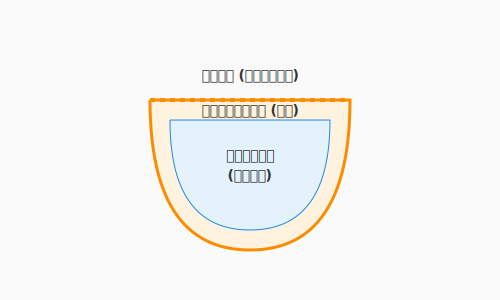

# 3.3 術式の器——関数・クラス・モジュール

前節までに、あなたはアルゴリズムという「元素」と、制御構造という「術式の構文」を学びました。しかし、数十行の処理を直接書き連ねていくだけでは、コードはあっという間に読み解けない長文呪文になってしまいます。

ここで必要になるのが、処理を適切な単位に分けて名前をつけ、再利用できるようにする**「器（Container）」**です。関数、クラス、モジュール——これらの器を使いこなすことで、術式は整理され、他の魔術師（チームメンバー）と共有でき、未来の自分にとっても読みやすいものになります。

厳密に言えば、関数・クラス・モジュールはそれぞれ異なる概念です。特にクラスは「オブジェクト指向」、関数を中心に据える発想は「関数型」というように、プログラミングパラダイムと深く結びついています。その違いは3.6節で詳しく扱います。本節ではパラダイムの違いには立ち入らず、これらに共通する**「処理をまとめて名前をつけ、適切な粒度で構造化する」**という考え方に焦点を当てます。



---

## 関数（Function）: 最小の器

### 一つの関数 = 一つの仕事

関数は、処理をまとめる最も基本的な器です。良い関数は「一つの仕事」だけを担います。

```python
# 一つの仕事に集中した関数
def calculate_xp_reward(quest: Quest, hero: Hero) -> int:
    """クエスト報酬の経験値を計算する"""
    base_xp = quest.base_xp
    level_bonus = 1.5 if hero.level < quest.recommended_level else 1.0
    return int(base_xp * level_bonus)
```

この関数は「経験値の計算」だけを行います。ログ出力もデータベース保存もしません。一つの仕事に集中しているからこそ、テストが書きやすく、変更にも強い関数になります。

これは3.4節で学ぶコードメトリクス（循環複雑度など）にも直結します。一つの仕事に集中した小さな関数は、自然と複雑度が低くなるのです。

### 引数と戻り値: 契約の明示

関数の入口（引数）と出口（戻り値）を明確にすることは、関数の「契約」を読み手に示すことです。

```python
# 契約が明確な関数
def find_available_quests(
    hero_level: int,
    all_quests: list[Quest],
    max_results: int = 10
) -> list[Quest]:
    """英雄のレベルに応じた受注可能なクエストを返す"""
    return [
        quest for quest in all_quests
        if quest.required_level <= hero_level
           and quest.status == "AVAILABLE"
    ][:max_results]
```

型ヒント（`int`, `list[Quest]`）があることで、AIがコードを読み解く際にも正確な推論が可能になります。人間にとっても、AIにとっても優しい「契約書」です。

### 純粋関数と副作用

関数には2つの種類があります。

| 種類 | 特徴 | 例 |
|------|------|-----|
| **純粋関数** | 同じ入力には常に同じ出力を返す。外部状態を変えない | `calculate_xp_reward()` |
| **副作用のある関数** | 外部状態を変更する（DBへの書き込み、ログ出力など） | `save_quest()`, `print()` |

```python
# 純粋関数: 入力だけで出力が決まる
def calculate_damage(attack: int, defense: int) -> int:
    return max(0, attack - defense)

# 副作用のある関数: 外部の状態を変更する
def complete_quest(quest: Quest, repository: QuestRepository) -> None:
    quest.status = "COMPLETED"
    repository.save(quest)  # 外部（DB）への書き込み
```

純粋関数はテストが容易で、並列処理にも強いという特徴があります。3.6節で学ぶ関数型プログラミングのパラダイムでは、この「純粋さ」が中心的な価値観となります。

すべてを純粋関数にする必要はありませんが、**純粋な計算と副作用のある操作を意識的に分離する**ことで、コードの見通しは大きく改善します。

### スコープ: 名前が届く範囲

変数や関数には「見える範囲（スコープ）」があります。

```python
total_xp = 0  # モジュールスコープ（広い）

def add_quest_reward(quest):
    bonus = quest.base_xp * 0.1  # 関数スコープ（この関数内だけ）

    global total_xp
    total_xp += quest.base_xp + bonus  # モジュールスコープの変数を変更
```

スコープが広い変数（グローバル変数）を多用すると、「誰がいつこの値を変えたのか」が追いにくくなります。変数のスコープは**必要最小限に留める**のが原則です。

---

## クラス（Class）: データと振る舞いの器

### フィールドとメソッド

関数が「処理」の器なら、クラスは「データとそれに関連する処理」をひとまとめにする器です。

```python
class Hero:
    """冒険者を表すクラス"""

    def __init__(self, name: str, level: int = 1):
        self.name = name          # フィールド: データ
        self.level = level
        self.xp = 0
        self.inventory: list[Item] = []

    def gain_xp(self, amount: int) -> None:
        """経験値を獲得し、必要ならレベルアップする"""
        self.xp += amount
        while self.xp >= self.xp_to_next_level():
            self.xp -= self.xp_to_next_level()
            self.level += 1

    def xp_to_next_level(self) -> int:
        """次のレベルに必要な経験値を計算する"""
        return self.level * 100
```

第2章（2.1節）で学んだ**カプセル化**を覚えていますか？　あの設計の視点が、ここでは実装として具現化されます。`Hero`クラスは、経験値の計算ロジックを内部に隠蔽し、外部からは `gain_xp()` というシンプルなインターフェースだけを公開しています。

### コンストラクタ: 器の初期化

`__init__` メソッド（コンストラクタ）は、オブジェクトが生まれる瞬間に呼ばれる特別なメソッドです。ここで、オブジェクトが正しい状態で生まれることを保証します。

```python
class Quest:
    def __init__(self, title: str, difficulty: str, base_xp: int):
        # 生まれた瞬間から正しい状態を保証
        if not title:
            raise ValueError("Quest title is required")
        if base_xp < 0:
            raise ValueError("XP reward must be non-negative")

        self.title = title
        self.difficulty = difficulty
        self.base_xp = base_xp
        self.status = "AVAILABLE"  # 初期状態は常に「受注可能」
```

### 言語による表現の違い

「データと振る舞いをまとめる」という概念は、言語によって異なる姿をとります。

| 言語 | 表現 | 特徴 |
|------|------|------|
| Python, Java, C# | `class` | 最も一般的なクラスベースOOP |
| Rust | `struct` + `impl` | データ定義と実装を分離 |
| Go | `struct` + メソッド | 継承なし、インターフェースで多態性 |
| JavaScript | `class` / プロトタイプ | ES6以降はclass構文、内部はプロトタイプベース |

3.6節でパラダイムの違いを学ぶ際、この表現の違いが深く関わってきます。

---

## モジュール / パッケージ: 大きな器

### 公開範囲の制御

モジュールは、関連するクラスや関数をまとめ、外部に**何を見せるか**を制御する器です。

```python
# questforge/domain/quest.py（モジュール）

# 外部に公開するもの
class Quest:
    """クエストを表すドメインモデル"""
    ...

class QuestStatus:
    """クエストの状態を表す列挙"""
    ...

# 内部でだけ使うもの（先頭に _ をつける慣習）
def _validate_quest_data(data: dict) -> bool:
    """クエストデータの内部検証（外部からは呼ばない）"""
    ...
```

Pythonでは `_` プレフィックスが「内部用」を示す慣習です。Javaでは `public` / `private` キーワード、TypeScriptでは `export` の有無で制御します。

### 名前空間とインポート

モジュールは「名前空間」としても機能します。同じ名前の要素が衝突することを防ぎます。

```python
# それぞれのモジュールに Item クラスがあっても衝突しない
from questforge.domain.items import Item as DomainItem
from questforge.presentation.dto import Item as ItemDTO
```

### パッケージ構成の例

QuestForgeのパッケージ構成を見てみましょう。

```
questforge/
├── domain/           # ドメイン層（ビジネスロジック）
│   ├── hero.py       #   Hero クラス
│   ├── quest.py      #   Quest クラス
│   └── items.py      #   Item クラス
├── application/      # アプリケーション層（ユースケース）
│   └── use_cases/
│       ├── complete_quest.py
│       └── assign_quest.py
├── infrastructure/   # インフラ層（外部接続）
│   ├── repositories/
│   └── api/
└── presentation/     # プレゼンテーション層（UI）
    └── cli/
```

この構成は、2.5節で学んだクリーンアーキテクチャの思想を、ファイルシステム上に投影したものです。各ディレクトリ（パッケージ）が一つの「責任の範囲」を持ち、依存の方向が内側（domain）に向かうよう整理されています。

---

## 器の階層構造

ここまで学んだ器を、階層として整理しましょう。

```
文（Statement）
  └── 関数（Function）      ← 処理のまとまり
       └── クラス（Class）    ← データ + 処理のまとまり
            └── モジュール（Module）  ← クラス・関数のまとまり
                 └── パッケージ（Package）  ← モジュールのまとまり
```

各レベルで「関心の分離」が行われています。

| レベル | 分離するもの | 例 |
|--------|-------------|-----|
| 文 | 個々の操作 | `hero.xp += reward` |
| 関数 | 一つの処理 | `calculate_reward()` |
| クラス | 一つの責任 | `Hero`（冒険者に関する全て） |
| モジュール | 一つの領域 | `domain/hero.py`（英雄ドメイン） |
| パッケージ | 一つの層 | `domain/`（ビジネスロジック全体） |

小さな器（関数）でうまく整理できていれば、大きな器（クラス、モジュール）も自然と整います。**まずは「一つの関数 = 一つの仕事」を徹底すること**が、コードの構造化の出発点です。

---

## QuestForge実践例: 報酬計算の構造化

「クエスト完了時に報酬を計算して付与する」という処理を、器の階層で構造化してみましょう。

```python
# --- 関数レベル: 個別の計算 ---

def calculate_xp_multiplier(quest: Quest, hero: Hero) -> float:
    """難易度とレベル差による経験値倍率を算出"""
    if quest.difficulty == "HARD" and hero.level < quest.recommended_level:
        return 2.0
    if quest.difficulty == "HARD":
        return 1.5
    return 1.0

def calculate_quest_xp(quest: Quest, hero: Hero) -> int:
    """クエストの経験値報酬を計算"""
    multiplier = calculate_xp_multiplier(quest, hero)
    return int(quest.base_xp * multiplier)


# --- クラスレベル: ユースケースの統合 ---

class CompleteQuestUseCase:
    """クエスト完了ユースケース"""

    def __init__(self, quest_repo: QuestRepository, hero_repo: HeroRepository):
        self.quest_repo = quest_repo
        self.hero_repo = hero_repo

    def execute(self, quest_id: str, hero_id: str) -> CompletionResult:
        quest = self.quest_repo.find_by_id(quest_id)
        hero = self.hero_repo.find_by_id(hero_id)

        # 純粋関数で計算
        xp_reward = calculate_quest_xp(quest, hero)

        # 副作用のある操作
        quest.status = "COMPLETED"
        hero.gain_xp(xp_reward)

        self.quest_repo.save(quest)
        self.hero_repo.save(hero)

        return CompletionResult(quest=quest, xp_gained=xp_reward)
```

純粋な計算（`calculate_xp_multiplier`, `calculate_quest_xp`）と副作用のある操作（`execute`内のDB保存）が、器の階層によって自然に分離されています。

---

## まとめ

術式は器によって初めて命を持ちます。関数は「一つの仕事を一つに」という契約を守ることで再利用可能になり、純粋関数と副作用のある操作を分離することでテストが格段に楽になります。クラスは第2章で学んだ設計思想を実装として具現化する場所であり、データと振る舞いを一体として表現します。

モジュールとパッケージはさらに大きな器として、関心の分離と公開範囲の制御を担います。文→関数→クラス→モジュール→パッケージという階層のそれぞれで適切な粒度の分離が行われていれば、数千行のコードベースでも読み解くことができます。AIが提案するコードもこの階層を意識しているかどうかを確認することが、採用・修正の判断基準になります。

次の3.4節では、こうして書かれたコードが本当に「良いコード」かどうかを客観的に測定する技術——コードメトリクスと静的解析について学びます。美しさを直感だけで語るのではなく、数値と道具を使って審美眼を磨く方法を探っていきましょう。

---

## AIへの詠唱例

```
@application/use_cases/complete_quest.py を読んで、
長い関数を「一つの関数 = 一つの仕事」の原則に従って分割してください。
純粋関数として切り出せる計算部分と、副作用のある操作を明確に分離してください。
```

```
application/use_cases/ のコードを読んで、
適切なクラスとモジュールに分割して構造化してください。
QuestForgeプロジェクトのクリーンアーキテクチャ（domain / application / infrastructure）に沿った
パッケージ構成も提案してください。
```

---

## ハンズオン: 長い関数を分割してみよう

### シナリオ

以下の「すべてを1つの関数で行っている」コードを、本節で学んだ原則に従って分割してください。

```python
def process_quest_completion(quest_id, hero_id, db):
    quest = db.execute("SELECT * FROM quests WHERE id = ?", quest_id)
    if not quest:
        print("Quest not found")
        return None
    hero = db.execute("SELECT * FROM heroes WHERE id = ?", hero_id)
    if not hero:
        print("Hero not found")
        return None
    if quest["status"] != "ACTIVE":
        print("Quest not active")
        return None
    xp = quest["base_xp"]
    if quest["difficulty"] == "HARD":
        xp = int(xp * 1.5)
    db.execute("UPDATE quests SET status = 'COMPLETED' WHERE id = ?", quest_id)
    new_xp = hero["xp"] + xp
    db.execute("UPDATE heroes SET xp = ? WHERE id = ?", new_xp, hero_id)
    print(f"Quest completed! {hero['name']} gained {xp} XP")
    return {"quest": quest, "xp_gained": xp}
```

### ステップ

1. **純粋関数を抽出**: XP計算のロジックを純粋関数として切り出す
2. **検証を分離**: ガード節として入力検証をまとめる
3. **副作用を明示**: DB操作を行う部分を明確にする

AIに「この関数を分割して」と依頼し、結果を本節の原則と照らし合わせてみてください。

---

## さらに学ぶためのリソース

- 📚 **書籍**: Steve McConnell『[Code Complete 第2版 ―完全なプログラミングを目指して](https://shop.nikkeibp.co.jp/asbp/shop/course/codecomplete/)』（実装技術の百科事典。関数やクラスの設計について、膨大な知見が詰まっています）
- 📚 **書籍**: Sandi Metz『[オブジェクト指向設計実践ガイド ―Rubyでわかる 進化し続ける柔軟なアプリケーションの作り方](https://www.gihyo.co.jp/book/2016/978-4-7741-8036-6)』（クラスの責任をどう分けるか、言語を問わず役立つ設計の知恵）
- 🌐 **Web**: Python 公式チュートリアル "[クラス](https://docs.python.org/ja/3/tutorial/classes.html)"（Pythonのクラス機構とスコープに関する公式解説）
- 📄 **論文**: Barbara Liskov and Stephen Zilles "[Programming with Abstract Data Types](https://dl.acm.org/doi/10.1145/942572.807045)" (1974)（データ抽象と抽象データ型（ADT）の概念を確立した歴史的論文）

---

**執筆メモ**:
- 執筆日時: 2026-02-01
- 構成: 3.2節（文レベルの制御）と3.4節（メトリクス/静的解析）の間を埋める新節
- 内容: 関数・クラス・モジュールによる処理の構造化。2章の設計→実装への橋渡し、3.6節FPへの伏線
