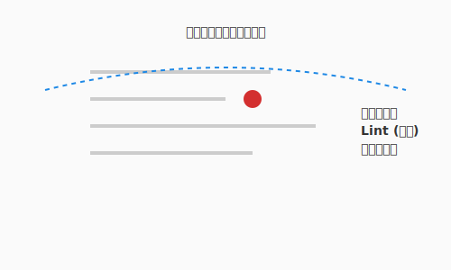

# 3.4 審美眼の錬磨——コードの評価と静的解析

これまでに、基本的な「元素（アルゴリズム）」と、それを組み上げる「構築（制御構造）」を学びました。しかし、AIと共に高速にコードを生成できるようになった今、アルケミスト（エンジニア）にはもう一つ、決定的に重要な能力が求められます。

それは、目の前のコードが「本当に良いものか」を瞬時に見抜く**審美眼（Evaluation）**です。

前節3.3で関数・クラス・モジュールという器で処理を整理したうえで、本節ではその器の出来栄えを数値と解析で鑑定します。

AIは平気な顔をして、動くけれどメンテナンス不可能な「呪いのアイテム」を生成することがあります。見た目は立派な剣でも、振った瞬間に折れる（バグる）ようでは使い物になりません。本セクションでは、コードの品質を数値で測る「鑑定魔法（メトリクス）」と、自動的に不備を検知する「結界（静的解析）」について学びます。

次の図は、リンター・フォーマッター・型チェッカーという三種類の静的解析ツールがコードのどの側面を検査するかを示しています。



ここで重要なのは、これらのツールがコードを「実行せずに」解析するという点です。リンターはバグの芽となる構造的な問題を指摘し、フォーマッターはスタイルを強制的に統一し、型チェッカーは型の不整合を事前に検知します。三者が連携することで、AIが生成したコードであっても人間がレビューする前段階で多くの問題を自動的に取り除くことができます。

---

では、こうした客観的な評価がなぜAI時代のエンジニアにとって不可欠なのかを確認しておきましょう。

### なぜこれが重要か

「なんとなく読みづらい」「多分大丈夫」といった感覚的な評価は、チーム開発やAIとの協働では通用しません。

1. **客観的な品質基準**: 「複雑すぎる」という指摘を、「循環複雑度が15を超えている」という事実に置き換えることで、感情論抜きに議論できます。
2. **AIの暴走抑止**: AIにコードを書かせた後、人間がレビューする際の「チェックリスト」として機能します。
3. **技術的負債の可視化**: 目に見えない「借金」を数値化し、リファクタリングの優先順位を決める根拠になります。

### 基本概念：鑑定のための指標（メトリクス）

コードの品質を測るスカウターのような数値です。シンプルなものから順に見ていきましょう。

#### 1. 行数（Lines of Code: LOC）


最もシンプルですが、強力な指標です。

```python
# 20行の関数（適切）
def complete_quest(quest, hero):
    if quest.status != "ACTIVE":
        return Error("Not active")
    quest.status = "COMPLETED"
    hero.add_xp(quest.xp_reward)
    return Success()

# 100行の関数（長すぎる → 分割を検討）
def do_everything(data):
    # ... 延々と続く処理 ...
    pass
```

**歴史的な基準と現代の実務基準**:

関数やメソッドの行数の基準は、開発環境やプログラミング言語などによって異なります。
ここではこれまでに提案されている代表的な基準をいくつか紹介します。


| 出典 | 推奨行数 | 備考 |
|------|---------|------|
| Robert C. Martin『Clean Code』(2008) | 20行以下 | 理想は5〜10行。「関数は小さくあるべき」 |
| Steve McConnell『Code Complete 第2版』(2004) | 200行以下 | 研究では65行程度まで問題なしとのデータも紹介 |
| Google Python Style Guide | 40行超で検討 | 「長すぎる関数は分割を検討せよ」 |
| 各種Linter（一般的な設定） | 50行前後で警告 | プロジェクトごとに調整可能 |

- **目安**: 50行を超えたら分割を検討。20〜30行以内に収まると読みやすい。
- **計測方法**: `wc -l ファイル名` や、エディタの行数表示で確認できます。
- **注意**: 行数だけでは「空行やコメントが多いだけ」の場合を区別できないため、他の指標と併用します。

行数という第一の指標を理解したら、次はコードの「分岐の多さ」を測る、より本質的な指標に踏み込みましょう。

#### 2. 循環的複雑度（Cyclomatic Complexity）

コードの中に「独立した実行経路」がいくつあるかを示します。1976年にThomas McCabeが提唱した伝統的な指標です。

**正式な計算式**（制御フローグラフ理論）:

```
M = E - N + 2P

M: 循環的複雑度
E: エッジ数（制御フローの矢印の数）
N: ノード数（処理ブロックの数）
P: 連結成分数（通常は1）
```

**実用的な計算方法**: 以下の要素を数えて `+1` する

| カウント対象 | 例 |
|-------------|-----|
| 条件分岐 | `if`, `elif`, `case` |
| ループ | `for`, `while` |
| 論理演算子 | `and`, `or` |
| 例外処理 | `catch`, `except` |
| 三項演算子 | `? :`, `if-else`式 |

```python
def get_rank(score):          # 基本: 1
    if score >= 90:           # +1 (if)
        return "S"
    elif score >= 70:         # +1 (elif)
        return "A"
    elif score >= 50:         # +1 (elif)
        return "B"
    else:
        return "C"
# 循環的複雑度 = 1 + 3 = 4
```

- **目安**: 10以下が理想。15を超えると要注意。20を超えるとテストが困難。
- **意味**: 「この関数を完全にテストするには、最低何個のテストケースが必要か」の下限値。

**計測ツール（言語別）**:

これらの値はツールで自動的に計測することができます。

| 言語 | ツール | コマンド例 |
|------|--------|-----------|
| Python | radon | `radon cc file.py -s` |
| JavaScript/TypeScript | eslint + complexity | `eslint --rule 'complexity: error'` |
| Java | PMD, Checkstyle | `pmd check -R category/java/design.xml` |
| C# | Visual Studio メトリクス | IDE内で計測 |
| Go | gocyclo | `gocyclo -over 10 .` |
| 汎用 | SonarQube | Web UI で確認 |

```bash
# Python での例
pip install radon
radon cc your_file.py -s  # -s でスコア表示
```

出力例:
```
your_file.py
    F 10:0 get_rank - A (4)   # A=低複雑度、数値は4
```

循環的複雑度がコードの構造を数値化するなら、次の指標はその数値が「人間の読みやすさ」とどう結びつくかをより精密に捉えます。

#### 3. 認知的複雑度（Cognitive Complexity）

「人間にとってどれくらい理解しづらいか」を測る、2016年にSonarSourceが提唱した現代的な指標です。循環的複雑度と異なり、**ネストの深さ**を重く評価します。

```python
# 例1: フラットな構造（認知的複雑度 = 3）
def check_eligibility(user):
    if not user.is_active:      # +1
        return False
    if user.age < 18:           # +1
        return False
    if user.is_banned:          # +1
        return False
    return True

# 例2: ネストした構造（認知的複雑度 = 6）
def check_eligibility(user):
    if user.is_active:          # +1
        if user.age >= 18:      # +2 (ネスト+1)
            if not user.is_banned:  # +3 (ネスト+2)
                return True
    return False
```

同じロジックでも、ネストが深いと認知的複雑度は高くなります。

- **目安**: 15以下が理想。25を超えると理解困難。

**計測ツール（言語別）**:

| 言語 | ツール | コマンド例 |
|------|--------|-----------|
| Python | flake8-cognitive-complexity | `flake8 --max-cognitive-complexity 15` |
| JavaScript/TypeScript | eslint-plugin-sonarjs | `eslint --plugin sonarjs` |
| Java | SonarQube, Sonarlint | IDE プラグインで確認 |
| C# | SonarAnalyzer | IDE プラグインで確認 |
| Go | gocognit | `gocognit -over 15 .` |
| 汎用 | SonarQube | Web UI で確認 |

```bash
# Python での例
pip install flake8-cognitive-complexity
flake8 --max-cognitive-complexity 15 your_file.py
```

---

## 魔法の道具：静的解析ツール（Linter & Formatter）

コードを実行せずに、その構造や記述を解析して問題を見つけるツール群です。これらは、開発者を守る「常時発動型の結界」として機能します。メトリクスで指標を把握したら、今度はその問題を自動的に検出するツールを揃えましょう。

### 1. リンター（Linter）：粗探しの小鬼
文法的には間違っていなくても、バグになりそうな箇所やスタイル違反を指摘してくれます。
- **代表格**: Ruff, Flake8, Pylint (Python), ESLint (JavaScript)
- **指摘内容**: 未使用の変数、定義されていない名前、危険なデフォルト引数など。

リンターでバグの芽を摘んだら、次はコードの「見た目」を統一するツールの出番です。

### 2. フォーマッター（Formatter）：整列の精霊
コードの見た目（インデント、改行、空白）を強制的に統一します。
- **代表格**: Black, Ruff (Python), Prettier (JavaScript)
- **効果**: 「タブかスペースか」「改行の位置はどこか」といった無益な宗教論争を終わらせ、本質的なロジックの議論に集中させます。

スタイルが整ったら、最後に「型」という観点で契約の番人を配置しましょう。

### 3. 型チェッカー（Type Checker）：契約の番人
動的型付け言語（PythonやJavaScript）において、型の整合性を静的に検証します。
- **代表格**: Mypy, Pyright (Python), TypeScript Compiler
- **効果**: `int` を期待している場所に `None` が渡されるようなミスを、実行前に検知できます。

---

> **コラム: IDEが守ってくれる時代**
>
> 現代の開発では、IDE（統合開発環境）がこれらのツールを裏で自動実行し、リアルタイムで警告を表示してくれます。コマンドを手で叩く必要はほとんどありません。
>
> **主要IDEの対応状況**:
>
> | IDE | 特徴 |
> |-----|------|
> | **VS Code** | 拡張機能で何でも追加可能。Pylance（Python）、ESLint、Prettier等をインストールすれば、保存時に自動フォーマット＆警告表示 |
> | **IntelliJ IDEA / PyCharm** | 購入時点で高度な静的解析が組み込み済み。循環的複雑度も設定で警告可能 |
> | **Visual Studio** | C#/.NET向けにコードメトリクス機能を標準搭載。「分析」メニューから計測可能 |
>
> **IDEで有効にしておきたい設定**:
> - **保存時の自動フォーマット**: 手動で整形する手間がゼロに
> - **リアルタイム型チェック**: 書いた瞬間にエラーが分かる
> - **複雑度の警告閾値**: 関数が複雑になりすぎたら黄色や赤で警告
>
> ツールの存在を使うことは重要ですが、実務では「IDEが勝手にやってくれる」状態を目指しましょう。結界は、意識せずとも常に発動しているのが理想です。

---

## 実践例：AIコードの鑑定会

AIに生成させたQuestForgeのコードを、ツールを使って評価してみましょう。メトリクスと静的解析が連携して初めて、コードの「真の品質」が見えてきます。

### 鑑定対象のコード（AI生成・未修正）

```python
def calculate_rewards(hero, quests):
    total_xp = 0
    total_gold = 0
    for q in quests:
        if q.status == 'COMPLETED':
            if q.difficulty == 'HARD':
                if hero.level < 5:
                    total_xp += q.base_xp * 2
                else:
                    total_xp += q.base_xp * 1.5
            elif q.difficulty == 'NORMAL':
                total_xp += q.base_xp
            # ... (以下略)
            
    return total_xp, total_gold
```

### 1. メトリクス計測（鑑定）

このコードを `radon` (Pythonのメトリクス計測ツール) で計測したとします。

- **循環複雑度**: 12 （少し高い）
- **判定**: ネストが深く、条件分岐が多いため、認知負荷が高い。

メトリクスで数値的な問題が分かったら、次は静的解析ツールで具体的な警告を確認しましょう。

### 2. 静的解析（結界の反応）

`Ruff` や `Mypy` を通すと、以下のような警告が出ました。

- **Ruff**: `total_gold` is defined but never used. （変数が使われていない）
- **Mypy**: `hero.level` is compatible with `int`? （型ヒントがないため不明瞭）

警告の内容が分かれば、具体的にどう修正するかが見えてきます。

### 3. 改善版（鑑定結果に基づく修正）

指摘を受けて、ガード節を使ったり関数を分けたりして修正します。

```python
def calculate_quest_reward(quest: Quest, hero: Hero) -> int:
    """単一クエストの報酬計算（複雑度を分離）"""
    if quest.status != 'COMPLETED':
        return 0
        
    if quest.difficulty == 'HARD':
        multiplier = 2.0 if hero.level < 5 else 1.5
        return int(quest.base_xp * multiplier)
        
    return quest.base_xp

def calculate_total_rewards(hero: Hero, quests: list[Quest]) -> int:
    """全クエストの報酬合計（単純な集計）"""
    return sum(calculate_quest_reward(q, hero) for q in quests)
```

- **循環複雑度**: それぞれ 3〜4 （非常に低い）
- **型安全性**: 型ヒントがあり、Mypyも通過。
- **可読性**: 意図が明確。

---

## ハンズオン: 結界を張る

あなたの環境に、最強の結界 `Ruff` と `Mypy` を導入しましょう。

### ステップ1: インストール

```bash
pip install ruff mypy
```

### ステップ2: 実行

QuestForgeのディレクトリで実行してみます。

```bash
# リンターとフォーマッターの実行
ruff check .
ruff format .

# 型チェックの実行
mypy .
```

大量の警告が出るかもしれませんが、絶望しないでください。それは今まで見えていなかった「改善の種」が見えただけです。

---

## まとめ

審美眼とは、「なんとなく良い」という直感を客観的な根拠に変換する力です。循環複雑度はその核心的な指標であり、10を超えた関数はバグの住処になりやすいことが経験的に知られています。数値を把握することで、AIが生成したコードの質を感覚ではなく事実として評価できるようになります。

Linter・Formatter・Type Checkerは、コードレビューの前段階で多くの問題を自動的に発見してくれる最低限の装備です。これらをIDEと連携させて常時稼働させることで、書いた瞬間にフィードバックを受け取れる環境が整います。警告が多く出ても絶望する必要はありません。それは今まで見えていなかった改善の種が可視化されたということです。

次の3.5節では、この「審美眼」と「構築力」を武器に、AIエージェントとどのように協働するかを深く掘り下げます。ゴーレムを自律的に動かす詠唱術（プロンプトエンジニアリング）と、エージェントの思考サイクルの仕組みを学んでいきましょう。

---

## AIへの詠唱例

```
以下のPythonコードの循環複雑度を評価し、もし10を超えているなら、
関数を分割するかロジックを簡素化して、複雑度を下げたコードを提案してください。
```

```
このコードに対して、Flake8やMypyで警告が出そうな箇所を指摘し、修正案を提示してください。
特に型ヒントの欠落と、未使用変数に注目してください。
```

---

## さらに学ぶためのリソース

- 🌐 **ツール**: [Ruff](https://docs.astral.sh/ruff/)（PythonのLinterとFormatterを統合した、極めて高速な現代の標準ツール）
- 🌐 **ツール**: [mypy](https://www.mypy-lang.org/)（Pythonに静的型チェックを導入し、堅牢なコードを構築するための番人）
- 🌐 **Web**: [Google Python Style Guide](https://google.github.io/styleguide/pyguide.html)（世界最高峰のエンジニアリング集団が定義する、美しく保守性の高いコードの基準）
- 📄 **論文**: T. J. McCabe "[A Complexity Measure](https://ieeexplore.ieee.org/document/233837)" (1976)（循環的複雑度を定義した歴史的論文）
- 🌐 **解説**: [Cognitive Complexity by SonarSource](https://www.sonarsource.com/resources/cognitive-complexity/)（人間にとっての「コードの読みづらさ」を数値化する認知的複雑度の公式ホワイトペーパー）

---

**執筆メモ**:
- 執筆日時: 2026-01-28
- 構成: 3.2節から「評価」を分離して新設
- 内容: メトリクス（循環/認知複雑度）+ 静的解析ツール（Linter/Formatter/Type Checker）
