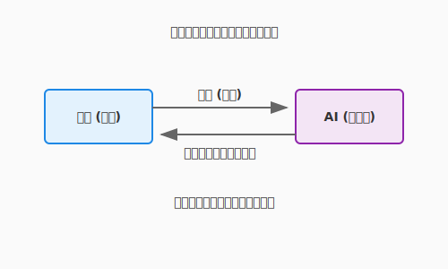

# 3.5 詠唱による具現化——自律型エージェントとの共闘

前節までは、あなたがコードを書く、あるいはAIにコード片を生成させる「対話」が中心でした。しかし、現代の錬金術（ソフトウェアエンジニアリング）には、より強力な使い魔が存在します。それが**「自律型コーディングエージェント（Autonomous Coding Agent）」**です。

彼らは、単に質問に答えるだけの「賢者」ではありません。あなたの開発環境（IDE）やターミナルに住み着き、ファイルシステムを読み、コマンドを実行し、エラーが出れば自ら修正する——まさに、実体を持って作業を行う「ゴーレム」です。

本セクションでは、Cursor、Windsurf、あるいはCLIベースのエージェントといった「自律型エージェント」を指揮し、設計を瞬時に実装へと具現化するための**「使役の作法」**を学びます。

次の図は、人間のエンジニア（術者）と自律型コーディングエージェント（ゴーレム）が、ファイル操作・コマンド実行・テストのループを通じてどのように協調するかを示しています。



ここで描かれているのは、術者が「何を作るか」という設計意図を詠唱（プロンプト）として渡し、ゴーレムが「どう作るか」という実行ループを自律的に回すという分業の構造です。人間がコードの一行一行を書く作業者から、エージェントの動きを監督・評価する指揮者へと役割が変化する——それがこの図の示す本質的なメッセージです。

---

## エージェントはいかにして動くか

チャットAIとエージェントの最大の違いは、**「手（ツール）」**と**「目（コンテキスト）」**を持っていることです。この三つの力がどのように連動するかを見ていきましょう。

### 1. コンテキストの掌握（目）
従来のチャットでは、必要なコードを人間がコピー＆ペーストする必要がありました。しかしエージェントは、以下のような情報を自ら取得します。

*   **ファイルシステム**: ディレクトリ構造やファイルの中身。
*   **Gitの差分**: 直前の変更内容。
*   **リンター/コンパイラのエラー**: コードが動かないという事実。

コンテキストを「目」として捉えたら、エージェントがその情報をもとにどう動き続けるかという「思考のループ」を理解しましょう。

### 2. ループ思考（自律自走）
エージェントは一度の生成で終わりません。以下のような「OODAループ」を高速で回します。

1.  **Observe (観察)**: ファイルを読み、エラーログを確認する。
2.  **Orient (状況判断)**: 「テストが落ちたのはインポートミスが原因だ」と推論する。
3.  **Decide (意思決定)**: ファイルを修正するコマンドを選択する。
4.  **Act (実行)**: 実際にファイルを書き換える。

ループで状況を判断し続けるエージェントが実際に何を「実行」できるのか——その「手」の部分を確認しておきましょう。

### 3. ツールの使用（手）
「コードを書く」だけでなく、以下の操作が可能です。
*   `read_file`: 既存コードの調査。
*   `write_file` / `replace`: コードの編集。
*   `run_shell_command`: テストの実行、ライブラリのインストール。

---

## 実践: ゴーレムへの命令書（プロンプト）

エージェントに対する指示は、チャットへの質問とは異なります。それは「会話」ではなく、**「作業指示書（Work Order）」**に近いものです。エージェントの仕組みが分かれば、その指示書をどう書けばよいかも見えてきます。

### コンテキストの明示（@参照の技法）

多くのIDE統合型エージェント（Cursor等）では、`@` を使って特定のファイルやシンボルを「注目」させることができます。

**基本的な指示**:
> クエストのリポジトリを実装して。

**効果的な指示**:
> `@Quest` エンティティと `@QuestRepository` インターフェースに基づき、`infrastructure/` フォルダ内に `JsonQuestRepository` を実装してください。実装後は `@test_quest_repository.py` を作成して動作確認を行ってください。

コンテキストを正しく渡す技法が身についたら、次はエージェントとの「反復」という概念を理解しましょう。

### 反復修正の活用

エージェントが一度で完璧なコードを書くことは稀です。「エラーが出たら直させる」プロセスこそが肝要です。

1.  **実装させる**: 「JSONファイルへの保存処理を書いて」
2.  **検証させる**: 「テストを実行して」
3.  **修正させる**: （テスト失敗後）「エラーログを読んで修正して」

このサイクルを回すことで、人間は詳細なデバッグ作業から解放されます。

---

## ハンズオン: クエスト管理機能の実装

概念と技法を理解したら、実際にQuestForgeの「クエスト完了機能」をエージェントに実装させてみましょう。

### シナリオ
あなたはアーキテクトとして、「クエストを完了（Complete）し、報酬を受け取る」というユースケースの設計を終えました。実装はエージェントに任せます。

### ステップ1: コンテキストの準備（契約）
まず、プロジェクトのルールをエージェントに読み込ませます。
（多くのエージェントは `.cursorrules` や `.ai/context/` といったファイルを自動的に参照します）

**指示（プロンプト）例**:
```markdown
あなたはClean Architectureを採用しているQuestForgeプロジェクトの開発者です。
`domain/` のルールを厳守し、`application/use_cases/complete_quest.py` を実装してください。
```

コンテキストの準備が整ったら、いよいよ実装と検証のループに入ります。

### ステップ2: 実装と検証のループ（使役）

**1. 実装指示**
> `CompleteQuestUseCase` を作成してください。
> - 入力: `quest_id`
> - 処理: リポジトリからクエストを取得し、ステータスを完了にし、保存する。
> - 参照: `@Quest` エンティティの `complete()` メソッドを使ってください。

**2. テスト生成と実行**
> このユースケースの単体テストを `tests/unit/test_complete_quest.py` に作成し、`python -m unittest` で実行してください。

**3. 自律修正**
> （もしテストが失敗したら）
> テストが失敗しました。原因を分析し、コードを修正して、再度テストを実行してください。

実装ループが完了したら、最後に人間の目で仕上げを確認しましょう。

### ステップ3: 人間による最終検分（査読）

エージェントは「動くコード」を作るのは得意ですが、「美しいコード」や「仕様の微妙なニュアンス」を見落とすことがあります。

*   **命名は適切か？**: ドメイン用語（Ubiquitous Language）を使っているか。
*   **過剰な実装はないか？**: YAGNI原則に違反していないか。
*   **セキュリティ**: 入力値の検証は抜けていないか。

---

個別の指示を都度書く手間を減らしたいとき、ルールファイルという「永続的な契約」が力を発揮します。

## 高度な魔術: ルールファイルによる自動化

毎回「Clean Architectureで…」と指示するのは手間です。プロジェクトルートに「エージェントへの指示書」を配置することで、これらの前提共有を自動化できます。

**例: `.ai/rules.md` (あるいは `.cursorrules`)**
```markdown
# プロジェクト指針
- 言語: Python 3.10+
- アーキテクチャ: Clean Architecture (domain, application, infrastructure, presentation)
- テスト: unittest使用。全てのユースケースにはテストが必須。
- エラー処理: カスタム例外 `DomainException` を使用すること。
```

これを置いておくだけで、エージェントは「阿吽の呼吸」でプロジェクトの掟に従うようになります。

---

ルールファイルでIDE統合型の「作法」が定まれば、次はより自律的なCLI型エージェントという別の使い魔の流儀に目を向けましょう。

## CLIエージェントという新たな魔導体系——Claude Codeを例に

IDE統合型エージェントが「魔法陣の中に住む使い魔」なら、CLIエージェントは「ターミナルという召喚の祭壇から呼び出す、より自律的な使い魔」です。

代表格である**Claude Code**（Anthropic製）は、コマンドラインから起動するだけで、プロジェクトのディレクトリ構造を読み解き、ファイルの編集、テストの実行、そしてGitへのコミットまで——一連の作業を自律的に実行できます。

### IDE型 vs CLI型：二つの使い魔の特性

| 特性 | IDE統合型（Cursor、Windsurf等） | CLI型（Claude Code、Aider等） |
|------|-------------------------------|------------------------------|
| **起動** | エディタ内のパネル・サイドバー | `claude` とターミナルに入力 |
| **コンテキスト指定** | `@ファイル名` で明示的に参照 | プロジェクト全体を自動で把握 |
| **指示の粒度** | コード片・関数単位の局所的な指示 | 機能単位のタスク全体を依頼 |
| **得意な作業** | その場でのコード補完・提案 | ファイル横断的な大規模実装、Git操作まで |
| **自律度** | 人間が確認しながら進める | 「よしなに」と任せて自律実行 |

どちらが優れているわけではありません。作業の性質に応じて使い分けるのが、熟練のアルケミストの流儀です。

CLI型の特性が分かったところで、そのゴーレムにプロジェクトの記憶を与える「魂の書き込み」について見ていきましょう。

### CLAUDE.md：ゴーレムへの「永続的な魂の書き込み」

前述の `.cursorrules` と同様の役割を、Claude Codeは **`CLAUDE.md`** というファイルで果たします。ただし、その深さは一段上です。

`.cursorrules` が「作業ルールの伝達」を目的とするのに対し、`CLAUDE.md` は**「プロジェクトの記憶と文脈」そのもの**を記述します。セッションをまたいでも、エージェントはここを読んでプロジェクトの背景を再学習します。

```markdown
# QuestForge プロジェクト設定

## このプロジェクトについて
RPG風タスク管理アプリ。Clean Architectureを採用。

## 絶対に守るルール
- domain/ 層には外部ライブラリのimportを禁止
- すべてのユースケースにはpytestのテストが必須
- コミットはfeature単位で分割すること

## よく使うコマンド
- テスト実行: `python -m pytest`
- 型チェック: `mypy src/`
```

このファイルをプロジェクトルートに置くだけで、ゴーレムは「プロジェクトの掟」を忘れない存在になります。

### 実践的な詠唱パターン三流派

CLAUDE.mdでゴーレムに記憶を与えたら、実際の指示の「流派」を押さえておきましょう。CLIエージェントへの指示には、大きく三つの流派があります。

#### 流派1：タスク丸投げ型（大規模実装）

機能全体を「まるごと」任せるスタイルです。

```
クエスト検索APIを実装してください。

- GET /api/quests?status=active&level_min=5
- レスポンスはJSONでクエスト一覧を返す
- Clean Architectureの層構造を守ること
- テストを書いてからロジックを実装すること（TDD）
- 最後に適切な単位でコミットまで行うこと
```

エージェントはこれだけで、インターフェース定義→ユースケース→インフラ実装→テスト→コミットを自律的にこなします。人間は完成した作業を確認・承認するだけです。

丸投げが有効な場面を知ったら、次はより慎重に進めたいときの「探索型」を見ていきましょう。

#### 流派2：探索型（文脈を理解してから作業）

既存のコードを調査した上で、文脈に沿った実装を進めてもらうパターンです。

```
現在の QuestRepository の実装を読んで、
定義されているメソッドと設計方針を把握してください。
その上で「期限切れクエストを一括アーカイブする」機能を追加してください。
```

エージェントはまずコードを「読み」、既存設計と一貫した実装を行います。コードベースが大きくなるほど、このアプローチの威力が増します。

さらに大きな変更や本番環境に近い作業では、承認を挟みながら進める流派が安心感をもたらします。

#### 流派3：段階的承認型（慎重に進めたいとき）

大きな変更を「小さな確認ステップ」に分割し、各段階で人間が承認するパターンです。

```
アーキテクチャのリファクタリングを3段階で進めます。
まずステップ1として、現在の設計の課題を分析して
レポートしてください。実装はまだ行わないでください。
```

「分析 → 承認 → 実装 → 承認 → 仕上げ」のサイクルにより、大規模な変更も確実にコントロールできます。

三つの流派を使い分けられるようになったら、さらに効率を高める「短縮詠唱」の仕組みも知っておきましょう。

### スラッシュコマンド：使い魔への「短縮詠唱」

Claude Codeには、頻繁に使う操作をワンフレーズで呼び出す**スラッシュコマンド**が用意されています。

| コマンド | 効果 |
|---------|------|
| `/commit` | 変更を論理単位ごとに自動でグループ化してコミット |
| `/review-pr` | プルリクエストのレビューを依頼 |
| `/fix` | 直前のエラーを自動修正 |

さらに、プロジェクト固有のスラッシュコマンドを **`.claude/commands/`** フォルダに定義することで、「このプロジェクト専用の詠唱術」を作り出せます。たとえば `/deploy` と入力するだけで、テスト→ビルド→デプロイの一連の儀式を自動実行させることも可能です。

```markdown
# .claude/commands/deploy.md
テスト(`pytest`)を実行し、全て通過したらDockerイメージをビルドして
ステージング環境にデプロイしてください。
デプロイ後、ヘルスチェックエンドポイントを叩いて正常を確認してください。
```

定型作業の「詠唱書」を整備していくことが、チーム全体の生産性を底上げします。

---

## コラム: 「Vibe Coding」と「スペック駆動開発」

AI時代の開発スタイルには、大きく分けて二つの流派が生まれつつあります。状況に応じてこれらを使い分けるのが、熟練したアルケミストの証です。

### 1. Vibe Coding（直感詠唱）
「なんとなくこんな感じ（Vibe）」という曖昧なイメージをAIに投げ、返ってきたものを動かしながら修正していくスタイルです。
*   **特徴**: スピード重視。厳密な仕様書よりも、対話と実行結果（画面の見た目や動き）を正解とする。
*   **適所**: UIのプロトタイピング、個人開発、使い捨てのスクリプト作成。
*   **魔法の性質**: **即興演奏**。ジャズのように、AIとの掛け合いで予期せぬ素晴らしいコードが生まれることもあれば、カオスに陥ることもあります。

### 2. Spec-Driven Development（スペック駆動開発）
Markdownなどで記述した「仕様書（Spec）」を正（Single Source of Truth）とし、AIにはその「厳密な翻訳」のみを行わせるスタイルです。
*   **特徴**: 品質と整合性重視。まずドキュメントを書き、それをAIに読ませて実装させる。コード修正時も、まずはSpecを直してからコードを再生成させる（Driftを防ぐ）。
*   **自動化の極致**: さらに進んだ形態では、**「実装→テスト実行→エラー修正」のループを完全に自動化**します。Specからテストコードを生成し、そのテストが通るまでAIが実装コードを自己修正し続けるのです。
*   **適所**: 業務システム、複雑なロジック、チーム開発。
*   **魔法の性質**: **契約魔法**。契約書（Spec）に書かれたことのみが忠実に履行されます。曖昧さを排除し、堅牢なゴーレムを生み出します。

この「テストによって品質を保証し、自動化された防壁を築く」というテーマについては、**第4章「無敵の軍団を作る（テストと品質保証）」**でより深く、実践的に掘り下げます。

本質的に、QuestForgeのようなドメイン駆動設計（DDD）を要するプロジェクトでは **スペック駆動開発** が適していますが、UIの試行錯誤には **Vibe Coding** が威力を発揮します。

---

## まとめ

自律型コーディングエージェントは、「手（ツール）」と「目（コンテキスト）」を持つことで、単なる質問応答AIとは一線を画します。ファイル操作とコマンド実行により、実装→テスト→修正のループを自律的に回せるエージェントは、まさに実体を持ったゴーレムです。しかしその能力を引き出す鍵は、`@`参照やルールファイルを使ってプロジェクトの文脈を正確に渡すことにあります。コンテキストなきエージェントは、地図なき冒険者と同じです。

IDE統合型はその場でのコード補完に、CLI型は機能単位の大規模実装に、それぞれ強みがあります。そして人間の役割は、コードを書く作業者からエージェントへの要件定義とコンテキスト供給、最終品質の保証を担う監督者へと変化します。この分業によって、あなたはより本質的な「何を作るか」という問いに集中できるようになります。

次の3.6節では、一つの言語・一つのパラダイムに縛られず、あらゆる「魔導体系」を自在に俯瞰するための視点を学びます。オブジェクト指向・関数型・宣言型という思考の枠組みを知ることで、問題に最適な言語とパラダイムを選び取る力が身につきます。

---

## AIへの詠唱例

### チャット／IDE統合型：局所的な実装依頼

```
@Quest エンティティと @QuestRepository インターフェースに基づき、
infrastructure/ フォルダ内に JsonQuestRepository を実装してください。
実装後は test_quest_repository.py を作成して動作確認を行ってください。
依存方向は必ず内側（domain）に向けてください。
```

### CLIエージェント型：機能単位の丸投げ（Claude Code等）

```
クエスト検索機能を実装してください。

要件:
- GET /api/quests?status=active&level_min=5
- Clean Architectureの層構造を守ること
- pytestでテストを書いてから実装すること（TDD）
- 実装完了後、適切な単位でコミットまで行うこと

まず現在のアーキテクチャを把握してから作業を開始してください。
```

### CLIエージェント型：CLAUDE.md の作成依頼

```
このプロジェクト（QuestForge）用の CLAUDE.md を作成してください。

含める内容:
- プロジェクトの概要と目的
- アーキテクチャの説明（Clean Architecture、各層の役割）
- 絶対に守るべきルール（依存方向、テスト必須など）
- よく使うコマンド（テスト実行、型チェック、ビルド）
- コミット規約

エージェントがセッション開始時に読むことを想定し、
簡潔かつ漏れなく記述してください。
```

### CLIエージェント型：段階的承認でリファクタリング

```
QuestRepository の実装を読んで、
現在の設計における改善の余地を3点挙げてください。
（この段階では実装は行わないでください）

確認後、優先度の高い改善から順に実装を進めます。
```

## さらに学ぶためのリソース

- 🌐 **ドキュメント**: [Cursor Documentation](https://docs.cursor.com/)（AI統合型エージェントの代表格。`.cursorrules` によるコンテキスト制御の最前線を学べます）
- 🌐 **ドキュメント**: [Claude Code (Anthropic)](https://docs.anthropic.com/en/docs/agents-and-tools/claude-code)（CLIベースで自律的に動作するAIエージェントの公式ガイド）
- 🌐 **Web**: [Simon Willison's Weblog](https://simonwillison.net/)（LLMとエンジニアリングの交差点における最新の実験と知見が日々更新されるブログ）
- 📄 **論文**: S. Yao et al. "[ReAct: Synergizing Reasoning and Acting in Language Models](https://arxiv.org/abs/2210.03629)" (2022)（エージェントが「推論」と「行動」を交互に行う仕組みの理論的基盤）
- 📄 **論文**: J. Wei et al. "[Chain-of-Thought Prompting Elicits Reasoning in Large Language Models](https://arxiv.org/abs/2201.11903)" (2022)（AIに「順を追って考えさせる」ことで推論能力を引き出す手法の原典）

---
