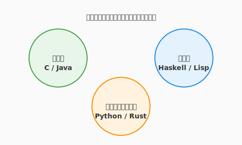

# 3.6 多彩なる魔導体系——言語の壁を超える

これまで私たちは、主に Python という「魔導言語」を使って魔法を具現化してきました。しかし、魔法の世界（ソフトウェア業界）には、数多くの言語が存在し、それぞれが独自の「魔導体系（パラダイム）」を持っています。

「Pythonが書ければそれでいい」と思うかもしれません。しかし、異なる体系を学ぶことは、単に「使える言語が増える」以上の意味を持ちます。それは、**「問題解決の引き出し（メンタルモデル）」が増える**ということです。

特定の言語に縛られた思考は、時として「金槌しか持っていないと、すべてが釘に見える」という思考の偏りにつながります。本セクションでは、代表的な魔導体系の特徴と、それらがあなたの「アルケミストとしての思考」にどう影響を与えるかを学びます。そして、AIを優秀な「翻訳者」として従え、言語の壁を自在に行き来する術を身につけます。

次の図は、オブジェクト指向・関数型・システムプログラミング・並行モデルという四大魔導体系（パラダイム）とそれぞれの代表言語の関係を示しています。



ここで示されているのは、各パラダイムが「世界をどう捉えるか」という哲学に基づいて言語を生み出してきたという歴史的な系譜です。オブジェクト指向は「モノの協調」、関数型は「データの変換」、システムプログラミングは「メモリの透視」、並行モデルは「通信による調和」という異なる世界観を持ちます。一つの言語を深く学ぶとき、その言語が属するパラダイムの哲学を意識することで、設計の選択肢が大きく広がります。

---

## 代表的な魔導体系（四大学派）

プログラミング言語は、単なる記号の羅列ではありません。そこには「世界をどう捉えるか」という哲学が込められています。これらを「学派」として捉えてみましょう。四大学派のそれぞれが持つ哲学と思考への影響を順番に見ていきます。

### 1. オブジェクト指向（OOP）：具現化の学派
**代表言語**: Java, C#, Ruby, Python
**哲学**: 「世界は、自律的に動く『モノ（Object）』の集まりである」
**思考への影響**: 
第2章で学んだ通り、複雑な問題を、責任を持つエージェント（オブジェクト）の協調動作としてモデル化します。大規模なシステムを「誰が何を知っているか（カプセル化）」という視点で整理するのに適しています。

### 2. 関数型（FP）：変換の学派
OOPが「モノの協調」を哲学とするなら、この学派はまったく異なる視点——「変換の連鎖」——から世界を捉えます。
**代表言語**: Haskell, Elixir, Lisp, (Rust, Scala)
**哲学**: 「世界は、汚れなき『データの変換（写像）』の連鎖である」
**思考への影響**:
この学派は「副作用（Side Effect）」を「呪い」のように忌み嫌います。変数を書き換えるのではなく、古いデータから新しいデータを「抽出」していきます。
この体系を学ぶと、**「状態管理の難しさ」**に敏感になります。「この関数を呼び出した後、他の場所でデータが変わってしまうのではないか？」という不安（呪い）を、**不変性（Immutability）**と**純粋関数**という聖なる結界で防ぐ知恵が身につきます。

### 3. システムプログラミング：透視の学派
「副作用をなくす」という関数型の美学を知ったら、今度はコンピュータの最下層に直接触れる学派に潜ってみましょう。
**代表言語**: C, C++, Rust
**哲学**: 「魔力（メモリ・CPU）の代償は、術者が自ら管理せよ」
**思考への影響**:
コンピュータの生の動き（メモリの番地、ポインタ、スタックとヒープ）を直接触ります。
現代において、大規模なAIモデルを動かしたり、1ミリ秒を争う高速処理を書く際には、この学派の知恵が不可欠です。「なぜこのコードは重いのか？」という疑問に対し、マシンのレベルまで潜って理由を説明できる「透視能力」が身につきます。

### 4. 並行モデル：調和の学派
メモリを透視する学派を経たら、最後は「複数の存在が調和して動く」という並行の世界観を持つ学派を見ていきましょう。
**代表言語**: Go, Erlang
**哲学**: 「世界は、独立した存在たちの『通信』によって調和する」
**思考への影響**:
何万もの魔法を同時に発動させる際、共通の魔力（共有メモリ）を奪い合うのではなく、メッセージを送り合うことで同期します。Go言語の「通信によるメモリ共有」という考え方を学ぶと、複雑な非同期処理を、まるでオーケストラの指揮者のようにスッキリと整理する視点が得られます（詳細は3.7節で深掘りします）。

---

## 実践: AIによる「意訳」とパラダイム・シフト

四つの学派の哲学を俯瞰できたら、その知識を実際のAIとの対話にどう活かすかを見ていきましょう。AIは言語間の翻訳が得意ですが、単に「翻訳して」と頼むと、直訳調の不自然なコードが生成されます。その言語の「流儀（Idiomatic way）」を反映させるには、**パラダイムを指定した詠唱（プロンプト）**が必要です。

### 悪い例：直訳（Python → Go）
Pythonの「クラスと継承」をそのままGoに持ち込もうとすると、Goの良さであるシンプルさが失われ、複雑で壊れやすいコードになります。

### 良い例：パラダイム・シフトを伴う意訳
AIに「Goの流儀（Idiomatic Go）に合わせて、継承ではなく**構造体の埋め込み（Composition）**と**インターフェース**で再設計して」と指示します。

```go
// Pythonの「継承」をGoの「構成」へ意訳した例
type Flyer interface {
    Fly()
}

type Hero struct {
    Name string
}

func (h *Hero) Move() { fmt.Println("Walking...") }

type Griffin struct {
    Hero // 埋め込みによる機能の再利用（構成）
}

func (g *Griffin) Fly() { fmt.Println("Flying high!") }
```
このように、**「パラダイムの違い」をAIに明示的に伝える**ことで、その言語において最も自然で高性能な魔法を引き出すことができます。

---

## ハンズオン: 異文化の風を感じる

### シナリオ
QuestForgeの「アイテムのフィルタリング機能（所持品から回復薬だけを取り出す）」を、3つの異なるパラダイムで実装し、思考の違いを体験します。同じ目的を異なる「語彙」で表現することで、パラダイムの個性が体感として分かります。

### ステップ1: 手続き型/命令型 (Python)
「空の箱を用意して、一つずつ確認して入れる」という、最も直感的な手順です。
```python
potions = []
for item in inventory:
    if item.type == 'POTION':
        potions.append(item)
```
**【アルケミストの気づき】**: 処理の「手順」を細かく制御できるが、コードが長くなりがち。

### ステップ2: 関数型 (Pythonスタイル)
手順を一つずつ書く命令型を体験したら、次は「何をしたいか」だけを宣言する関数型のスタイルを比べてみましょう。「手順」ではなく「条件」を宣言します。
```python
potions = [item for item in inventory if item.type == 'POTION']
```
**【アルケミストの気づき】**: 「何をするか（What）」に集中でき、バグが入り込む隙間（代入操作など）が減る。

### ステップ3: システムプログラミング型 (Rust + AI)
同じロジックがこれほど変わるとは驚きでしょう。さらに深く、メモリの動きまで意識するシステムプログラミング型も体験してみましょう。AIに「Rust言語で、メモリコピーを避けて（ゼロコピー）実装して。所有権の動きを解説して」と依頼してみましょう。
```rust
// AIが生成するコードのイメージ
let potions: Vec<&Item> = inventory.iter()
    .filter(|item| item.item_type == ItemType::Potion)
    .collect();
```
**【アルケミストの気づき】**: データの「所有権」や「貸し借り（借用）」という概念が登場し、メモリの使われ方を極限まで意識させられる。

---

## コラム: ポリグロット（多言語者）の武器庫

複数の言語を学ぶことの最大のメリットは、**「解決策の語彙」が増えること**です。

- 「ここは状態が複雑だから、Reduxのような**不変データ構造**を取り入れよう（関数型の知恵）」
- 「ここはパフォーマンスが命だから、**メモリアライメント**を意識したデータ構造にしよう（システム言語の知恵）」
- 「ここは将来の拡張が多いから、**インターフェース**で疎結合にしよう（オブジェクト指向の知恵）」

一つの言語を使っていても、脳内では複数の学派の知恵が融合し、独自の強力な魔法を編み出せるようになります。これが「言語の壁を超える」真の意味です。

---

## WebAssembly：ブラウザ上に刻まれた汎用真理ルーン

異なる言語パラダイムを学ぶことで「解決策の語彙」が増えると述べました。もう一つ、現代の言語の壁を超える技術として知っておくべきが **WebAssembly（Wasm）** です。Wasm は「ブラウザ上で動く低レベル命令セット」——あらゆる言語を翻訳できる汎用真理言語（ルーン）です。

### Wasmとは何か

WebAssemblyは、ブラウザやエッジ環境でネイティブに近い速度でコードを実行するためのバイナリ形式の命令セットです。JavaScriptの代替ではなく、**JavaScriptと共存する実行層**です。

```
Python / Rust / C++ / Go
        ↓ コンパイル
  WebAssembly (.wasm)
        ↓ 実行
   ブラウザ / Node.js / エッジ
```

C++で書いた物理シミュレーションを、PythonのバックエンドとJavaScriptのフロントエンドが混在する環境でも同じコードで動かせる——これがWasmの真価です。

### なぜ注目されるのか

| 特徴 | 意味 |
|------|------|
| **言語非依存** | Rust・C/C++・Go・Pythonなど多言語からコンパイル可能 |
| **高速** | JavaScriptよりネイティブに近い実行速度 |
| **サンドボックス** | ホスト環境とのアクセスが制限された安全な実行環境 |
| **ポータブル** | ブラウザ・サーバー・エッジ・IoTで同一バイナリが動く |

### QuestForgeでの活用シナリオ

```python
# Python側：Rustで書いたゲームロジックをWasm経由で呼び出す
# QuestForgeのダメージ計算をRustで高速化し、
# Python APIとブラウザの両方から利用する

# ブラウザ（JS側）：
# import init, { calculate_damage } from './questforge_engine.wasm';
# const damage = calculate_damage(attacker_stat, defender_stat, skill_id);

# Python（テスト側）：
# import wasmtime
# engine = wasmtime.Engine()
# module = wasmtime.Module.from_file(engine, "questforge_engine.wasm")
# damage = module.calculate_damage(100, 50, 3)
```

Wasmはまだ「主戦力」ではなく、計算負荷の高い特定処理（物理演算・画像処理・暗号化・AI推論）を既存の言語資産を活かしたまま高速化したい場面で特に輝きます。

---

## まとめ

プログラミング言語は単なる記号の羅列ではなく、「世界をどう捉えるか」という哲学が込められた思考の枠組みです。オブジェクト指向・関数型・宣言型・並行計算型という四大学派を知ることで、問題の性質に応じて最適なアプローチを選び取る引き出しが増えます。一つの言語しか知らなければ、すべての問題が同じ形に見えてしまいます。

AIはパラダイムの通訳者としても力を発揮します。「Idiomatic（その言語らしい）」という一言を添えた詠唱で、AIは出力言語の流儀に沿ったコードを生成してくれます。また、別の言語で学んだ美しい概念——関数型の不変性、Rustの所有権モデル——はメインの言語をより良く書くための「知恵の逆輸入」となります。

次の3.7節では、複数の処理を同時に操る高度な術式、非同期・並行プログラミングに踏み込みます。現代のWebアプリやAI処理に不可欠なasync/awaitの仕組みと、複数のゴーレムを協調させるアクターモデルを学んでいきましょう。

---

## AIへの詠唱例

```prompt
このPythonコードを、関数型プログラミングの「不変性（Immutability）」を意識してリファクタリングしてください。変数の再代入を避け、リスト内包表記やmap/filterを活用してください。
```

```prompt
以下のロジックをRustで実装したいです。パフォーマンスを最大化するために、ヒープ割り当てを最小限に抑え、所有権を効率的に扱う方法を提案してください。
---

## さらに学ぶためのリソース

- 📚 **書籍**: Bruce A. Tate『[セブン・ランゲージ ―7つの言語 7つの世界](https://www.ohmsha.co.jp/book/9784274068553/)』（Ruby, Io, Prolog, Scala, Erlang, Clojure, Haskell。全く異なる7つの世界観を一望できる名著）
- 📚 **書籍**: Harold Abelson他『[計算機プログラムの構造と解釈 第2版 (SICP)](https://www.kadokawa.co.jp/product/301402000676/)』（プログラミングの本質を学ぶ「魔法使いの必読書」）
- 🌐 **Web**: [Exercism](https://exercism.org/)（多くの言語を、メンターの指導を受けながら無料で学べる最高の修行場）
- 🌐 **Web**: [Rosetta Code](https://rosettacode.org/)（一つの問題を何百もの言語でどう解くかを比較できる、現代のロゼッタ・ストーン）
- 📄 **論文**: John Backus "[Can Programming Be Liberated from the von Neumann Style?](https://dl.acm.org/doi/10.1145/359576.359579)" (1977)（命令型の限界を指摘し、関数型プログラミングの道を拓いた歴史的講演）

---

## AIへの詠唱例
