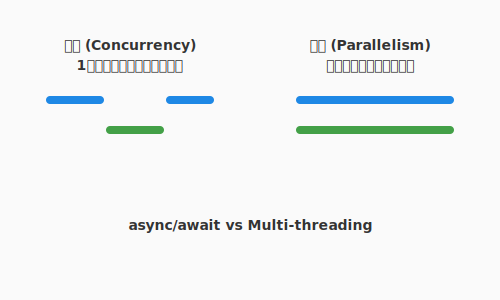

# 3.7 並列詠唱の奥義——非同期・並行プログラミング（The Art of Concurrent Spellcasting）

## 導入: 複数の術式を同時に紡ぐ

これまでの旅で、あなたは一つの処理を美しく構築する力を身につけてきました。しかし、現実のソフトウェアでは、**複数のことを「同時に」こなす**場面が当たり前のように訪れます。

QuestForgeを想像してみてください。プレイヤーがクエスト一覧を開いた瞬間、アプリは以下のことを「同時に」行う必要があります。

- データベースからクエスト一覧を取得する
- プレイヤーの実績データを読み込む
- 報酬画像のサムネイルを生成する
- リアルタイム通知をチェックする

これらを一つずつ順番にやっていたら、ユーザーは何秒も待たされてしまいます。**並行プログラミング**は、この「待ち時間」を劇的に短縮し、ソフトウェアに「瞬発力」を与える技術です。

前セクション（3.6）で学んだ並行モデル（CSP、アクターモデル）の概念を土台に、ここではより実践的な技法を深掘りします。



---

## 並行と並列——似て非なる二つの概念

まず、混同されやすい二つの概念を整理しましょう。

### Concurrency（並行）と Parallelism（並列）

| | 並行（Concurrency） | 並列（Parallelism） |
|--|---------------------|---------------------|
| **イメージ** | 一人のシェフが複数の料理を同時進行 | 複数のシェフが同時に料理 |
| **本質** | 複数のタスクを**管理**する構造 | 複数のタスクを**同時に実行**するハードウェア |
| **例** | async/await、イベントループ | マルチコアCPU、GPU並列計算 |

並行は「構造（Structure）」であり、並列は「実行（Execution）」です。Rob Pike（Go言語の設計者）の名言を借りれば、**「並行は一度に多くのことを扱い（dealing with）、並列は一度に多くのことを行う（doing）」**のです。

並行プログラミングの素晴らしい点は、シングルコアのマシンでも効果を発揮することです。I/O待ち（ネットワーク、ディスク）の間に別の処理を進められるため、CPUの「空き時間」を有効活用できます。

---

## async/await——現代の非同期パターン

Python、JavaScript、Rust、C# など、多くの現代言語が採用する **async/await** パターンは、非同期処理を直感的に書ける革命的な仕組みです。

### 同期 vs 非同期

```python
import time

# 同期版: 一つずつ順番に待つ（合計6秒）
def fetch_quest_data_sync():
    quests = fetch_from_db()        # 2秒待つ
    achievements = fetch_achievements()  # 2秒待つ
    notifications = fetch_notifications()  # 2秒待つ
    return quests, achievements, notifications

# 非同期版: 同時に待つ（合計約2秒）
import asyncio

async def fetch_quest_data_async():
    quests, achievements, notifications = await asyncio.gather(
        fetch_from_db(),            # ─┐
        fetch_achievements(),        # ─┤ 同時に開始、最も遅いものが終われば完了
        fetch_notifications()        # ─┘
    )
    return quests, achievements, notifications
```

3倍の高速化です。しかも、CPUのコア数とは無関係に、I/O待ちの「隙間」を活用しているだけです。

### async/await の本質

`async def` で定義した関数は**コルーチン**と呼ばれ、`await` で「ここで一旦制御を返す（中断してもいいよ）」と宣言します。

```python
async def prepare_quest_reward(quest_id):
    # awaitのたびに、他のコルーチンが動ける「隙間」が生まれる
    quest = await fetch_quest(quest_id)        # I/O待ちの間、他の処理が進む
    player = await fetch_player(quest.player_id)  # 同じく
    reward = calculate_reward(quest, player)      # CPU計算は同期的に行う
    await save_reward(reward)                      # I/O待ちの間、また他が進む
    return reward
```

ポイントは、**CPU計算は同期的に実行される**ことです。async/await が威力を発揮するのは、ネットワーク通信やファイル読み書きなどの **I/O バウンドな処理** です。

---

## イベントループ——一人のシェフの腕前

async/await の裏側には、**イベントループ**という仕組みが動いています。

```
┌─────────────────────────────────────────┐
│            イベントループ                  │
│                                          │
│  ① タスクAの await に到達 → 中断          │
│  ② タスクBの await に到達 → 中断          │
│  ③ タスクAの I/O 完了 → 再開              │
│  ④ タスクAの次の await → 中断             │
│  ⑤ タスクBの I/O 完了 → 再開              │
│  ...                                     │
└─────────────────────────────────────────┘
```

イベントループは「一人のシェフ」です。パスタを茹でている間にサラダを準備し、サラダのドレッシングが馴染むのを待つ間にパスタのソースを仕上げる——一人でも、待ち時間をうまく使えば、驚くほど多くの料理を並行して進められます。

Node.jsやPythonの `asyncio`、Rustの `tokio` は、このイベントループモデルを採用しています。

---

## スレッドと共有メモリ——力と責任

イベントループが「一人のシェフ」なら、**スレッド**は「複数のシェフが一つのキッチンを共有する」モデルです。

### スレッドの威力とレースコンディション

```python
import threading

# 共有リソース: 全プレイヤーの合計経験値
total_xp = 0

def add_quest_xp(xp):
    global total_xp
    current = total_xp     # ① 現在の値を読む
    # ← ここで別のスレッドが割り込むと...
    total_xp = current + xp  # ② 加算して書き戻す

# 2つのスレッドが同時に実行すると...
# スレッドA: current = 0, total_xp = 0 + 100 = 100
# スレッドB: current = 0, total_xp = 0 + 50 = 50  ← Aの結果が消えた！
```

これが**レースコンディション（競合状態）**です。二人のシェフが同時に塩を入れると、料理がしょっぱくなりすぎるのと同じです。

### ロックによる制御

レースコンディションを防ぐ基本的な方法が**ロック（排他制御）**です。

```python
import threading

total_xp = 0
lock = threading.Lock()

def add_quest_xp_safe(xp):
    global total_xp
    with lock:  # ここから先は一度に一つのスレッドだけ
        total_xp += xp
    # ロックを解放 → 次のスレッドが入れる
```

ロックは必要不可欠ですが、使いすぎると「順番待ちの行列」ができて並列性の恩恵が失われます。さらに、複数のロックを順序を間違えて取得すると**デッドロック**（互いに相手のロック解放を永遠に待つ状態）が発生します。

> **コツ**: ロックの設計は奥深いテーマです。初学者は「共有状態をできるだけ減らす」ことを第一に心がけましょう。3.3節で学んだ「純粋関数」と「副作用の分離」が、ここでも大きな力を発揮します。

---

## メッセージパッシング——安全な並行の思想

3.6節で触れたCSP（Communicating Sequential Processes）とアクターモデルは、「共有メモリ」の代わりに「メッセージのやり取り」で並行処理を組み立てる思想です。

### Go のチャネル（CSP モデル）

```go
// Go言語: チャネルによるメッセージパッシング
func fetchQuestRewards(questIDs []string) []Reward {
    ch := make(chan Reward)

    for _, id := range questIDs {
        go func(qid string) {  // ゴルーチンを起動
            reward := calculateReward(qid)
            ch <- reward  // チャネルに送信
        }(id)
    }

    var rewards []Reward
    for range questIDs {
        rewards = append(rewards, <-ch)  // チャネルから受信
    }
    return rewards
}
```

Go言語の有名な格言はこうです。

> **「メモリを共有して通信するな、通信してメモリを共有せよ。」**

共有状態をロックで守る代わりに、チャネル（通信路）を通じてデータを受け渡す。このアプローチは、レースコンディションやデッドロックの可能性を構造的に排除します。

### Python での実践

Pythonでも、`asyncio.Queue` を使ってメッセージパッシングのスタイルを取り入れることができます。

```python
import asyncio

async def quest_processor(queue: asyncio.Queue):
    """キューからクエストを受け取って処理するワーカー"""
    while True:
        quest = await queue.get()  # メッセージを待つ
        reward = await calculate_reward(quest)
        print(f"クエスト '{quest.title}' の報酬: {reward} XP")
        queue.task_done()

async def main():
    queue = asyncio.Queue()

    # 3つのワーカーを起動
    workers = [asyncio.create_task(quest_processor(queue)) for _ in range(3)]

    # キューにクエストを投入
    for quest in pending_quests:
        await queue.put(quest)

    await queue.join()  # 全タスクの完了を待つ
```

---

## AIとの協働: 並行コードのレビューと検証

並行プログラミングのバグは、タイミングに依存するため再現が難しく、デバッグも容易ではありません。ここでこそ、AIの「論理的推論力」が真価を発揮します。

### レースコンディションの検出

> **プロンプト例**:
> 「以下のPythonコードにレースコンディションの可能性はありますか？ 複数スレッドから同時に呼び出された場合のシナリオを具体的に説明し、修正案を提示してください。」

### 非同期コードの設計相談

> **プロンプト例**:
> 「QuestForgeで以下の3つの処理を並行して実行したいです。それぞれの特性（I/Oバウンド / CPUバウンド）を踏まえて、async/await、スレッド、マルチプロセスのどれが適切か提案してください。
> 1. データベースからクエスト一覧を取得
> 2. 報酬の統計計算（重い数値計算）
> 3. 外部APIへの通知送信」

AIは、I/Oバウンドな処理にはasync/await、CPUバウンドな処理にはマルチプロセスを提案するなど、特性に応じた適切な使い分けをアドバイスしてくれます。

---

## AIへの詠唱例

この節で学んだことを実践するためのプロンプト：

```
以下のPythonの同期コードを、asyncioを使った非同期版にリファクタリングしてください。
- I/O待ちが発生する箇所を特定し、asyncに変換
- asyncio.gatherで並行実行できる部分をまとめる
- エラーハンドリングも考慮する

[同期コードを貼り付け]
```

```
以下のマルチスレッドコードに潜在的なレースコンディションやデッドロックの
リスクがないか分析してください。
問題がある場合は、具体的なシナリオと修正案を示してください。

[マルチスレッドコードを貼り付け]
```

---

## まとめ

- **並行は構造、並列は実行**: 並行性はシングルコアでも効果を発揮する「タスク管理」の設計
- **async/await はI/Oの味方**: ネットワークやディスクの待ち時間を有効活用する現代の標準パターン
- **イベントループは一人のシェフ**: 待ち時間を巧みに使い、複数の処理を効率的に進める仕組み
- **共有メモリは慎重に**: レースコンディションとデッドロックを心がけるため、共有状態は最小限に
- **メッセージパッシングで安全に**: CSPやアクターモデルは、並行処理の安全性を構造的に保証する
- **AIで並行コードを検証**: タイミング依存のバグは人間の目では見つけにくく、AIの論理的分析が力を発揮する

---

## さらに学ぶためのリソース

- 📚 **書籍**: Luciano Ramalho『Fluent Python 第2版』第20-21章（Pythonの並行処理を体系的に解説）
- 📚 **書籍**: Paul Butcher『Seven Concurrency Models in Seven Weeks』（7つの並行モデルを比較学習）
- 🌐 **ドキュメント**: [Python asyncio 公式ドキュメント](https://docs.python.org/ja/3/library/asyncio.html)
- 🌐 **記事**: Rob Pike "Concurrency Is Not Parallelism"（並行と並列の違いを明快に説明するGo公式トーク）

---

**Meta Information**:
- 文字数: 約4000
- 主要概念: 並行と並列、async/await、イベントループ、スレッド、レースコンディション、CSP、アクターモデル
- コード例数: 6
- 必要な図: 並行vs並列の概念図、イベントループの動作図
- AI詠唱例: 2
