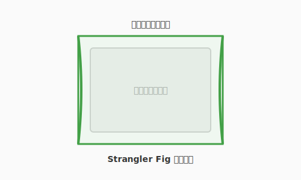

# 3.8 【外伝】失われた古代技術——レガシーコードの考古学


## 導入: 呪われた遺構に足を踏み入れる

熟練したアルケミスト（エンジニア）であれば、避けては通れない冒険があります。それは、数年、時には十数年以上前に書かれ、当時の術者たちが去り、ドキュメントも失われ、しかし今なお組織の心臓部で動き続けている**「古代の術式（レガシーコード）」**の探索です。

それらは、触れた瞬間に崩れ落ちる砂の城のようであり、不用意に書き換えれば未知の災い（意図しないバグ）を振りまく呪いのアイテムのようでもあります。本節では、この「レガシーコード」という名のダンジョンを安全に探索し、現代の光を当てるための考古学的なアプローチを学びます。

---

## 考古学の第一歩：非破壊検査（観察とテスト）

遺跡を重機で壊してはならないように、レガシーコードをいきなり書き換えるのは禁物です。

### 1. 動作の写し（仕様化テスト）
何が正しい動きなのか分からない場合、まずは現在の動きをそのまま「真実」として記録します。これを**仕様化テスト（Characterization Test）**と呼びます。
「なぜこう動くのか」は問わず、「今はこう動いている」という事実をテストコードという形で固定し、セーブポイントを作ります。

### 2. 依存関係の透視
古代の術式は、あちこちの部品が複雑に絡み合っています。
- **Seams（継ぎ目）**: コードを壊さずに挙動を差し替えられる場所を探します。
- **依存の抽出**: 巨大なメイン処理から、少しずつ計算ロジック（純粋関数）を切り出し、外の世界へ救出します。

---

## 復元の作法：絞め殺し植物（Strangler Fig）パターン

巨大な遺跡を一度に改築するのは不可能です。現代の賢者たちは、**Strangler Fig（絞め殺し植物）パターン**という戦術を使います。



1.  **包囲**: 古い術式の周囲に、新しい術式の「殻」を作ります。
2.  **委譲**: 特定の機能だけを、古い術式から新しい術式へと少しずつルーティングを切り替えます。
3.  **置換**: すべての機能が新しくなれば、中心にあった古い術式は自然に消滅します。

これは、システムを止めることなく、生命体を入れ替えるように進化させる高度な錬金術です。

---

## まとめ

1.  **敬意を払う**: レガシーコードは「過去の成功の証」である。当時の制約の中で最善を尽くした術者たちに敬意を払い、慎重に扱う。
2.  **テストという防具**: 触る前に必ずテストで現状を固定する。
3.  **少しずつ光を**: 一度に直そうとせず、関心の分離（3.3節）を適用しながら、小さな「成功の島」を広げていく。

古代の知恵を現代の術式へと昇華させたとき、あなたは真のマスター・アルケミストへと一歩近づくでしょう。

---

## AIへの詠唱例

```prompt
この10年前に書かれたと思われる複雑な関数を分析してください。
1. 入力と出力のパターンを5つ推測し、仕様化テストのコードを書いてください。
2. 他の部品との依存関係が強い箇所を特定し、切り離しのための「継ぎ目」を提案してください。
```
