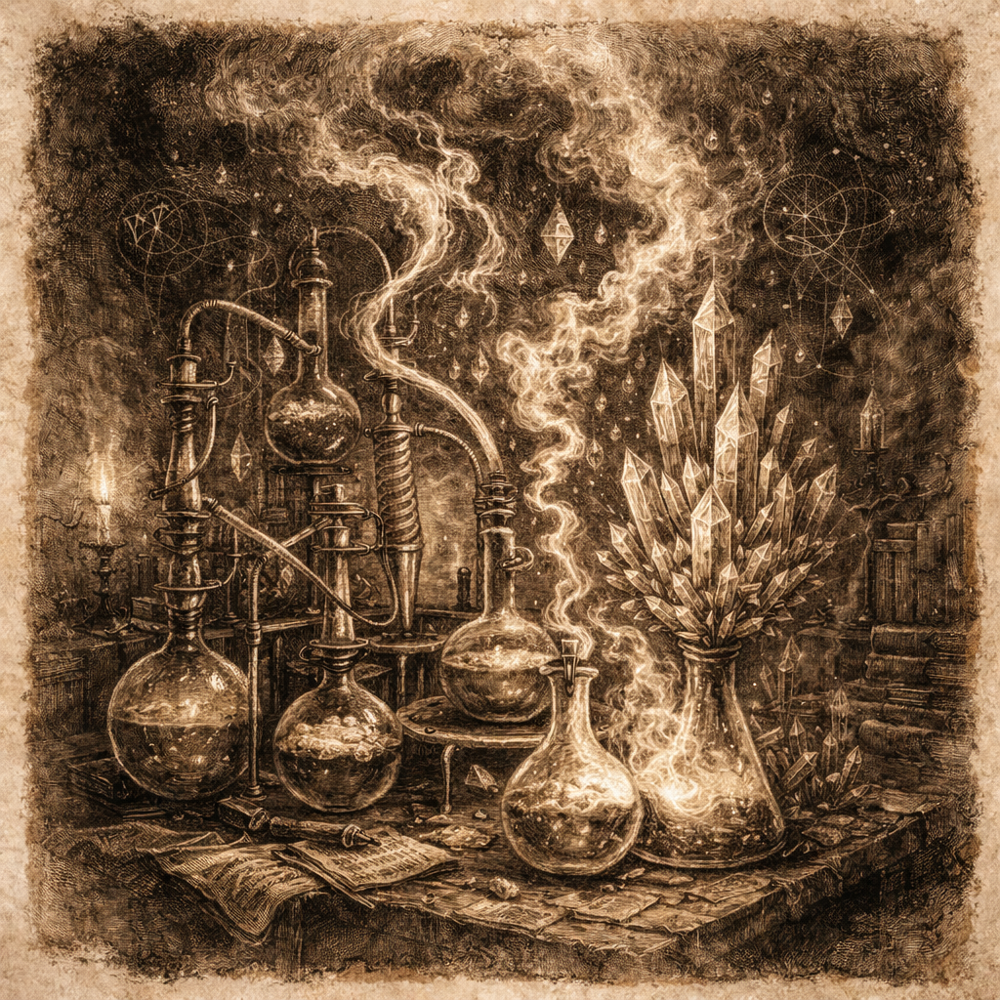
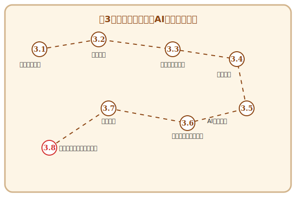

# 第3章 モダン・アルケミー——論理を具現化する実装の技法

## この章で手に入れる力

第2章で「城の設計図（アーキテクチャ）」を描き終えたあなたは、ついに現場での「建築（実装）」に取り組む準備が整いました。

実装とは、抽象的な設計という「魂」を、具象的なコードという「肉体」に宿らせる儀式です。現代のアルケミスト（エンジニア）には、伝統的な計算機科学の知識に加え、AIという強力な「精霊」と共鳴し、爆速で高品質なコードを生み出す技術が求められます。

この章では、**AI駆動の実装技法（Modern Implementation）**を学びます。アルゴリズムという最小単位から、美しく淀みのないロジック、そしてAIへの「詠唱（プロンプト）」による自動生成まで——設計図を動くソフトウェアへと昇華させる力を身につけましょう。

## 冒険の地図

---

## 本章の構成

- **3.1 魔導の元素**：アルゴリズムとデータ構造の本質。
- **3.2 術式の構築**：制御構造と論理の美学、読みやすいコードの紡ぎ方。
- **3.3 術式の器**：関数・クラス・モジュールによる構造化とスコープ管理。
- **3.4 審美眼の錬磨**：メトリクスと静的解析によるコード品質の数値化。
- **3.5 詠唱による具現化**：自律型エージェント（Cline/Gemini等）との共闘作法。
- **3.6 多彩なる魔導体系**：言語の壁を超え、パラダイムの真髄に触れる。
- **3.7 並列詠唱の奥義**：非同期・並行プログラミングで時間の流れを操る。
- **3.8 【外伝】失われた古代技術**：レガシーコードの考古学と解読術。
- **3.9 【外伝】手技の工房**：Skills・MCP・サブエージェントによる使役の拡張。

---

## 読了後のあなた

この章を読み終えると、あなたは以下のことができるようになります。

- **選ぶ**: 目的に応じて最適なアルゴリズムとデータ構造を選択できる
- **書く**: ネストが浅く、誰が見ても意図が伝わる美しい術式を構築できる
- **まとめる**: 関数・クラス・モジュールで処理を適切な粒度に構造化できる
- **評価する**: AIが出力したコードの品質や効率を正しく判断できる
- **使役する**: AIに的確な指示を出し、設計に忠実なコードを生成させられる
- **広げる**: 一つの言語に縛られず、パラダイムを意識した開発ができる
- **操る**: 非同期処理や並行プログラミングで、複数の処理を同時に進められる

設計図に命を吹き込み、動く魔法（ソフトウェア）を創造する旅を始めましょう。

---

## さらに学ぶためのリソース（章全体）

この章のテーマである「実装」という儀式を、一生の仕事として楽しむための心構えと技法が詰まった一冊です。

- 📚 **書籍**: Andrew Hunt, David Thomas『[達人プログラマー 第2版 ―熟達に向けたあなたの旅](https://www.ohmsha.co.jp/book/9784274226298/)』（エンジニアの心構え、技術の習得、そして日々の研鑽。すべてのアルケミストにとっての「北極星」となる名著です）

### 📜 賢者伝説（学術論文）

- 📄 **80s**: Frederick P. Brooks Jr. "[No Silver Bullet — Essence and Accident in Software Engineering](https://ieeexplore.ieee.org/document/1663530)" (1987)（ソフトウェア開発の困難さの本質を説き、「銀の弾丸はない」と断じた必読論文）
- 📄 **10s**: M. Allamanis, E. T. Barr, P. Devanbu, and C. Sutton "[A Survey of Machine Learning for Big Code and Naturalness](https://dl.acm.org/doi/10.1145/3212695)" (2018)（現代のAI駆動開発の技術的背景を整理した重要論文）
- 📄 **20s**: M. Chen et al. "[Evaluating Large Language Models Trained on Code](https://arxiv.org/abs/2107.03374)" (2021)（GitHub Copilotのモデルとなった**OpenAI Codex**の原典論文）
