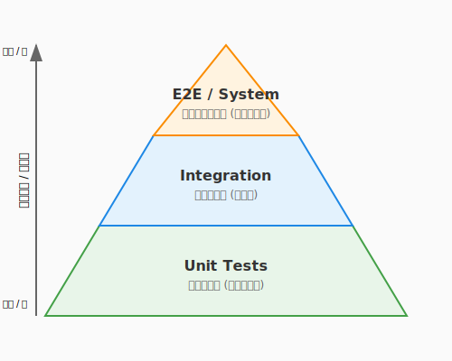
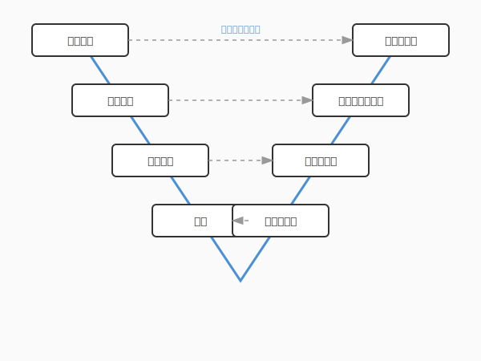

# 4.1 守護魔法の体系——テストの全体像

## 導入: 軍団を組織する前に

第3章で、あなたはコードを実装する技法を学びました。しかし、どれほど丁寧に書いたコードも、明日の変更で壊れないという保証はありません。コードを守り続けるには——それを安心して変え続けるには——**テスト**という守護魔法が必要です。

ここで一つ、心に刻んでおいてほしいことがあります。**「仕様書に書かれている手順をなぞって実行してみるだけでは、それはまだ真の『テスト』とは呼べません」**。

テストとは、単なる「動作確認」ではなく、システムの「脆さ」や「境界線」を積極的に探し出し、意図的に壊そうとする試み——いわば、コードに対する厳格な「鑑定」なのです。AIが瞬時にコードを生成する現代において、そのコードが本当に信頼に値するかを見抜くあなたの鑑定眼こそが、品質の最後の砦となります。

本節ではまず、テストの全体像——**何を、どの粒度で、どうテストするのか**——という地図を手に入れます。地図なき軍団は烏合の衆ですが、地図を持った軍団は無敵です。

---

## テストレベル: 4つの防衛圏

テストには「どの範囲を検証するか」に応じた**レベル**があります。小さい範囲から大きい範囲へ、4つの防衛圏として整理できます。

| レベル | 検証対象 | 誰が担当するか | 速度 |
|--------|---------|---------------|------|
| **単体テスト（Unit Test）** | 関数・メソッド単体 | 開発者 | 非常に速い |
| **結合テスト（Integration Test）** | 複数のコンポーネントの連携 | 開発者 | やや遅い |
| **システムテスト（System Test）** | システム全体の動作 | QAチーム / 開発者 | 遅い |
| **受入テスト（Acceptance Test）** | ユーザーの要求を満たしているか | 顧客 / プロダクトオーナー | 遅い |

### 単体テスト（Unit Test）

最も小さな粒度のテストです。一つの関数やメソッドが、期待通りに動くかを確認します。

```python
# QuestForge: 経験値計算の単体テスト
import unittest

class TestXpCalculation(unittest.TestCase):
    def test_hard_quest_gives_double_xp_for_low_level_hero(self):
        quest = Quest(title="Dragon Slayer", difficulty="HARD", base_xp=100,
                      recommended_level=10)
        hero = Hero(name="Aria", level=3)

        result = calculate_quest_xp(quest, hero)

        self.assertEqual(result, 200)  # 100 * 2.0

    def test_normal_quest_gives_base_xp(self):
        quest = Quest(title="Herb Gathering", difficulty="NORMAL", base_xp=50,
                      recommended_level=1)
        hero = Hero(name="Aria", level=5)

        result = calculate_quest_xp(quest, hero)

        self.assertEqual(result, 50)
```

単体テストは数ミリ秒で完了し、何百回でも気軽に実行できます。これが守護魔法の最前線です。

### 結合テスト（Integration Test）

複数のコンポーネントが正しく**連携**できるかを検証します。「関数単体は正しいのに、組み合わせると動かない」という状況を防ぎます。

```python
# QuestForge: ユースケース + リポジトリの結合テスト
class TestCompleteQuestIntegration(unittest.TestCase):
    def test_completing_quest_updates_hero_xp(self):
        # 実際のリポジトリ（インメモリ実装）を使う
        quest_repo = InMemoryQuestRepository()
        hero_repo = InMemoryHeroRepository()

        quest = Quest(title="Forest Patrol", difficulty="NORMAL", base_xp=80,
                      recommended_level=1)
        hero = Hero(name="Kai", level=5)
        quest_repo.save(quest)
        hero_repo.save(hero)

        use_case = CompleteQuestUseCase(quest_repo, hero_repo)
        use_case.execute(quest.id, hero.id)

        updated_hero = hero_repo.find_by_id(hero.id)
        self.assertEqual(updated_hero.xp, 80)
```

### システムテスト / 受入テスト

システム全体を通して、ユーザーの視点で「仕様通りに動くか」を検証します。受入テストは、第1章で定義した要求やユースケースが満たされているかを確認するテストでもあります。要求の定義（1章）からテストの検証（4章）まで、本書全体が一つの開発サイクルとして繋がっています。

---

## テストピラミッド: 理想的な軍団編成

テストレベルごとに「どれくらいの数を書くべきか」を示したのが**テストピラミッド**です。



| 層 | 特徴 | 目安 |
|----|------|------|
| **上層（E2E / System）** | 遅い・壊れやすいが、ユーザー体験を直接検証 | 全体の10〜20% |
| **中層（Integration）** | コンポーネント連携の整合性を確認 | 全体の20〜30% |
| **下層（Unit）** | 速い・安定・大量に書ける | 全体の50〜70% |

ピラミッドの形が逆さま（上層ばかり多い）になると、テストの実行に時間がかかり、原因の特定にも手間が増えます。**土台（単体テスト）を厚く、頂点（E2E）は薄く**が、効率的な軍団編成の原則です。

---

## V字モデル: 開発工程とテストの対応

ソフトウェアエンジニアリングには、開発の各工程と対応するテストレベルを示す**V字モデル**という考え方があります。



左側で「何を作るか」を決め、右側で「正しく作れたか」を検証します。

V字の同じ高さにある工程とテストが対応しているのがポイントです。

- **要求定義**で書いた仕様は → **受入テスト**で検証する
- **基本設計**で決めた構造は → **システムテスト**で検証する
- **詳細設計**で決めた連携は → **結合テスト**で検証する
- **実装**した関数/クラスは → **単体テスト**で検証する

---

## テストダブル: 依存を切り離す技法

単体テストで「データベースに保存する処理」をテストしたいとき、本物のデータベースを用意するのは大変です。そこで使うのが**テストダブル（Test Double）**——本物の代わりに使う「影武者」です。

| 種類 | 役割 | 用途 |
|------|------|------|
| **スタブ（Stub）** | 固定値を返す替え玉 | 「リポジトリから常にこのデータを返す」 |
| **モック（Mock）** | 呼び出されたかを検証する替え玉 | 「save()が1回呼ばれたことを確認する」 |
| **スパイ（Spy）** | 本物の処理を実行しつつ記録する | 「実際に動かし、呼び出し回数も数える」 |

```python
# スタブの例: 常に特定のクエストを返すリポジトリ
class StubQuestRepository:
    def find_by_id(self, quest_id: str) -> Quest:
        return Quest(title="Stub Quest", difficulty="NORMAL",
                     base_xp=100, recommended_level=1)

# モックの例: save()が呼ばれたかを検証
from unittest.mock import MagicMock

def test_complete_quest_saves_result():
    mock_repo = MagicMock()
    quest = Quest(title="Test", difficulty="NORMAL", base_xp=50,
                  recommended_level=1)
    mock_repo.find_by_id.return_value = quest

    use_case = CompleteQuestUseCase(mock_repo, hero_repo)
    use_case.execute(quest.id, hero.id)

    mock_repo.save.assert_called_once()  # save()が1回呼ばれたことを確認
```

テストダブルを使うことで、データベースやネットワークなどの外部依存を切り離し、高速で安定した単体テストが書けます。第2章で学んだ「依存性の逆転（DIP）」が、ここで実践的に活きてきます。インターフェース（抽象）に依存する設計だからこそ、本物と影武者を自在に差し替えられるのです。

---

## まとめ

1. **テストレベル**は4段階: 単体→結合→システム→受入。それぞれが異なる粒度でコードの正しさを保証する。
2. **テストピラミッド**で量のバランスを取る: 土台（単体テスト）を厚く、頂点（E2E）は薄く。
3. **V字モデル**で開発工程とテストを対応づける: 要求定義には受入テスト、実装には単体テスト。
4. **テストダブル**で外部依存を切り離す: stub/mock/spyを使い分け、高速で安定したテストを実現する。

---

## AIへの詠唱例

```
以下のクラスの単体テストを書いてください。
外部依存（リポジトリ）はモックに差し替え、以下のケースをテストしてください：
1. 正常系: クエスト完了時に経験値が加算される
2. 異常系: 存在しないクエストIDを指定した場合
[コードを貼り付け]
```

```
このプロジェクトのテストピラミッドを分析してください。
単体テスト、結合テスト、E2Eテストの比率を数え、
理想的なピラミッドとの乖離を指摘してください。
```

---

**執筆メモ**:
- 執筆日時: 2026-02-01
- 構成: テストの全体像を「地図」として最初に提示。以降の節の前提知識。
- 接続: 1章（要求定義）→4章（受入テスト）、2章（DIP）→テストダブル、5章（リファクタリング）→テストの安全網

---

## さらに学ぶためのリソース

- 🌐 **Web**: [JSTQB 認定テスト技術者資格](https://jstqb.jp/)（国際的なソフトウェアテスト資格。シラバスにはテストの基礎用語と体系が凝縮されています）
- 🌐 **Web**: Martin Fowler "[The Test Pyramid](https://martinfowler.com/articles/practical-test-pyramid.html)"（テストピラミッドの概念を世に広めた、実践的なテスト戦略の解説）
- 📚 **書籍**: 小川秀人、佐藤陽春、森拓郎、加賀洋渡『[土台からしっかり学ぶ ソフトウェアテストのセオリー](https://www.ric.co.jp/book/contents/pdfs/1314_introduction.pdf)』（テストの全体像を初心者にも分かりやすく解説した良書）
