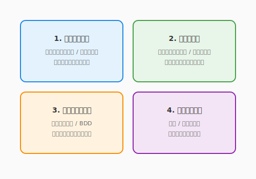

# 4.2 鑑定術の技法——テスト設計の4つの流派

テストの全体像（4.1節）を学んだあなたは、次にこう問うはずです。「具体的に、**どのテストケースを書けば十分なのか？**」

すべての入力パターンをテストするのは不可能です。経験値の計算関数ひとつとっても、整数の入力パターンは事実上無限にあります。では、「十分なテスト」とはどう設計すればよいのでしょうか？

先人たちは、この問いに対して複数のアプローチを編み出しました。本節では、テストケースの設計技法を**4つの流派**として整理し、それぞれの強みと適所を学びます。

次の図は、テストケース設計における4つの流派とそれぞれの着眼点を示しています。



ここで示された4流派は、互いに補完し合う関係にあります。コードの内部を見る「コードベース（ホワイトボックス）」、仕様から設計する「仕様ベース（ブラックボックス）」、ユーザーの物語を辿る「シナリオベース」、そして即興で探索する「探索的テスト」——この4つを問いの性質に応じて使い分けることが、テストという守護魔法を真に強化する道です。

---

## 第1の流派: コードベース（ホワイトボックス）

### カバレッジ: テストされていない場所の地図

コードの内部構造を見て、「どの行が実行されたか」「どの分岐が通過したか」を測定するアプローチです。テスト自体を設計する技法というよりも、**テストが不十分な場所を発見する地図**として機能します。

#### 命令カバレッジ（Statement Coverage）

「すべての行が少なくとも1回実行されたか」を測定します。

```python
def get_quest_rank(score: int) -> str:
    if score >= 90:          # 行A
        return "S"           # 行B
    elif score >= 70:        # 行C
        return "A"           # 行D
    else:
        return "B"           # 行E
```

`score=95` と `score=75` の2つのテストで、行A〜Dは実行されますが、行Eは通過しません。命令カバレッジは **4/5 = 80%** です。`score=50` を追加すれば100%に達します。

命令カバレッジをクリアしても、条件分岐の片方だけしか試されていない可能性があります。より厳密な視点が次の基準です。

#### 分岐カバレッジ（Branch Coverage）

「すべての条件分岐のTrue/Falseが実行されたか」を測定します。命令カバレッジよりも厳しい基準です。

```python
def can_accept_quest(hero: Hero, quest: Quest) -> bool:
    if hero.level >= quest.required_level and not quest.is_expired():
        return True    # 分岐: True
    return False       # 分岐: False
```

| テスト | hero.level >= required | not is_expired() | 結果 | 通過する分岐 |
|--------|----------------------|-------------------|------|-------------|
| テスト1 | True | True | True | True分岐 |
| テスト2 | False | True | False | False分岐 |

この2つのテストで分岐カバレッジは100%です。しかし、`hero.level >= required` がTrueで `is_expired()` がTrueのケース（期限切れ）はテストされていません。

複合条件の各部分が独立してTrue/Falseの両方を取るかまで確かめるには、さらに一段階厳しい基準が必要です。

#### 条件カバレッジ（Condition Coverage）

複合条件（`and` / `or`）の各部分がTrue/Falseの両方を取ったかを測定します。分岐カバレッジよりもさらに厳密です。

| テスト | hero.level >= required | not is_expired() | 結果 |
|--------|----------------------|-------------------|------|
| テスト1 | True | True | True |
| テスト2 | True | False | False |
| テスト3 | False | True | False |

3つのテストで、各条件がTrue/Falseの両方を取ることを確認できます。

では、これら3種類のカバレッジをすべて満たせば、品質は保証されるのでしょうか。実は、そうではありません。

#### カバレッジの限界

カバレッジ100%は「すべてのコードが実行された」ことを意味しますが、「正しく動いている」ことの証明ではありません。

```python
# カバレッジ100%でも見逃すバグの例
def calculate_tax(price: int) -> int:
    return price * 0.1  # 本来は0.08のはずだが...

def test_tax():
    assert calculate_tax(1000) == 100  # テストは通る。しかし税率が間違っている！
```

カバレッジは**「テストされていない場所」を見つけるための地図**であり、品質の十分条件ではありません。「カバレッジが高い＝テストが十分」ではなく、「カバレッジが低い＝テストが不十分な場所がある」と読むのが正しい使い方です。

---

## 第2の流派: 仕様ベース（ブラックボックス）

コードの内部構造を見る第1の流派に対し、第2の流派はコードの中身を一切見ません。仕様書と期待される振る舞いだけを手がかりに、テストケースを設計します。

### 同値分割: 入力の「代表選手」を選ぶ

コードの中身を見ずに、**仕様（入力と期待出力の関係）**に基づいてテストケースを設計する技法です。

同値分割では、入力を「同じ振る舞いをするはずのグループ（同値クラス）」に分け、各グループから**代表値を1つずつ**選んでテストします。

**例: QuestForgeの経験値倍率計算**

仕様: 「英雄のレベルがクエスト推奨レベル未満なら倍率2.0、以上なら倍率1.0」（推奨レベル = 10）

| 同値クラス | 入力範囲 | 代表値 | 期待される倍率 |
|-----------|---------|--------|--------------|
| **有効クラス1**: レベル不足 | 1〜9 | 5 | 2.0 |
| **有効クラス2**: レベル十分 | 10〜100 | 15 | 1.0 |
| **無効クラス1**: レベルゼロ以下 | 0, -1, ... | 0 | エラー or 特別処理 |

```python
class TestXpMultiplier(unittest.TestCase):
    def test_low_level_hero_gets_double(self):
        # 有効クラス1の代表値
        self.assertEqual(calculate_xp_multiplier(quest_lv10, hero_lv5), 2.0)

    def test_high_level_hero_gets_normal(self):
        # 有効クラス2の代表値
        self.assertEqual(calculate_xp_multiplier(quest_lv10, hero_lv15), 1.0)

    def test_zero_level_raises_error(self):
        # 無効クラスの代表値
        with self.assertRaises(ValueError):
            calculate_xp_multiplier(quest_lv10, hero_lv0)
```

同値分割で「クラスの代表値」を選んだとして、クラスの境目そのものには何が潜んでいるのでしょうか。バグが最も集まりやすい場所がそこです。

### 境界値分析: 境界線上を狙い撃つ

バグは「境界」に集まる傾向があります。境界値分析では、同値クラスの**境目の値**を重点的にテストします。

推奨レベル10の場合:

| テストケース | 値 | 意味 |
|-------------|-----|------|
| 境界の直下 | 9 | レベル不足の最大値 |
| 境界そのもの | 10 | 境界値（どちらに属する？） |
| 境界の直上 | 11 | レベル十分の最小値 |

```python
class TestXpMultiplierBoundary(unittest.TestCase):
    def test_one_below_threshold(self):
        self.assertEqual(calculate_xp_multiplier(quest_lv10, hero_lv9), 2.0)

    def test_at_threshold(self):
        # ここがバグの温床。「未満」なので10は倍率1.0のはず
        self.assertEqual(calculate_xp_multiplier(quest_lv10, hero_lv10), 1.0)

    def test_one_above_threshold(self):
        self.assertEqual(calculate_xp_multiplier(quest_lv10, hero_lv11), 1.0)
```

「未満」と「以下」の取り違え、`<` と `<=` の混同——こうしたバグは境界値分析で効率的に発見できます。

---

## 第3の流派: シナリオベース

### ユーザーの物語をテストにする

ユーザーが実際にシステムを使う**一連の流れ（シナリオ）**をテストケースとして記述する技法です。第1章で書いたユースケースが、ここでテストの根拠になります。

```python
class TestQuestCompletionScenario(unittest.TestCase):
    def test_hero_completes_quest_and_levels_up(self):
        """シナリオ: 英雄がクエストを完了し、レベルアップする"""
        # Given: レベル1の英雄と、報酬100XPのクエスト
        hero = Hero(name="Aria", level=1)
        quest = Quest(title="First Adventure", difficulty="NORMAL",
                      base_xp=100, recommended_level=1)

        # When: クエストを完了する
        result = complete_quest(quest, hero)

        # Then: 経験値が加算され、レベルアップしている
        self.assertEqual(result.xp_gained, 100)
        self.assertEqual(hero.level, 2)  # 100XPでレベル2に
        self.assertEqual(quest.status, "COMPLETED")
```

**Given（前提）→ When（操作）→ Then（期待結果）** の形式で書くと、テストが「仕様書」としても読めるようになります。この形式は**BDD（振る舞い駆動開発）**とも呼ばれ、非エンジニアとの共通言語にもなります。

---

## 第4の流派: 探索的テスト

### 仕様書に縛られない即興テスト

ここまでの3つの流派は、いずれもテストケースを**事前に設計**します。一方、探索的テストは、実際にソフトウェアを動かしながら「怪しいところはないか？」と探り、**発見と学習を同時に行う**即興的なアプローチです。

#### チャーターとセッション

無目的に触るのではなく、**チャーター（探索テーマ）**を定め、時間を区切った**セッション**で行います。

```
チャーター: 「クエスト報酬計算で、極端な入力値を試す」
時間: 30分
探索メモ:
- レベル999の英雄 → 正常に動作
- 難易度を空文字に → 500エラー（バグ発見！）
- 報酬XPに負の値 → 経験値が減る（仕様漏れ？）
```

探索的テストは、仕様書やコードカバレッジでは見つけられない「想定外の使い方」を発見するのに効果的です。自動化されたテストと組み合わせることで、守りの層がさらに厚くなります。

---

## 4つの流派を組み合わせる

各流派には得意・不得意があります。一つの流派だけに頼るのではなく、組み合わせてテストの網を編みます。

| 流派 | 強み | 適所 |
|------|------|------|
| **コードベース** | テストの抜け漏れを可視化 | カバレッジ計測、リグレッション防止 |
| **仕様ベース** | 仕様から体系的にケースを導出 | 入力パターンの網羅、境界値のバグ検出 |
| **シナリオベース** | ユーザー視点の動作保証 | 受入テスト、チーム内の仕様共有 |
| **探索的テスト** | 想定外のバグ発見 | リリース前の最終確認、新機能の品質探索 |

---

## まとめ

テスト設計の4つの流派は互いに補完し合います。コードベースのカバレッジはテストされていない場所を地図として示し、不十分な箇所の発見に役立ちます（100%が目的ではありません）。仕様ベースの同値分割・境界値分析は入力空間を効率的に分割し、代表値と境界を狙い撃てます。

シナリオベースのGiven-When-Then形式はユーザーの物語をテストに変換し、仕様書としても機能する優れた表現力を持ちます。そして探索的テストは仕様書にない「想定外」を即興で発見する、自動テストとの補完関係にある技法です。この4つを問いの性質に応じて使い分けることで、テストは単なる動作確認を超えた「生きた仕様書」へと昇華します。

次の4.3節では、テストを「後から書く検証」から「先に書く設計ツール」に転換するテスト駆動開発（TDD）を学びます。赤から緑へのサイクルが、コードの設計品質をどう変えるかを体感していきましょう。

---

## AIへの詠唱例

### IDE統合型：同値分割・境界値でテストケースを設計

```
@domain/hero.py の gain_xp() メソッドを読んで、以下を行ってください。

1. 同値分割と境界値分析を実施し、テストケース一覧を表形式で提示
   （「有効クラス/無効クラス」「境界値」のラベル付き）
2. 設計したテストケースを pytest 形式でコード化する
```

### CLIエージェント型：カバレッジ未到達分岐の補強

```
domain/ のコードと tests/unit/ のテストを読み比べて、
分岐カバレッジ100%を達成するために必要な追加テストを特定してください。

出力：
- カバーされていない分岐の一覧（ファイル名・行番号・条件）
- 各分岐をカバーするテストの説明
- pytest 形式の追加テストコード
```

---

**執筆メモ**:
- 執筆日時: 2026-02-01
- 構成: テスト設計技法を4流派で整理。伝統的技法（カバレッジ、同値分割、境界値）とモダンな技法（探索的テスト）を併置
- 接続: 4.1（テストレベル）の上に「どうテストケースを設計するか」を積む。4.4（AIテスト生成）ではこれらの技法をAIに適用させる

---

## さらに学ぶためのリソース

- 🌐 **ツール**: [pytest 公式ドキュメント](https://docs.pytest.org/)（Pythonで最も使われている、シンプルかつ強力なテストフレームワーク）
- 🌐 **ツール**: [JUnit 5 User Guide](https://junit.org/junit5/docs/current/user-guide/)（Javaにおける単体テストの標準。4.2節の思想の原点です）
- 📚 **書籍**: 浜井和夫、大岩隆司『[はじめてのユニットテスト ―失敗しないための実践的なテストコード](https://www.amazon.co.jp/dp/477418290X)』（テストコードを「負債」にせず、開発の助けにするための知恵）
- 🌐 **Web**: [Nielsen Norman Group "Exploratory Testing"](https://www.nngroup.com/articles/exploratory-testing/)（探索的テストの概念と、UXリサーチにおける位置づけ。英語）
