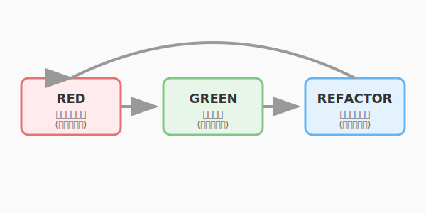

# 4.3 赤から緑へ——テスト駆動開発のリズム

ここまで、テストの全体像（4.1節）とテスト設計の技法（4.2節）を学びました。しかし、これらはいずれも「コードを書いた後にテストを書く」という前提に立っています。

**テスト駆動開発（TDD: Test-Driven Development）**は、この順序を逆転させます。まずテストを書き、そのテストを通すためにコードを書く。この単純な逆転が、開発のリズムと品質を劇的に変えます。

TDDの生みの親であるKent Beckはこう述べています。「テストを先に書くことで、設計について考えることを強制される」と。テストは検証の道具であるだけでなく、**設計を駆動するエンジン**でもあるのです。

---

## Red-Green-Refactor: 3つのフェーズ

TDDは、3つのフェーズを短いサイクルで繰り返します。

次の図は、TDDのRed-Green-Refactorサイクルを示しています。



ここで表現されているのは、単純に見えて奥深いサイクルです。「赤（Red）→緑（Green）→磨く（Refactor）」のリズムを短いサイクルで繰り返すことで、コードは常に動作が保証された状態で少しずつ改善され続けます。テストを先に書くことでインターフェース設計を強制し、Refactorフェーズでは安全網としてのテストが大胆な改善を支えます。

### 1. Red: まずテストを書く（失敗させる）

まだ実装のない状態で、「こう動いてほしい」というテストを書きます。実行すると当然失敗します（赤）。

```python
# Red: まずテストを書く
class TestCompleteQuest(unittest.TestCase):
    def test_completing_quest_changes_status(self):
        quest = Quest(title="Goblin Hunt", difficulty="NORMAL",
                      base_xp=50, recommended_level=1)

        quest.complete()

        self.assertEqual(quest.status, "COMPLETED")
```

この時点では `Quest.complete()` メソッドは存在しません。テストは `AttributeError` で失敗します。

### 2. Green: テストを通す最小限の実装

テストを通すために、**最小限の**コードを書きます。美しさは後回し。まずは動くことが最優先です。

```python
# Green: テストを通す最小限の実装
class Quest:
    def __init__(self, title: str, difficulty: str, base_xp: int,
                 recommended_level: int):
        self.title = title
        self.difficulty = difficulty
        self.base_xp = base_xp
        self.recommended_level = recommended_level
        self.status = "AVAILABLE"

    def complete(self):
        self.status = "COMPLETED"
```

テストが通ります（緑）。

### 3. Refactor: テストが緑のまま、きれいにする

テストという安全網があるので、安心してコードを磨けます。第5章で学ぶリファクタリングの技法が、ここで活きます。

```python
# Refactor: ガード節を追加して堅牢にする
class Quest:
    # ...

    def complete(self):
        if self.status != "AVAILABLE":
            raise InvalidQuestStateError(
                f"Cannot complete quest in '{self.status}' state"
            )
        self.status = "COMPLETED"
```

リファクタリング後もテストが緑であることを確認します。壊れていればすぐに気づけます。

---

## QuestForge実践: クエスト完了をTDDで作る

より実践的な例として、「クエストを完了し、経験値を付与する」ユースケースをTDDで段階的に構築してみましょう。

### サイクル1: クエスト完了でステータスが変わる

```python
# Red
def test_completing_quest_changes_status_to_completed(self):
    quest = Quest("Herb Gathering", "NORMAL", base_xp=30, recommended_level=1)
    quest.complete()
    self.assertEqual(quest.status, "COMPLETED")

# Green → 上記の実装で通る
```

### サイクル2: 完了済みクエストは再完了できない

```python
# Red
def test_cannot_complete_already_completed_quest(self):
    quest = Quest("Herb Gathering", "NORMAL", base_xp=30, recommended_level=1)
    quest.complete()
    with self.assertRaises(InvalidQuestStateError):
        quest.complete()  # 2回目は失敗するはず

# Green → ガード節を追加（上のRefactorで実装済み）
```

### サイクル3: 完了時に経験値を計算する

```python
# Red
def test_completing_quest_returns_xp_reward(self):
    quest = Quest("Dragon Slayer", "HARD", base_xp=100, recommended_level=10)
    hero = Hero("Aria", level=5)

    result = quest.complete_with_reward(hero)

    self.assertEqual(result.xp_gained, 200)  # HARD + 低レベル → 2倍

# Green
class Quest:
    def complete_with_reward(self, hero: Hero) -> CompletionResult:
        if self.status != "AVAILABLE":
            raise InvalidQuestStateError(...)
        self.status = "COMPLETED"
        xp = calculate_quest_xp(self, hero)
        hero.gain_xp(xp)
        return CompletionResult(quest=self, xp_gained=xp)
```

このように、小さなテストを一つずつ追加しながら、実装を**漸進的に成長させていく**のがTDDのリズムです。

---

## TDDがもたらすもの

### 設計への効果

テストを先に書くと、「このクラスを外部からどう使いたいか」を最初に考えることになります。つまり、TDDは**インターフェース設計を強制する仕組み**です。

- テストしにくい設計 → 依存が密結合している証拠 → 設計を見直す
- テストしやすい設計 → 責任が明確で疎結合 → 良い設計

### リファクタリングとの接続

第5章との関係が明確になります。TDDの3番目のフェーズ「Refactor」は、**テストという安全網があるからこそ安心して行える**のです。第5章で学ぶリファクタリングにおいて「テストが不可欠」である理由が、ここで具体的に体験できます。

---

## TDDの適所

TDDはすべての場面に適するわけではありません。

| 場面 | TDDの効果 |
|------|----------|
| **ドメインロジック**（計算、ルール） | 高い。入出力が明確でテストしやすい |
| **アルゴリズム実装** | 高い。段階的に正しさを確認できる |
| **UIレイアウト** | 低い。見た目の正解は数値で表現しにくい |
| **プロトタイピング** | 低い。仕様が固まっていない段階では足かせになりうる |
| **外部APIとの連携** | 中程度。テストダブルとの組み合わせで可能 |

QuestForgeのようなドメインロジック中心のアプリケーションは、TDDの威力が最も発揮される領域です。

---

## まとめ

Red-Green-Refactorというリズムは、テスト駆動開発の核心です。テストを先に書き（Red）、最小限の実装で通し（Green）、安全にリファクタリングする（Refactor）——この3フェーズのサイクルを回すことで、コードは常に動作が保証された状態で磨かれ続けます。そして、テストを先に書くという行為自体が、インターフェース設計と責任の分離を自然に促す設計ツールとして機能します。

TDDで書いたテストは、第5章で学ぶリファクタリングを安心して行うための安全網にもなります。「変えても壊れていない」という確信があるからこそ、大胆な改善が可能になるのです。ドメインロジックやアルゴリズムにこそTDDの威力は最大限に発揮されます。

次の4.4節では、AIが「刺客」として積極的にテストケースを生成する技法を学びます。プロパティベーステストやミューテーションテストといった手法で、人間が書くテストでは気づきにくい弱点を発見していきましょう。

---

## AIへの詠唱例

### 仕様からTDDで新機能を実装

```
QuestForgeに「パーティ編成」機能を TDD で実装してください。

仕様：
- パーティは最大4人
- 同じ英雄を重複して追加できない
- パーティリーダーは最もレベルの高い英雄が自動的に選ばれる

進め方（Red-Green-Refactor を順守）：
1. Red: 失敗するテストを1つ書く
2. Green: そのテストだけをパスさせる最小限の実装を書く
3. Refactor: domain/ の既存クラスと整合性を保ちながら整理する
4. 1〜3 を繰り返し、すべての仕様をカバーする

各ステップで「テストコード」と「実装コード」を分けて提示してください。
```

### CLIエージェント型：次に書くべきテストの特定

```
domain/quest.py と tests/unit/test_quest.py を読んで、
TDD の観点から「次に書くべきテストケース」を3つ提案してください。

選定基準：
- 現在のテストでカバーされていない振る舞い
- バグが潜みやすい境界条件
- 仕様変更時にリグレッションを検知できるケース

各提案に、テストコードと「なぜこのテストが重要か」の説明を添えてください。
```

---

**執筆メモ**:
- 執筆日時: 2026-02-01
- 構成: Red-Green-Refactorの基本→QuestForge実践→TDDの効果と適所
- 接続: 5章（リファクタリングの安全網）→4.3（TDD）→4.4（AIがテストを生成）

---

## さらに学ぶためのリソース

- 📚 **書籍**: Kent Beck『[テスト駆動開発](https://www.ohmsha.co.jp/book/9784274066921/)』（TDDの生みの親による原典。第1部の多通貨の実装例は必読です）
- 📚 **書籍**: 和田 卓人『[テスト駆動開発の定義：アジャイルな設計、リファクタリング、そしてエンジニアとしての誇り](https://tatsu-zine.com/books/tdd-definition)』（TDDの真髄を日本の第一人者が解説した一冊）
- 🌐 **Web**: [TDD Manifesto](https://www.jamesshore.com/v2/blog/2021/tdd-manifesto)（TDDの価値観を整理したマニフェスト。英語）
