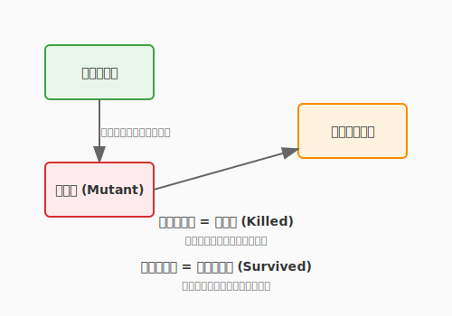

# 4.4 AIが放つ刺客——テストの自動生成と拡張

4.2節でテスト設計の技法を、4.3節でTDDのリズムを学びました。しかし、人間の想像力には限界があります。「自分が書いたコードの弱点」は、書いた本人にとって最も見えにくいものです。

ここでAIの出番です。AIに**「このコードを壊すテストを書いて」**と依頼すると、あなたが想定しなかったエッジケースや境界条件を突いてきます。まるで優秀な刺客を雇い、自分の城の守りを試すように——本気で攻めてくる相手がいるからこそ、守りはより堅固になります。

AIをテストの**攻撃側**に回す——そのとき、コードの堅牢性はどこまで高まるのでしょうか。

次の図は、ミューテーションテストの仕組みを示しています。



ここで示されているのは、コードに小さな「変異（ミュータント）」を注入し、テストがその変異を検知できるかどうかを確認するプロセスです。テストが変異を「殺す（kill）」ことができれば、そのテストは有効であることが証明されます。逆に変異が「生き残る（survive）」場合は、カバレッジが高くてもテストに穴があることを意味します。

---

## AIによるテストケース生成

### 基本の詠唱: 実装からテストを生成する

最もシンプルな使い方は、実装コードをAIに渡してテストを生成させることです。

```
@domain/quest.py の calculate_quest_xp 関数を読んで、
unittestを使った包括的なテストスイートを生成してください。
正常系、異常系、境界値のテストケースを含めてください。
```

AIは4.2節で学んだ技法——同値分割、境界値分析——を自動的に適用し、テストケースを生成します。

### AIならではの視点でケースを広げる

AIが特に力を発揮するのは、**人間が気づきにくい観点**からのテストケース発見です。

```
@domain/hero.py と @domain/quest.py を読んで、
開発者が気づきにくいエッジケースを5つ挙げ、
それぞれのテストコードを書いてください。
特に以下の観点に注目してください：
- 空のコレクション、Noneの入力
- 整数のオーバーフロー
- 並行実行時の競合
- 文字列のエンコーディング
```

AIが見つけてくる「刺客」の例:

| 刺客（テストケース） | 狙いどころ |
|-------------------|-----------|
| 経験値が `int` の最大値を超える | 整数オーバーフロー |
| クエストのタイトルが空文字 | 入力検証の漏れ |
| 報酬XPが負の値 | 仕様の曖昧な領域 |
| 同時に2人の英雄が同じクエストを完了 | 並行処理の競合 |

---

## プロパティベーステスト: 性質で攻める

従来のテストは「入力Aに対して出力Bであること」を**個別に**検証します。プロパティベーステストは発想が異なり、「**任意の入力に対して常に成り立つ性質**」を定義し、大量のランダム入力で検証します。

### QuestForgeでの例

「経験値報酬は常に0以上である」という性質をテストしてみましょう。

```python
from hypothesis import given, strategies as st

@given(
    base_xp=st.integers(min_value=0, max_value=10000),
    hero_level=st.integers(min_value=1, max_value=100),
    quest_level=st.integers(min_value=1, max_value=100),
)
def test_xp_reward_is_always_non_negative(base_xp, hero_level, quest_level):
    quest = Quest("Random", "HARD", base_xp=base_xp,
                  recommended_level=quest_level)
    hero = Hero("Test", level=hero_level)

    result = calculate_quest_xp(quest, hero)

    assert result >= 0  # どんな入力でも経験値は0以上
```

Hypothesisライブラリは、この性質を何百もの**ランダムな入力の組み合わせ**で検証します。もし反例が見つかれば、失敗する最小の入力を自動的に絞り込んで報告してくれます。

### 有効なプロパティの例

| プロパティ | 検証内容 |
|-----------|---------|
| 冪等性 | `complete()` を2回呼んでも状態は1回目と同じ |
| 可逆性 | エンコードしたものをデコードすると元に戻る |
| 不変条件 | ソート後もリストの長さと要素の集合は変わらない |
| 単調性 | レベルが高いほど、必要経験値は多くなる |
| 整合性 | 報酬の合計は、個別報酬の和と一致する |

---

## ミューテーションテスト: テストの強度を測る

4.2節で「カバレッジ100%でも品質は保証されない」と学びました。では、テストスイート自体の**強さ**をどう測るのでしょうか？

**ミューテーションテスト**は、コードに小さな**変異（ミュータント）**を注入し、テストがその変異を検知できるかを確認する技法です。

### 仕組み

```python
# 元のコード
def calculate_xp_multiplier(quest, hero):
    if hero.level < quest.recommended_level:
        return 2.0
    return 1.0

# ミュータント1: < を <= に変異
def calculate_xp_multiplier(quest, hero):
    if hero.level <= quest.recommended_level:  # 変異！
        return 2.0
    return 1.0

# ミュータント2: 2.0 を 1.0 に変異
def calculate_xp_multiplier(quest, hero):
    if hero.level < quest.recommended_level:
        return 1.0  # 変異！
    return 1.0
```

- テストがミュータントを検知（テスト失敗）→ **殺した（killed）** → テストは有効
- テストがミュータントを見逃す（テスト成功）→ **生き残った（survived）** → テストに穴がある

**ミューテーションスコア** = 殺したミュータント数 / 全ミュータント数

スコアが低ければ、カバレッジが高くても「テストが甘い」ことがわかります。

### ツール

| 言語 | ツール | 特徴 |
|------|--------|------|
| Python | mutmut | Python特化、使いやすい |
| JavaScript | Stryker | 豊富なミュータント演算子 |
| Java | PIT (pitest) | 高速、Maven/Gradle連携 |

```bash
# Pythonでのミューテーションテスト実行例
pip install mutmut
mutmut run --paths-to-mutate=src/
mutmut results
```

---

> **コラム: 形式的仕様記述——さらに厳密な守りへ**
>
> プロパティベーステストは「多数の具体的な入力」で性質を検証しますが、**形式的仕様記述**はさらに一歩進み、仕様を**数学的に記述**して網羅的に検証します。
>
> **Alloy**: 集合と関係でモデルを記述し、反例を自動探索する軽量形式手法。「この設計にデッドロックは存在するか？」を数学的に確認できます。
>
> **TLA+**: 状態遷移を時相論理で記述。Amazon Web Servicesが分散システムの設計検証に実戦投入したことで注目を集めました。
>
> これらは学習コストが高いものの、ミッションクリティカルなシステム（金融、医療、航空宇宙）では強力な武器になります。興味がある方はLamport『Specifying Systems』やJackson『Software Abstractions』を手に取ってみてください。

---

## まとめ

AIを「テストの刺客」として雇う技法は、あなたが見落としたエッジケースや境界条件を発見する強力な手段です。実装コードをAIに渡して「このコードを壊すテストを書いて」と依頼するだけで、人間が想定しなかった観点が次々と現れます。城の守りを本気で試す刺客がいるからこそ、守りはより堅固になるのです。

プロパティベーステストは個別の入出力ではなく「常に成り立つ性質」を定義し、大量のランダム入力で検証します。そしてミューテーションテストはコードに変異を注入し、テストの「強度」を測る——カバレッジの先にある品質指標です。形式的仕様記述は数学的に仕様を記述する究極の手法であり、ミッションクリティカルなシステムで特別な価値を発揮します。

次の4.5節では、これらのテストを「一度書いたら終わり」ではなく、継続的に自動実行する鉄壁の防衛線の築き方を学びます。CI/CDパイプラインと品質ゲートによって、守護魔法を常時発動し続ける環境を整えていきましょう。

---

## AIへの詠唱例

### IDE統合型：プロパティベーステストの生成

```
@domain/hero.py と @domain/quest.py を読んで、
Hypothesis を使ったプロパティベーステストを書いてください。

以下の観点で「性質」を3つ提案し、それぞれテストコードを生成してください：
- 経験値の加減算で成立すべき数学的性質（例：順序不変性）
- クエスト完了の前後で保たれるべき不変条件
- ヒーローのステータスが取り得る範囲の制約
```

### CLIエージェント型：ミューテーションテストの弱点分析

```
domain/ のコードと tests/unit/ のテストを読んで、
ミューテーションテストの観点から「見逃しやすい変異」を分析してください。

出力：
1. 生き残りやすいと推測されるミュータント3件
   （変異箇所・変異の内容・なぜ検知されにくいか）
2. 各ミュータントを検知するための追加テストコード
3. 現在のテストスイートのミューテーションスコア推定（0〜100%）
```

---

**執筆メモ**:
- 執筆日時: 2026-02-01
- 構成: AIテスト生成→プロパティベーステスト→ミューテーションテスト→形式的仕様記述（コラム）
- 接続: 4.2（テスト設計技法）をAIに適用させる発展。4.5（CI）でこれらを自動実行する基盤へ

---

## さらに学ぶためのリソース

- 🌐 **ツール**: [Hypothesis 公式ドキュメント](https://hypothesis.readthedocs.io/)（Pythonにおけるプロパティベーステストの最高峰。膨大なケースを自動生成してバグを追い詰めます）
- 🌐 **ツール**: [Stryker Mutator](https://stryker-mutator.io/)（JavaScript, C#, Scala対応のミューテーションテストツール。テストの質を可視化します）
- 📚 **書籍**: Daniel Jackson『[抽象によるソフトウェア設計 ―Alloyではじめる形式手法](https://www.ohmsha.co.jp/book/9784274068584/)』（軽量形式手法Alloyの入門書。設計の論理的整合性を確認する技法を学べます）
- 🌐 **Web**: [TLA+ Home Page](https://lamport.azurewebsites.net/tla/tla.html)（時相論理による仕様記述言語TLA+の原典。Leslie Lamportによるチュートリアルが充実しています）
