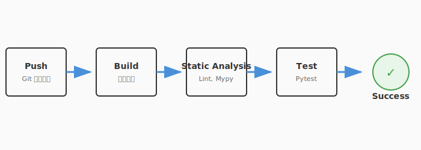

# 4.5 鉄壁の防衛線——テスト自動化とCI

どれほど優れたテストスイートも、**実行されなければ無意味**です。

「テストを書いたのに、忙しくて実行しなかった」「誰かがテストを壊したまま気づかずマージしてしまった」——こうした事態を防ぐには、テストの実行を人間の意志に頼らず、**自動化**する必要があります。

テストを「手動で実行するもの」から「常に自動で守り続けるもの」に昇華させる——その仕組みが**CI（継続的インテグレーション）**です。

---

## CIとは何か

**CI（Continuous Integration）**とは、コードの変更がリポジトリにプッシュされるたびに、自動的にビルド・テストを実行する仕組みです。

次の図は、CIパイプラインの全体的な流れを示しています。



ここで注目したいのは、コードのプッシュからフィードバックまでの流れが完全に自動化されている点です。コードが変更されるたびに、ビルド・テスト・解析という「守護魔法」が自動発動し、品質ゲートを通過しなければマージが許可されません。このサイクルが高速に回ることで、問題はコードが書かれた直後に発見できます。

### CIがもたらすもの

| 効果 | 説明 |
|------|------|
| **即座のフィードバック** | コードを壊したら数分以内に通知される |
| **全テストの確実な実行** | 「テスト通すの忘れた」がなくなる |
| **安心してマージできる** | CIが緑なら、少なくとも既存機能は壊れていない |
| **チームの信頼基盤** | 全員が同じ基準で品質を確認できる |

---

## GitHub Actionsで実践する

最も手軽にCIを始められるのが**GitHub Actions**です。リポジトリに設定ファイルを1つ置くだけで、プッシュのたびにテストが自動実行されます。

### 基本的な設定

```yaml
# .github/workflows/test.yml
name: QuestForge Tests

on:
  push:
    branches: [main]
  pull_request:
    branches: [main]

jobs:
  test:
    runs-on: ubuntu-latest
    steps:
      - uses: actions/checkout@v4

      - name: Set up Python
        uses: actions/setup-python@v5
        with:
          python-version: '3.12'

      - name: Install dependencies
        run: pip install -r requirements.txt

      - name: Run tests
        run: python -m pytest tests/ -v
```

この設定で、`main`ブランチへのプッシュまたはプルリクエストのたびに、以下が自動実行されます:

1. コードをチェックアウト
2. Python環境をセットアップ
3. 依存パッケージをインストール
4. テストを実行

### カバレッジレポートの自動生成

4.2節で学んだカバレッジを、CIで自動計測・レポート化できます。

```yaml
      - name: Run tests with coverage
        run: |
          pip install pytest-cov
          python -m pytest tests/ --cov=src --cov-report=term-missing

      - name: Check coverage threshold
        run: |
          python -m pytest tests/ --cov=src --cov-fail-under=80
```

`--cov-fail-under=80` を指定すると、カバレッジが80%未満の場合にCIが失敗します。これが**品質ゲート**です。

---

## 品質ゲート: マージの門番

品質ゲートとは、「この基準を満たさなければマージを許可しない」という自動チェックです。

| ゲート | 基準例 | 目的 |
|--------|--------|------|
| **テスト通過** | 全テストがパス | 既存機能が壊れていないことの保証 |
| **カバレッジ閾値** | 80%以上 | テストの網羅性の最低基準 |
| **静的解析** | Lintエラーゼロ | 3.4節で学んだコード品質の維持 |
| **型チェック** | Mypy通過 | 型の整合性 |

```yaml
      # 静的解析とテストを並列実行
      - name: Lint
        run: ruff check src/

      - name: Type check
        run: mypy src/

      - name: Test
        run: python -m pytest tests/ --cov=src --cov-fail-under=80
```

GitHub上でプルリクエストを作ると、これらのチェックが自動で走り、すべて通過しなければマージボタンが押せないように設定できます（Branch Protection Rules）。

---

## テストの実行戦略

テストが増えるにつれ、実行時間が課題になります。効率的な実行戦略を設計しましょう。

### テストの分類と実行タイミング

| 分類 | 実行タイミング | 実行時間の目安 |
|------|--------------|---------------|
| **単体テスト** | 毎回のプッシュ | 数秒〜数十秒 |
| **結合テスト** | プルリクエスト作成時 | 数分 |
| **E2E / システムテスト** | マージ前、リリース前 | 数十分 |

```yaml
jobs:
  # 常に実行: 高速な単体テスト
  unit-tests:
    runs-on: ubuntu-latest
    steps:
      - uses: actions/checkout@v4
      - run: python -m pytest tests/unit/ -v

  # PRのみ実行: 結合テスト
  integration-tests:
    if: github.event_name == 'pull_request'
    runs-on: ubuntu-latest
    steps:
      - uses: actions/checkout@v4
      - run: python -m pytest tests/integration/ -v
```

4.1節で学んだテストピラミッドの考え方が、ここでも活きます。土台（単体テスト）は常に・速く、上層（E2E）は必要なタイミングだけ実行します。

---

> **コラム: カオスエンジニアリング——本番環境の回復力テスト**
>
> CIパイプラインで守れるのは「コードが正しいか」までです。しかし、本番環境では「サーバーが突然落ちる」「ネットワークが不安定になる」といった予測困難な障害が起こります。
>
> **カオスエンジニアリング**は、意図的に障害を注入し、システムの回復力を検証するアプローチです。Netflixが開発した「Chaos Monkey」は、本番環境のサーバーをランダムに停止させることで有名です。
>
> - **原則**: 「障害は必ず起こる。だから、制御された状況で先に経験しておく」
> - **手法**: プロセスの強制終了、ネットワーク遅延の注入、ディスク容量の枯渇シミュレーション
> - **効果**: 障害発生時のアラート・復旧手順が本当に機能するかを確認できる
>
> これは第6章「進化する生命体（デプロイと運用）」で扱う運用の世界と深く関わります。テストの守りは、CIで終わりではなく、本番環境の回復力まで続いているのです。

---

## まとめ

CIはテストを「常時発動」にする仕組みです。プッシュのたびに自動でテストが走り、壊れた瞬間にフィードバックを受け取ることで、問題の発見を最大限に早期化できます。品質ゲートはこれをさらに一歩進め、テスト通過・カバレッジ閾値・静的解析を自動チェックし、基準未達のコードがマージされるのを防ぎます。

テストピラミッドに沿った実行戦略——単体テストは常に速く、結合テストはPR時に、E2Eはリリース前に——を守ることで、CIのフィードバックループを快適な速度に保てます。3.4節で学んだLinter・型チェッカーもCIに組み込み、コード品質を多角的に守ることが理想的な形です。

次の4.6節では、テストが検出した不具合の原因を突き止める技術——デバッグを学びます。名探偵のように証拠を辿り、バグの根本原因を発見する方法を探っていきましょう。

---

## AIへの詠唱例

### CLIエージェント型：CI設定ファイルの生成

```
このプロジェクトの構成（pyproject.toml / requirements.txt 等）を読んで、
QuestForge 用の GitHub Actions ワークフローを生成し、
.github/workflows/ci.yml として保存してください。

要件：
- Python 3.12 を使用
- pytest でテストを実行（カバレッジ80%以上を品質ゲートに設定）
- ruff で Lint チェック
- mypy で型チェック
- プッシュ時とプルリクエスト時に自動実行
```

### CLIエージェント型：テスト分類と並列化戦略

```
tests/ ディレクトリ全体を走査して、以下を行ってください。

1. 各テストファイルを「単体テスト・結合テスト・E2Eテスト」に自動分類し、
   現在の実行時間の見積もりを算出する
2. 分類に基づき、pytest-xdist を使った並列化戦略を提案する
3. .github/workflows/ci.yml に並列化設定を追記する
```

---

**執筆メモ**:
- 執筆日時: 2026-02-01
- 構成: CI基礎→GitHub Actions実践→品質ゲート→実行戦略→カオスエンジニアリング（コラム）
- 接続: 3.4節（静的解析）との統合、4.1（テストピラミッド）の実行戦略への応用、5章（リファクタリング）への橋渡し

---

## さらに学ぶためのリソース

- 🌐 **ドキュメント**: [GitHub Actions 公式ドキュメント](https://docs.github.com/ja/actions)（現代のCI/CDのデファクトスタンダード。ワークフロー構築の基礎を学べます）
- 🌐 **Web**: Martin Fowler "[Continuous Integration](https://martinfowler.com/articles/continuousIntegration.html)"（CIの概念を確立した、歴史的に最も重要な技術記事の一つ）
- 📚 **書籍**: Jez Humble, David Farley『[継続的デリバリー 信頼できるソフトウェアリリースのためのビルド・テスト・デプロイメントの自動化](https://www.pearson.com/en-us/subject-catalog/p/continuous-delivery/P200000000137/9780321601919)』（CI/CDの全容を体系化した不朽の名著）
