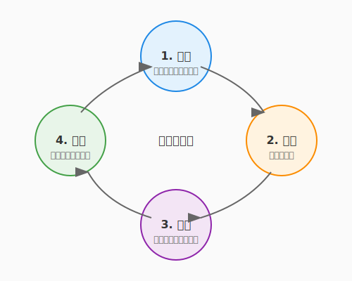

# 4.6 術式の不調を探る——デバッグという推理ゲーム（The Art of Debugging）

テストという守護魔法を身につけたあなたには、もう一つ欠かせない力があります。テストが「不具合の存在」を知らせてくれたとして——では、その**原因はどこにあるのか？** それを論理的に突き止める力が**デバッグ**です。

デバッグは「面倒な作業」でしょうか？ いいえ。デバッグは、推理小説の探偵のように、手がかりを集め、仮説を立て、真犯人を追い詰めていく**知的な推理ゲーム**です。シャーロック・ホームズは言いました——「不可能を消去した後に残ったものが、どんなにありそうになくても、真実である」と。

テストが「守りの魔法」なら、デバッグは「真実を暴く鑑識魔法」です。このセクションでは、闇雲にコードを眺めるのではなく、体系的かつ効率的に原因を特定するための技法を学びます。そして、AIという強力な「助手（ワトソン）」を活用して、推理の精度と速度を飛躍的に高める方法を身につけましょう。

---

## 体系的デバッグ——仮説検証のサイクル

熟練のエンジニアとそうでない人のデバッグの違いは何でしょうか。それは**「体系的であるかどうか」**です。

### 科学的手法としてのデバッグ

デバッグは、まさに科学の営みと同じです。



1. **観察する**: 何が起きているかを正確に把握する（エラーメッセージ、ログ、再現手順）
2. **仮説を立てる**: 「原因はおそらく〇〇だろう」と予想する
3. **実験する**: 仮説を検証するために、最小限の変更を加えて動かす
4. **結論を出す**: 仮説が正しかったか評価し、次の仮説へ進む

このサイクルを意識するだけで、「あちこち触って余計に壊す」という事態を避けられます。

### 二分探索デバッグ——O(log N) で犯人を追い詰める

3.1節で学んだアルゴリズムの知識が、ここで活きます。バグの原因箇所を特定する最も効率的な方法の一つが、**二分探索的アプローチ**です。

```python
# 100行の処理のどこかでデータが壊れている場合...

def process_quest_data(quests):
    # ステップ1: 入力データを確認
    print(f"[checkpoint-1] quests: {quests[:3]}...")  # ← ここは正常？

    validated = validate_quests(quests)
    # ステップ2: バリデーション後を確認
    print(f"[checkpoint-2] validated: {validated[:3]}...")  # ← ここは？

    sorted_quests = sort_by_priority(validated)
    enriched = enrich_with_rewards(sorted_quests)
    # ステップ3: 加工後を確認
    print(f"[checkpoint-3] enriched: {enriched[:3]}...")  # ← ここは？

    return format_output(enriched)
```

処理の「中間地点」にチェックポイントを置き、データが正常かどうかを確認します。正常なら後半に、そうでなければ前半にさらにチェックポイントを追加する——これを繰り返せば、O(log N) の効率で原因箇所を絞り込めます。

> **コツ**: `git bisect` は、この二分探索をコミット履歴に適用するGitの強力なコマンドです。「いつからバグが入ったか」を自動的に特定してくれます。

---

## ロギング戦略——システムの声を記録する

`print` デバッグは手軽ですが、本番環境やチーム開発では**構造化されたロギング**が力を発揮します。

### ログレベルの設計

ログには「重要度」があります。適切なレベルを使い分けることで、必要な情報だけを効率的に取り出せます。

| レベル | 用途 | 例 |
|--------|------|-----|
| `DEBUG` | 開発中の詳細な追跡 | 変数の値、関数の呼び出し順序 |
| `INFO` | 正常な動作の記録 | 「クエストが作成されました」 |
| `WARNING` | 注意が必要な状況 | 「レスポンスが3秒を超えました」 |
| `ERROR` | 機能の一部に支障 | 「データベース接続に失敗、リトライ中」 |
| `CRITICAL` | システム全体に影響 | 「ディスク容量が限界に達しました」 |

### 構造化ログの威力

テキストの羅列ではなく、JSON形式で構造化されたログを出力すると、検索や集計が格段に楽になります。

```python
import logging
import json

class StructuredLogger:
    def __init__(self, name):
        self.logger = logging.getLogger(name)

    def info(self, message, **context):
        """構造化されたログを出力する"""
        log_entry = {
            "message": message,
            "context": context
        }
        self.logger.info(json.dumps(log_entry, ensure_ascii=False))

# 使用例
logger = StructuredLogger("questforge")
logger.info(
    "クエスト完了",
    quest_id="Q-042",
    hero="アルケミスト見習い",
    reward_xp=150
)
# 出力: {"message": "クエスト完了", "context": {"quest_id": "Q-042", "hero": "アルケミスト見習い", ...}}
```

構造化ログは、6.4節で学ぶオブザーバビリティの基盤にもなります。今のうちからこの習慣を身につけておくと、運用フェーズで大きなアドバンテージになります。

---

## デバッガーの活用——時を止める魔法

`print` やログが「痕跡を辿る」手法だとすれば、デバッガーは**「時を止めてその場で観察する」**魔法です。

### 基本のデバッグ操作

現代のIDE（VS Code、PyCharm、IntelliJ）に搭載されたデバッガーは、驚くほど直感的です。

| 操作 | 意味 | 使いどころ |
|------|------|-----------|
| **ブレークポイント** | 指定行で実行を一時停止 | 「この行に来た時の状態を見たい」 |
| **ステップオーバー** | 1行ずつ進む（関数の中には入らない） | 処理の流れを概観したい |
| **ステップイン** | 関数の中に入って追跡 | 関数内部の動きを確認したい |
| **ステップアウト** | 現在の関数を抜けて呼び出し元に戻る | 深く潜りすぎた時に復帰 |
| **ウォッチ式** | 指定した変数や式の値を監視 | 「この値がいつ変わるか知りたい」 |

### 条件付きブレークポイントの威力

「1000回ループする中の、特定の条件の時だけ止めたい」——こんな時に活躍するのが**条件付きブレークポイント**です。

```python
for quest in quests:  # 1000件のクエストを処理
    reward = calculate_reward(quest)
    # 条件付きブレークポイント: reward < 0 の時だけ止まる
    assign_reward(quest, reward)
```

VS Codeなら、ブレークポイントを右クリックして「条件式」に `reward < 0` と入力するだけ。報酬がマイナスになる「事件」が起きた瞬間だけ、時を止めてその場を調べることができます。

---

## AIを活用したデバッグ——最強の助手を召喚する

5.2節でAIをレビュアーとして活用する術を学びます（第5章で詳しく扱います）。デバッグでも、AIは強力な「助手（ワトソン）」として活躍します。

### エラーメッセージの解読

エラーメッセージは時に暗号のように見えますが、AIは膨大な知識から瞬時に解読してくれます。

> **プロンプト例**:
> 「以下のPythonのエラーメッセージが発生しました。原因として考えられることと、解決方法を3つ提案してください。」
> ```
> TypeError: unsupported operand type(s) for +: 'NoneType' and 'int'
> ```

AIは「関数が `None` を返している可能性」「変数の初期化漏れ」「条件分岐で値が設定されないパス」など、複数の可能性を提示してくれます。

### 再現条件の特定

バグで最も手強いのは、「時々しか起きない」ものです。AIに状況を伝えて、再現条件の仮説を立ててもらいましょう。

> **プロンプト例**:
> 「QuestForgeで、クエストの報酬計算が時々0になるバグが報告されています。以下のコードを見て、再現条件として考えられるケースを列挙してください。特に、入力データのエッジケースに注目してください。」

### デバッグセッションの壁打ち相手

仮説を立てたら、AIに「この仮説は妥当か？」と壁打ちすることで、見過ごしていた可能性に気づけることがあります。

> **プロンプト例**:
> 「以下の関数で `reward` が0になるバグを調査しています。私の仮説は『`difficulty` が文字列で渡されている』です。他に考えられる原因はありますか？ コードの文脈を踏まえて検討してください。」

---

## 実践: QuestForgeでのデバッグ

QuestForgeのクエスト報酬計算で「報酬が0になる」という報告を受けたとしましょう。名探偵のようにステップを踏んで推理していきます。

```python
def calculate_reward(quest, hero):
    base = quest.difficulty * 10
    bonus = hero.streak_days // 7 * 5  # 連続ログインボーナス
    level_modifier = get_level_modifier(hero.level)
    return int(base * level_modifier + bonus)

def get_level_modifier(level):
    modifiers = {1: 1.0, 2: 1.2, 3: 1.5, 4: 2.0}
    return modifiers.get(level)  # ← 手がかりはここに...
```

**推理の過程**:

1. **観察**: 報酬が0になるのは「レベル5以上の英雄」だけ
2. **仮説**: `get_level_modifier` がレベル5以上で `None` を返しているのでは？
3. **検証**: `modifiers.get(5)` は確かに `None` を返す（辞書にキーがない）
4. **真犯人**: `int(base * None + bonus)` → `TypeError`... いや、`None` との乗算でエラーになる前に、実は別の場所で例外がキャッチされて0が返されていた！

```python
# さらに効果的な方法: デフォルト値を設定する
def get_level_modifier(level):
    modifiers = {1: 1.0, 2: 1.2, 3: 1.5, 4: 2.0}
    return modifiers.get(level, 1.0)  # デフォルトで1.0を返す
```

このように、デバッグは「原因→修正」の直線ではなく、仮説と検証を繰り返す**螺旋的なプロセス**です。その螺旋を楽しめるようになった時、あなたはデバッグの達人への道を歩み始めています。

---

## AIへの詠唱例

### IDE統合型：バグの体系的調査

```
@application/use_cases/complete_quest.py を読んでください。

以下のバグが報告されています：
「同じクエストを2回完了操作すると、経験値が二重に加算される」

体系的なデバッグ手順に従い、以下を行ってください：
1. 原因の候補を優先度順に列挙
2. 各仮説の検証方法（確認すべきコード箇所・テストケース）
3. 最も可能性の高い修正案を提示

修正の実装は私が確認してから行ってください。
```

### CLIエージェント型：ロギングの整備

```
application/ と infrastructure/ のコードを読んで、
デバッグと運用監視に役立つロギングを追加してください。

方針：
- Python 標準の logging モジュールを使用
- ログレベルを適切に使い分けること
  （DEBUG: 詳細な処理フロー、INFO: 重要なイベント、WARNING/ERROR: 異常系）
- 構造化ログ（JSON形式）を採用すること
- ユーザーIDやクエストIDなど、原因特定に役立つ情報を含めること

変更後に既存のテストが通ることを確認してください。
```

---

## まとめ

デバッグは推理ゲームです。闇雲にコードを書き換えるのではなく、「観察→仮説→検証→結論」のサイクルで体系的に進めることで、原因究明の効率が格段に上がります。二分探索のアプローチでチェックポイントを置けば、原因箇所をO(log N)の速さで絞り込めます。

構造化ログとログレベルの設計は「未来の自分への手紙」として、運用フェーズでの診断力を長期にわたって高めてくれます。デバッガーのブレークポイントとウォッチ式は、実行中のプログラムをその場で観察できる時間魔法です。そしてAIは、エラーメッセージの解読から再現条件の推定、仮説の壁打ちまで、最強の助手として活躍します。

次の4.7節（外伝）では、テストと検証の地平をさらに広げ、コンテナとインフラレベルでの品質保証に踏み込みます。テストの限界を超えた先に広がる、より堅牢なシステムの作り方を探っていきましょう。

---

## さらに学ぶためのリソース

- 📚 **書籍**: David J. Agans『[デバッグの理論と実践 ―ソフトウェアのバグを追い詰める9つの規則](https://www.oreilly.co.jp/books/9784873111451/)』（言語を問わず使える、デバッグの普遍的な戦略を学べる不朽の名著）
- 📚 **書籍**: Andreas Zeller『[ソフトウェアデバッグの教科書 ―なぜプログラムは失敗するのか](https://www.amazon.co.jp/dp/487311394X)』（デバッグのプロセスを科学的に分析した名著）
- 🌐 **Web**: [Visual Studio Code Debugging](https://code.visualstudio.com/docs/editor/debugging)（現代の標準的なデバッグインターフェースの使い方ガイド）
- 🌐 **Web**: [Python logging HOWTO](https://docs.python.org/ja/3/howto/logging.html)（ログレベルやハンドラの設定など、Python標準ロギングの包括的な解説）

---

**Meta Information**:
- 文字数: 約4000
- 主要概念: 体系的デバッグ、二分探索デバッグ、ロギング戦略、デバッガー、AIデバッグ
- コード例数: 4
- 必要な図: デバッグの仮説検証サイクル図
- AI詠唱例: 2
