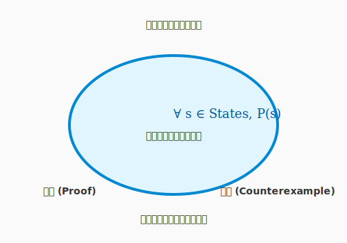

# 4.7 【外伝】真理の鏡——形式手法による「絶対に壊れない」証明


第4章を通じて、あなたはテストという守護魔法を学びました。しかし、どれほど多くのテストケースを重ねても、エドガー・ダイクストラが喝破した通り、**「テストは不具合の存在を示すことはできるが、不具合の不在を証明することはできない」**のです。

100万回の実験（テスト）で成功しても、100万1回目に「詰み（デッドロック）」が発生する可能性はゼロではありません。この絶望的な問いに対する、もう一つの極端な解答が**「形式手法（Formal Methods）」**です。

次の図は、形式手法という「真理の鏡」がどのようにシステムの全状態空間を照らし出すかを示しています。



これは「実験」ではなく、数学的な「証明」によって、術式の正しさを宣言する究極の鑑定術です。ここで表現されているのは、テストがサンプリング（標本調査）であるのに対し、形式手法は全数調査に相当するという本質的な違いです。

---

## 真理の数式：モデル検査

形式手法の中でも、現代のアルケミストにとって実用的なのが**「モデル検査」**という技法です。AlloyやTLA+といった道具を使い、設計を論理学の言葉で記述します。

### 「詰み」を許さない
例えば、QuestForgeの「パーティ編成と同時にクエスト受注をする」ロジックを論理式で描きます。
AIという強力な計算機を使って、「考えうるすべての状態」を網羅的に探索させます。もし、宇宙が滅びるまでの時間のどこかでデッドロックが起きる可能性があるなら、形式手法はその「反例」を、数学的な確信を持って突きつけてきます。

では、この数学的な道具は何のために使うのでしょうか——「コードを正しく書く」ためではなく、もっと根本的な何かのためです。

### 究極の抽象化
形式手法は、コードそのものを書くことではありません。**「設計の魂」**を記述することです。
複雑な分散システムや、人命に関わる医療機器、巨額の資産を扱う金融システムの心臓部において、この「真理の鏡」は欠かせない装備となっています。

---

## まとめ

形式手法は実験による安心ではなく、証明による確信を与えます。複雑な状態遷移や並行処理の「設計ミス」を実装前に摘み取れるという価値は、人命や資産が関わるシステムの最重要箇所において特別な意味を持ちます。すべてのコードに適用する必要はありません——システムの最も重要な「要（かなめ）」にだけ、この強力な鏡をかざす賢者の選択が求められます。

真理は常に一つです。論理の刃を研ぎ澄まし、不確実性の霧を切り裂きましょう。

こうして第4章では、テストの体系から設計技法・TDD・AI拡張・CI自動化・デバッグ・形式手法まで、コードを守り続けるための全技術を巡ってきました。続く**第5章「リファクタリング：彫刻を磨く喜び」**では、動いているコードをさらに美しく・保守しやすく改善する技法を学びます。匂いを嗅ぎ分け、AIと対話しながら、技術的負債を「投資」として捉え直す旅が始まります。

---

## AIへの詠唱例

```
QuestForge の「クエスト完了フロー」を形式手法で検証したいです。

以下のファイルを読んで対象の振る舞いを把握してください：
- domain/quest.py: Quest エンティティの状態遷移（未着手→進行中→完了）
- application/use_cases/complete_quest.py: 完了ユースケースのロジック

以下を順番に行ってください：
1. クエストの状態遷移を TLA+ または Alloy のモデルで記述する雛形を作成する
2. 「同じクエストが二重に完了できない」という不変条件を定義する
3. モデルチェッカーで検証するためのコマンドを示す
```
