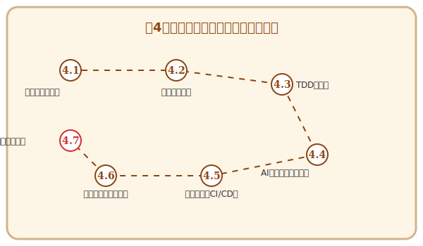

# 第4章 無敵の軍団を作る——テストと品質保証

## この章で手に入れる力

第3章でコードを実装する技を学びました。しかし、書いたコードも、無防備に野ざらしにしておけば風雨に侵食されてしまいます。

ソフトウェアの世界における「風雨」とは、仕様変更、機能追加、そしてチームメンバーによる予期しない修正です。これらの変化からコードの品質を守り抜くには、**自動化された守護魔法——テスト**が不可欠です。

この章では、テストを「面倒な検査作業」ではなく、**コードを安心して進化させ続けるための最強の味方**として捉え直します。伝統的なテスト設計の知恵から、テスト駆動開発のリズム、AIによるテスト生成、そして自動化の基盤まで——あなたのソフトウェアを鉄壁に守る「無敵の軍団」を編成しましょう。

## 冒険の地図

---

---

## 読了後のあなた

この章を読み終えると、あなたは以下のことができるようになります。

- **見渡す**: テストレベルとテストピラミッドで、何をどの粒度でテストするか判断できる
- **設計する**: カバレッジ分析や同値分割で、効率的なテストケースを設計できる
- **駆動する**: TDDのリズムで、テストが導く安全な開発を実践できる
- **活用する**: AIにテストケースを生成させ、人間が見落とすエッジケースを発見できる
- **自動化する**: CIパイプラインでテストを常時実行し、品質を継続的に守れる
- **診断する**: テストが検出した不具合の原因を、体系的なデバッグ手法で突き止められる

彫刻を守る鉄壁の軍団を、今から編成していきましょう。

---

## さらに学ぶためのリソース（章全体）

- 📚 **書籍**: Kent Beck『[テスト駆動開発](https://www.ohmsha.co.jp/book/9784274217883/)』（TDDの原典。和田卓人氏による「訳者解説」も必読）
- 📚 **書籍**: Gerard Meszaros "[xUnit Test Patterns: Refactoring Test Code](https://www.informit.com/store/xunit-test-patterns-refactoring-test-code-9780131495050)"（テストコードの設計パターンと「匂い」の集大成）
- 📚 **書籍**: Lisa Crispin, Janet Gregory "[Agile Testing: A Practical Guide for Testers and Agile Teams](https://www.pearson.com/en-us/subject-catalog/p/agile-testing-a-practical-guide-for-testers-and-agile-teams/P200000000167/9780321534460)"（アジャイル開発におけるテスト戦略の決定版）
- 📚 **書籍**: 秋山浩一『[ソフトウェアテスト技法ドリル 第2版](https://www.juse-p.co.jp/products/detail.php?product_id=155)』（テスト設計の具体的な技法を演習形式で学べる実践書）
- 📚 **書籍**: 小川秀人、佐藤陽春、森拓郎、加賀洋渡『[土台からしっかり学ぶ ソフトウェアテストのセオリー](https://www.ric.co.jp/book/contents/pdfs/1314_introduction.pdf)』（テストの全体像を体系的に整理した、現代のエンジニアのための入門書）

### 📜 賢者伝説（学術論文）

- 📄 **70s**: Edsger W. Dijkstra "[Notes on Structured Programming](https://www.cs.utexas.edu/users/EWD/ewd02xx/EWD249.PDF)" (1970)（「プログラムテストは不具合の存在を示すことはできるが、不在を証明することはできない」という有名な洞察を含む論文）
- 📄 **00s**: K. Claessen and J. Hughes "[QuickCheck: A Lightweight Tool for Random Testing of Haskell Programs](https://dl.acm.org/doi/10.1145/351240.351266)" (2000)（現代のプロパティベーステストの先駆けとなった、自動ランダムテスト手法の原典）
- 📄 **10s**: G. Fraser and A. Arcuri "[EvoSuite: Automatic Test Suite Generation for Object-Oriented Software](https://dl.acm.org/doi/10.1145/2025113.2025179)" (2011)（自動テスト生成の金字塔）
- 📄 **20s**: S. Kang et al. "[Large Language Models are Few-shot Testers](https://arxiv.org/abs/2209.11515)" (2022)（LLMを用いてバグを再現するテストコードを生成する、現代のテスト自動化の最前線）
