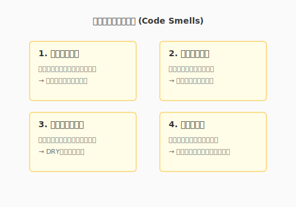
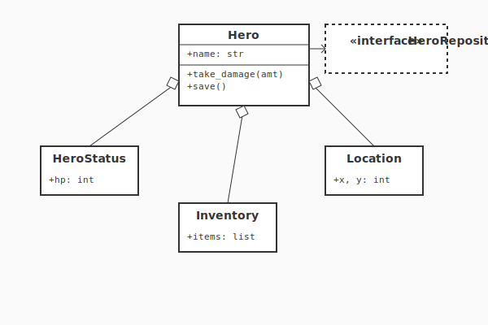

# 5.1 コードの「匂い」を嗅ぎ分ける（The Art of Sensing）

美しいコードを書くための第一歩は、まず「美しくないもの」に気づくことです。熟練したエンジニアは、悪いコードを見た瞬間に、理屈よりも先に「嫌な予感」や「生理的な不快感」を覚えます。

リファクタリングの提唱者であるMartin Fowlerは、この兆候を**「コードの匂い（Code Smells）」**と名付けました。

これはバグ（欠陥）ではありません。コンパイラは文句を言わず、プログラムは正常に動きます。しかし、そこからは「将来トラブルを起こしそうな気配」——魔法の回路における「マナの淀み」のようなもの——が漂っています。

このセクションでは、その「匂い」の正体を突き止め、言語化する訓練を行います。「なんとなく汚い」を「このメソッドはデータ泥棒をしている」と言い換えられるようになった時、あなたは真の錬金術師への階段を登り始めます。

---

## 理論的背景: 代表的な「匂い」のカタログ

数ある匂いの中から、特に遭遇頻度が高く、早めに気づくほど効果が大きいものを紹介します。

### 1. 長すぎる関数 (Long Function)
- **症状**: 画面をスクロールしないと全体が見えない関数。
- **なぜ悪いか**: 「複数のこと」をやっている可能性が高く、理解も修正も困難。コンテキストの切り替えが脳のメモリを圧迫します。
- **対処法**: **「メソッドの抽出」**。意味のあるまとまりごとに切り出し、適切な名前をつけます。

### 2. 巨大なクラス (Large Class / God Class)
- **症状**: メソッドやフィールドが数十個あり、何でも知っているクラス。
- **なぜ悪いか**: 単一責任の原則（SRP）違反。変更の影響範囲が予測不能になります。「神」は全知全能であるがゆえに、少し触れただけで世界（システム全体）を壊しかねません。
- **対処法**: **「クラスの抽出」**。役割ごとに別のクラス（従者たち）に分権します。

### 3. 重複したコード (Duplicated Code)
- **症状**: 「コピペして少し変えた」だけのコードが散見される。
- **なぜ悪いか**: **諸悪の根源**。修正漏れの温床となります。一箇所直しても、他がバグったままになるリスクがあります。
- **対処法**: 共通部分をメソッドや親クラスにまとめる（DRY原則）。

### 4. データ泥棒 (Feature Envy)
- **症状**: 他のオブジェクトのゲッターばかりを呼び出し、自分のデータのように計算しているメソッド。
- **なぜ悪いか**: 「データを持っている場所」と「計算する場所」が離れている（密結合）。オブジェクト指向の「データと振る舞いのカプセル化」に反します。
- **対処法**: **「メソッドの移動」**。その計算ロジックを、データを持っているクラスへ引越しさせます。

### 5. 意外な振る舞いをするデフォルト引数 (Mutable Default Arguments) - Python特有のポイント
- **症状**: `def add_item(item, list=[]):` のように、リストや辞書をデフォルト引数にしている。
- **なぜ悪いか**: Pythonではデフォルト引数は**一度だけ生成され、使い回されます**。ある呼び出しでリストに追加した内容が、次の呼び出しにも残ってしまいます（幽霊のようなバグ）。
- **対処法**: デフォルト値を `None` にし、内部で初期化する。

次の図は、代表的なコードの匂いを一覧で示しています。



ここで示された5つの匂いは、いずれも「コードが将来の変更を拒んでいるサイン」として読み取ることができます。長すぎる関数は理解コストを、巨大なクラスは変更の影響範囲を、重複コードは修正漏れのリスクをそれぞれ生み出します。まずこれらの匂いに名前をつけて認識できるようになることが、リファクタリングの第一歩です。

> [!TIP]
> **「論理の目」としての静的解析ツール**
> あなたの嗅覚（直感）を養うのも重要ですが、機械に任せられる部分は任せましょう。
> **Linter**（Flake8, Pylintなど）や**静的解析ツール**（SonarQube, CodeClimateなど）は、長すぎる関数や複雑な分岐、Python特有の注意点などを自動的に検知してくれます。
> 
> これらは、いわば「マナの乱れを検知する探知機」です。まずツールで機械的に「明らかな淀み」を解消してから、人間の嗅覚でより深い「設計の歪み」に挑む。これが現代のアルケミストの賢い戦い方です。
> （静的解析の具体的な設定については3.4節を参照してください）

---

## 実践: QuestForgeの「神」を解体する

QuestForgeの開発が進むにつれ、主人公を表す `Hero` クラスが肥大化してしまいました。実際のコードを見て、匂いを嗅ぎ取ってみましょう。

### Before: 淀んだマナ（God Class）

```python
class Hero:
    def __init__(self, name):
        self.name = name
        self.hp = 100
        self.inventory = []  # アイテム管理
        self.quests = []     # クエスト管理
        self.x = 0           # 位置情報
        self.y = 0
    
    def take_damage(self, amount):
        self.hp -= amount
        if self.hp < 0: self.hp = 0
        
    def add_item(self, item):
        # アイテム管理ロジック
        if len(self.inventory) >= 20:
            print("Inventory full!")
            return
        self.inventory.append(item)
        
    def move(self, direction):
        # 移動ロジック
        if direction == 'NORTH': self.y += 1
        # ... (延々と続く移動コード)
        
    def save_to_db(self):
        # インフラストラクチャのロジックまで混入！
        import sqlite3
        conn = sqlite3.connect('game.db')
        # ... (SQLの発行)
```

### 匂いの分析

1.  **巨大なクラス**: 戦闘、アイテム、移動、保存...あまりにも多くの責務を負っています。
2.  **抽象度の混在**: ゲームのルール（HP計算）と、低レベルな実装詳細（SQL発行）が同じ場所にあります。
3.  **認知的負荷が高い**: `Hero` を修正しようとすると、アイテムやDBのことまで気にしなければなりません。

### After: 権限の委譲（Refactoring）

このクラスを「統治者」としての役割に特化させ、実務を専門家に委譲します。

次の図は、Heroクラスを分解して各責務を専門クラスに分散させた構造を示しています。



この再構築により、各クラスは単一の責任を持つようになります。

```python
class Hero:
    def __init__(self, name, repository: HeroRepository):
        self.name = name
        self.status = HeroStatus()       # 戦闘・ステータス管理
        self.inventory = Inventory()     # アイテム管理
        self.location = Location(0, 0)   # 位置情報
        self.repository = repository     # 保存担当（依存性の注入）
        
    # Heroは「司令塔」になり、詳細は各クラスに任せる
    def take_damage(self, amount):
        self.status.damage(amount)
        
    def add_item(self, item):
        self.inventory.add(item)
        
    def save(self):
        # 保存の詳細はRepositoryが知っている
        self.repository.save(self)
```

**変化のポイント**:
- **Inventoryクラス**: アイテム数の上限チェックなどをカプセル化。
- **HeroStatusクラス**: HPやMPの計算ロジックを集約。
- **Repositoryパターン**: DB操作を完全に分離（第2章の復習）。

これにより、`Hero` クラスは見通しが良くなり、各パーツを単体でテストできるようになりました。

---

## AI時代のアプローチ: 嗅覚の拡張

人間が匂いに気づくのが理想ですが、AIに「検知」を手伝わせることもできます。特に、自分が書いたコードの匂いには気づきにくいものです。

### プロンプト例：検知の依頼

> 「このコードの中で、SRP（単一責任の原則）に違反している可能性がある部分や、可読性を下げている『コードの匂い』を指摘してください。特に『変更のしやすさ』の観点から分析してください。」

AIは感情を持たないため、遠慮なく「このクラスは大きすぎます」「この条件分岐は複雑すぎます」と指摘してくれます。これを**「静的な壁打ち相手」**として使うのがコツです。

---

## まとめ

1.  **直感を信じる**: 「なんとなく読みづらい」は、改善が必要なシグナル。
2.  **名前を知る**: 「データ泥棒」「神クラス」などの名前を知ることで、問題を認識・共有しやすくなる。
3.  **役割を分ける**: 巨大なものは分割し、適切な場所に責務を割り振るのがリファクタリングの基本。

次は、この「匂い」の解消作業を、AIという強力なパートナーと共に行う方法——**「AIペアプログラミング」**について学びます。

---

## AIへの詠唱例

```
以下のPythonコードを分析し、「コードの匂い（Code Smells）」があれば指摘してください。
特に以下の観点でチェックしてください：
1. 長すぎる関数がないか
2. ネストが深すぎていないか
3. 変数名が意図を表しているか
```

## さらに学ぶためのリソース

- 📚 **書籍**: マーチン・ファウラー『[リファクタリング 第2版 ―既存のコードを安全に改善する](https://www.ohmsha.co.jp/book/9784274224546/)』（リファクタリングのバイブル。JavaScriptを例に、カタログ形式で技法を学べます）
- 📚 **書籍**: Michael Feathers『[レガシーコード改善ガイド](https://www.shoeisha.co.jp/book/detail/9784798116839)』（テストがないコードに対して、どう安全にリファクタリングを適用するかを説く実践書）
- 🌐 **Web**: [Refactoring.Guru](https://refactoring.guru/ja/refactoring)（リファクタリングのカタログを、豊富な図解と多言語のサンプルコードで学べる素晴らしいサイト）
- 📄 **論文**: William F. Opdyke "[Refactoring Object-Oriented Frameworks](http://www.laputan.org/pub/papers/opdyke-thesis.pdf)" (1992)（リファクタリングという用語を定義し、その体系化の先駆けとなった歴史的論文）

---
