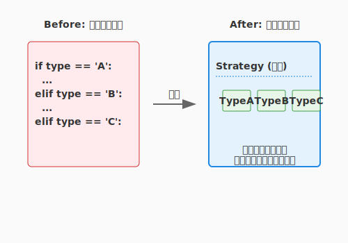

# 5.2 AIによるコードレビュー（The Dialogue with the Familiar）

## 導入: 使い魔（Familiar）との対話

かつて、コードレビューといえば「先輩エンジニアに怒られる時間」だったかもしれません。あるいは、一人開発（ぼっち開発）で、誰の目にも触れずにコードが腐っていく孤独な戦いだったかもしれません。

しかし、現代のアルケミストには強力な相棒がいます。AIです。
AIは、あなたが書いたコードの「死角」を冷静に見抜き、より良い書き方を提案してくれる「使い魔（Familiar）」です。

ただし、AIは黙っていても助けてくれません。適切な「召喚（プロンプト）」を行い、対話を重ねることで初めて、その真価を発揮します。このセクションでは、AIを単なる「コード生成機」ではなく、**「最強のレビュアー兼メンター」**として活用する術を学びます。

---

## 視点を切り替える召喚術

「このコードを直して」と頼むだけでは、AIは表面的な修正しかしません。AIに**「人格（ロール）」**と**「観点（パースペクティブ）」**を与えることで、レビューの質は劇的に向上します。

### 1. 観点を指定する
漫然と見させるのではなく、チェックリストを渡します。

> **プロンプト例**:
> 「あなたはGoogleのスタイルガイドを熟知したPythonのエキスパートです。以下のコードをレビューし、**可読性**、**パフォーマンス**、**型安全性**の3つの観点から改善点を指摘してください。」

### 2. 意地悪なレビュアーを演じさせる
自分のコードの脆さを知るには、攻撃者の視点が必要です。

> **プロンプト例**:
> 「あなたは意地悪なセキュリティエンジニアです。このコードにある脆弱性や、エッジケースでクラッシュする可能性を徹底的に探し出してください。」

### 3. 教育的な解説を求める
修正案だけでなく「なぜそうすべきか」を問うことで、あなたの知識（ドメイン知識）が増えます。

> **プロンプト例**:
> 「修正案を提示する際、なぜその変更が良いのか、本来のコードにはどのようなリスクがあったのかを、初学者にもわかるように解説してください。」

---

## 実践: QuestForgeの分岐地獄を浄化する

QuestForgeのクエスト完了処理(`complete_quest`)が、仕様追加により複雑怪奇な `if-elif` の塔になってしまったとします。これをAIと共にリファクタリングしてみましょう。

### Before: 条件分岐の塔

```python
def complete_quest(hero, quest):
    if quest.type == '討伐':
        if hero.level >= quest.required_level:
            hero.xp += quest.xp
            print("討伐成功！")
        else:
            print("レベルが足りません")
    elif quest.type == '納品':
        if quest.target_item in hero.inventory:
            hero.inventory.remove(quest.target_item)
            hero.xp += quest.xp
            print("納品完了！")
        else:
            print("アイテムがありません")
    elif quest.type == '探索':
        # ... まだまだまだ続く ...
```

このコードは、新しいクエストタイプが増えるたびに `complete_quest` 関数を書き換える必要があり、「開放閉鎖の原則（OCP）」に違反しています。

### AIへの相談（The Dialogue）

**Human**:
「このコードは `quest.type` で分岐していて拡張しづらいです。**Strategyパターン**を使ってリファクタリングしたいのですが、設計案とコード例を提示してください。」

**AI (Familiar)**:
「素晴らしい着眼点です。クエストの完了ロジックを `QuestStrategy` として抽象化し、`KillQuest`, `DeliveryQuest` などの具象クラスに分けるのが良いでしょう。以下に提案を示します...」

### After: 美しきポリモーフィズム



AIとの対話を経て、以下のような構造に生まれ変わりました。

```python
# 抽象戦略
class QuestStrategy(ABC):
    @abstractmethod
    def complete(self, hero) -> bool:
        pass

# 具象戦略（討伐）
class KillQuest(QuestStrategy):
    def complete(self, hero):
        if hero.level < self.required_level:
            return False
        hero.gain_xp(self.xp)
        return True

# コンテキスト（利用側）
def complete_quest(hero, quest):
    # 分岐が消え、ただ「完了せよ」と命じるだけになった
    if quest.strategy.complete(hero):
        print("クエストクリア！")
```

コードの行数は増えましたが、複雑さは劇的に下がりました。新しいクエストタイプを追加する際も、既存のコードを一切触る必要がありません。

---

## 人間 vs AI：補完し合うレビュー

AIは強力ですが、万能ではありません。**人間によるレビュー（ピアレビュー）**とAIによるレビューは、それぞれ得意分野が異なります。これらを組み合わせることで、最高品質の魔法陣（コード）が完成します。

| 観点 | AIが得意なこと（機械の目） | 人間が得意なこと（心の目） |
|------|---------------------------|---------------------------|
| **速度** | 数秒。いつでも何回でも可能 | 数時間〜数日。疲弊する |
| **網羅性** | 凡ミス、命名規則、構文のチェック | 設計の意図、要件との整合性 |
| **文脈** | そのファイルの範囲内での最適化 | プロジェクト全体の歴史、政治的背景、将来の展望 |
| **教育** | 知識の提供（逆引き辞典的） | チームの文化醸成、成長の動機づけ |

### ハイブリッド・レビューの黄金律

1.  **静的解析・AIレビューを先に通す**: インデントのズレやタイポなど、機械が直せる部分で人間の貴重な時間を使わせない。
2.  **人間は「なぜ」に集中する**: 「この設計にした意図は？」「将来、別のクエストが増えたらどうする？」といった、文脈が必要な議論に人間が注力する。
3.  **AIを「第3の目」にする**: 人間同士の議論が煮詰まったとき、「AIに別のパターンを出させてみよう」と客観的な意見を求める。

人間によるレビューの具体的なプロセスやマナーについては、第7章でさらに詳しく学びます。

---

## 自動化された審判（CIでのAIレビュー）

対話的なレビューだけでなく、開発プロセスにAIを組み込むことも可能です。
GitHub Actionsなどで、プルリクエスト（PR）が作られた瞬間にAIが差分を読み、簡易レビューをコメントするツール（CodiumAI PR-Agentなど）も普及し始めています。

- **文法ミスの指摘**: 人間が見逃す些細なミスを即座に検知。
- **ドキュメント生成**: 変更内容からPRの説明文を自動生成。
- **テスト提案**: 「この変更に対するテストが足りていません」という警告。

これらを導入することで、人間のレビュアーは「設計の妥当性」や「仕様の意図」といった、より高度な部分の議論に集中できるようになります。

---

## さらに学ぶためのリソース

- 🌐 **Web**: [Google Engineering Practices Documentation - Code Review](https://google.github.io/eng-practices/review/)（世界最高峰のチームによる、建設的で効率的なコードレビューの極意）
- 📚 **書籍**: Karl Wiegers『[ピアレビュー ―高品質ソフトウェア開発のための手引](https://www.amazon.co.jp/dp/4822281897)』（人間同士のレビューにおける心理的な側面や、フィードバックの方法論を学べる名著）
- 🌐 **Web**: [Martin Fowler's Bliki - CodeSmell](https://martinfowler.com/bliki/CodeSmell.html)（匂いの概念を理解するための原典記事）
- 🌐 **ツール**: [PR-Agent (CodiumAI)](https://github.com/Codium-ai/pr-agent)（AIによる自律的なプルリクエストのレビュー、要約、改善提案を体験できるツール）

---

## まとめ

- **視点を与える**: AIに「誰になりきって」「何を見るか」を指定する。
- **対話する**: 一発の回答で満足せず、「もっと良くできる？」「Strategyパターンを使ったら？」とディスカッションする。
- **学ぶ**: AIの修正案から、より良いコーディングスタイルやデザインパターンを吸収する。
- **補完する**: 機械の目（AI・静的解析）と、心の目（人間）を使い分ける。

AIは、あなたのコードを批判する敵ではありません。共に最高傑作を作り上げるための、頼れる相棒なのです。

---

## AIへの詠唱例

```
@domain/quest.py を読んでコードをレビューしてください。
**可読性**、**パフォーマンス**、**型安全性**の3つの観点から改善点を指摘し、
それぞれの修正案と理由を初学者にもわかるように説明してください。
```

```
@application/use_cases/complete_quest.py を読んで、
含まれる条件分岐を Strategyパターンを使ってリファクタリングしたいです。
設計案（クラス図）とリファクタリング後のコードを提示してください。
既存のテストが壊れないよう、段階的な手順も示してください。
```