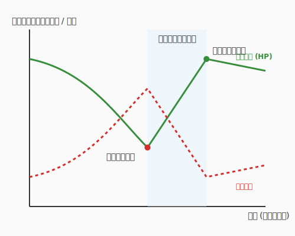

# 5.3 技術負債の返済ゲーム（Gamification of Maintenance）

## 導入: 終わらない戦いを「遊び」に変える

ソフトウェア開発において、最も長く、最も奥深い旅路。それは「メンテナンス」です。
納期に追われて書いた急ごしらえのコード、一時的な回避策、古くなったライブラリ...これらは**「技術的負債（Technical Debt）」**として積み重なり、利子（開発速度の低下）を要求し続けます。



多くのエンジニアにとって、負債の返済（リファクタリング）は「やらなきゃいけないけど、面倒で評価されない仕事」になりがちです。しかし、私たちは「楽しむ」ためにここにいます。

このセクションでは、地道な借金返済を、モンスターを倒し経験値を得る**「RPG（ロールプレイングゲーム）」**へと変えるマインドセットと、AIという「鑑定眼」を武器にした現代のリファクタリング術を紹介します。

---

## 理論的背景：魔導の代償（負債の四象限）

すべての負債が悪というわけではありません。Ward Cunninghamが提唱した「技術的負債」の概念を、魔導のタイプ別に分類してみましょう。

| 種類 | 状態 | 特徴（魔法のメタファー） |
|------|------|-----------------------|
| **無謀・意図的** | **「禁忌の魔術」** | 「動けばいい」と確信犯的に汚いコードを書く。後で大爆発する。 |
| **慎重・意図的** | **「戦略的供物」** | 「今はリリースを優先し、来月に再設計する」という苦渋の決断。 |
| **無謀・無意識** | **「暴走した魔力」** | 設計の原則を知らず、結果としてカオスを生み出す。 |
| **慎重・無意識** | **「古びた知識」** | 実装時はベストだったが、技術の進歩や要件の変化で最適ではなくなった。 |

大切なのは、今目の前にある負債がどの「呪い」に相当するかを正しく識別することです。

---

## 装備の研磨：一振りの砥石

かつての戦士たちは、戦いから戻るたびに、自分の武器の欠けを「一箇所だけ」研いでおく習慣を持っていました。

> **「戦い終わるごとに、砥石を一度だけ当てる」**

これをコードに適用しましょう。
大規模な「リファクタリングの祭典」という特別な時間を設ける必要はありません。機能追加やバグ修正という冒険から帰還するたびに、ついでにコードという武器を**「ほんの少しだけ」**研いでおくのです。

- **変数名をリネームする**（刃を磨き、その名を正す）
- **長すぎる関数から1つだけロジックを切り出す**（重すぎる鎧の一部を外す）
- **古くなったコメントを修正または削除する**（視界を遮る汚れを拭き取る）

この「一振りの砥石」の積み重ねが、次なる強敵（複雑な新機能要求）が現れた時に、あなたの剣（コード）を鋭く保ち、一撃で問題を解決する力となります。

---

## 負債の可視化：モンスター図鑑とステータス

見えない敵は脅威ですが、数値化された敵はただのターゲットです。コードの「不健康さ」をステータスとして可視化しましょう。

### 1. モンスター図鑑（TODO / FIXME）
コード中に `TODO` や `FIXME` を残す際、具体的な「討伐難易度」を記述します。

```python
# FIXME: モンスターLv.5 - ネストが深すぎるのでGuard Clauseで平坦化する
# TODO: モンスターLv.2 - マジックナンバー '300' を定数化する
```

### 2. コードの「呪い」を数値化する（メトリクス）
AIや静的解析ツールを使って、コードの複雑さを算出します。

- **循環複雑度（Cyclomatic Complexity）**: コードの分岐の多さ。
- **認知負荷（Cognitive Load）**: 人間がそのコードを理解するのに必要な脳のメモリ量。

「この関数の認知負荷は20を超えている。はぐれメタル級の強敵だ！」という共通言語を持つことで、リファクタリングはチーム共有の「クエスト」に変わります。

---

## AI考古学者：古文書の解読と浄化

AI時代のリファクタリングにおける最大の武器は、AIを**「考古学者」**として使うことです。

### 古文書の解読（Explain Code）
意味不明なスパゲッティコードを見つけたとき、AIに「このコードの意図を要約し、データの流れを可視化して」と頼みます。AIは、数年前の自分（または他人）が残した「古文書」の解釈を助けてくれます。

### 浄化プランの作成（Plan Refactoring）
「このコードをSOLID原則に基いてリファクタリングしたい。影響範囲を最小限にするための5つのステップを提案して」と詠唱します。AIは、安全にコードを磨き上げるための「攻略チャート」を作成してくれます。

---

## レガシーコードというダンジョン攻略

テストコードの一行もない、古文書のような「レガシーコード」に挑む際の鉄則は一つです。
**「触る前に、防具（テスト）を装備せよ」**（第4章で学んだ守護魔法が、ここで活きます）。

### 攻略手順
1.  **仕様化テスト（Characterization Test）**: 現在の挙動（たとえバグであっても）を確定させるテストを書く。
2.  **保護壁の設置**: テストが通ることを確認し、セーブポイントを作る。
3.  **少しずつ変形**: **Strangler Fig（絞め殺し植物）パターン**を使い、古いロジックを新しいロジックで少しずつ包み込み、置き換えていきます。

---

## コラム：リファクタリング・スペルブック（呪文集）

| 呪文名 | 正式名称 | 効果 |
|-------|---------|------|
| **スピリット・スプリット** | メソッドの抽出 | 巨大な関数から、一部の処理を独立した関数へ切り出す。 |
| **ソウル・トランスファー** | メソッドの移動 | あるクラスにあるメソッドを、より適切なデータを持つ別のクラスへ移す。 |
| **トゥルー・ネーミング** | 変数の改名 | 意味の曖昧な変数に、その役割を完璧に表す名前を与える。 |
| **インライン・アセンブル** | メソッドのインライン化 | 逆に細切れすぎて分かりにくい関数を、呼び出し元に統合する。 |

---

## まとめ: 借金ではなく「投資」

技術的負債という言葉はネガティブですが、見方を変えれば、それは**「未来の自分たちへの投資のチャンス」**です。

リファクタリングを通じて、コードだけでなく、あなた自身とチームもレベルアップしていく。汚いコードを見つけた時、こう思えるようになれば、あなたは一流のアルケミストです。

「おっ、あそこに経験値の塊（はぐれメタル）がいるぞ」と。

---

## 参考文献

- **Ward Cunningham "The WyCash Portfolio Management System"** (1992)
- **Michael Feathers 著『レガシーコード改善ガイド』** (翔泳社, 2009)
- **Martin Fowler 著『リファクタリング(第2版)』** (オーム社, 2019)
- **Emily Bache 著『Gilded Rose Refactoring Kata』** (Online Practice)

---

## AIへの詠唱例

```prompt
このレガシーコードの動作を一切変えずに、可読性を高めるためのリファクタリング案を3つ提案してください。それぞれのメリットと、壊れていないかを確認するためのテストケースも合わせて提示してください。
```

```prompt
以下の複雑な条件分岐を、Polymorphism（多態性）を使って整理する設計案を書いてください。
```
