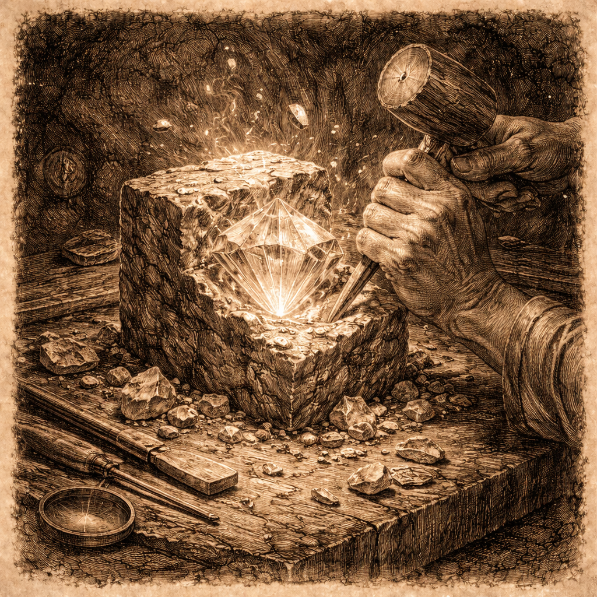
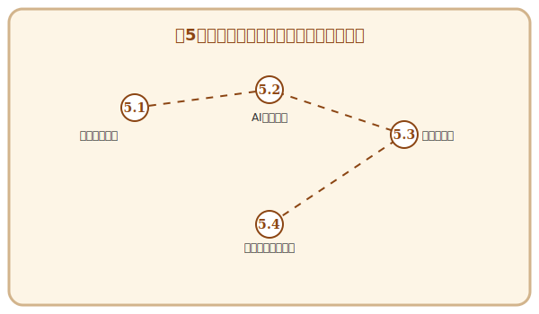

# 第5章 リファクタリング：彫刻を磨く喜び

## この章で手に入れる力

どれほど完璧な設計図を描いても、実際にコードを書き進めるうちに、現場には「綻び」が生じます。時間の不足、要求の変化、理解の深化——。それらはコードを少しずつ複雑にし、読みづらく、壊れやすいものに変えていきます。

この章で学ぶ**リファクタリング（Refactoring）**は、外部から見た振る舞いを変えずに、内部の構造を美しく整える技術です。それは、荒削りの石像を丁寧に磨き上げ、命を吹き込む彫刻家の仕事に似ています。

そして忘れてはならないのが、第4章で手に入れた**テストという安全網**です。テストが「振る舞いが変わっていない」ことを保証してくれるからこそ、安心してコードの内部構造を磨き上げることができます。リファクタリングとテストは、切っても切れない相棒同士なのです。

あなたはここで、AIという「鋭い彫刻刀」を使いこなし、不吉な「コードの匂い」を嗅ぎ分け、技術負債という魔物を手懐ける術を身につけます。

## 冒険の地図

---

## 本章の構成

- **5.1 コードの「匂い」を嗅ぎ分ける**：Code Smellsの特定と職人の直感。
- **5.2 AIによるコードレビュー**：対話的リファクタリングで設計を磨き上げる。
- **5.3 技術負債の返済ゲーム**：ボーイスカウト・ルールと計画的な救済作業。
- **5.4 【外伝】万変の魔導書**：ソフトウェアプロダクトラインと戦略的再利用。

---

## 読了後のあなた

この章を読み終えると、あなたは以下のことができるようになります。

- **嗅ぎ分ける**: 修正が必要な「悪いコード」を直感と論理で特定できる
- **磨く**: 既存の機能を壊さずに、コードの可読性と保守性を向上させられる
- **共闘する**: AIに適切な指示を出し、複雑なリファクタリングを安全に実行できる
- **管理する**: 技術負債を適切に評価し、チームで計画的に返済できる
- **広げる**: 単一のコードから、再利用可能な「プロダクトライン」への進化を構想できる

磨き抜かれたコードには、美しさと強さが宿ります。あなたの彫刻を完成させましょう。

---

## さらに学ぶためのリソース（章全体）

この章のテーマである「コードの美学」を追求し、プロのエンジニアとしての規範を学ぶための一冊です。

- 📚 **書籍**: Robert C. Martin『[Clean Code アジャイルソフトウェア達人の技](https://www.kadokawa.co.jp/product/301708000593/)』（「意味のある命名」や「関数の小ささ」など、コードを磨き上げるための具体的な美学が徹底解説されています）

### 📜 賢者伝説（学術論文）

- 📄 **90s**: Ward Cunningham "[The WyCash Portfolio Management System](https://c2.com/doc/oopsla92.html)" (1992)（「技術的負債」というメタファーが初めて提唱された、歴史的な経験報告）
- 📄 **90s**: William F. Opdyke "[Refactoring Object-Oriented Frameworks](http://www.laputan.org/pub/papers/opdyke-thesis.pdf)" (1992)（リファクタリングという用語を定義し、そのカタログ化と自動化の可能性を初めて体系的に論じた博士論文）
