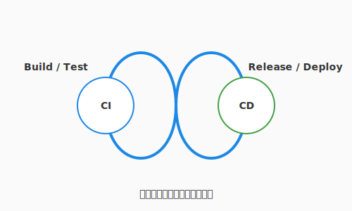

# 6.2 絶え間なき循環——CI/CDパイプライン

4.5節では、テストの自動実行という観点からCIの基礎を学びました。この節では、その視野をさらに広げ、コードがリポジトリに入ってからユーザーの手に届くまでの**流れ全体**——CI/CDパイプライン——を俯瞰します。

生きている動物の体内では、心臓が絶えず血液を送り出し、酸素と栄養を全身の細胞へと届けています。ソフトウェアという生命体も、これと全く同じ仕組みを必要とします。

新しく紡がれたコードという名の「酸素」は、速やかにテストされ、ビルドされ、そしてユーザーの手元という「全身」へ届けられなければなりません。もしこの循環がどこかで滞れば、ソフトウェアは瞬く間に鮮度を失い、古びたロジックの重みで腐敗してしまいます。

この循環を自動化し、止まることなく回し続けるための魔法の仕掛け。それが**CI/CDパイプライン**です。これは単なる便利ツールではありません。開発チームに心地よいリズムを与え、ソフトウェアに絶え間ない「命」を吹き込み続けるための、まさにプロジェクトの心臓部なのです。



---

## CI: 継続的インテグレーション（統合の洗礼）

「インテグレーション（統合）」とは、あなたが丹精込めて書いたコードを、チームの共有資産であるメインブランチ、いわば「真実の泉」へと合流させる儀式を指します。

かつて、開発者たちは数週間、時には数ヶ月もの間、自分の手元だけでコードを書き溜めていました。しかし、いざ全員のコードを一つにまとめようとした瞬間、無数のロジックの衝突や予期せぬ不具合が爆発的に発生し、開発現場は阿鼻叫喚の修羅場へと化しました。これがソフトウェアエンジニアリングの歴史に刻まれた**「統合地獄（Integration Hell）」**の正体です。

CI（継続的インテグレーション）の哲学は、この巨大な災厄を**「日々の小さな洗礼」**へと変えることにあります。

私たちは、一度に大量のコードを合流させるのではなく、毎日、あるいは毎時間、小さな変更を頻繁に泉へと戻します。そのたびに、クラウド上で自動化された「守護魔法（テスト）」が即座に発動し、新しく加わったコードが既存の機能を壊していないか、あるいは魔法の形式（構文）が乱れていないかを厳格に鑑定します。

バグは、生まれた瞬間に発見されればただの「書き間違い」に過ぎませんが、数週間放置されれば複雑に絡み合った「解けない呪い」へと進化してしまいます。CIは、この進化の芽を摘み取り、常に泉の水を清らかに保ち続けるための知恵なのです。

---

## CD: 継続的デリバリー（価値の送り出し）

CIによって清められ、品質が保証された「健全なコード」を、いつでも世界へ解き放てる状態に保つこと。そして、最終的には本番環境への展開までをも自動化の力で成し遂げること。それがCD（継続的デリバリー／デプロイメント）の役割です。

ここで、二つの異なる送り出しのスタイルについて理解しておきましょう。

一つは**継続的デリバリー（Continuous Delivery）**です。これは、完成した魔法の薬を丁寧に瓶に詰め、ラベルを貼り、いつでも出荷できる状態で棚に並べておくようなものです。本番環境へ送り出すための最後の「ボタン」は人間が押しますが、そこに至るまでの複雑な準備作業はすべて自動化されています。

もう一つは、さらに踏み込んだ**継続的デプロイメント（Continuous Deployment）**です。これは、魔法の薬が完成し、テストという鑑定をパスした瞬間に、それを必要としている人々の元へと自動的に転送される究極の形態です。人間による承認すら介さず、価値が瞬時に世界へと行き渡ります。

どちらのスタイルを選ぶにせよ、私たちの目的は「リリースという儀式のコスト」を限りなくゼロに近づけることにあります。リリースが日常の些細な出来事になれば、私たちは「失敗を恐れて半年に一度だけ行う大規模な博打」を捨て、「一日に何度も小さな改善を積み重ねる進化」を選ぶことができるようになるのです。

---

## GitHub Actions：雲上の自動人形（オートマタ）

現代のアルケミストたちが、この絶え間ない循環を実現するために使役するのが、**GitHub Actions** という名の「雲上の自動人形」です。これはGitHubの背後にある広大なクラウド空間で、あなたの指示通りに動く自動工房です。

この工房を動かすには、まず**ワークフロー（Workflow）**という詳細な指示書を書き記す必要があります。この指示書は、コードのリポジトリ内にYAML形式のファイルとして保管され、特定の**イベント（Event）**、例えば「コードが泉にPushされた」という合図とともに自動的に読み上げられます。

合図を受け取ると、**ランナー（Runner）**と呼ばれる「使い魔（ホムンクルス）」が召喚されます。この使い魔は、クラウド上に用意された真っさらな作業机（仮想マシン）の前に座り、指示書に従って一つひとつ**ジョブ（Job）**をこなしていきます。

ジョブの中身は、さらに細かな**ステップ（Step）**に分かれています。コードを机の上に広げる（Checkout）、適切な魔法の杖（Pythonなどの環境設定）を用意する、そしてテストという名の鑑定を行う。これらの定型的な作業には、世界中の先達たちが公開している**アクション（Action）**という再利用可能なパーツを組み込むことができます。これにより、あなたは複雑な構築手順を一から記述することなく、洗練された自動化の恩恵に預かれるのです。

---

## 実践: QuestForgeの自動化の書（YAML）

以下に、QuestForgeのテストとデプロイの流れを定義した「自動化の書」の例を示します。

```yaml
name: QuestForge CI/CD

on:
  push:
    branches: [ main ]  # メインブランチにPushされた瞬間に起動
  pull_request:
    branches: [ main ]  # プルリクエストが作成された際も鑑定を行う

jobs:
  # 第一のジョブ: 鑑定（テスト）
  test:
    runs-on: ubuntu-latest
    steps:
      - uses: actions/checkout@v4       # 1. 工房にコードを持ち込む
      - name: Setup Python
        uses: actions/setup-python@v5   # 2. Pythonの環境を整える
        with:
          python-version: '3.11'
      - name: Install dependencies      # 3. 必要な素材（ライブラリ）を揃える
        run: pip install -r requirements.txt
      - name: Run Unit Tests            # 4. 鑑定魔法を実行
        run: python -m unittest discover tests

  # 第二のジョブ: 納品（デプロイ）
  deploy:
    needs: test                        # 鑑定（テスト）が成功した場合のみ実行
    if: github.ref == 'refs/heads/main' # かつ、メインブランチの変更であること
    runs-on: ubuntu-latest
    steps:
      - name: Deploy to Cloud
        run: echo "Deploying to production server..." # 実際にはここで本番への転送を行う
```

---

> [!TIP]
> **Pipeline as Code：自動化の手順を資産にする**
> このYAMLファイルのように、CI/CDの設定そのものをコードとしてリポジトリに含める手法を **Pipeline as Code** と呼びます。
> 
> これには大きな意味があります。自動化の手順自体が「バージョン管理」の対象となるため、「誰がいつパイプラインの動きを変えたのか」を正確に追跡できるようになります。また、万が一設定を誤ってパイプラインが壊れてしまったとしても、Gitの歴史を遡るだけで、一瞬にして以前の正常な状態へと復旧できるのです。自動化という「仕組み」そのものも、あなたが守るべき大切な知的資産の一部であることを忘れないでください。

---

## まとめ

ソフトウェアが真に生きていると言えるのは、常に変化し価値を届け続けている間だけです。CIによって日々の統合を「清らかな洗礼」に変え、CDによって世界への送り出しを「軽やかな呼吸」に変える——この連鎖こそが、CI/CDパイプラインの本質です。GitHub Actionsという自動人形を賢く使いこなすことで、「手作業による間違い」という呪いから解放され、設定ファイル自体もコードとして管理・バージョン管理できる知的資産へと昇華します。

パイプラインが整った環境でコードを書くとき、何度でもやり直しができる「究極のセーブポイント」を手に入れたRPGのプレイヤーのような揺るぎない安心感の中で、最高のパフォーマンスを発揮できます。自動化の仕組みそのものを守るべき資産と捉えること——それが成熟した開発チームの証です。

6.3節では、この循環を守る「結界」に目を向けます。セキュリティという観点から、エンジニアリングの各フェーズを貫くDevSecOpsの思想と、実践的な防衛術を学びましょう。

---

## AIへの詠唱例

```prompt
GitHub Actionsのワークフローを作成してください。
要件：
1. mainブランチへのPR作成時にテスト（pytest）を実行する。
2. テストが失敗した場合は、開発者に通知を送る。
3. テストが成功し、mainにマージされた場合のみ、ビルド成果物を生成して保存する。
```

---

## さらに学ぶためのリソース

- 🌐 **ドキュメント**: [Docker Documentation](https://docs.docker.com/)（コンテナ化のデファクトスタンダード。チュートリアルから運用まで網羅されています）
- 🌐 **ドキュメント**: [Kubernetes Documentation](https://kubernetes.io/docs/home/)（コンテナオーケストレーションの公式ガイド。大規模システムの管理には必須です）
- 📚 **書籍**: 仲山昌宏『[Docker/Kubernetesの実践コンテナ開発入門](https://www.gihyo.co.jp/book/2020/978-4-297-11354-4)』（コンテナの基礎から、Kubernetesによる運用までを体系的に学べる一冊）
- 📄 **論文**: B. Burns et al. "[Borg, Omega, and Kubernetes](https://dl.acm.org/doi/10.1145/2890735.2890736)" (2016)（Googleの内部システムBorgからKubernetesへと受け継がれた、大規模クラスター管理の設計思想を解説した論文）
- 🌐 **Web**: [CNCF (Cloud Native Computing Foundation)](https://www.cncf.io/)（クラウドネイティブ技術のハブ。最新のツールやプロジェクトの動向を確認できます）
