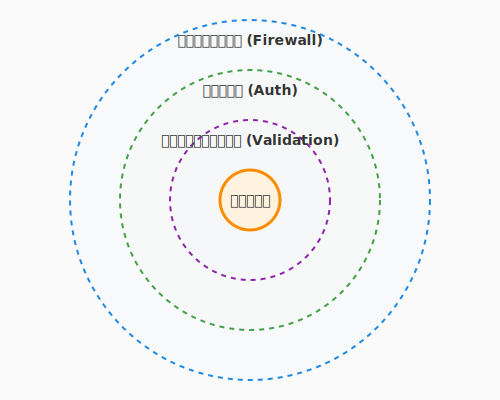

# 6.3 鍛冶場の結界——セキュリティという守りの技法（The Ward of the Forge）

**執筆状態**: 🟩 暫定完了

**最終更新**: 2026-02-08

---

## 導入: 結界なき城は砂の城

CI/CDパイプライン（6.2）で、コードが自動的に本番環境へ届く仕組みを手に入れました。しかし、外の世界は必ずしも友好的ではありません。あなたのソフトウェアが外界に公開された瞬間から、それは**守るべき城**になります。

セキュリティは「怖い」「自分には関係ない」と感じるかもしれません。しかし、考え方を変えてみましょう。セキュリティとは、**あなたの作品とユーザーを守る「結界」**を張ること。それは、鍛冶場で武器を鍛えるように、ソフトウェアの「強度」を高めるクラフトマンシップの一部です。

このセクションでは、セキュアコーディングの基本原則から、認証・認可のパターン、そしてCI/CDに組み込むDevSecOpsまで——ソフトウェアを脅威から守る実践的な技法を学びます。



---

## セキュアコーディングの三原則

セキュリティの基本は、驚くほどシンプルな原則に集約されます。

### 1. 入力を信じない（Input Validation）

外部から来るデータは、すべて「未知の来訪者」です。正体を確かめてから城門を開きましょう。

```python
from dataclasses import dataclass

# QuestForge: クエスト作成のバリデーション
@dataclass
class QuestInput:
    title: str
    difficulty: int
    description: str

def create_quest(input_data: dict) -> QuestInput:
    title = input_data.get("title", "")

    # 長さの検証
    if not (1 <= len(title) <= 100):
        raise ValueError("タイトルは1〜100文字で入力してください")

    # 型の検証
    difficulty = input_data.get("difficulty")
    if not isinstance(difficulty, int) or not (1 <= difficulty <= 10):
        raise ValueError("難易度は1〜10の整数で指定してください")

    # HTMLタグの除去（XSS対策）
    import html
    safe_description = html.escape(input_data.get("description", ""))

    return QuestInput(title=title, difficulty=difficulty, description=safe_description)
```

### 2. 最小権限の原則（Principle of Least Privilege）

機能やユーザーには、**必要最小限の権限だけ**を与えます。

```python
# シンプルな例: 全権限を与えてしまう
def get_all_quests(db, user):
    return db.query("SELECT * FROM quests")  # 全員が全クエストを見える

# さらに効果的な方法: ユーザーに応じた権限で絞る
def get_user_quests(db, user):
    return db.query(
        "SELECT * FROM quests WHERE guild_id = %s",
        (user.guild_id,)  # パラメータ化クエリでSQLインジェクションも防止
    )
```

### 3. 出力をエスケープする（Output Encoding）

データを表示する際は、コンテキストに応じたエスケープを行います。HTML、JavaScript、SQLなど、出力先ごとにルールが異なります。

```python
# テンプレートエンジンの自動エスケープを活用する
# Jinja2の例: {{ quest.title }} は自動的にHTMLエスケープされる

# 手動でエスケープが必要な場合
import html
safe_output = html.escape(user_input)  # <script> → &lt;script&gt;
```

---

## OWASP Top 10 を知る——最も多い脅威のカタログ

**OWASP（Open Worldwide Application Security Project）** が公開する「Top 10」は、Webアプリケーションで最も頻繁に見られるセキュリティ上の弱点をまとめたリストです。全てを詳細に学ぶ必要はありませんが、**「何が存在するか」を知っていること**が守りの第一歩です。

| 順位 | カテゴリ | QuestForgeでの例 |
|------|---------|-----------------|
| 1 | アクセス制御の不備 | 他プレイヤーのクエストを編集できてしまう |
| 2 | 暗号化の不備 | パスワードを平文で保存している |
| 3 | インジェクション | SQLインジェクション、XSS |
| 4 | 安全でない設計 | 認証チェックが特定のルートにしかない |
| 5 | セキュリティ設定の不備 | デバッグモードが本番で有効 |

> **コツ**: OWASP Top 10 は「チェックリスト」として活用しましょう。新しい機能を作るたびに「この機能、Top 10 のどれかに引っかからないか？」と自問する習慣が、セキュリティ意識を自然に高めます。

---

## 認証と認可——「あなたは誰？」と「何ができる？」

**認証（Authentication）** は「あなたは誰ですか？」、**認可（Authorization）** は「あなたに何が許されていますか？」を確認することです。この二つは似ているようで、明確に異なる概念です。

### パスワードの安全な扱い

```python
# bcryptでパスワードをハッシュ化する
import bcrypt

def hash_password(password: str) -> bytes:
    """パスワードを安全にハッシュ化する"""
    salt = bcrypt.gensalt()
    return bcrypt.hashpw(password.encode('utf-8'), salt)

def verify_password(password: str, hashed: bytes) -> bool:
    """パスワードを検証する"""
    return bcrypt.checkpw(password.encode('utf-8'), hashed)

# パスワードは絶対に平文で保存しない
# ハッシュ化されたパスワードだけをデータベースに保存する
```

### JWT（JSON Web Token）の基本

JWTは、ユーザーの認証情報を安全に受け渡すための標準的なトークン形式です。

```python
import jwt
from datetime import datetime, timedelta

SECRET_KEY = "your-secret-key"  # 実際には環境変数から取得する

def create_token(user_id: str) -> str:
    """認証トークンを生成する"""
    payload = {
        "user_id": user_id,
        "exp": datetime.utcnow() + timedelta(hours=1),  # 1時間で有効期限切れ
        "iat": datetime.utcnow()
    }
    return jwt.encode(payload, SECRET_KEY, algorithm="HS256")

def verify_token(token: str) -> dict:
    """トークンを検証してペイロードを返す"""
    return jwt.decode(token, SECRET_KEY, algorithms=["HS256"])
```

> **ポイント**: JWTの `SECRET_KEY` は環境変数やシークレット管理サービスで管理し、ソースコードにハードコーディングしないことが鉄則です。

---

## 依存ライブラリの脆弱性管理

現代のソフトウェアは、多くの外部ライブラリに依存しています。あなた自身のコードが完璧でも、依存ライブラリに脆弱性があれば、城門は破られます。

### 自動チェックツール

```bash
# Python: pip-audit で脆弱性をスキャン
pip-audit

# Node.js: npm audit
npm audit

# GitHub: Dependabot が自動的にプルリクエストを作成
# .github/dependabot.yml で設定
```

```yaml
# .github/dependabot.yml の設定例
version: 2
updates:
  - package-ecosystem: "pip"
    directory: "/"
    schedule:
      interval: "weekly"
    open-pull-requests-limit: 10
```

Dependabotを有効にしておくと、依存ライブラリに脆弱性が見つかった際に、修正バージョンへのアップデートを提案するプルリクエストが自動的に作成されます。まるで、城の見張り番が24時間体制でパトロールしてくれるようなものです。

---

## DevSecOps——CI/CDにセキュリティを組み込む

6.2節で学んだCI/CDパイプラインに、セキュリティチェックを「自然に」組み込むアプローチを **DevSecOps** と呼びます。

```yaml
# GitHub Actions: セキュリティチェックを含むパイプライン
name: Security Pipeline
on: [push, pull_request]

jobs:
  security:
    runs-on: ubuntu-latest
    steps:
      - uses: actions/checkout@v4

      # 依存ライブラリの脆弱性チェック
      - name: Audit dependencies
        run: pip-audit

      # シークレットの混入チェック
      - name: Scan for secrets
        uses: trufflesecurity/trufflehog@main
        with:
          path: ./

      # 静的セキュリティ解析
      - name: Run Bandit (Python security linter)
        run: bandit -r src/ -f json
```

ポイントは、セキュリティチェックを**「特別なイベント」ではなく「日常のワークフロー」**にすることです。コードをプッシュするたびに自動的にチェックされるため、脆弱性が混入した瞬間に検知できます。

---

## 実践: QuestForgeでのセキュリティ対策

QuestForgeに具体的なセキュリティ対策を施してみましょう。

### XSS（クロスサイトスクリプティング）対策

プレイヤーがクエストの説明文に `<script>alert('hacked!')</script>` と入力した場合、そのまま表示するとブラウザでスクリプトが実行されてしまいます。

```python
# テンプレートエンジンの自動エスケープを活用
# Flask + Jinja2 の場合、{{ }} は自動エスケープされる
# <script> → &lt;script&gt; として表示される

# Markdownを許可したい場合は、ホワイトリスト方式でサニタイズ
import bleach

def sanitize_quest_description(raw_html: str) -> str:
    """安全なHTMLタグだけを許可する"""
    allowed_tags = ['p', 'br', 'strong', 'em', 'ul', 'ol', 'li', 'code']
    return bleach.clean(raw_html, tags=allowed_tags)
```

### CSRF（クロスサイトリクエストフォージェリ）対策

CSRFトークンを使って、リクエストが正規のフォームから送信されたことを確認します。

```python
# Flask-WTFを使用した例
from flask_wtf.csrf import CSRFProtect

app = Flask(__name__)
csrf = CSRFProtect(app)
# これだけで、全てのPOSTリクエストにCSRFトークン検証が追加される
```

---

## AIへの詠唱例

この節で学んだことを実践するためのプロンプト：

```
以下のPython Webアプリケーションのコードをセキュリティの観点からレビューしてください。
OWASP Top 10を参考に、以下の点をチェックしてください：
- SQLインジェクションの可能性
- XSSの可能性
- 認証・認可の不備
- シークレットのハードコーディング
修正案もあわせて提示してください。

[コードを貼り付け]
```

```
以下のGitHub Actionsワークフローに、セキュリティチェック（依存ライブラリの脆弱性スキャン、
シークレット検出、静的セキュリティ解析）のステップを追加してください。

[既存のworkflow YAMLを貼り付け]
```

---

## まとめ

- **入力を信じない**: 外部データは必ずバリデーションし、エスケープしてから使う
- **最小権限**: 必要最小限の権限だけを付与し、攻撃の影響範囲を限定する
- **OWASP Top 10 をチェックリストに**: 新機能の開発時に脅威のカタログを参照する習慣を持つ
- **認証と認可を分けて考える**: 「誰か」と「何ができるか」は別の仕組みで管理する
- **依存ライブラリを監視**: DependabotやCI/CDでの自動チェックで脆弱性を早期発見する
- **DevSecOps**: セキュリティを「特別な作業」ではなく「日常のワークフロー」に組み込む

---

## さらに学ぶためのリソース

- 📚 **書籍**: 徳丸浩『体系的に学ぶ 安全なWebアプリケーションの作り方 第2版』（Webセキュリティの定番教科書）
- 🌐 **ドキュメント**: [OWASP Top 10](https://owasp.org/www-project-top-ten/)（最新の脅威カタログ）
- 🌐 **ドキュメント**: [OWASP Cheat Sheet Series](https://cheatsheetseries.owasp.org/)（実践的なセキュリティガイド集）
- 📚 **書籍**: Jim Manico, August Detlefsen『Iron-Clad Java』（セキュアコーディングの実践）
- 🌐 **学習サイト**: [PortSwigger Web Security Academy](https://portswigger.net/web-security)（ハンズオンで学ぶWebセキュリティ）

---

**Meta Information**:
- 文字数: 約4200
- 主要概念: セキュアコーディング、OWASP Top 10、認証・認可、JWT、依存ライブラリ管理、DevSecOps
- コード例数: 7
- 必要な図: セキュリティの多層防御の概念図
- AI詠唱例: 2
