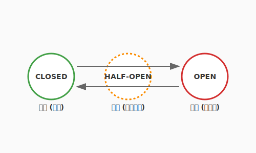

# 6.5 カオスへの耐性——レジリエンスと自己修復

どれほど強固な石造りの城も、未曾有の大地震には勝てないかもしれません。
ソフトウェアの世界でも、100%の稼働を保証することは不可能です。ネットワークは途切れ、クラウドのサーバーは突然死に、外部APIは予告なく停止します。

そんな「予期せぬ不幸」が起きた時、システムはガシャガシャと音を立てて崩れ落ちるしかないのでしょうか？

アルケミスト（エンジニア）の答えは「NO」です。
私たちは、システムに**レジリエンス（回復力・弾力性）**という「守護の霊薬」を投与することができます。それは、嵐の中で折れる樫の木ではなく、風をしなやかに受け流し、折れてもまた伸びる柳のような強さです。

次の図は、サーキットブレーカーの3つの状態（Closed・Open・Half-Open）と、それぞれの遷移条件を示しています。



ここで示されているのは、電気回路のブレーカーと同じ発想です。通常時（Closed）は接続を許可しますが、障害が閾値を超えると遮断（Open）に切り替わり、外部サービスへの接続を止めます。一定時間後に半開（Half-Open）状態で接続を試み、成功すれば通常に戻ります。この自動的な遮断と復旧が、一部の不調がシステム全体に波及するのを防ぎます。

---

## 故障は「前提」である

まず、マインドセットを切り替えましょう。
「いかに故障を防ぐか」ではなく、**「故障は必ず起きる。起きた時にいかに被害を最小限に抑え、素早く立ち直るか」**を考えます。

この「Design for Failure（失敗を前提とした設計）」こそが、大規模なシステムを支える哲学です。錬金術師が実験の失敗を糧に真理に近づくように、私たちもシステムの不完全さを前提に、より高次の安定を目指します。

---

## Circuit Breaker: 延焼を防ぐ防波堤

QuestForgeが「外部のドラゴン討伐API」と連携しているとしましょう。ある日、このAPIが故障して応答しなくなりました。
そのまま呼び出し続けると、QuestForgeのサーバーまで応答待ちの列（渋滞）で埋め尽くされ、ついにはアプリ全体が沈没してしまいます。

これを防ぐのが**Circuit Breaker（サーキットブレーカー）**という「遮断の結界」です。
電気のブレーカーと同じように、不調な部品への接続を一時的に「遮断（Open）」します。

- **遮断中**: 故障箇所を呼び出さず、すぐに「今はドラゴンが不在です」という代替データ（フォールバック）を返します。
- **回復確認**: 一定時間後、少しだけ通信を試します（Half-Open）。成功すれば「結界を解き」、接続を再開（Closed）します。

これにより、一部の不調がシステム全体に波及するのを防ぎます。「一部が壊れても、他の機能（冒険者の持ち物確認など）は動き続ける」という、しなやかな強さの第一歩です。

---

## カオスエンジニアリング: 免疫力を鍛える

システムのレジリエンスを確かめる最も過激で効果的な方法。それが、**カオスエンジニアリング**です。
これは、**本番環境であえてサーバーを止めたり、ネットワークを遅延させたりして、システムが正しく耐えられるかをテストする**という手法です。

「狂気の沙汰だ！」と思うかもしれません。
しかし、あえて小さな「毒（混乱）」を摂取することで、チームは「いつ障害が起きても大丈夫だ」という絶対的な自信を得ることができます。これは、本番環境という過酷な戦場に向けた、システムの「予防接種」なのです。

## 実践：QuestForgeを共倒れから守る

QuestForgeでは、クエスト完了時に「AIによる報酬メッセージの生成」という外部APIを利用しているとしましょう。もしこの外部サービスが非常に重くなり、1回の返答に30秒かかるようになったらどうなるでしょうか？

冒険者が次々とクエストを完了させるたびに、QuestForgeのサーバーは外部サービスからの返答を待ち、接続枠（スレッド）を使い果たしてしまいます。結果として、**外部サービスの不調のせいで、QuestForgeの「移動」や「チャット」といった無関係な機能までが動かなくなってしまう**のです。

これが「共倒れ」です。

次の図は、サーキットブレーカーが共倒れを防ぐ仕組みを示しています。


ここで**サーキットブレーカー**を導入すると、外部サービスが一定回数以上失敗（または遅延）した瞬間に、即座に「遮断」が実行されます。
- **遮断中**: 外部サービスを呼び出さず、代わりに「デフォルトのメッセージ」を即座に返します（フォールバック）。
- **効果**: QuestForgeのサーバーリソースは守られ、冒険者は「AIの返答はないが、ゲームは快適に続けられる」という状態を維持できます。

---

## 自己修復 (Self-Healing): 眠らない守護神

現代のプラットフォーム（Kubernetesなど）には、異常なコンテナを自動的に再起動したり、負荷に応じてサーバーを増設（オートスケーリング）したりする機能が備わっています。

人間が夜中に叩き起こされて再起動ボタンを押すのではなく、システムが自ら「あ、ここが不調だな、新しく作り直そう」と判断して修復する。この**自己修復能力**こそが、自律した「生命体」としてのソフトウェアの完成形です。

---

## まとめ

レジリエンスの美学は「故障をゼロにする」ことではなく、「故障からしなやかに立ち直る」設計を選ぶことにあります。ネットワークや外部サービスは「いつか止まるもの」として前提に置き、フォールバックを用意する——このマインドセットの転換が、大規模システムを支える哲学の根本です。Circuit Breakerは不調を局所化して共倒れを防ぎ、Kubernetesの自己修復機能は人間が眠っている間もシステムを再生し続けます。

カオスエンジニアリングは、その名に反して非常に合理的な発想です。あえて小さな「毒」を本番環境に摂取させることで、チームは「いつ障害が起きても大丈夫だ」という絶対的な自信を手に入れます。不確実な世界で生き抜くソフトウェアとは、折れない樫の木ではなく、風をしなやかに受け流し、折れてもまた伸びる柳——カオスを友とする存在なのです。

6.6節では、このように強靭に動き続けるシステムを「ユーザーと一緒に進化させる」フィードバックループの技法へと進みます。Feature FlagsやA/Bテストを駆使して、ユーザーの声を直接製品の成長に変えていきましょう。

---

## AIへの詠唱例

この節で学んだことを実践するためのプロンプト：

```
マイクロサービスアーキテクチャにおいて「Circuit Breaker」を導入するメリットと、
それがなかった場合に起きる「カスケード失敗（連鎖的な障害）」のシナリオを、
QuestForgeのようなRPGアプリを例に挙げて、中学生でも分かるように説明してください。
```

```
Pythonのライブラリ（例：tenacityやresilience4jの概念）を使って、
外部API呼び出しに「リトライ処理」と「指数バックオフ（Exponential Backoff）」を
実装するサンプルコードを書いてください。
```

---

## さらに学ぶためのリソース

- 🌐 **Web**: [PRINCIPLES OF CHAOS ENGINEERING](https://principlesofchaos.org/)（カオスエンジニアリングの基本原則を定めた、すべてのプラクティスの出発点。日本語訳もあります）
- 🌐 **Web**: [Netflix Technology Blog - Chaos Monkey Guide for Resilience](https://netflix.github.io/chaosmonkey/)（カオスエンジニアリングの先駆けとなったNetflixのツール。その思想と使い方が詳述されています）
- 📚 **書籍**: Casey Rosenthal, Nora Jones『[Chaos Engineering: System Resiliency in Practice](https://www.oreilly.co.jp/books/9784814400263/)』（カオスエンジニアリングの提唱者たちによる、実践的な導入ガイド）
- 📄 **論文**: C. Rosenthal et al. "[Chaos Engineering](https://dl.acm.org/doi/10.1145/2857056.2857057)" (2015)（カオスエンジニアリングという新しい分野を学術的に定義した論文）
- 🌐 **Web**: [AWS Architecture Blog - Reliability Pillar](https://aws.amazon.com/blogs/architecture/category/learning-levels/well-architected/reliability/)（クラウド上で高い信頼性を実現するための、AWS Well-Architected Frameworkのベストプラクティス）

