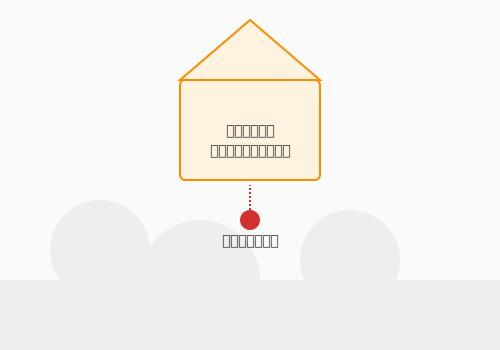

# 6.8 【外伝】浮遊する魔導城——サーバーレスとクラウドの経済学


かつて、魔法を発動させるには自前の魔法陣（サーバー）を丹念に描き、維持し続ける必要がありました。サーバーの調達、OSのセットアップ、ミドルウェアの設定、パッチ適用——魔法を使う前に、城の管理だけで膨大な労力が費えていました。

しかし現代のクラウドという空には、必要な時だけ顕現し、役目を終えれば雲散霧消する**「浮遊する魔導城（サーバーレス）」**が存在します。サーバーレスとは、「サーバーが存在しない」のではなく、「サーバーの存在をあなたが意識しなくてよい」という設計思想です。

この実体を持たない城は、どのような仕組みで動き、どう運用すればよいのでしょうか。「魔力（クラウドコスト）」を賢く統治するFinOpsの知恵とともに探っていきましょう。

次の図は、サーバーレスという「浮遊する魔導城」のアーキテクチャ概念と、従来の常駐サーバーとの対比を示しています。



ここで示されているのは、「呼ばれた瞬間だけ顕現する城」というサーバーレスの本質です。従来のサーバーが夜中も門番を常駐させるのに対し、FaaSは必要な時だけ召喚されてすぐに消えます。この「使った分だけ課金」という性質が、散発的なイベント処理では圧倒的なコスト効率をもたらします。

---

## 瞬時の顕現：FaaSとイベント駆動アーキテクチャ

サーバーレスがどんな魔法を使っているのか、その本質から紐解いていきましょう。

### サーバーレスの本質

サーバーレスの極意は、**「イベントが発生した時だけ、魔力が物質化する」**という点にあります。

| 方式 | 比喩 | 課金 |
|------|------|------|
| 従来のサーバー | 夜中も門番が常駐する城 | 常時課金（稼働中は常にコスト） |
| サーバーレス（FaaS） | 呼ばれた瞬間だけ召喚される門番 | 実行時間×実行回数で課金 |

**FaaS（Function as a Service）** の代表がAWS Lambdaです。QuestForgeにおける使い方を見てみましょう。

```python
# AWS Lambda: クエスト完了時の通知関数
import json
import boto3

def lambda_handler(event, context):
    """
    クエスト完了イベントを受け取り、勇者に通知を送る
    EventBridgeからトリガーされる
    """
    quest_id = event['detail']['quest_id']
    hero_id = event['detail']['hero_id']

    # SNSで通知を送信
    sns = boto3.client('sns')
    sns.publish(
        TopicArn='arn:aws:sns:ap-northeast-1:123456789:quest-notifications',
        Message=json.dumps({
            'hero_id': hero_id,
            'message': f'クエスト {quest_id} を完了しました！経験値を獲得！'
        })
    )

    return {'statusCode': 200, 'body': 'Notification sent'}
```

この関数は「クエスト完了イベントが発生した時だけ」起動し、完了すれば消えます。月に1万件のクエストが完了しても、コストは関数の実行時間に対してのみ発生します。

Lambda単体の動きが掴めたところで、複数のコンポーネントが連鎖するイベント駆動の全体像を見てみましょう。

### イベント駆動の設計パターン

サーバーレスはイベント駆動アーキテクチャと相性が抜群です。QuestForgeでは以下のような構成が考えられます。

```
[ユーザーアクション]
       ↓
[API Gateway]  ← HTTPリクエストを受け取る
       ↓
[Lambda関数]   ← ビジネスロジックを実行
       ↓
[EventBridge]  ← 結果をイベントとして発行
       ↓
[他のLambda]   ← 通知・分析・ログなど各処理が独立して反応
```

各コンポーネントが疎結合に連携し、それぞれが独立してスケールします。

---

## サーバーレスの設計上の特性

イベント駆動の全体像が見えてきたところで、サーバーレスを使いこなすために押さえておきたい特性を確認しましょう。

### Cold Startへの対策

サーバーレスには**Cold Start**という特性があります。長時間呼ばれなかった関数を起動する際、初期化に数百ms〜数秒かかることがあります。これはリアルタイム性が求められる機能への配慮が必要な特性です。

**対策の選択肢:**

- **Provisioned Concurrency（AWS Lambda）**: 一定数のインスタンスを常時ウォームアップしておく（コスト増だが遅延を解消）
- **定期的なウォームアップ**: CloudWatch Eventsで定期的に関数を呼び出してウォームな状態を維持
- **ランタイムの選択**: Python・Node.jsはGo・Rustより起動が遅い傾向があるため、レイテンシ重視の関数はランタイムを選ぶ

Cold Startへの対処法が整ったら、もう一つの制約である実行時間の上限も確認しておきましょう。

### 実行時間の上限

AWS Lambdaは最大15分の実行時間制限があります。長時間バッチ処理（大量データの集計など）には向きません。そのような処理には、Step FunctionsやECS（コンテナ実行）を組み合わせる設計が有効です。

---

## 魔力の統治術：FinOps

サーバーレスの技術的な特性を理解したところで、「魔力（クラウドコスト）」をどう賢く統治するかという経済的な視点に移りましょう。

### クラウドコストという「見えにくい魔力の消費」

オンプレミス（自社所有サーバー）では、ハードウェア費用は固定です。一方クラウドは**使った分だけ課金**されるため、設計の良し悪しが直接コストに現れます。無駄な呪文を走らせ続ければ、クラウドの魔力供給源から膨大な請求が届きます。

**FinOps（フィノプス）**とは、Finance（財務）とDevOpsを組み合わせた言葉で、技術者・財務・ビジネスが連携してクラウドコストを可視化・最適化する文化と実践です。

では、FinOpsの実践においてどのようなコスト最適化の手段があるのか、主要な手法を順に見ていきましょう。

### コスト最適化の主要な手法

**1. 適正サイジング**

Lambda関数のメモリ設定は、コストと実行速度のトレードオフです。メモリを増やすと実行速度が上がりますが、コストも増えます。AWS Lambda Power Tuningなどのツールで最適なメモリ量を計測しましょう。

```
メモリ128MB: 実行時間 500ms → コスト $0.0000010
メモリ512MB: 実行時間 200ms → コスト $0.0000017
メモリ1024MB: 実行時間 120ms → コスト $0.0000020
← 速度は4倍になるが、コストも2倍。用途によって選択する
```

**2. 不要リソースの整理**

クラウドでは「使っていないが課金されているリソース」が積み重なりやすい特性があります。

- 停止したままのEC2インスタンス
- アタッチされていないEBSボリューム
- 古いLambdaバージョンと未使用ログ

AWS Cost Explorerや、Infracostなどのツールで定期的に棚卸しをすることが有効です。

**3. Spot/Preemptibleインスタンスの活用**

バッチ処理や開発環境には、通常より70〜90%安い**Spot Instance（AWS）** や **Preemptible VM（GCP）** を活用できます。中断されても再実行できる設計を前提に使います。

**4. リザーブドキャパシティ**

長期間安定して使うリソースは、1〜3年の**Reserved Instance（予約購入）**で最大72%のコスト削減が可能です。「予測可能なベースライン」をReserved、「突発的なスパイク」をSpotやOn-Demandで賄うのが定石です。

これらの手法を組み合わせるにあたって、まず「どこで何が使われているか」を可視化することが出発点です。

### コスト可視化のダッシュボード

FinOpsの第一歩は「どこで何を使っているか」の可視化です。

```
[AWS Cost Explorer]
  ├── サービス別コスト（Lambda vs RDS vs S3）
  ├── 環境別コスト（本番 vs 開発 vs テスト）
  └── チーム・機能別タグ付きコスト
          ↓
  「クエスト検索機能」のコストが急増 → Lambda実行回数の増加を検知
          ↓
  クエリの最適化でDynamoDB読み込みを削減 → コスト30%改善
```

---

## サーバーレスが輝く場面・そうでない場面

サーバーレスはあらゆる状況の万能薬ではありません。特性を理解して使い所を選ぶことが、賢い魔導師の条件です。

| ユースケース | 向き不向き | 理由 |
|------------|-----------|------|
| イベント駆動の非同期処理（通知・集計） | ◎ 最適 | 散発的な実行にコスト効率が高い |
| 軽量API（低トラフィック） | ○ 向く | スケールゼロで運用コストが低い |
| 高トラフィックWebAPI（常時アクセス） | △ 要検討 | コンテナの方がCold Start不要で安定 |
| 長時間バッチ処理（数時間） | △ 向かない | 実行時間制限・コスト上昇の可能性 |
| レガシーシステムの段階的移行 | ○ 有効 | 特定機能のみ切り出してサーバーレス化 |

---

## まとめ

サーバーレスの本質は、サーバーという「モノ」への意識から解放され、「価値（コード）」の実行そのものに集中することにあります。FaaSは散発的・イベント駆動な処理と相性が良く、呼ばれた瞬間だけ顕現して役目を終えれば消える魔導城は、従来の常駐サーバーと比べてコストと運用の両方で大きな利点をもたらします。Cold Startという特性を理解し、Provisioned Concurrencyや設計上の工夫で対処できれば、その特性は弱点ではなく個性として扱えます。

FinOpsの視点でクラウドコストを可視化し、適正サイジング・不要リソースの整理・リザーブドキャパシティを組み合わせることで、コストという「魔力の消費」を賢く統治できます。サーバーレスはあらゆる問題の答えではなく、コンテナ・サーバーレス・マネージドサービスを組み合わせた最適なアーキテクチャ選択こそが真の腕の見せどころです。浮かべる城の数と大きさを、コストという現実と向き合いながら統治する知恵——それが現代の魔導師に不可欠な資質なのです。

第7章では、こうした強力な技術を持つ個人たちがチームとして機能するための方法論へと進みます。アジャイルという名の冒険パーティで、スクラム・Git・ペアプログラミングを武器に、持続可能な速度で最高の価値を届ける技法を学びましょう。

---

## AIへの詠唱例

```
AWS Lambda と API Gateway を使って、QuestForgeの「クエスト完了通知機能」を実装したいです。
以下の要件を満たすアーキテクチャ構成案とTerraformコードの例を提示してください：
- EventBridgeからのイベントトリガー
- SNSを使った非同期通知
- Cold Startを最小化するための設定
- コストを抑えるためのメモリ設定の考え方
```

---

## さらに学ぶためのリソース

- 🌐 **ドキュメント**: [AWS Lambda Documentation](https://docs.aws.amazon.com/lambda/)（サーバーレスコンピューティングの先駆者の公式ドキュメント）
- 🌐 **ドキュメント**: [Vercel Documentation](https://vercel.com/docs)（サーバーレスなフロントエンドとバックエンドのデプロイを極限までシンプルにするプラットフォーム）
- 🌐 **Web**: [FinOps Foundation](https://www.finops.org/)（クラウドコスト最適化の標準的な実践体系を提供する業界団体）
- 📄 **論文**: E. Jonas et al. "[Cloud Programming Simplified: A Berkeley View on Serverless Computing](https://arxiv.org/abs/1902.03383)" (2019)（サーバーレスがクラウドの未来をどう変えるかをバークレー大学の研究者が論じた重要論文）
- 📚 **書籍**: 西谷 圭介『[AWSサーバーレス開発ガイド](https://www.shoeisha.co.jp/book/detail/9784798158358)』（AWSを活用した実践的なサーバーレスアーキテクチャの構築方法）
