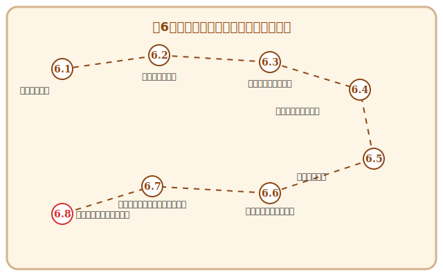

# 第6章 進化する生命体——デプロイと運用

## この章で手に入れる力

第5章で、あなたはリファクタリングの技法でコードを美しく磨き上げる力を手に入れました。テスト（第4章）という安全網に守られながら磨かれたコードも、工房の中に閉じこもったままでは、誰の役にも立てません。

ソフトウェアの真の価値は、ユーザーの手に届いた瞬間に初めて生まれます。工房で丹精込めて作り上げた「動く像」を、広大な外界——本番環境——へと解き放ち、そこで自律的に活動し、成長し続ける**「生命体」**へと進化させること。それが、この章のテーマです。

この章では、デプロイを「恐怖の儀式」から**「日常の営み」**へと変える技術、システムの健康状態を感じ取る可観測性、そしてユーザーとの対話を通じて共に進化するフィードバックループまで——ソフトウェアに命を吹き込み、育て続けるための知恵を学びましょう。

## 冒険の地図

---

## 本章の構成

- **6.1 命を吹き込む儀式**：デプロイメントの進化（Blue/Green、カナリアリリース）。
- **6.2 絶え間なき循環**：CI/CDパイプラインとGitHub Actions。
- **6.3 鍛冶場の結界**：セキュアコーディングとDevSecOpsの防衛術。
- **6.4 脈動を聴く**：オブザーバビリティ（ログ・メトリクス・トレース）。
- **6.5 カオスへの耐性**：レジリエンス設計、Circuit Breaker、カオスエンジニアリング。
- **6.6 ユーザーとの共進化**：フィードバックループ（Feature Flags、A/Bテスト）。
- **6.7 【外伝】浮遊する魔導城**：サーバーレスとクラウドの経済学。

---

## 読了後のあなた

この章を読み終えると、あなたは以下のことができるようになります。

- **解き放つ**: Blue/Greenデプロイやカナリアリリースで、安心してソフトウェアを本番環境へ届けられる
- **自動化する**: CI/CDパイプラインで、コードを書いてから本番に届くまでの流れを自動化できる
- **守る**: セキュアコーディングの原則とDevSecOpsで、ソフトウェアを脅威から守れる
- **感じ取る**: ログ・メトリクス・トレースの三位一体で、システムの健康状態を把握できる
- **備える**: Circuit Breakerやカオスエンジニアリングで、予期しない事態にも強いシステムを設計できる
- **対話する**: Feature FlagsやA/Bテストで、ユーザーの反応を見ながらソフトウェアを進化させられる
- **統治する**: サーバーレスやクラウドの経済性を理解し、効率的な魔導インフラを選択できる

さあ、工房の扉を開き、あなたのソフトウェアを広い世界へ送り出しましょう。

---

## さらに学ぶためのリソース（章全体）

この章のテーマである「運用のエンジニアリング」と「デリバリーの文化」を学ぶための、現代の標準的な聖典です。

- 📚 **書籍**: Gene Kim他『[The DevOps ハンドブック 理論・原則・実践のすべて](https://shop.nikkeibp.co.jp/asbp/shop/course/devops/)』（DevOpsの全体像を「三つの道」として体系化した決定版。組織文化から技術基盤までを網羅しています）
- 📚 **書籍**: Betsy Beyer他『[SRE サイトリライアビリティエンジニアリング ―Googleの信頼性を支えるエンジニアリングチーム](https://www.oreilly.co.jp/books/9784873117911/)』（運用をソフトウェアの問題として解決するSREの聖典。大規模システムの信頼性をいかに守るかの知恵が詰まっています）

### 📜 賢者伝説（学術論文）

- 📄 **00s**: Roy T. Fielding "[Architectural Styles and the Design of Network-based Software Architectures](https://www.ics.uci.edu/~fielding/pubs/dissertation/top.htm)" (2000)（現代のWebの基盤であるRESTアーキテクチャスタイルを定義した伝説的学位論文）
- 📄 **00s**: Werner Vogels "[Eventually Consistent](https://dl.acm.org/doi/10.1145/1435417.1435432)" (2009)（AmazonのCTOが、大規模分散システムにおける可用性と整合性のトレードオフを説いた重要論文）
