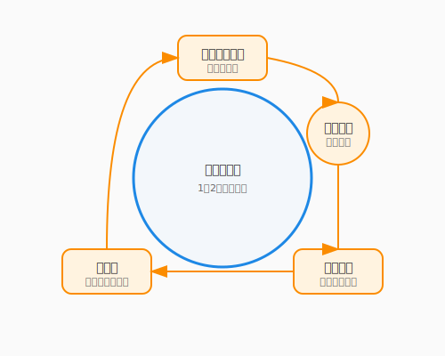

# 7.1 スクラムの祝祭

一人で旅をするなら、自分のペースで歩けば良いでしょう。しかし、パーティ（チーム）で冒険するとなれば話は別です。ある者は先走り、ある者は立ち止まり、気づけばバラバラになってしまう——そんな経験はありませんか？

チーム開発において最も恐ろしいのは、進むべき方向を見失うことではなく、**リズム**を失うことです。

ここで紹介する**スクラム（Scrum）**は、チームに「心臓の鼓動」のような一定のリズムを与えるフレームワークです。それは管理のための拘束具ではありません。むしろ、定期的に立ち止まり、互いの健闘を称え合い、次の一歩を確かにするための**祝祭（セレモニー）**なのです。

### アジャイルの誓い

スクラムの根底には、2001年に17人のソフトウェア開発者が署名した「アジャイルソフトウェア開発宣言」という価値観が流れています。

> 私たちは、ソフトウェア開発の実践あるいは実践を手助けをする活動を通じて、よりよい開発方法を見つけだそうとしている。この活動を通じて、私たちは以下の価値を見出した：
>
> プロセスやツール よりも **個人と対話** を、
> 包括的なドキュメント よりも **動くソフトウェア** を、
> 契約交渉 よりも **顧客との協調** を、
> 計画に従うこと よりも **変化への対応** を、
>
> **価値とする。すなわち、左記のことがらに価値があることを認めながらも、私たちは右記のことがらにより価値をおく。**

この最後の一文が、宣言の精髄です。

よく誤解されますが、アジャイルは「ドキュメントを書くな」「契約するな」「計画を立てるな」とは言っていません。プロセス・ドキュメント・契約・計画には確かに価値がある——それを認めた上で、しかしそれらより優先すべきものがある、と言っているのです。


この「両方大事だけど、どちらがより大事か」という思考は、冒険の優先順位を決める時と同じです。地図（計画）は持つべきですが、実際の地形（現実の変化）が地図と違えば、地形の方を信じる。それがアジャイルの知恵です。

> ### コラム: 「スクラム」という言葉の由来
>
> **スクラム（Scrum）** はもともと、ラグビーの用語です。ボールのこぼれた時、両チームの選手たちが肩を組んで密集し、一丸となってボールを奪い合うあの隊形——それが「スクラム」です。
>
> 1986年、一橋大学の竹内弘高氏と野中郁次郎氏は、ハーバード・ビジネス・レビューに論文「The New New Product Development Game」を発表しました。彼らは当時のソニー・本田・キヤノンなど日本企業の製品開発を調査し、最も革新的な開発チームはラグビーのスクラムのように「チーム全体が一つのユニットとして前進する」と気づきました。それまでの「前の工程が終わったら次の担当に渡す」リレー式ではなく、**設計・開発・テストを担う全員が同時に走る**方式を、彼らはスクラムと名付けたのです。
>
> このラグビーの比喩に感銘を受けたジェフ・サザーランドとケン・シュエイバーが、1990年代初頭にソフトウェア開発の具体的なフレームワークとして体系化し、現在のスクラムが生まれました。
>
> 「全員で肩を組み、一緒に前に進む」——この言葉は、チーム開発の本質を今も鋭く言い表しています。

---

## スプリント: 冒険の区切り

スクラムでは、開発期間を**スプリント（Sprint）**と呼ばれる短い区切り（通常1〜2週間）に分割します。

次の図は、スクラムの祝祭（セレモニー）がスプリントというサイクルの中でどのように配置されているかを示しています。



終わりなきマラソンは大変ですが、ゴールが見えている短距離走なら全力を出せます。スプリントは、その名の通り「短距離走」の繰り返しです。

### なぜ区切るのか？

1.  **小さな勝利を祝う**: 2週間ごとに「動くもの（インクリメント）」が完成すれば、チームは達成感を味わえます。これは冒険のモチベーションを保つ最大の秘訣です。
2.  **変化を受け入れる**: 長期計画は変更に手間がかかりますが、2週間後の計画なら柔軟に変えられます。「やっぱりこっちの機能が欲しい」という顧客の要望も、次のスプリントで歓迎できます。
3.  **リズムを生む**: 「プランニング→開発→レビュー→ふりかえり」というサイクルが、チームに心地よい呼吸をもたらします。

---

## 3つの役割: 冒険のキャスト

スクラムチームには、3つの明確な役割があります。

| 役割 | ファンタジーRPGでの例え | 責務 |
|------|-------------------|------|
| **プロダクトオーナー (PO)** | 依頼主 / 王様 | 「何を作るか（What）」を決める。プロダクトの価値を最大化する責任者。 |
| **スクラムマスター (SM)** | ギルドの受付 / 賢者 | 「どう進めるか（How）」を支える。チームが円滑に動けるよう障害を取り除く奉仕者。 |
| **開発者 (Developers)** | 冒険者パーティ | 「どう作るか（How）」を担う。設計から実装、テストまでを行い、価値を生み出す専門家集団。 |

ここで重要なのは、**上下関係ではない**ということです。王様（PO）も賢者（SM）も冒険者（Dev）も、同じ「プロダクトの成功」という財宝を目指す対等な仲間です。

---

## 4つの祝祭: セレモニー

スクラムには、チームのリズムを整えるための4つのイベントがあります。これらは事務的な会議ではなく、チームの結束を深める**祝祭（セレモニー）**です。

### 1. スプリントプランニング (Sprint Planning)
**「冒険の計画」**
スプリントの初日に行います。POが提示した「やりたいこと（プロダクトバックログ）」から、開発者が「このスプリントでやれること（スプリントバックログ）」を選び取ります。
「この2週間で、私たちはどんな価値を世界に届けるのか？」を全員で合意する、ワクワクする時間です。

### 2. デイリースクラム (Daily Scrum)
**「朝の作戦会議」**
毎日、同じ時間、同じ場所で、15分だけ行います。
- 昨日やったこと
- 今日やること
- 障害となっていること（あれば）

これらを共有し、パーティの連携を確認します。「報告」ではなく「作戦合わせ」です。立ったまま行う（スタンドアップ）のが通例です。

### 3. スプリントレビュー (Sprint Review)
**「戦利品の披露」**
スプリントの最終日、完成した「動くソフトウェア」をステークホルダー（関係者）にお披露目します。
パワーポイントの資料ではなく、実際のプロダクトを見せることが鉄則です。拍手とフィードバックが飛び交う、最も盛り上がる祝祭です。

### 4. スプリントレトロスペクティブ (Sprint Retrospective)
**「焚き火を囲んだ語らい」**
レビューの後、チームメンバーだけで行います。KPT法などがよく使われます。
- **Keep**: よかったこと、続けたいこと
- **Problem**: 困ったこと、課題
- **Try**: 次に試したいこと

「誰が悪かったか」を探す魔女裁判ではありません。「どうすればもっと楽しく、速く進めるか」を語り合う、前向きな改善の場です。

---

## 3つの秘宝: アーティファクト

スクラムにおける成果物は、透明性を確保するための**秘宝（アーティファクト）**です。

1.  **プロダクトバックログ**: プロダクトに必要な全ての機能や改善点のリスト。POが管理し、常に優先順位が並び替えられます。
2.  **スプリントバックログ**: 現在のスプリントで取り組むタスクのリスト。開発者が管理します。
3.  **インクリメント**: スプリントの成果物。「完成の定義（Definition of Done）」を満たし、すぐにリリース可能な状態のソフトウェアです。

---

## AI時代のスクラム: 新たな仲間

AIは、スクラムチームに新たな風を吹き込みます。

### AIスクラムマスター
デイリースクラムの要約や、レトロスペクティブでのKPT整理をAIに任せてみましょう。AIは感情を持たないため、中立的な視点で「前回のTryが実施されていませんね？」と鋭い指摘をしてくれるかもしれません。

では、チームの意思決定を支える役割にも、AIは活躍の場を広げています。

### AIプロダクトオーナー補佐
バックログのユーザーストーリーを具体化したり、受け入れ基準（Acceptance Criteria）の案を出したりする際に、AIは強力な壁打ち相手になります。

---

## まとめ

スクラムは管理ツールではなく、チームに心地よいリズムを与えるフレームワークです。スプリントという短い区切りで「小さな勝利」を積み重ねることが、モチベーションと品質の両方を支える源泉となります。終わりなきマラソンが疲労を生むように、ゴールの見えない開発は迷走を招きます——2週間という体感できる距離が、全力疾走を可能にするのです。

PO・SM・開発者の3役割は上下関係ではなく、同じ「プロダクトの成功」という財宝を目指す対等な仲間の役割分担です。そして4つの祝祭——プランニング、デイリー、レビュー、レトロスペクティブ——を事務的な義務ではなくチームの成長を喜ぶ場として育てることが、アジャイルチームを本当の「冒険パーティ」へと変えます。さあ、次のスプリントが始まります。あなたのパーティは、どんな宝物を探しに行きますか？

7.2節では、このチームの技術的な背骨とも言えるGit/GitHubを使ったバージョン管理と共同作業の技法へと進みます。ブランチ戦略やプルリクエストの作法を身につけ、チームの「コードの流れ」を美しく保ちましょう。

---

## AIへの詠唱例

この節で学んだことを実践するためのプロンプト：

```
あなたはベテランのスクラムマスターです。
私たちのチームの「スプリントレトロスペクティブ」をファシリテートしてください。
まずは、今回のスプリントの感想をチームメンバーに尋ねることから始めて、
最終的に具体的な「Try（次回の改善アクション）」を3つ導き出してください。
```

```
以下の機能要件をもとに、スクラムの「プロダクトバックログアイテム」を作成してください。
ユーザーストーリー形式（〜として、〜したい、なぜなら〜だから）で記述し、
それぞれの「受け入れ基準（Acceptance Criteria）」も3つずつ提案してください。

機能要件：
[ここに要件を入力]
```
