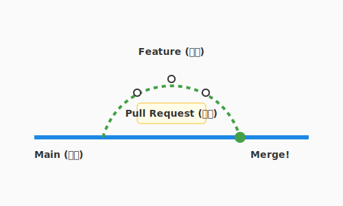

# 7.2 Git/GitHubを通じた知の交流

5.2節ではAIとの対話的なコードレビューを学びました。また6.2節では、CI/CDパイプラインの中でコードが自動的にテスト・デプロイされる流れを見てきました。この節では、その基盤となる**Git/GitHub**を使った「チームでの知の交流」に焦点を当てます。

かつて、開発者たちは「共有フォルダ」という名の荒野で戦っていました。「`final_v2_修正版.zip`」のようなファイルが飛び交い、誰かが上書き保存をするたびに、仲間の作業が消滅する悲劇が繰り返されていたのです。

Gitの登場は、この荒野に「時間操作」と「平行世界」の魔法をもたらしました。私たちは過去のあらゆる時点に戻ることができ、並行して複数の未来（機能）を試すことができます。

そしてGitHubは、Gitを単なる保存場所から**「知の交流広場」**へと進化させました。ここでは、コードは単なる命令列ではありません。開発者から開発者へ宛てた、思考と意図を乗せた「手紙」なのです。

---

## ブランチ戦略: 可能性の樹形図

Gitの強力な機能の一つに**ブランチ（Branch）**があります。これは文字通り「枝」です。本流（mainブランチ）から枝分かれして、安全な場所で実験や開発を行い、完成したら再び本流に戻す（マージする）ことができます。

冒険パーティにおいて、これは「斥候」の役割に似ています。

### シンプル・イズ・ベスト: GitHub Flow

複雑なブランチ戦略（Git Flowなど）も存在しますが、現代のアジャイル開発では、よりシンプルで高速な**GitHub Flow**が好まれます。



1.  **Main**: 常にデプロイ可能な、清浄な本流。
2.  **Feature Branch**: 新機能やバグ修正のために作成する枝。「`feature/login-screen`」のように、何をするか分かりやすい名前をつけます。
3.  **Pull Request**: 変更を本流に取り込んでもらうための「提案」。
4.  **Review & Merge**: 仲間が確認し、承認されれば本流へ合流します。

このシンプルなサイクルを高速に回すことが、チームの活力を保つ秘訣です。

---

## プルリクエスト: 知恵の交差点

プルリクエスト（PR）は、単にコードをマージするための手続きではありません。それは「私はこの課題をこう解決しました。どう思いますか？」という、チームへの問いかけです。

### 良いPRは「物語」を語る

「コードを見れば分かる」は、書き手の傲慢かもしれません。読み手（レビュアー）のために、PRにはコンテキスト（文脈）という物語を添えましょう。

- **Why**: なぜこの変更が必要なのか？（背景、目的）
- **What**: 何をしたのか？（変更の概要）
- **How**: どうやって実現したのか？（技術的な工夫、迷った点）

スクリーンショットやGIF動画を貼るのも効果的です。テキストだけの説明よりも、動く画面は百倍の雄弁さで「成果」を伝えてくれます。

---

## コードレビューの作法: 粗探しではなく「宝探し」

コードレビューを「間違い探し」や「門番の検問」だと考えていませんか？ そのマインドセットは今すぐ捨てましょう。コードレビューは、仲間と共にコードをより美しく、堅牢にするための**「共創の場」**です。

### レビュアーの心得（Reviewer）

1.  **Good First**: まず良い点を見つけて褒めましょう。「この実装、エレガントですね！」「この命名、分かりやすいです！」その一言が、レビュイー（書き手）の心理的安全性を高めます。
2.  **質問として投げる**: 「ここは間違っています」と断定するのではなく、「ここは〜という理由で、〜の方が安全ではないでしょうか？」や「この意図を教えてもらえますか？」と問いかけましょう。
3.  **Nitpick（細かい指摘）は明示する**: 本質的ではない細かい指摘（空白や改行など）には、「nits（nitpickの略）」と添えて、「修正しなくてもいいけど」というニュアンスを伝えましょう。

### レビュイーの心得（Reviewee）

1.  **コードと人格を分ける**: 指摘されているのは「コード」であって「あなた」ではありません。防御的にならず、「より良くするチャンス」として歓迎しましょう。
2.  **感謝を伝える**: レビューには時間がかかります。時間を割いてくれた仲間に「レビューありがとうございます！」と感謝を伝えましょう。

---

## AI時代の知の交流: 頼れる副操縦士

AIは、ここでも強力な助っ人になります。

### AIによるPR要約
変更内容が膨大で、PRの説明を書くのが大変？ AIに `git diff` を読ませて、「この変更の要約と、レビュアーが注目すべきポイントをMarkdownで書いて」と頼んでみましょう。驚くほど的確な下書きを作ってくれます。

### AIコードレビュー
人間がレビューする前に、AIに一次レビューを依頼するのも賢い方法です。「このコードにセキュリティ上の脆弱性はないか？」「可読性を下げる箇所はないか？」と問いかければ、人間だけでは気づきにくいミスを事前に潰してくれます。これにより、人間同士のレビューはより本質的な設計やドメインロジックの議論に集中できます。

---

## まとめ

Git/GitHubはバージョン管理を超えた「知の交流広場」です。コードは仲間への手紙であり、mainブランチは常にデプロイ可能な清浄な本流として守られます。GitHub Flowというシンプルなサイクル——枝を作り、育て、プルリクエストで提案し、レビューを経て本流に戻す——を高速に回すことがチームの活力を保ちます。

プルリクエストにはWhy・What・Howの物語を添えてレビュアーをガイドし、レビューの場では「粗探し」ではなく良い点を見つける「宝探し」の姿勢で臨む——このマインドセットこそが、チームを単なる集団から信頼で結ばれた一つの生命体へと進化させます。AIによるPR要約や一次レビューを賢く活用することで、人間同士の議論はより本質的な設計の話に集中できます。

7.3節では、さらに距離を縮めた「ペアプログラミング・モブプログラミング」という技法へと進みます。2人以上の目と頭で同じコードに向き合うことで生まれる、驚くほど高い品質とチームの結束力を体感しましょう。

---

## AIへの詠唱例

この節で学んだことを実践するためのプロンプト：

```
`git diff main..HEAD` を実行して変更内容を把握してください。
その結果をもとに、レビュアーに分かりやすいPRのタイトルと本文（Markdown形式）を作成してください。
本文には「変更の目的」「実施したこと」「特に見てほしい点」を含めてください。
```

```
@application/use_cases/complete_quest.py を読んで、
経験豊富なシニアエンジニアの視点でコードレビューしてください。
1. 良い点（褒めるポイント）
2. 改善点（具体的な提案とともに）
3. セキュリティ上の懸念点
を挙げてください。
口調は「後輩を指導する優しい先輩」のように、丁寧で建設的なトーンでお願いします。
```
