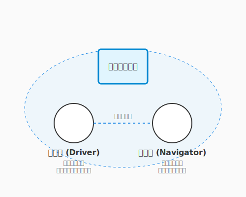

# 7.3 共鳴する魂——ペアプロ・モブプロ

プログラミングは孤独な作業だと思っていませんか？ モニターに向かい、ヘッドホンをして、一人でコードの世界に没入する——確かにそれも一つのスタイルです。

しかし、魔法の世界には、複数の術者が声を合わせて強力な魔法を放つ「二重詠唱」が存在します。ソフトウェア開発におけるそれが、**ペアプログラミング**と**モブプログラミング**です。

これは単に「二人で作業する」だけではありません。二つの脳をケーブルで繋いだかのように思考を同期させ、一人では決して到達できない速度と品質を生み出す、エキサイティングな共創体験なのです。

---

## ペアプログラミング: 操縦士と航海士

ペアプログラミング（ペアプロ）では、一台のコンピュータを二人で操作します。ここには明確な役割分担があります。

次の図は、ペアプログラミングにおけるドライバーとナビゲーターの役割と連携の様子を示しています。



図に示された二つの役割は、常に相補的な関係にあります。操縦士（ドライバー）がコードを書く間、航海士（ナビゲーター）は全体像を眺め、次の一手を考え続けます。

| 役割 | アナロジー | 責務 |
|------|-----------|------|
| **ドライバー** | 操縦士 | キーボードを操作し、コードを書く。「今、ここ」のミクロな実装に集中する。 |
| **ナビゲーター** | 航海士 | ドライバーの横で画面を見て、全体像や設計、将来の問題を考える。「少し先」のマクロな視点を持つ。 |

### 1+1 > 2 の魔法

「二人で一つの仕事をするなんて、生産性が半分になるのでは？」
そう思うかもしれません。しかし、実際には逆の現象が起きます。

1.  **迷いが消える**: ドライバーが書き方に迷っても、ナビゲーターが即座に答えを出したり、調べたりしてくれます。手が止まる時間が極限まで減ります。
2.  **バグが生まれない**: 書いた瞬間にレビューされている状態なので、ミスはその場で修正されます。後からのデバッグ時間が消滅します。
3.  **スキルが伝染する**: ベテランのショートカットキー捌きや、思考プロセスを目の当たりにすることで、若手は驚くべき速度で成長します。逆もまた然り、若手の素朴な疑問がベテランの固定観念を壊すこともあります。

---

## モブプログラミング: 集合知の顕現

ペアプロをさらに拡張し、チーム全員（3人以上）で一つの画面を見て開発するのが**モブプログラミング（モブプロ）**です。

「全員で？ さすがに非効率では？」
いえ、これが「フロー効率（タスクが完了するまでの速さ）」において最強の布陣となることがあります。

### 待ち時間の消滅

通常の開発では、「仕様確認の待ち」「コードレビューの待ち」「マージの承認待ち」といった**待ち時間**が大量に発生します。
モブプロでは、開発者、テスター、時にはプロダクトオーナーまでもがその場にいます。
「これどうする？」「こうしよう」「OK」
意思決定は光の速さで行われ、コードは書かれた瞬間にレビュー済みとなり、仕様確認もその場で完了します。

### 役割のローテーション

この「待ち時間の消滅」をさらに活かすために、役割の回し方にも工夫があります。モブプロでは、タイピスト（ドライバー）を10分〜15分ごとに交代します。
- **タイピスト**: 「自分の頭」を使わず、周り（モブ）からの指示をコードに入力する翻訳機に徹します。
- **モブ**: 議論し、解決策を導き出し、タイピストに指示を出します。

これにより、特定の誰かだけが疲弊することなく、チーム全員がコードのオーナーシップを持つことができます。「誰かしか知らないコード」という技術的負債は、モブプロの炎の中で焼き払われます。

---

## 共鳴する楽しさ

ペアプロやモブプロの最大の魅力は、**フロー状態（没入感）の共有**です。

難解なバグを全員で追い詰め、解決した瞬間のハイタッチ。
美しい設計が議論の中から立ち現れた瞬間の感動。
一人で抱え込んでいた不安が、仲間と共有することで消えていく安堵感。

それはまるで、ジャズのセッションのような高揚感です。コードを通じて魂が共鳴する瞬間を、ぜひ味わってください。

---

## AIとのペアプログラミング

人間のパートナーが見つからない時も、嘆く必要はありません。今やAI（GitHub CopilotやChatGPTなど）が、24時間365日、文句ひとつ言わずに付き合ってくれるペアプロ相手となります。

彼らは優秀なドライバー（コード生成）であり、知識豊富なナビゲーター（設計相談）でもあります。
「この関数、もっときれいに書ける？」と問いかければ、即座にリファクタリング案を出してくれます。AIとの対話もまた、現代における「二重詠唱」の一つの形です。

---

## まとめ

ペアプログラミングは「二人で一つの仕事をするから非効率」ではなく、「迷いが消え・バグが生まれず・スキルが伝染する」という三重の恩恵をもたらします。ドライバーとナビゲーターの役割分担で、ミクロな実装とマクロな設計を同時に進める「二重詠唱」が実現し、後からのデバッグ時間という最大のコストを消滅させます。モブプログラミングはその発展形として、仕様確認・実装・レビューをすべてリアルタイムで処理し、「待ち時間」と「属人化」という二大技術的負債を炎で焼き払います。

フロー状態の共有こそ、これらの技法の最大の魅力です。難解なバグを全員で追い詰めた瞬間のハイタッチ、美しい設計が議論の中から立ち現れた感動——それはジャズのセッションのような高揚感です。そしてAIは、人間のパートナーがいない時も24時間付き合ってくれる頼れる相棒として、現代の「二重詠唱」の新しい形を提供します。キーボードを渡し合う先に、一人では見られなかった景色が広がっています。

7.4節では、ここまで学んできたアジャイルの技法をさらに深める外伝として、ドキュメント駆動開発とリモートチームの協働という現代的なテーマへと進みます。

---

## AIへの詠唱例

この節で学んだことを実践するためのプロンプト：

```
あなたは私の「ペアプログラミングのナビゲーター」です。
私はこれからPythonで[タスク内容]を実装します。
私がコードを書く（入力する）たびに、以下の観点でレビューやアドバイスをしてください。
1. バグやエッジケースの指摘
2. よりPythonらしい書き方の提案
3. 可読性や命名へのフィードバック

まずは、これから書く機能の設計方針についてディスカッションしましょう。
```

```
モブプログラミングのタイピスト役を交代するタイミングを知らせる
「タイマー機能」を持つシンプルなWebアプリを作りたいです。
HTML/JSで動くプロトタイプのコードを提示してください。
```
