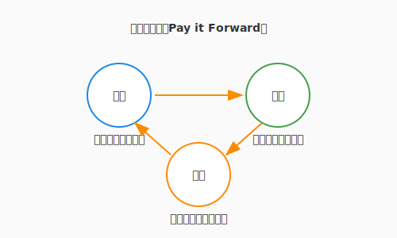

# 7.4 【外伝】冒険者のギルド——知の共有とOSS


ここまで、あなたはチーム（パーティ）での開発プロセスを学びました。しかし、アルケミストの旅はそれだけでは終わりません。あなたの手元にある魔導言語（Pythonなど）や、これまで使ってきた便利な道具（ライブラリ）の多くは、世界中の見知らぬ賢者たちが無償で公開してくれた**「オープンソース（OSS）」**という名の共有財産です。

一人の力には限界がありますが、世界中の冒険者が集う**「ギルド（コミュニティ）」**に参加し、知恵を出し合うことで、人類はかつてないほど強力な魔法（ソフトウェア）を手にすることができました。本節では、あなたがこの偉大な循環の一員となり、知を送り出す側になるための作法を学びます。

---

## ギルドの入り口：貢献（Contribution）の形

OSSへの貢献は、決して「高度なコードを書くこと」だけではありません。

*   **報告の書（Issue）**: バグを見つけたり、新機能を提案したりすることは、プロジェクトをより良くする貴重な一歩です。
*   **翻訳の術（Translation）**: 英語のドキュメントを日本語に訳すことは、仲間を増やす素晴らしい貢献です。
*   **感謝の印（Star / Donation）**: GitHubでStarを付けたり、開発者を支援したりすることも、立派なギルド活動です。

## 賢者たちの最高評議会：学術学会

こうした日々の貢献が積み重なる一方で、魔法の根本原理を究明しようとする、より深い知の営みも存在します。ギルドが日々の冒険のための実践的な場であるなら、**学術学会（Academic Societies）**は、その知恵を「真理」として後世に刻み込むための**「賢者たちの最高評議会」**です。

ここでは、一時的な流行に左右されない、数十年後も変わらない魔導の法則（理論）が、厳しい**検証の儀式（査読）**を経て、古の写本（論文）として記録されています。

*   **知の探求**: なぜその魔法が効くのか、より効率的な術式はないか。先人たちが積み上げた膨大な論文という名の「叡智の記録」に触れることで、あなたの魔法はより深く、揺るぎないものになります。
*   **次世代への継承**: あなたが発見した新しい術式が、厳しい検証を乗り越えて評議会に認められたとき、それは数十年、数百年の時を超えて、未来のアルケミストを導く「北極星」となるのです。

## 作法：プルリクエスト（PR）の心得

こうした共有の場に自らの作品を持ち込む際は、第7章（7.2節）で学んだ作法がより一層重要になります。

1.  **ForkとBranch**: 相手の領域を汚さず、自分の複製（Fork）で慎重に作業します。
2.  **目的の明示**: 「なぜその変更が必要か」を、背景を知らない他者にも分かる言葉で綴ります。
3.  **議論を愉しむ**: レビューは「攻撃」ではなく「洗練のプロセス」です。異なる文化や視点からの指摘を、自分の術式を磨く糧にしましょう。

---

## 知の恩送り（Pay it Forward）

あなたが誰かのライブラリに助けられたように、あなたの書いた一行のコードや、一つのブログ記事が、地球の裏側の誰かの窮地を救うかもしれません。

次の図は、知の恩送り（Pay it Forward）が世代を超えて循環していくサイクルを示しています。



「自分なんかが」と謙遜する必要はありません。あなたが今日、初心者の立場で苦労して解決した「エラーの記録」こそが、次に冒険を始める者にとって最も分かりやすい道標になるのです。

---

## まとめ

OSSは世界の共有資産です。Pythonもflaskも、日々の開発を支えるライブラリの多くは、見知らぬ賢者たちが無償で積み上げてきた知の遺産です。貢献の形は多種多様で、高度なコードを書くことだけが貢献ではありません。バグ報告、ドキュメントの翻訳、Starを付けること、ブログに学びを記録すること——これらすべてが、偉大な循環の一部です。

ギルドの精神——互いに教え合い、高め合う——こそが技術の進化を加速させます。あなたが今日苦労して解決したエラーの記録が、地球の裏側で同じ場所でつまずく誰かの最も分かりやすい道標になる。「自分なんかが」と謙遜する必要はありません。ギルドの門を叩きましょう——そこには、まだ見ぬ強力な魔法と、志を同じくする多くの仲間が待っています。

7.5節では、プロジェクト計画と見積もりという、アジャイルチームが日常的に向き合う奥深いテーマへと進みます。ポーカーで合意を形成するプランニングポーカーなど、楽しく精度を上げていく技法を学びましょう。

---

## AIへの詠唱例

```prompt
私が使っているOSSライブラリ [ライブラリ名] でバグを見つけました。
開発者に分かりやすく、かつ建設的なトーンで「バグ報告（Issue）」の下書きを英語で書いてください。
再現手順と期待される動作も含めてください。
```

---

## さらに学ぶためのリソース

- 🌐 **学会**: [IEEE Computer Society](https://www.computer.org/) / [ACM](https://www.acm.org/)（世界最大のコンピュータ学術団体。ICSE等の主要国際会議を主催しています）
- 🌐 **コミュニティ**: [The Linux Foundation](https://www.linuxfoundation.org/) / [Apache Software Foundation](https://www.apache.org/)（世界を支える主要なOSSプロジェクトをホストする財団）
- 📄 **論文**: Daniel Jackson "[A Direct Path to Dependable Software](https://cacm.acm.org/magazines/2009/4/22961-a-direct-path-to-dependable-software/fulltext)" (2009)（ソフトウェアの信頼性を、理論と実践の両面からどう担保すべきかを説いた論文）
- 🌐 **Web**: [Google Open Source](https://opensource.google/)（企業がどのようにOSSと関わり、貢献しているかを知るための良い事例）

