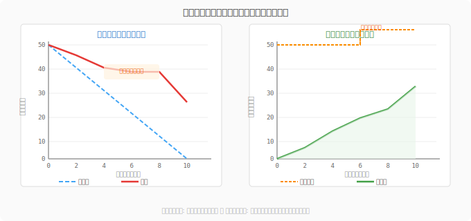

# 7.5 冒険パーティを率いる——プロジェクト管理の実践

## 導入: 旅路を設計する技術

地図のない冒険は、勇気あふれる蛮行です。どれほど優れた剣士も、目的地と現在地を把握してこそ、真の実力を発揮できます。

チーム開発も同じです。「いつまでに、何を、どのくらいの規模で届けるか」を見通す力——これが**プロジェクト管理**の本質です。スクラムのリズム（7.1節）はチームの日々の心拍を刻みます。この節では、より大きな視野でプロジェクト全体の「旅路を設計する技術」を学びます。

---

## 見積もり：未知の道程を測る

### なぜ見積もりは難しいか

ソフトウェアエンジニアリングにおいて、見積もりは伝統的に最も難しいスキルの一つです。「このAPIを実装するのに何日かかる？」——この問いに正確に答えられる人はほとんどいません。複雑さは実装してみて初めて明らかになるものです。

だからこそ、アジャイルは「時間」ではなく「複雑さの相対的な大きさ」で見積もる方法を生み出しました。

### ストーリーポイント

**ストーリーポイント（Story Points）**は、タスクの複雑さ・労力・不確実性を抽象的な数値で表す単位です。重要なのは「この作業は3日かかる」ではなく「この作業はあの作業の2倍複雑だ」という**相対比較**です。

QuestForgeで例えると：

| ユーザーストーリー | ポイント | 理由 |
|------------------|:-------:|------|
| 勇者の名前を表示する | 1 | シンプルなデータ表示 |
| クエスト一覧を検索する | 3 | フィルタリングロジックが必要 |
| 経験値をリアルタイム更新する | 8 | WebSocket、整合性、エラー処理が絡む |
| 課金システムと連携する | 13 | 外部APIの複雑な統合、セキュリティ要件 |

フィボナッチ数列（1, 2, 3, 5, 8, 13, 21...）が好まれるのは、大きな数ほど見積もりの「精度の限界」を自然に表現できるからです。100ポイントと101ポイントの差を区別できる人はいません——であれば100と120くらいの粒度で考えるのが誠実です。

### プランニングポーカー

見積もりを**民主的に行う**手法が**プランニングポーカー**です。

1. ファシリテーターがユーザーストーリーを読み上げる
2. 全員が同時にカードを出す（1, 2, 3, 5, 8...）
3. 最大値と最小値を出した人が理由を説明する
4. 議論した上で再度投票、収束したら確定

「同時に出す」のがミソです。最初に誰かが高い数字を出すと、他のメンバーはその数字に引きずられてしまいます（**アンカリング効果**）。ポーカーは全員の独立した見解を引き出します。QuestForgeチームが週次のスプリントプランニングでこれを実践することで、シニアエンジニアが気づかなかった「フロントエンドの複雑さ」をジュニアエンジニアが指摘するといった発見が生まれます。

---

## バーンダウンとバーンアップ：旅の「今、どこにいる？」

### バーンダウンチャート

スプリントが始まったら、「残り作業はどれくらいか」を毎日可視化します。



**バーンダウンチャート**は横軸に時間、縦軸に残ストーリーポイントを取り、理想線（直線）と実績線を重ねた図です。

- **実績が理想より上**（残作業が多い）→ 予定より遅れている
- **実績が理想より下**（残作業が少ない）→ 予定より早い
- **平坦な区間**→ ブロッカーが発生している可能性

QuestForgeで、スプリント中盤に実績線が急に平坦になったとします。スクラムマスターがデイリースクラムで確認すると、「外部決済APIの仕様が変わって待ち状態になっている」が発覚します。バーンダウンチャートは問題を可視化し、早期の対処を促します。

### バーンアップチャート

バーンダウンとは逆に、「完了した作業量」を積み上げていく図です。バーンアップの特徴は、**スコープの変化**も一緒に見せられること。途中で「ギルド機能を追加してほしい」という要求が入ると、合計線が上がります。これにより「スコープが変わったから遅れたのか」「実装が遅いから遅れたのか」が一目で区別できます。

---

## ベロシティ：パーティの巡航速度

**ベロシティ（Velocity）**とは、一つのスプリントで完了したストーリーポイントの合計です。

```
スプリント1: 32ポイント完了
スプリント2: 28ポイント完了
スプリント3: 35ポイント完了
→ 平均ベロシティ = 31.7 ≈ 32ポイント/スプリント
```

ベロシティが分かると、「プロダクトバックログに残り160ポイントあるなら、あと5スプリント（約10週間）で完了する」という予測が立てられます。

**重要な視点**: ベロシティは「速さ競争」の指標ではありません。「チームの持続可能なペース」を把握するための羅針盤です。スプリントごとに急激に変動する場合は、見積もりの精度か、チームの状態に課題があるサインかもしれません。

### キャパシティプランニング

スプリントプランニングでは、ベロシティだけでなく**キャパシティ**（実際に使える人日）も考慮します。

```
チーム: エンジニア4名 × スプリント10日 = 40人日
ただし:
  - ミーティング・セレモニー: 4名 × 2日分
  - 有給・病欠バッファ: 4日分
  → 実質キャパシティ: 40 - 8 - 4 = 28人日相当
```

QuestForgeでは、祝日やカンファレンス参加の週はスプリントゴールを意図的に小さく設定します。無理のない計画が、チームの持続的な健康を守ります。

---

## リスク管理：見えない敵を地図に載せる

### リスクマトリクス

リスクとは「起きるかもしれないこと」です。見て見ぬふりをするより、可視化して対処策を準備しておく方が、遥かに賢明です。

**リスクマトリクス**では、リスクを「発生確率」と「影響度」の2軸で評価します。

| リスク | 確率 | 影響 | 優先度 | 対策 |
|--------|:----:|:----:|:------:|------|
| 決済APIの仕様変更 | 中 | 高 | 🔴 高 | API変更通知を購読、アダプター層で隔離 |
| DBマイグレーションの失敗 | 低 | 高 | 🟡 中 | ステージング環境での事前検証、ロールバック手順の整備 |
| チームメンバーの離脱 | 低 | 中 | 🟡 中 | ドキュメント整備、ペアプロで知識共有 |
| 新機能の仕様不明確 | 高 | 中 | 🟡 中 | スプリント0で先行スパイク調査 |
| 開発環境のセットアップ問題 | 中 | 低 | 🟢 低 | DevContainer・onboardingドキュメント整備 |

### スパイクで不確実性を解消する

特定のリスクが高い技術的課題には、**スパイク（Spike）**を活用します。スパイクとは「調査・実験専用の時間ボックス」で、通常1〜3日程度です。

「WebSocketでリアルタイム通知を実装できるか？」——この問いに自信を持てないまま8ポイントとして計画するよりも、「まず2日間でPoCを作る」スパイクを組み込む方が、その後の見積もりの精度を劇的に上げます。

---

## AI時代のプロジェクト管理

AIはプロジェクト管理のパートナーとして新しい可能性を開いています。

**見積もりの補助**: 「このユーザーストーリーを実装する際の技術的な複雑さ、想定されるリスク、考慮すべきエッジケースを整理して」とAIに問えば、見落としがちな観点を補完してくれます。

**バックログの整理**: 「この要件を、それぞれ独立してリリース可能なユーザーストーリーに分割して」という依頼は、AIが得意とする構造化作業です。

**リスク分析**: 「このアーキテクチャ変更のリスクを、発生確率と影響度の観点でリストアップして」と依頼すれば、考慮漏れを発見できます。

ただし、AIの見積もりはあくまで参考値です。チームの文脈、コードベースの状態、メンバーのスキルセットを理解した上で、最終判断はチームが下します。

---

## まとめ

1. **ストーリーポイント**: 時間ではなく複雑さの相対値で見積もる。フィボナッチ数列で曖昧さを正直に表現する。
2. **プランニングポーカー**: 全員が同時にカードを出すことでアンカリングを避け、チームの多様な視点を引き出す。
3. **バーンダウン/バーンアップ**: 残作業・完了作業を毎日可視化し、問題の早期発見と意思決定を支える。
4. **ベロシティ**: チームの持続可能なペースを知る羅針盤。競争の指標ではない。
5. **リスクマトリクス**: 不確実性を可視化し、スパイクで「分からない」を「分かる」に変える。

---

## さらに学ぶためのリソース

- 📚 **書籍**: Mike Cohn『[アジャイルな見積もりと計画づくり](https://www.marubayashi.net/books/agile-estimating-and-planning/)』（ストーリーポイントとベロシティの実践的活用法の決定版）
- 📚 **書籍**: Tom DeMarco, Timothy Lister『[ピープルウェア](https://www.nikkeibook.com/item-detail/34600)』（人と環境こそが生産性を左右するという、ソフトウェア開発の本質を突く古典）
- 📚 **書籍**: Donald G. Reinertsen『[製品開発フロー原則](https://www.amazon.co.jp/dp/B06XCNH7VN)』（リーン開発の視点から、バッチサイズとWIPの最適化を論じる）
- 📄 **論文**: Standish Group "[CHAOS Report](https://www.standishgroup.com/chaos.php)"（プロジェクト成功・失敗の統計的研究。見積もりとスコープ管理の重要性を示す）
