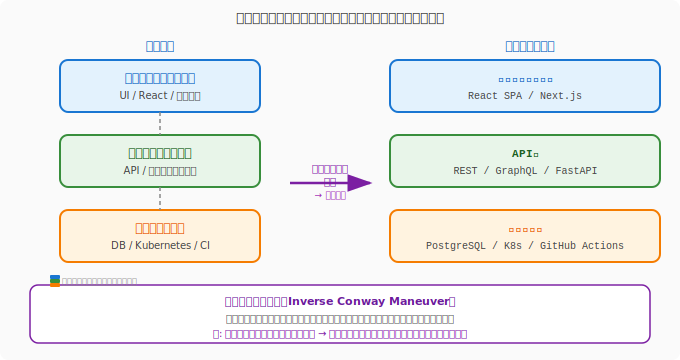

# 7.6 パーティの形が魔法を決める——チーム設計とコンウェイの法則

## 導入: 組織の形がコードの形になる

「なぜQuestForgeの通知サービスとユーザーサービスのAPIはこんなにも密結合なんだろう？」——コードベースを読み解いていると、こんな疑問が湧くことがあります。

その答えは、多くの場合、コードの外にあります。**組織の構造**の中に。

メルビン・コンウェイが1968年に発見したこの法則は、半世紀を経た今も、ソフトウェアアーキテクチャを理解する最も重要な洞察の一つです。

---

## コンウェイの法則：組織とアーキテクチャの鏡

### 法則の本質

> **「システムを設計する組織は、その組織のコミュニケーション構造を模倣した設計を生み出す。」**
> — Melvin Conway（1968）

言葉だけでは掴みにくいので、QuestForgeで考えてみましょう。

QuestForgeの開発チームが「フロントエンドチーム」「バックエンドチーム」「インフラチーム」という3つのチームに分かれているとします。すると自然に、アーキテクチャも「フロントエンド」「バックエンドAPI」「インフラ基盤」の3層に分かれた設計になります。



なぜそうなるか？ それは、**チームの境界がコミュニケーションの境界を生み出す**からです。同じチームのメンバーは頻繁に対話し、密に統合された設計を生み出します。チームをまたぐ接点には、明示的なインターフェース（API仕様書、契約）が必要になります。

これは悪いことではありません——意識的に活用すれば、強力な設計ツールになります。

### 逆コンウェイ戦略

この認識から生まれた設計アプローチが**逆コンウェイ戦略（Inverse Conway Maneuver）**です。

> **「目標とするアーキテクチャに合わせてチームを設計する。」**

マイクロサービス化を目指すなら、まずアーキテクチャを描き、それに合わせてチームを分割する。チームの境界がサービスの境界になるよう意図的に設計するのです。

QuestForgeでは、「クエスト機能」「勇者プロファイル」「ギルド管理」「通知」という4つのドメインに沿ってチームを編成することで、それぞれが独立してデプロイできるサービスアーキテクチャを自然に実現できます。

---

## チームトポロジー：4つのチームタイプ

Matthew Skelton と Manuel Pais が体系化した**チームトポロジー（Team Topologies）**は、現代のソフトウェア開発における最も実践的なチーム設計の枠組みです。

### 4種類のチームタイプ

| タイプ | 役割 | QuestForgeでの例 |
|--------|------|-----------------|
| **ストリームアラインドチーム** | 特定のビジネスドメインに継続的に価値を届ける主役 | クエストチーム、勇者チーム |
| **プラットフォームチーム** | 他チームの自律性を高めるセルフサービス基盤を提供 | インフラ・CI/CDチーム |
| **イネーブリングチーム** | 専門知識を伝播してストリームアラインドチームの能力を高める | セキュリティ専門チーム |
| **コンプリケイテッドサブシステムチーム** | 専門的な複雑さを持つ独立した領域を担う | 課金・決済チーム |

**ストリームアラインドチーム**が中心です。QuestForgeの「クエストチーム」は、クエストの作成・管理・完了に関わるAPIからフロントエンドまでを一貫して担います。外部の承認を待たずに変更をデプロイできる、真の意味での「機能チーム」です。

**プラットフォームチーム**は脇役に見えますが、実は全体を支える縁の下の力持ちです。「Kubernetes クラスターをセルフサービスでプロビジョニングできる内部開発者プラットフォーム」を提供することで、クエストチームが基盤の管理に煩わされることなく機能開発に集中できます。

### チームの相互作用モード

チーム同士の関わり方も、3つのモードに分類できます。

| モード | 説明 | 向いている場面 |
|--------|------|---------------|
| **コラボレーション** | 共同作業で新しい何かを生み出す | 新機能の探索期間、境界の発見 |
| **X-as-a-Service** | 一方がサービスを提供し、他方が消費する | 安定したプラットフォームAPIの利用 |
| **ファシリテーション** | イネーブリングチームが能力を伝える | 新技術の導入、セキュリティ教育 |

長期的なコラボレーションは認知的負荷を高めます。チームの成熟とともに、コラボレーションから「X-as-a-Service」へとモードを移行させることが、チームの自律性を高める鍵です。

---

## 認知的負荷：人間の帯域幅を設計する

### チームが担える複雑さの上限

人間の脳が一度に処理できる情報量には限界があります。チームも同様です。**認知的負荷（Cognitive Load）**がチームの能力を超えると、品質の低下・バグの増加・燃え尽きが起きます。

チームトポロジーでは、**チームの認知的負荷を意図的に管理すること**がチーム設計の中心的な仕事だとされています。

### 認知的負荷の3種類

| 種類 | 説明 | 最小化のアプローチ |
|------|------|------------------|
| **内在的負荷** | 問題領域そのものの複雑さ（避けられない） | チームのスコープを絞る |
| **外来的負荷** | 仕事の進め方の複雑さ（ツール・プロセス） | プラットフォームチームが吸収する |
| **関連的負荷** | 学習・成長・創造のための思考 | 内在的・外来的負荷を減らして確保する |

QuestForgeのクエストチームが「Kubernetesの設定管理」「社内ライブラリのバージョン管理」「セキュリティパッチの適用」まで担っているとしたら、**外来的負荷**が高すぎます。これをプラットフォームチームが引き受けることで、クエストチームはユーザー価値の創出（関連的負荷）に集中できます。

### 「このチームは何を担っているか？」を1文で言えるか

チームのスコープが適切かどうかを確認するシンプルなテストです。「クエストの作成・検索・完了に関わるすべての機能を、フロントエンドからAPIまで一貫して届ける」——これは言えます。「フロントエンドとバックエンドとDBとインフラと・・・」——これは担いすぎのサインです。

---

## 心理的安全性：チームの基盤

技術的な設計と同じくらい重要なのが、**心理的安全性（Psychological Safety）**です。

Googleが2012〜2016年に180チームを研究した「プロジェクト・アリストテレス」は、高パフォーマンスチームの最大の予測因子として心理的安全性を特定しました。技術的スキルでも、メンバーの優秀さでもなく、「このチームでは、リスクを取っても安心だという確信」が最も重要だったのです。

心理的安全性のあるチームでは：

- **失敗を報告できる**: バグを隠さず、早期に共有する
- **「わからない」と言える**: ジュニアメンバーが遠慮なく質問できる
- **実験できる**: 「失敗するかもしれないアイデア」を試せる
- **フィードバックを与え合える**: コードレビューが学びの場になる

QuestForgeのスプリントレトロスペクティブでチームメンバーが「実はあの設計について懸念があったけど言い出せなかった」と口にできるチームは、心理的安全性が高いチームです。

---

## ソフトウェアサプライチェーンとSBOM

### 見えない素材の一覧表

現代のソフトウェアは、自分たちが書いたコードだけで成り立っていません。QuestForgeのバックエンドを例にとると、FastAPIフレームワーク・SQLAlchemy・Pydantic・cryptographyライブラリ……数十〜数百のオープンソースライブラリが積み重なって動いています。それらのライブラリも、さらに別のライブラリに依存しています。

この「ソフトウェアの素材の連鎖」を**ソフトウェアサプライチェーン**と呼びます。製造業における部品表（BOM: Bill of Materials）と同じ発想で、ソフトウェアの構成要素を形式的に列挙したものが **SBOM（Software Bill of Materials / ソフトウェア部品表）** です。

### なぜSBOMが重要か

2021年12月、世界を震撼させた脆弱性「Log4Shell（CVE-2021-44228）」を思い出しましょう。Javaの広く使われているログライブラリ Log4j に深刻な脆弱性が発見された際、多くの組織が「自社システムでLog4jを使っているか？」すら即座に答えられませんでした。SBOMがあれば、影響範囲を数分で特定できます。

SBOMが提供する価値：

| 活用場面 | 内容 |
|---------|------|
| **脆弱性対応** | 新しいCVE（共通脆弱性識別子）が発表された際、即座に影響サービスを特定 |
| **ライセンスコンプライアンス** | GPLやMITなど、組み込んだOSSのライセンス条件を一覧で確認 |
| **監査・規制対応** | 米国行政命令14028（2021年）はSBOMの提供を連邦政府向けソフトウェアに義務化 |
| **サプライチェーン攻撃の検知** | SolarWinds事件のように、依存ライブラリを経由した攻撃を早期に検知 |

### SBOMの標準フォーマット

SBOMには標準化された2つの主要フォーマットがあります。

- **SPDX（Software Package Data Exchange）**: Linux Foundation が策定した国際標準（ISO/IEC 5962:2021）
- **CycloneDX**: OWASP が策定した、セキュリティ用途に最適化されたフォーマット

どちらもJSON・XML・その他の形式で出力でき、CIツールや脆弱性スキャナーとの連携が可能です。

### QuestForgeでのSBOM運用

SBOMの生成と管理は、**プラットフォームチームの責務**として組み込むのが自然です。各ストリームアラインドチーム（クエストチーム・勇者チームなど）が個別に管理するより、横断的な基盤として自動化する方が一貫性を保てます。

```yaml
# GitHub Actions でのSBOM生成例（CycloneDX）
- name: Generate SBOM
  uses: CycloneDX/gh-python-generate-sbom@v2
  with:
    input: ./requirements.txt
    output: sbom.json
    format: json

- name: Upload SBOM
  uses: actions/upload-artifact@v3
  with:
    name: sbom
    path: sbom.json

# 脆弱性スキャン（Grype）
- name: Scan for vulnerabilities
  uses: anchore/scan-action@v3
  with:
    sbom: sbom.json
    fail-build: true
    severity-cutoff: high
```

プラットフォームチームがこのCI/CDパイプラインをテンプレートとして提供することで、各チームは「SBOMを生成するCI設定」を自分で書く必要がなくなります。**外来的負荷を吸収し、各チームの認知的負荷を下げる**——チームトポロジーの実践そのものです。

### AIとSBOM

「このrequirements.txtで、ライセンスがGPLv3以上のライブラリをリストアップして」とAIに問えば、ライセンス監査の第一歩をすぐに踏み出せます。また、新しいCVEの詳細をAIに要約させ「このシステムへの影響範囲を教えて」と続けることで、脆弱性対応の初動を大幅に加速できます。

---

## AI時代のチーム設計

AIツールは、チームの認知的負荷を変えつつあります。

**コードの「理解コスト」を下げる**: 「このモジュールが何をしているか、3行で説明して」とAIに問えば、コードリーディングの時間が大幅に短縮されます。これにより、一人の開発者が把握できる領域が広がり、チームの最適なサイズや境界の引き方が変わる可能性があります。

**非同期のコードレビューを加速**: AIがファーストパスのレビューを行い、明らかな問題を指摘することで、人間のレビュアーはより深い設計上の議論に集中できます。

**チーム間の知識移転**: 「このサービスのAPIをどう使うか、新しいチームメンバー向けに説明して」という問いは、ドキュメントの不足を補います。

ただし、**コンウェイの法則は変わりません**。AIが認知的負荷を下げても、組織の境界はアーキテクチャに投影されます。「AIがあるからチームの設計は重要でない」ではなく、「AIを活かすためにもチームの設計が重要」です。

---

## まとめ

1. **コンウェイの法則**: 組織のコミュニケーション構造は、そのままアーキテクチャに投影される。「なぜこの設計なのか」の答えは組織図にある。
2. **逆コンウェイ戦略**: 欲しいアーキテクチャを先に描き、それに合わせてチームを設計する。チームの境界がサービスの境界になる。
3. **チームトポロジー**: ストリームアラインドチームを中心に、プラットフォーム・イネーブリング・コンプリケイテッドサブシステムの4タイプで役割を明確にする。
4. **認知的負荷**: チームが担う複雑さを意識的に管理する。外来的負荷はプラットフォームが吸収し、関連的負荷（創造）の余白を作る。
5. **心理的安全性**: 技術的設計と同等に、「失敗を言える文化」を育てることが高パフォーマンスチームの基盤となる。
6. **SBOM**: ソフトウェアの全依存関係を形式的に列挙した部品表。脆弱性対応・ライセンスコンプライアンス・規制対応の基盤として、プラットフォームチームがCI/CDに組み込んで自動生成する。

---

## さらに学ぶためのリソース

- 📚 **書籍**: Matthew Skelton, Manuel Pais『[チームトポロジー——価値あるソフトウェアをすばやく届けるための組織設計](https://www.amazon.co.jp/dp/4820729209)』（チームトポロジーの原著。逆コンウェイ戦略の実践的フレームワーク）
- 📚 **書籍**: Amy C. Edmondson『[恐れのない組織](https://www.amazon.co.jp/dp/4862763960)』（心理的安全性の研究の第一人者による、組織文化設計の実践書）
- 📄 **論文**: Melvin E. Conway "[How Do Committees Invent?](http://www.melconway.com/Home/Committees_Paper.html)" (1968)（コンウェイの法則の原典。わずか数ページながら、半世紀後も有効な洞察）
- 📄 **論文**: Google re:Work "[Project Aristotle](https://rework.withgoogle.com/print/guides/5721312655835136/)"（心理的安全性が高パフォーマンスチームの最大の予測因子であることを示した、Googleの大規模研究）
- 🌐 **Web**: Team Topologies "[team-topologies.com](https://teamtopologies.com/)"（4つのチームタイプと3つの相互作用モードの図解・事例集）
- 🌐 **Web**: NTIA "[Software Bill of Materials](https://www.ntia.gov/sbom)"（米国国家通信情報管理庁によるSBOMの定義・フォーマット・最低要件の公式ガイダンス）
- 🌐 **Web**: OWASP "[CycloneDX](https://cyclonedx.org/)"（SBOMの主要フォーマットCycloneDXの仕様・ツール・事例集）
- 📄 **ドキュメント**: [SPDX Specification](https://spdx.github.io/spdx-spec/)（ISO/IEC 5962として国際標準化されたSBOMフォーマットの公式仕様）
