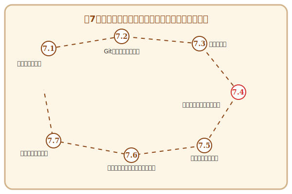

# 第7章 冒険者パーティのチーミング——開発プロセスとチーム設計

## この章で手に入れる力

ここまでの旅で、あなたは要求を聴き取り、設計し、実装し、テストで守り、磨き上げ、本番環境へ送り出す力を身につけました。一人の冒険者として、十分な実力を備えたと言えるでしょう。

しかし、現実のソフトウェア開発は、一人では完結しません。仲間と共に走り、互いの強みを活かし、チームとして価値を生み出す——そこに新たな喜びと、一人では到達できない高みがあります。

この章では、**アジャイル開発**の心臓部であるスクラムのリズム、Gitを使ったコードの知の交流、ペアプログラミングやモブプログラミングによるリアルタイムの「思考の同期」を学びます。さらに、プロジェクト全体の旅路を設計するプロジェクト管理の技法と、**コンウェイの法則**・**チームトポロジー**が教える「パーティの形がコードの形を決める」という深い真理まで、冒険者パーティを率いるために必要な知恵を総ざらいします。

## 冒険の地図

---

---

## 読了後のあなた

この章を読み終えると、あなたは以下のことができるようになります。

- **リズムを刻む**: スプリントとセレモニーで、チーム開発にリズムと祝祭を生み出せる
- **交流する**: プルリクエストとコードレビューで、互いの知恵をコードに込められる
- **共鳴する**: ペアプログラミングで、一人では思いつかない発想をリアルタイムに引き出せる
- **調和する**: チーム全体でモブプログラミングを実践し、知識の属人化を解消できる
- **旅路を設計する**: ストーリーポイントとバーンダウンチャートで、プロジェクトの今を可視化できる
- **パーティを設計する**: コンウェイの法則とチームトポロジーで、組織とアーキテクチャを意識的に整合させられる

一人の冒険者から、最強の冒険パーティへ。仲間と共に、新たなステージへ踏み出しましょう。

---

## さらに学ぶためのリソース（章全体）

- 📚 **ガイド**: Ken Schwaber, Jeff Sutherland『[スクラムガイド](https://scrumguides.org/docs/scrumguide/v2020/2020-Scrum-Guide-Japanese.pdf)』（すべてのスクラム実践者の出発点。常に最新版を確認しましょう）
- 📚 **書籍**: Henrik Kniberg『[塹壕より Scrum と XP](https://www.infoq.com/jp/minibooks/scrum-xp-from-the-trenches/)』（現場での苦労と工夫が詰まった、世界中で読まれている実践記。InfoQで無料公開）
- 📚 **書籍**: Scott Chacon, Ben Straub『[Pro Git 第2版](https://git-scm.com/book/ja/v2)』（Gitの仕組みから応用までを網羅した、公式サイト公開の決定版）
- 📚 **書籍**: Mark Pearl著、長尾高弘訳『[モブプログラミング・ベストプラクティス](https://www.oreilly.co.jp/books/9784873118628/)』（モブプログラミングをチームに導入するための実践的ガイド）
- 📚 **書籍**: Mike Cohn『[アジャイルな見積もりと計画づくり](https://www.marubayashi.net/books/agile-estimating-and-planning/)』（ストーリーポイントとベロシティの実践的活用法の決定版）
- 📚 **書籍**: Matthew Skelton, Manuel Pais『[チームトポロジー——価値あるソフトウェアをすばやく届けるための組織設計](https://www.amazon.co.jp/dp/4820729209)』（チームトポロジーの原著。逆コンウェイ戦略の実践的フレームワーク）
- 📚 **書籍**: Amy C. Edmondson『[恐れのない組織](https://www.amazon.co.jp/dp/4862763960)』（心理的安全性の研究の第一人者による、組織文化設計の実践書）
- 🌐 **Web**: Woody Zuill "[Mob Programming](https://woodyzuill.com/)"（モブプログラミングの提唱者による情報サイト）

### 📜 賢者伝説（学術論文）

- 📄 **60s**: Melvin E. Conway "[How Do Committees Invent?](http://www.melconway.com/Home/Committees_Paper.html)" (1968)（コンウェイの法則の原典。わずか数ページで、半世紀後も有効な洞察を与える）
- 📄 **80s**: Hirotaka Takeuchi and Ikujiro Nonaka "[The New New Product Development Game](https://hbr.org/1986/01/the-new-new-product-development-game)" (1986)（スクラムの名称と概念の源流となった、日本発の画期的な経営学論文）
- 📄 **90s**: Kent Beck "[Embracing Change with Extreme Programming](https://ieeexplore.ieee.org/document/774350)" (1999)（XPの宣言書）
- 📄 **10s**: Google re:Work "[Project Aristotle](https://rework.withgoogle.com/print/guides/5721312655835136/)"（心理的安全性が高パフォーマンスチームの最大の予測因子であることを示したGoogleの大規模研究）
- 📄 **20s**: A. Ziegler et al. "[Productivity assessment of neural code completion](https://arxiv.org/abs/2205.06537)" (2022)（GitHub Copilot等のAI補完が、開発者の生産性と幸福度にどう寄与するかを定量的・定性的に示した先駆的調査）
